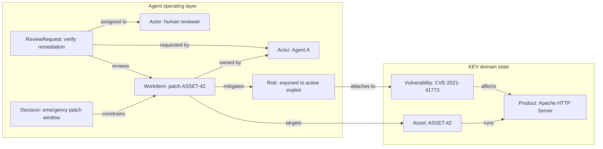

<p align="center">
  <a href="https://cruxible.ai">
    
  </a>
</p>

# Cruxible Core

[](https://pypi.org/project/cruxible-core/)
[](https://python.org)
[](LICENSE)

**Cruxible is hard state for AI agents.**

Governed, queryable, and durable — state that outlives any single model or session.

LLMs reason over context windows and retrieved text, not shared state. When
what's true about a project or domain lives only in prompts, files, chat
history, tickets, or vector-memory summaries, every model invocation has to
reconstruct it.

Cruxible turns the durable slice of that knowledge into typed, queryable,
governed state — entities, relationships, lifecycle, and review status that
agents and humans share instead of re-deriving. It doesn't replace your source
systems; it points to them, cites specific records or chunks, and keeps only the
claims worth coordinating around.

The core is deterministic: no LLM inside, no hidden API calls, and every
important operation can produce a receipt.

## The State Learning Loop

Cruxible is built for teams that want their AI systems to improve and their
knowledge to compound with use, instead of getting wiped away by every context
refresh, model swap, or handoff.

A Cruxible-backed loop looks like this:

1. You model the surface as an ontology — typed entities, relationships,
   constraints, and named queries, using a YAML config language.
2. State is seeded and grown through direct adds, imports, and governed group
   proposals.
3. Agents query that governed state instead of reconstructing context from
   scratch.
4. Workflows and tools produce traces, evidence, and proposed changes.
5. Humans or policies review uncertain claims and important state transitions.
6. Edge feedback records corrections, missing context, and policy gaps.
7. Outcome profiles record whether decisions and workflow results were later
   correct, incorrect, partial, or unknown.
8. Approved state, rejected claims, corrections, outcomes, and receipts persist.
9. Future agents use that durable state regardless of which model is running.

The model can change. The accumulated state, evidence, review history,
feedback, outcomes, and workflow knowledge stay with the team.

## Two Kinds Of State

Cruxible is useful for two related jobs.

### Domain State

Domain state is the durable model of the world an agent is reasoning about:
customers, assets, vulnerabilities, suppliers, products, cases, controls,
policies, dependencies, risks, services, or any other domain-specific entities
and relationships.

Domain state answers:

> What is true, proposed, reviewed, or constrained about the world?

Examples:

- Which assets are exposed to a known exploited vulnerability?
- Which supplier incident affects which products and shipments?
- Which legal matter is constrained by a new case authority?
- Which products substitute for or complement each other?

### Agent Operating State

Agent operating state is the durable coordination layer for work done by agents
and humans: work items, review requests, decisions, open questions, risks, state
notes, actors, dependencies, lineage, and lifecycle status.

Operating state answers:

> What are we doing, why, what blocks it, who reviewed it, and what changed?

Examples:

- What open work items are active, blocked, deferred, or ready for review?
- Which decision constrains this implementation?
- Which review request approved closing a work item?
- Which open question blocks a decision or a downstream work item?

These state types can be used separately. They are strongest together: a domain
kit models the thing the agent is working on, while an operating-state kit tracks
the work, decisions, evidence, reviews, and lifecycle around that domain.

### Example: KEV Domain State Plus Agent Operating State



The KEV kit owns the domain facts and the agent-operation kit owns the operating
facts; typed operation-to-domain edges (or `SubjectRef`s across instances)
compose them into one queryable graph.

## Why Not Markdown, RAG, Or Vector Memory?

Markdown, retrieval, and vector memory give a model text to read. Cruxible gives
it typed, governed state. What changes:

| Markdown · RAG · vector memory | Cruxible |
|---|---|
| No provenance — text doesn't record where a claim came from or whether it was reviewed | Durable claims are designed to carry source evidence, review state, and receipts |
| Context is rebuilt from text every session, losing relationships and detail | Persisted as typed state — read, not reconstructed |
| Anything can be edited; nothing enforces what may change | Writes pass guards, review, and lifecycle rules |
| Retrieval returns similar chunks; it can't follow exact links | Multi-hop traversal over typed relationships |
| Counts and rollups are approximate summaries | Exact, repeatable aggregation — counts and joins |
| Each read is fresh and can disagree with the last | One accepted state — the same answer for every agent and app |
| No feedback loop — corrections and whether a decision was right are lost | Feedback and outcomes are recorded against the state as durable signal |
| Static text that doesn't improve from use | State and ontology iterate with use — claims mature from proposed to accepted |
| A better model reads better, but can't certify its own output | Guarantees come from a deterministic layer outside the model |

Cruxible does not replace your source systems. It points to records or specific
chunks in markdown, a database, or a SaaS, and stores only the durable claims,
relationships, lifecycle, and review decisions agents coordinate around.

## Governance And Workflows

Cruxible separates writing state from accepting it. State enters one of two ways:

| Write mode | Use it for | What happens |
|---|---|---|
| **Direct write** | Asserting hard state — imports, deterministic relationships, source evidence | Live and queryable at once, with evidence when supplied, but unreviewed until a governed process approves it |
| **Governed proposal** | Judgment calls — uncertain or interpretive relationships | Candidates are grouped under one thesis with signal evidence and routed to a human or auto-resolution policy; approval writes accepted state with provenance, rejection records why |

Workflows orchestrate both: a reproducible procedure can query state, call
providers, shape candidates, then apply direct writes or propose a governed
group. Providers are version- and content-locked in the kit lockfile, so runs
replay deterministically; every run also leaves receipts and traces.

## How It Fits

```text
AI agents and humans
  write configs, review proposals, run workflows, record outcomes
          |
          v
CLI / HTTP client / MCP tools
  thin surfaces over the service layer
          |
          v
Cruxible Core
  deterministic runtime, no LLM inside
          |
          v
state.db
  graph state, receipts, traces, groups, feedback, outcomes, decisions,
  snapshots, source artifacts
```

## Small Example

A minimal slice of a supply-chain ontology — the kind you author in a kit
config:

```yaml
entity_types:
  Supplier:
    properties:
      supplier_id: { type: string, primary_key: true }
      name: { type: string, indexed: true }
      primary_geography: { type: string, optional: true }
  Component:
    properties:
      component_id: { type: string, primary_key: true }
      name: { type: string, indexed: true }
      criticality: { type: string, optional: true, enum_ref: criticality }
  Incident:
    properties:
      incident_id: { type: string, primary_key: true }
      title: { type: string, indexed: true }
      severity: { type: string, optional: true, enum_ref: incident_severity }

relationships:
  - name: supplier_supplies_component
    from: Supplier
    to: Component
  # Governed judgment: an incident materially impacts a supplier.
  - name: incident_impacts_supplier
    from: Incident
    to: Supplier

named_queries:
  # Blast radius: from an incident, traverse impacted suppliers to the
  # components they supply.
  components_exposed_by_incident:
    mode: traversal
    entry_point: Incident
    returns: Component
    traversal:
      - relationship: incident_impacts_supplier
        direction: outgoing
      - relationship: supplier_supplies_component
        direction: outgoing
```

An agent (or app) can now ask for the blast radius of an incident — the
components exposed through its impacted suppliers — without scanning
spreadsheets or tracing the bill of materials by hand.

```bash
cruxible query run components_exposed_by_incident \
  --param incident_id=INC-42 \
  --json
```

The query response includes the result rows and a receipt pointer. When receipt
content is included or fetched later, it explains the deterministic path from
query parameters to traversed edges to returned results:

```json
{
  "items": [
    {
      "entity_type": "Component",
      "entity_id": "component-main-board"
    }
  ],
  "receipt_id": "RCP-...",
  "receipt": {
    "operation_type": "query",
    "query_name": "components_exposed_by_incident",
    "parameters": {
      "incident_id": "INC-42"
    },
    "nodes": [
      {
        "node_type": "query",
        "detail": {
          "entry_point": "Incident"
        }
      },
      {
        "node_type": "edge_traversal",
        "relationship": "incident_impacts_supplier"
      },
      {
        "node_type": "edge_traversal",
        "relationship": "supplier_supplies_component"
      },
      {
        "node_type": "result",
        "entity_type": "Component",
        "entity_id": "component-main-board"
      }
    ],
    "results": [
      {
        "entity_type": "Component",
        "entity_id": "component-main-board"
      }
    ]
  }
}
```

## Get Started

### Install And Start A Local Daemon

```bash
pip install "cruxible-core[server,mcp]"
CRUXIBLE_SERVER_STATE_DIR="$HOME/.cruxible/server" cruxible server start
```

The daemon is local-only by default and binds to `127.0.0.1:8100`. For a simple
local hardening layer, set `CRUXIBLE_SERVER_AUTH=true` and
`CRUXIBLE_RUNTIME_BOOTSTRAP_SECRET=...`, then claim the bootstrap secret to
create runtime credentials.

If you prefer [uv](https://docs.astral.sh/uv/):

```bash
uv tool install "cruxible-core[server,mcp]"
```

### Initialize A Kit

```bash
cruxible --server-url http://127.0.0.1:8100 init --kit agent-operation
```

The returned `instance_id` is the handle used by CLI, MCP, HTTP clients, and UI
surfaces for later queries, workflows, writes, and reviews.

### Query State

```bash
cruxible --server-url http://127.0.0.1:8100 \
  --instance-id <instance_id> \
  query list

cruxible --server-url http://127.0.0.1:8100 \
  --instance-id <instance_id> \
  query run actor_work_queue --param actor_id=alice --json
```

Or call the same query surface from Python:

```python
from cruxible_client import CruxibleClient

with CruxibleClient(base_url="http://127.0.0.1:8100") as client:
    result = client.query(
        "<instance_id>",
        "actor_work_queue",
        {"actor_id": "alice"},
    )
    for item in result.items:
        print(item)
```

## Agent Setup

For agents, prefer a split environment:

- `cruxible-core` runs in a daemon/runtime environment.
- The agent environment installs `cruxible-client` or uses MCP.
- `CRUXIBLE_REQUIRE_SERVER=1` keeps the agent on the daemon path.
- `CRUXIBLE_SERVER_STATE_DIR` lives outside the agent's writable workspace.

```bash
pip install cruxible-client
```

MCP example:

```json
{
  "mcpServers": {
    "cruxible": {
      "command": "cruxible-mcp",
      "env": {
        "CRUXIBLE_MODE": "governed_write",
        "CRUXIBLE_SERVER_URL": "http://127.0.0.1:8100"
      }
    }
  }
}
```

Local permission modes are a practical hardening layer, not full sandboxing. If
trust levels matter, keep the daemon state outside the agent workspace and
expose only the client, HTTP, or MCP surface. See
[Isolated Deployment](docs/isolated-deployment.md).

## Kits

| Kit | Kind | What it models |
|-----|------|----------------|
| [agent-operation](kits/agent-operation/) | Agent operating state | Work items, review requests, decisions, risks, open questions, state notes, actors, lifecycle, and dependency context. |
| [kev-reference](kits/kev-reference/) | Domain reference state | Public known-exploited vulnerability reference data. |
| [kev-triage](kits/kev-triage/) | Domain overlay state | Local asset exposure, service impact, controls, incidents, findings, remediation, and governed vulnerability triage. |
| [supply-chain-blast-radius](kits/supply-chain-blast-radius/) | Domain state | Suppliers, components, assemblies, products, shipments, and incident blast radius. |
| [case-law-monitoring](kits/case-law-monitoring/) | Domain state | Matter-centered case-law monitoring and authority impact. |

Standalone kits can define a full state model. Overlay kits can extend an
upstream state model with local state, governed proposals, and local workflows.

## Documentation

- [Quickstart](docs/quickstart.md) - install to first query
- [Concepts](docs/concepts.md) - architecture and primitives
- [Config Reference](docs/config-reference.md) - YAML schema
- [CLI Reference](docs/cli-reference.md) - terminal commands
- [MCP Tools Reference](docs/mcp-tools.md) - agent tool surface
- [AI Agent Guide](docs/for-ai-agents.md) - orchestration patterns
- [Kit Walkthroughs](docs/kit-walkthroughs.md) - standalone and overlay kits
- [Local State And Backups](docs/local-state-and-backups.md) - SQLite, daemon state, and portability
- [Common Providers And Dataflow Steps](docs/common-providers.md) - provider and workflow building blocks

## Technology

Cruxible Core uses [Pydantic](https://docs.pydantic.dev/) for validation,
[NetworkX](https://networkx.org/) for in-memory graph operations,
[Polars](https://pola.rs/) for data operations, [SQLite](https://sqlite.org/)
for local durable state, [FastAPI](https://fastapi.tiangolo.com/) for the daemon,
and [FastMCP](https://github.com/jlowin/fastmcp) for MCP tools.

## License

MIT

<!-- mcp-name: io.github.cruxible-ai/cruxible-core -->
