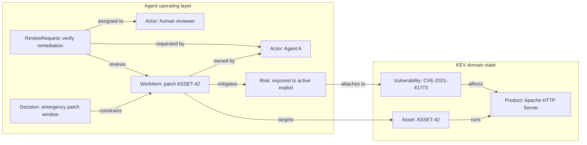

<p align="center">
  <a href="https://cruxible.ai">
    
  </a>
</p>

# Cruxible

[](https://pypi.org/project/cruxible/)
[](https://python.org)
[](https://github.com/cruxible-ai/cruxible/blob/main/LICENSE)

**Cruxible is hard state for AI agents** — a typed, verifiable state layer
that teams of agents and humans operate together. Work compounds into a
record of what you've determined to be true: every claim reviewed and linked
to its evidence. When the expensive question arrives (which assets are
exposed? what breaks downstream? is this authority still good law?), the
answer is computed over established truth, not guessed from a pile of
context.

You model your domain in a Terraform-like config: entity and relationship
types, deterministic workflows, write rules. The runtime enforces it.

<p align="center">
  
</p>

- **State enters deterministically.** Exports and tables from real systems
  are pinned as artifacts and matched row by row into proposals; model
  judgment is injected only where your pinned domain logic can't decide.

- **Writes are governed.** Governed relationships can only be written through
  a proposal flow that requires declared evidence, auto-resolves only under
  trust rules you set, and routes everything else to human review. Every
  accepted claim is attributed and carries a receipt.

- **The model is executable.** Recurring procedures are declared workflows in
  the same config: previewed before they apply, locked to the exact provider
  code and artifacts they compile against, replayable from receipts. State
  accumulates as the exhaust of governed work, and the model improves
  iteratively: feedback and outcomes are recorded in state, and the config
  evolves like code.

- **Reads are reproducible.** Same query, same state, same result, with a
  receipt explaining how it was derived. Queries express structure that
  retrieval can't: multi-hop traversals, review status, staleness against
  cited sources.

- **The core is deterministic.** No LLM inside, no hidden API calls. It works
  with any agent or harness, points at your existing systems, and mints into
  state only the claims worth coordinating around.

## Get Started

```bash
pip install "cruxible[server]"
```

Start the daemon in one shell. Auth is on because agent identity lives in
the auth layer; the daemon writes a one-time bootstrap secret to a `0600`
file:

```bash
CRUXIBLE_SERVER_AUTH=true CRUXIBLE_SERVER_STATE_DIR="$HOME/.cruxible/server" \
  cruxible server start --bootstrap-secret-file "$HOME/.cruxible/bootstrap.secret"
```

Everything else is one paste in a second shell — create the instance from
the **agent-operation** kit (work items, reviews, decisions, risks, actors;
the kit bundle is fetched from the release and digest-verified), claim
admin, mint your first agent, give it work:

```bash
# create the instance while the bootstrap secret is live
export CRUXIBLE_SERVER_BEARER_TOKEN="$(cat "$HOME/.cruxible/bootstrap.secret")"
cruxible --server-url http://127.0.0.1:8100 init --kit agent-operation --bootstrap
cruxible context connect --server-url http://127.0.0.1:8100 --instance-id <instance-id>

# claim admin, then mint the agent. Minting IS what creates the agent's
# Actor in state — no other write path can create one.
cruxible credential claim-bootstrap --secret-file "$HOME/.cruxible/bootstrap.secret"
export CRUXIBLE_SERVER_BEARER_TOKEN=<admin-token>   # printed once by the claim
cruxible credential mint --label claude --mode graph_write
export CRUXIBLE_SERVER_BEARER_TOKEN=<claude-token>  # act as the agent from here

# give the agent work; writes are validated, attributed, and receipted
cruxible entity add WorkItem wi-first-slice \
  --set title="Model the first slice of our domain" \
  --set type=research --set status=active --set priority=high
cruxible relationship add work_item_owned_by_actor WorkItem wi-first-slice Actor claude
cruxible query run actor_work_queue --param actor_id=claude --json
```

`--kit` is repeatable — `init --kit agent-operation --kit project-domain`
composes an overlay onto its base. A source checkout of the repo overrides
the published bundles when you want to hack on kits.

The same surface is available from Python (and MCP, below):

```python
from cruxible_client import CruxibleClient

with CruxibleClient(base_url="http://127.0.0.1:8100", token="<claude-token>") as client:
    result = client.query("<instance-id>", "actor_work_queue", {"actor_id": "claude"})
    for item in result.items:
        print(item)
```

Why auth-on, permission tiers, the one-instance-per-auth-daemon rule, and
hardening live in the
[Quickstart](https://github.com/cruxible-ai/cruxible/blob/main/docs/quickstart.md) and
[Runtime Auth And Agent Roles](https://github.com/cruxible-ai/cruxible/blob/main/docs/runtime-auth-and-agent-roles.md).

## What A Governed Domain Looks Like

A minimal slice of a supply-chain ontology, as authored in a kit config:

```yaml
entity_types:
  Supplier:
    properties:
      supplier_id: { type: string, primary_key: true }
      name: { type: string, indexed: true }
      primary_geography: { type: string, optional: true }
  Component:
    properties:
      component_id: { type: string, primary_key: true }
      name: { type: string, indexed: true }
      criticality: { type: string, optional: true, enum_ref: criticality }
  Incident:
    properties:
      incident_id: { type: string, primary_key: true }
      title: { type: string, indexed: true }
      severity: { type: string, optional: true, enum_ref: incident_severity }

relationships:
  - name: supplier_supplies_component
    from: Supplier
    to: Component
  # Governed judgment: an incident materially impacts a supplier.
  - name: incident_impacts_supplier
    from: Incident
    to: Supplier

named_queries:
  # Blast radius: from an incident, traverse impacted suppliers to the
  # components they supply.
  components_exposed_by_incident:
    mode: traversal
    entry_point: Incident
    returns: Component
    traversal:
      - relationship: incident_impacts_supplier
        direction: outgoing
      - relationship: supplier_supplies_component
        direction: outgoing
```

The ontology is only part of the config: the same file declares guards,
proposal routing, workflows, and providers, so a domain's model, rules, and
procedures ship together as one versioned, composable kit.

An agent (or app) can now ask for the blast radius of an incident (the
components exposed through its impacted suppliers) without scanning
spreadsheets or tracing the bill of materials by hand:

```bash
cruxible query run components_exposed_by_incident \
  --param incident_id=INC-42 \
  --json
```

Results come back with a receipt: the deterministic path from query parameters
to traversed edges to returned rows.

```json
{
  "items": [
    { "entity_type": "Component", "entity_id": "component-main-board" }
  ],
  "receipt_id": "RCP-...",
  "receipt": {
    "operation_type": "query",
    "query_name": "components_exposed_by_incident",
    "parameters": { "incident_id": "INC-42" },
    "nodes": [
      { "node_type": "query", "detail": { "entry_point": "Incident" } },
      { "node_type": "edge_traversal", "relationship": "incident_impacts_supplier" },
      { "node_type": "edge_traversal", "relationship": "supplier_supplies_component" },
      { "node_type": "result", "entity_type": "Component", "entity_id": "component-main-board" }
    ]
  }
}
```

Receipts are not logs — they are typed evidence graphs. Mutation receipts
record exactly what a write changed, and governed edges carry a reference back
to the receipt of the operation that created them.

## Governance

Cruxible separates writing state from accepting it. State enters one of two
ways:

| Write mode | Use it for | What happens |
|---|---|---|
| **Direct write** | Asserting hard state — imports, deterministic relationships, source evidence | Live and queryable at once, with evidence when supplied, but unreviewed until a governed process approves it |
| **Governed proposal** | Judgment calls — uncertain or interpretive relationships | Candidates are grouped under one thesis with signal evidence and routed to a human or auto-resolution policy; approval writes accepted state with provenance, rejection records why |

Guards are declared in config and enforced at a single write chokepoint.
A relationship type can refuse direct writes entirely; a work item can be
blocked from closing until an approved review is linked; a write can be
required to co-create a linked entity in the same unit of work; a claim can be
required to carry source evidence. Evidence requirements are enforced, not
decorative — the write is refused unless every reference dereferences to a
registered source chunk whose content hash matches.

## Workflows And Pinned Providers

Workflows orchestrate reads, providers, shaping, and writes as one declared,
reproducible procedure. Providers are the building blocks workflows call —
deterministic transforms and data loaders in Python, over HTTP, or as
commands. They are pinned, not trusted. The kit lockfile
(`cruxible.lock.yaml`) records each provider's version, content digest, and
declared side effects, and every call leaves an execution trace, so runs
replay deterministically.

Canonical workflows are **preview-first**:

```bash
cruxible run --workflow build_local_state    # executes against a clone, returns an apply digest
cruxible apply --workflow build_local_state --from-last-preview
```

`run` never touches live state. `apply` re-verifies the preview's digest
against the current config, lockfile, and head snapshot before committing.
If anything shifted underneath, it refuses. Workflows that produce governed
proposals run through `cruxible propose` and land in review instead of in
live state.

Declare → preview → apply, with a receipt at every step.

## Why Not Markdown, RAG, Or Vector Memory?

Markdown, retrieval, and vector memory give a model text to read, so every
session it reconstructs what's true from scratch, and no amount of context
engineering makes that reconstruction reliable. A better model reads better,
but it cannot certify its own output. Cruxible's answer is to **model the
domain instead of engineering the context**: the durable slice of what's true
becomes typed, governed state, read instead of reconstructed. What changes:

| Markdown · RAG · vector memory | Cruxible |
|---|---|
| A claim is just text — no source, no review state | Claims carry provenance and review state; evidence-gated writes refuse references that don't dereference to content-hash-verified source chunks |
| Anything can be edited; nothing enforces what may change | Writes pass typed validation, guards, review, and lifecycle rules |
| Retrieval returns similar chunks; it can't follow exact links | Multi-hop traversal over typed relationships, with visibility rules applied at every hop |
| Counts and rollups are approximate summaries | Exact, repeatable counts and joins as deterministic workflow steps |
| Each read is fresh and can disagree with the last | One accepted state — the same answer for every agent and app |
| A correction is just more text — nothing ties it to the claim it corrects | Feedback and outcomes attach to the specific claim, decision, or workflow result as typed, queryable signal |
| Static text that doesn't improve from use | Claims mature from proposed to accepted; the ontology iterates with use |
| A better model reads better, but can't certify its own output | Guarantees come from a deterministic layer outside the model |

Markdown and retrieval remain the right tools for most text (drafts,
exploration, one-off questions), and Cruxible itself cites markdown chunks as
source evidence. The table is about the durable slice: claims that are
recurring, shared, and expensive to get wrong, where re-reading text re-pays
the reconstruction cost every session and re-rolls the risk with every fresh
read.

## Domain State And Operating State

Cruxible models two kinds of state, strongest together.

**Domain state** is the durable model of the world an agent reasons about —
assets, vulnerabilities, suppliers, products, cases, controls, policies,
risks. It answers what is true, proposed, reviewed, or constrained. *Which
assets are exposed to a known exploited vulnerability? Which supplier incident
affects which products and shipments?*

**Agent operating state** is the durable coordination layer for the work
itself — work items, review requests, decisions, open questions, risks,
actors, dependencies, lineage. It tracks what's active or blocked, why, who
reviewed it, and what changed.

A domain kit models the thing being worked on; an operating-state kit tracks
the work, decisions, and reviews around it. Typed operation-to-domain edges
(or `SubjectRef`s across instances) compose them into one queryable graph:



## State That Compounds

Knowledge shouldn't be wiped out by a context refresh, a model swap, or a
handoff. Three loops make the state improve with use:

1. **Feedback and outcomes.** Corrections, missing context, and policy gaps
   are recorded as feedback; outcomes record whether a decision or workflow
   result was later correct, incorrect, partial, or unknown. Repeated bad
   outcomes generate trust-demotion suggestions on the paths that produced
   them.
2. **Governed proposals.** Uncertain relationships are proposed, reviewed, and
   accepted or rejected with provenance; resolution paths carry an explicit
   trust status.
3. **Config iteration.** The ontology itself is refined as it's used (new
   entity types, relationships, guards, and queries), so the model of the
   domain matures alongside the data.

The model can change: swap vendors, upgrade, run several at once. What
compounds belongs to you. State, evidence, review history, feedback,
outcomes, and the ontology itself accumulate in a database you own, portable
down to a single file, not in a vendor's weights or a platform's memory. The
work agents do becomes your asset.

## How It Fits

```text
AI agents and humans
  write configs, review proposals, run workflows, record outcomes
          |
          v
CLI / HTTP client / MCP tools
  thin surfaces over the service layer
          |
          v
Cruxible
  deterministic runtime, no LLM inside
          |
          v
state.db
  graph state, receipts, traces, groups, feedback, outcomes, decisions,
  snapshots, source artifacts
```

## Kits

A kit packages an ontology with its governance, queries, workflows, and
providers as one versioned, composable unit.

Start with **agent-operation** — the operating state layer for a team of
agents, and the kit Cruxible is developed with. It is domain-agnostic: work
items, review requests, decisions, risks, open questions, and actors apply
whether your agents write code, run research, or manage a pipeline. Actors
are auth-managed, review gates are enforced at the write chokepoint (a work
item cannot close without an approved review), and every agent's writes are
attributed to its token.

The **KEV pair** is the depth proof for domain state: a public
known-exploited-vulnerability reference state, plus a governed overlay where
deterministic ingest, governed proposals (which assets run which products),
and review workflows run end to end on real data.

| Kit | Kind | Status | What it models |
|-----|------|--------|----------------|
| [agent-operation](https://github.com/cruxible-ai/cruxible/tree/main/kits/agent-operation/) | Agent operating state | ready | Work items, review requests, decisions, risks, open questions, state notes, actors, lifecycle, and dependency context. |
| [project-domain](https://github.com/cruxible-ai/cruxible/tree/main/kits/project-domain/) | Domain overlay state | ready | Roadmap items, milestones, release lines, and product areas composed over the agent-operation base — the project state Cruxible itself runs on. |
| [agent-release](https://github.com/cruxible-ai/cruxible/tree/main/kits/agent-release/) | Domain overlay state | ready | Agent systems, versions, eval suites and runs, with governed certification and promotion gates. |
| [kev-reference](https://github.com/cruxible-ai/cruxible/tree/main/kits/kev-reference/) | Domain reference state | ready | Public known-exploited vulnerability reference data. |
| [kev-triage](https://github.com/cruxible-ai/cruxible/tree/main/kits/kev-triage/) | Domain overlay state | ready | Local asset exposure, service impact, controls, incidents, findings, remediation, and governed vulnerability triage. |
| [supply-chain-blast-radius](https://github.com/cruxible-ai/cruxible/tree/main/kits/supply-chain-blast-radius/) | Domain state | ready | Suppliers, components, assemblies, products, shipments, and incident blast radius. |
| [case-law-monitoring](https://github.com/cruxible-ai/cruxible/tree/main/kits/case-law-monitoring/) | Domain state | ready | Matter-centered case-law monitoring and authority impact. |

Standalone kits can define a full state model. Overlay kits can extend an
upstream state model with local state, governed proposals, and local workflows.

**Status** — *ready* kits ship working providers (KEV also ships public reference
data), so their workflows execute end to end. *in_progress* means the ontology,
governance, named queries, and feedback/outcome loops are complete and validated,
but the data-ingest and assessment providers are placeholders — implement them or
wire your own data before running the workflows.

## Agent Setup

For agents, prefer a split environment:

- Cruxible runs in a daemon/runtime environment.
- The agent environment installs `cruxible-client` or uses MCP.
- `CRUXIBLE_REQUIRE_SERVER=1` keeps the agent on the daemon path.
- `CRUXIBLE_SERVER_STATE_DIR` lives outside the agent's writable workspace.

```bash
pip install cruxible-client
```

MCP example:

```json
{
  "mcpServers": {
    "cruxible": {
      "command": "cruxible-mcp",
      "env": {
        "CRUXIBLE_MODE": "governed_write",
        "CRUXIBLE_SERVER_URL": "http://127.0.0.1:8100",
        "CRUXIBLE_SERVER_BEARER_TOKEN": "<agent-token>"
      }
    }
  }
}
```

Local permission modes are a practical hardening layer, not full sandboxing. If
trust levels matter, keep the daemon state outside the agent workspace and
expose only the client, HTTP, or MCP surface. See
[Isolated Deployment](https://github.com/cruxible-ai/cruxible/blob/main/docs/isolated-deployment.md).

## Documentation

**Getting started**
- [Quickstart](https://github.com/cruxible-ai/cruxible/blob/main/docs/quickstart.md) — install to first query
- [Concepts](https://github.com/cruxible-ai/cruxible/blob/main/docs/concepts.md) — architecture and primitives

**Modeling and authoring**
- [Modeling State](https://github.com/cruxible-ai/cruxible/blob/main/docs/modeling-state.md) — designing an ontology (entities, relationships, gates vs flags)
- [Config Reference](https://github.com/cruxible-ai/cruxible/blob/main/docs/config-reference.md) — the YAML config schema
- [Kit Authoring](https://github.com/cruxible-ai/cruxible/blob/main/docs/kit-authoring.md) — kit manifest, structure, and packaging
- [Kit Walkthroughs](https://github.com/cruxible-ai/cruxible/blob/main/docs/kit-walkthroughs.md) — building standalone and overlay kits
- [Common Providers And Dataflow Steps](https://github.com/cruxible-ai/cruxible/blob/main/docs/common-providers.md) — provider and workflow building blocks

**Reference**
- [CLI Reference](https://github.com/cruxible-ai/cruxible/blob/main/docs/cli-reference.md) — terminal commands
- [MCP Tools Reference](https://github.com/cruxible-ai/cruxible/blob/main/docs/mcp-tools.md) — agent tool surface
- [AI Agent Guide](https://github.com/cruxible-ai/cruxible/blob/main/docs/for-ai-agents.md) — orchestration patterns

**Operating and deploying**
- [Local State And Backups](https://github.com/cruxible-ai/cruxible/blob/main/docs/local-state-and-backups.md) — SQLite, daemon state, and portability
- [Runtime Auth And Agent Roles](https://github.com/cruxible-ai/cruxible/blob/main/docs/runtime-auth-and-agent-roles.md) — credentials, permission tiers, and bootstrap
- [State Resolution And Maintenance](https://github.com/cruxible-ai/cruxible/blob/main/docs/state-resolution-and-maintenance.md) — proposal resolution, trust grading, and maintenance signals
- [Isolated Deployment](https://github.com/cruxible-ai/cruxible/blob/main/docs/isolated-deployment.md) — running the daemon with only the client/MCP surface exposed
- [Hosted Runtime Image](https://github.com/cruxible-ai/cruxible/blob/main/docs/hosted-runtime-image.md) — the runtime container image

**Guides**
- [Skill Classification At Scale](https://github.com/cruxible-ai/cruxible/blob/main/docs/skill-classification-at-scale.md) — a worked governed-classification agent playbook

## Technology

Cruxible uses [Pydantic](https://docs.pydantic.dev/) for validation,
[NetworkX](https://networkx.org/) for in-memory graph operations,
[Polars](https://pola.rs/) for data operations, [SQLite](https://sqlite.org/)
for local durable state, [FastAPI](https://fastapi.tiangolo.com/) for the daemon,
and [FastMCP](https://github.com/jlowin/fastmcp) for MCP tools.

## License

Apache 2.0

<!-- mcp-name: io.github.cruxible-ai/cruxible-core -->
