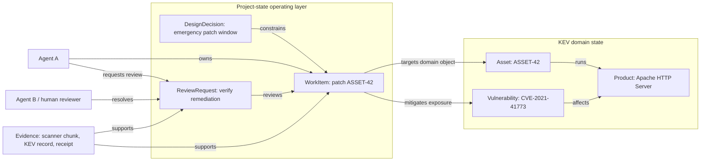

<p align="center">
  <a href="https://cruxible.ai">
    
  </a>
</p>

# Cruxible Core

[](https://pypi.org/project/cruxible-core/)
[](https://python.org)
[](LICENSE)

**Cruxible is a local-first governed state layer for AI agents: it helps teams
turn domain knowledge, workflow traces, human review, and accumulated judgment
into queryable state that survives model swaps.**

LLMs operate over context windows and retrieved text, not shared mutable state.
When project or domain state lives only in prompts, markdown files, chat
history, tickets, databases, or vector-memory summaries, each model invocation
must reconstruct the relevant facts, relationships, and decisions from those
sources.

Cruxible is not a replacement for those sources. It can point to them, cite
specific records or chunks, and turn the durable slice into agent-ready
relational state: typed entities, relationships, lifecycle, review status,
evidence, constraints, workflows, and named queries. That state gives agents a
structured context for reasoning, especially when multiple agents or human
reviewers need to coordinate on the same work. Receipts, governance, and
provenance make durable claims traceable back to their sources. Core executes
deterministically: no LLM inside, no hidden API calls, and every important
operation can produce a receipt.

For developers, Cruxible gives you a stable backend for agent context:

- model the state once as a kit instead of rebuilding context in every prompt
- keep external systems as sources of truth while storing pointers and durable
  claims
- expose the same named queries to agents, scripts, HTTP clients, dashboards,
  and review tools
- route uncertain claims through governed review instead of accepting every
  agent write as trusted state
- trace state back to source records, chunks, receipts, workflows, and reviewers

## The Owned Learning Loop

Cruxible is built for teams that want their AI systems to improve and their
knowledge to compound with use, instead of getting wiped away by every context
refresh, model swap, or handoff.

A Cruxible-backed loop looks like this:

1. Agents query governed state instead of reconstructing context from scratch.
2. Workflows and tools produce traces, evidence, and proposed changes.
3. Humans or policies review uncertain claims and important state transitions.
4. Edge feedback records corrections, missing context, and policy gaps.
5. Outcome profiles record whether decisions and workflow results were later
   correct, incorrect, partial, or unknown.
6. Approved state, rejected claims, corrections, outcomes, and receipts persist.
7. Future agents use that durable state regardless of which model is running.

The model can change. The accumulated state, evidence, review history,
feedback, outcomes, and workflow knowledge stay with the team.

## Two Kinds Of State

Cruxible is useful for two related jobs.

### Domain State

Domain state is the durable model of the world an agent is reasoning about:
customers, assets, vulnerabilities, suppliers, products, cases, controls,
policies, dependencies, risks, services, or any other domain-specific entities
and relationships.

Domain state answers:

> What is true, proposed, reviewed, or constrained about the world?

Examples:

- Which assets are exposed to a known exploited vulnerability?
- Which supplier incident affects which products and shipments?
- Which legal matter is constrained by a new case authority?
- Which products substitute for or complement each other?

### Agent Operating State

Agent operating state is the durable coordination layer for work done by agents
and humans: work items, review requests, design decisions, open questions,
risks, milestones, release lines, evidence, dependencies, and lifecycle status.

Operating state answers:

> What are we doing, why, what blocks it, who reviewed it, and what changed?

Examples:

- What open work items are active, blocked, deferred, or ready for review?
- Which design decision constrains this implementation?
- Which review request approved closing a work item?
- Which open question blocks a release or a downstream task?

These state types can be used separately. They are strongest together: a domain
kit models the thing the agent is working on, while an operating-state kit tracks
the work, decisions, evidence, reviews, and lifecycle around that domain.

### Example: KEV Domain State Plus Project Operating State



In this shape, the KEV kit owns the domain facts: an asset runs a product, and a
vulnerability affects that product. The agent-operation kit owns the operating
facts: Agent A has a work item to patch the asset, a decision constrains how the
work happens, and Agent B or a human reviewer resolves the review request.
Evidence refs and receipts connect both layers back to scanner output, source
records, markdown chunks, and prior Cruxible operations.

## Why Not Just Markdown Or Memory?

Markdown and memory are good for loose context. They are weak as shared state.

| Markdown, prompts, or memory alone | With Cruxible |
|---|---|
| Facts are re-summarized on every handoff | Facts and relationships persist as typed state |
| Procedure lives in prose and habits | Queries, constraints, guards, and workflows are executable |
| Review is informal | Review and lifecycle state are part of the model |
| Provenance is scattered across chats and tools | Receipts and evidence refs explain where claims came from |
| Agents RAG over many files to recover context | Agents ask narrow named queries with bounded results |
| Apps need custom glue over prose | Apps call the same query engine agents use |
| Stale items linger as text | State has explicit status, ownership, dependencies, and closure rules |

Use markdown for narrative, plans, and source evidence. Use Cruxible for state
that agents and humans need to coordinate around.

Cruxible also does not need to re-implement every source system. If markdown,
an application database, Stripe, Cognito, a CRM, or another relational system is
already the source of truth, Cruxible can keep pointers to whole records or to
specific addressable parts, such as a chunk in a markdown file, and store only
the durable claims, relationships, lifecycle state, evidence refs, or review
decisions that agents need to coordinate around.

## What Cruxible Provides

- **Ontologies:** typed entity and relationship schemas for a domain or operating
  state model.
- **Constraints and mutation guards:** deterministic validation rules for graph
  quality and state transitions.
- **Named and inline queries:** bounded, deterministic read surfaces for agents,
  apps, and workflows.
- **Workflows:** reproducible procedures that query, call providers, generate
  candidates, apply direct state, or propose governed changes.
- **Governed proposals:** candidate relationship groups with signal evidence,
  review state, trust policy, and resolution receipts.
- **Evidence-backed direct writes:** agents can add live state with evidence refs
  or source-artifact locators without marking it review-approved.
- **Pointers to external truth:** state can reference source documents,
  markdown chunks, external records, record fields, or existing databases
  without copying everything into the graph.
- **Receipts and traces:** durable proof for queries, workflows, mutations, and
  provider execution.
- **Feedback and outcomes:** Loop 1 feedback records corrections and policy
  gaps; Loop 2 outcomes record whether decisions or workflow results were later
  correct, incorrect, partial, or unknown.
- **Kits and overlays:** reusable state models that can be composed, extended,
  bundled, and run locally.

## What Developers Build With It

Cruxible is not just a place to store graph-shaped facts. The point is to make
state usable by agents, humans, and software without each caller reinterpreting
the underlying documents.

- **Agent reasoning context:** an agent can run named queries, inspect receipts,
  cite evidence, and reason from stable state instead of from a fresh scrape of
  scattered markdown.
- **Multi-agent coordination:** teams of agents and human reviewers can work
  against the same lifecycle, dependency, review, and provenance state instead
  of exchanging lossy summaries.
- **Query-backed product features:** apps and services can call the same query
  engine through HTTP or the client SDK to power status pages, review queues,
  dependency views, exposure reports, dashboards, and agent-facing tools.
- **Pointers plus claims:** Cruxible can point to whole external records or
  specific addressable parts for live detail while storing the relationships,
  decisions, and review state that need to be durable.
- **Reviewable write pipelines:** uncertain claims become candidate groups with
  signals, evidence, and review actions instead of silently mutating trusted
  state.
- **Workflow automation:** workflows consume query results, call deterministic
  providers, apply direct state, generate governed proposals, and emit receipts.
- **State maintenance:** evaluation, feedback, outcomes, and mutation guards turn
  state into something agents can improve, not just retrieve.

## Governance And Workflows

Cruxible separates writing state from accepting state.

Direct writes are useful when an agent or system is asserting hard state: import
these entities, add these deterministic relationships, attach this source
evidence. Direct relationship writes are live and queryable, but they remain
unreviewed unless a governed process later approves them.

Governed proposals are the review boundary for judgment calls. A workflow can
group many candidate relationships under one thesis, attach signal evidence,
record why each member was proposed, and route the group to a human or trusted
auto-resolution policy. Approval writes accepted relationship state with
resolution provenance; rejection records why the proposal did not become state.

Workflows are the executable procedure layer. They make repeated agent work
auditable: run a query, call a provider, shape candidates, map signals, propose a
group, apply direct state, or test the whole flow against expected behavior.
Because workflow runs, proposal resolutions, feedback, outcomes, and queries all
produce durable records, agents can explain not only what they concluded, but how
the state changed and which evidence supported it.

## How It Fits

```text
AI agents and humans
  write configs, review proposals, run workflows, record outcomes
          |
          v
CLI / HTTP client / MCP tools
  thin surfaces over the service layer
          |
          v
Cruxible Core
  deterministic runtime, no LLM inside
          |
          v
state.db
  graph state, receipts, traces, groups, feedback, outcomes, decisions,
  snapshots, source artifacts
```

The core loop:

1. Model a domain or operating-state surface as a kit.
2. Add or refresh state through direct writes, workflows, or imports.
3. Propose uncertain relationships for review instead of silently accepting
   them.
4. Query compact state surfaces instead of re-reading every source document.
5. Record feedback, outcomes, and decisions so the state can improve over time.

## Small Example

```yaml
entity_types:
  WorkItem:
    properties:
      work_item_id: { type: string, primary_key: true }
      title: { type: string }
      status: { type: string, enum_ref: lifecycle_status }
      priority: { type: string, enum_ref: priority }
  ReviewRequest:
    properties:
      review_request_id: { type: string, primary_key: true }
      status: { type: string, enum_ref: review_status }

relationships:
  - name: review_request_for_work_item
    from: ReviewRequest
    to: WorkItem
  - name: work_item_depends_on_work_item
    from: WorkItem
    to: WorkItem

named_queries:
  work_items_for_owner:
    mode: collection
    returns: WorkItem
    result_shape: entity
    where:
      result.properties.owner:
        eq: $input.owner
      result.properties.status:
        not_in: [closed, superseded]
```

An agent can now ask the state layer for an owner's open queue, dependency
context, review status, and blockers without scanning project notes or chat
history.

## Get Started

### Install And Start A Local Daemon

```bash
pip install "cruxible-core[server,mcp]"
CRUXIBLE_SERVER_STATE_DIR="$HOME/.cruxible/server" cruxible server start
```

The daemon is local-only by default and binds to `127.0.0.1:8100`. For a simple
local hardening layer, set `CRUXIBLE_SERVER_AUTH=true` and
`CRUXIBLE_RUNTIME_BOOTSTRAP_SECRET=...`, then claim the bootstrap secret to
create runtime credentials.

If you prefer [uv](https://docs.astral.sh/uv/):

```bash
uv tool install "cruxible-core[server,mcp]"
```

### Initialize A Kit

```bash
cruxible --server-url http://127.0.0.1:8100 init --kit agent-operation
```

The returned `instance_id` is the handle used by CLI, MCP, HTTP clients, and UI
surfaces for later queries, workflows, writes, and reviews.

### Query State

```bash
cruxible --server-url http://127.0.0.1:8100 \
  --instance-id <instance_id> \
  query list

cruxible --server-url http://127.0.0.1:8100 \
  --instance-id <instance_id> \
  query run work_items_for_owner --param owner=codex-core --json
```

Or call the same query surface from Python:

```python
from cruxible_client import CruxibleClient

with CruxibleClient(base_url="http://127.0.0.1:8100") as client:
    result = client.query(
        "<instance_id>",
        "work_items_for_owner",
        {"owner": "codex-core"},
    )
    for item in result.items:
        print(item)
```

### Write State

For direct hard-state writes, use `entity add`, `relationship add`, or
`batch-direct-write`. Direct relationship writes are live and evidence-backed,
but they are not group-reviewed accepted state.

For uncertain or interpretive claims, use governed proposal workflows or group
proposal commands, then resolve the group after review.

## Agent Setup

For agents, prefer a split environment:

- `cruxible-core` runs in a daemon/runtime environment.
- The agent environment installs `cruxible-client` or uses MCP.
- `CRUXIBLE_REQUIRE_SERVER=1` keeps the agent on the daemon path.
- `CRUXIBLE_SERVER_STATE_DIR` lives outside the agent's writable workspace.

```bash
pip install cruxible-client
```

MCP example:

```json
{
  "mcpServers": {
    "cruxible": {
      "command": "cruxible-mcp",
      "env": {
        "CRUXIBLE_MODE": "governed_write",
        "CRUXIBLE_SERVER_URL": "http://127.0.0.1:8100"
      }
    }
  }
}
```

Local permission modes are a practical hardening layer, not full sandboxing. If
trust levels matter, keep the daemon state outside the agent workspace and
expose only the client, HTTP, or MCP surface. See
[Isolated Deployment](docs/isolated-deployment.md).

## Kits

| Kit | Kind | What it models |
|-----|------|----------------|
| [agent-operation](kits/agent-operation/) | Agent operating state | Work items, review requests, decisions, risks, open questions, state notes, actors, lifecycle, and dependency context. |
| [kev-reference](kits/kev-reference/) | Domain reference state | Public known-exploited vulnerability reference data. |
| [kev-triage](kits/kev-triage/) | Domain overlay state | Local asset exposure, service impact, controls, incidents, findings, remediation, and governed vulnerability triage. |
| [supply-chain-blast-radius](kits/supply-chain-blast-radius/) | Domain state | Suppliers, components, assemblies, products, shipments, and incident blast radius. |
| [case-law-monitoring](kits/case-law-monitoring/) | Domain state | Matter-centered case-law monitoring and authority impact. |

Standalone kits can define a full state model. Overlay kits can extend an
upstream state model with local state, governed proposals, and local workflows.

## Demos

| Demo | Domain | What it demonstrates |
|------|--------|---------------------|
| [sanctions-screening](demos/sanctions-screening/) | Fintech / RegTech | OFAC screening with beneficial ownership chain traversal. |
| [drug-interactions](demos/drug-interactions/) | Healthcare | Multi-drug interaction checking with CYP450 enzyme data. |
| [mitre-attack](demos/mitre-attack/) | Cybersecurity | Threat modeling with ATT&CK technique and group analysis. |

## When To Use Cruxible

Use Cruxible when state must be:

- shared across humans, agents, workflows, or apps
- queryable by stable names rather than rediscovered from prose
- governed by constraints, guards, review, or lifecycle rules
- backed by evidence and receipts
- durable across sessions and agent handoffs

Do not use Cruxible for every note. Temporary scratch work, narrative docs,
meeting notes, and free-form reasoning still belong in markdown or ordinary
tools unless they contain claims that should become durable state.

## Documentation

- [Quickstart](docs/quickstart.md) - install to first query
- [Concepts](docs/concepts.md) - architecture and primitives
- [Config Reference](docs/config-reference.md) - YAML schema
- [CLI Reference](docs/cli-reference.md) - terminal commands
- [MCP Tools Reference](docs/mcp-tools.md) - agent tool surface
- [AI Agent Guide](docs/for-ai-agents.md) - orchestration patterns
- [Kit Walkthroughs](docs/kit-walkthroughs.md) - standalone and overlay kits
- [Local State And Backups](docs/local-state-and-backups.md) - SQLite, daemon state, and portability
- [Common Providers And Dataflow Steps](docs/common-providers.md) - provider and workflow building blocks

## Technology

Cruxible Core uses [Pydantic](https://docs.pydantic.dev/) for validation,
[NetworkX](https://networkx.org/) for in-memory graph operations,
[Polars](https://pola.rs/) for data operations, [SQLite](https://sqlite.org/)
for local durable state, [FastAPI](https://fastapi.tiangolo.com/) for the daemon,
and [FastMCP](https://github.com/jlowin/fastmcp) for MCP tools.

## License

MIT

<!-- mcp-name: io.github.cruxible-ai/cruxible-core -->
