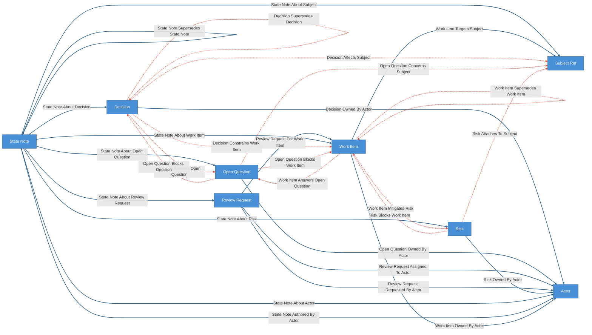
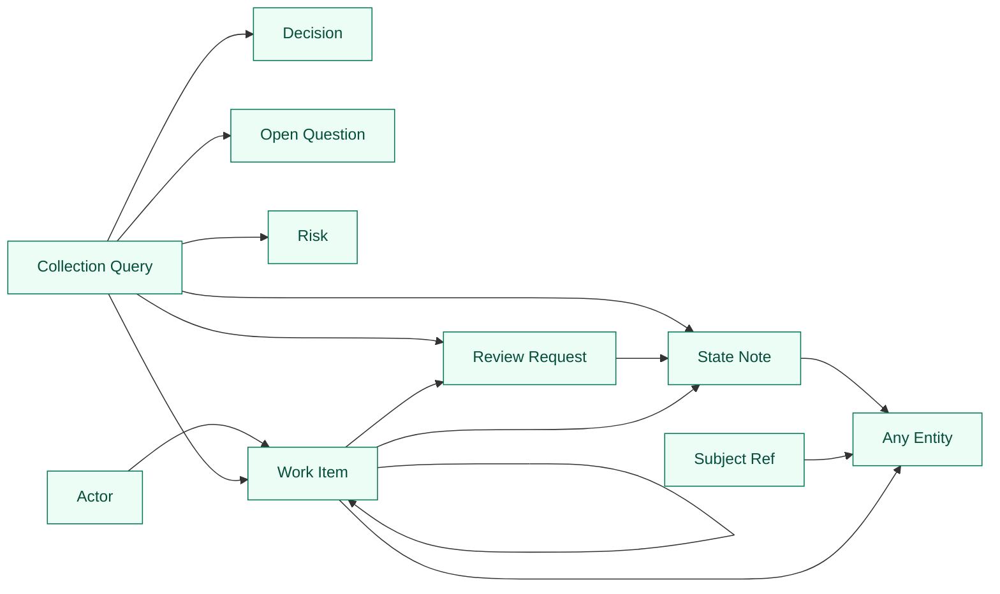

# Agent Operation Kit

Reusable Cruxible state model for coordinating agent and human work over one or
more durable domain ontologies.

Agent operation state is an agent-native orchestration overlay, not the domain
state itself. It models work, reviews, decisions, risks, open questions, actors,
state notes, lifecycle, blockers, dependencies, composition, and lineage. Domain
entities stay in their own kits. This kit links outward through `SubjectRef` or
through relationships added by composed configs.

Documents, chats, OKF bundles, plans, review reports, and transcripts are source
evidence for operation-state claims. They are not modeled as operation-state
entities.

Everything between `CRUXIBLE:BEGIN` / `CRUXIBLE:END` markers is regenerated
from `config.yaml` by `cruxible config views`; treat those blocks as code-owned
structural truth. Everything outside those marker blocks is authored explanation.

## Modeling Notes

Work relationships need separate axes:

- `work_item_depends_on_work_item` is sequencing: B before A.
- `risk_blocks_work_item` and `open_question_blocks_work_item` are impediments.
- `work_item_part_of_work_item` is composition and roll-up, not sequencing.
- `work_item_spawned_from_work_item` is lineage, not sequencing or replacement.
- `work_item_supersedes_work_item` is replacement.
- `StateNote` is dated operational commentary: correction, field note,
  rationale update, implementation note, or review note. Keep current entity
  fields concise; put durable interpretation history in linked notes.

This distinction keeps readiness and critical-path queries from treating every
related item as a blocker.

## Ontology Map

<!-- CRUXIBLE:BEGIN ontology -->

<!-- CRUXIBLE:END ontology -->

## Workflow Summary

Workflows are intentionally not included in this first pass. The first useful
workflow layer should be composed by a domain kit or local overlay once the
operation ontology has real state behind it.

<!-- CRUXIBLE:BEGIN workflow-pipeline -->
```mermaid
flowchart LR
  classDef canonicalWorkflow fill:#4a90d9,stroke:#2c5f8a,color:#fff
  classDef governedWorkflow fill:#e67e22,stroke:#a0521c,color:#fff

```
<!-- CRUXIBLE:END workflow-pipeline -->

<!-- CRUXIBLE:BEGIN workflow-summary -->

<!-- CRUXIBLE:END workflow-summary -->

## Governed Relationships

Governed relationships represent interpretive operational claims that should be
evidence-backed when proposed by agents.

<!-- CRUXIBLE:BEGIN governance-table -->
| Relationship | Scope | Creation Path | Signals | Auto-resolve Gate | Review Policy | Feedback | Outcomes |
| --- | --- | --- | --- | --- | --- | --- | --- |
| Decision Affects Subject | Decision -> Subject Ref | Agent/manual group propose | Maintainer Judgment, Source Evidence | All Support; prior trust: Trusted Only | Trust-gated auto-resolve | - | - |
| Decision Answers Open Question | Decision -> Open Question | Agent/manual group propose | Maintainer Judgment, Source Evidence | All Support; prior trust: Trusted Only | Trust-gated auto-resolve | - | - |
| Decision Constrains Work Item | Decision -> Work Item | Agent/manual group propose | Maintainer Judgment, Source Evidence | All Support; prior trust: Trusted Only | Trust-gated auto-resolve | - | - |
| Decision Supersedes Decision | Decision -> Decision | Agent/manual group propose | Maintainer Judgment, Source Evidence | All Support; prior trust: Trusted Only | Trust-gated auto-resolve | - | - |
| Open Question Blocks Decision | Open Question -> Decision | Agent/manual group propose | Maintainer Judgment, Source Evidence | All Support; prior trust: Trusted Only | Trust-gated auto-resolve | - | - |
| Open Question Blocks Work Item | Open Question -> Work Item | Agent/manual group propose | Maintainer Judgment, Source Evidence | All Support; prior trust: Trusted Only | Trust-gated auto-resolve | - | - |
| Open Question Concerns Subject | Open Question -> Subject Ref | Agent/manual group propose | Maintainer Judgment, Source Evidence | All Support; prior trust: Trusted Only | Trust-gated auto-resolve | - | - |
| Risk Attaches To Subject | Risk -> Subject Ref | Agent/manual group propose | Maintainer Judgment, Source Evidence | All Support; prior trust: Trusted Only | Trust-gated auto-resolve | - | - |
| Risk Blocks Work Item | Risk -> Work Item | Agent/manual group propose | Maintainer Judgment, Source Evidence | All Support; prior trust: Trusted Only | Trust-gated auto-resolve | - | - |
| Work Item Answers Open Question | Work Item -> Open Question | Agent/manual group propose | Maintainer Judgment, Source Evidence | All Support; prior trust: Trusted Only | Trust-gated auto-resolve | - | - |
| Work Item Depends On Work Item | Work Item -> Work Item | Agent/manual group propose | Maintainer Judgment, Source Evidence | All Support; prior trust: Trusted Only | Trust-gated auto-resolve | - | - |
| Work Item Mitigates Risk | Work Item -> Risk | Agent/manual group propose | Maintainer Judgment, Source Evidence | All Support; prior trust: Trusted Only | Trust-gated auto-resolve | - | - |
| Work Item Supersedes Work Item | Work Item -> Work Item | Agent/manual group propose | Maintainer Judgment, Source Evidence | All Support; prior trust: Trusted Only | Trust-gated auto-resolve | - | - |
<!-- CRUXIBLE:END governance-table -->

### Signal Policy Notes

<!-- CRUXIBLE:BEGIN signal-policy-catalog -->
| Signal Source | Role | Review Unsure | Used By | Notes |
| --- | --- | --- | --- | --- |
| `maintainer_judgment` | advisory | yes | Decision Affects Subject, Decision Answers Open Question, Decision Constrains Work Item, Decision Supersedes Decision, Open Question Blocks Decision, Open Question Blocks Work Item, Open Question Concerns Subject, Risk Attaches To Subject, Risk Blocks Work Item, Work Item Answers Open Question, Work Item Depends On Work Item, Work Item Mitigates Risk, Work Item Supersedes Work Item | - |
| `source_evidence` | required | yes | Decision Affects Subject, Decision Answers Open Question, Decision Constrains Work Item, Decision Supersedes Decision, Open Question Blocks Decision, Open Question Blocks Work Item, Open Question Concerns Subject, Risk Attaches To Subject, Risk Blocks Work Item, Work Item Answers Open Question, Work Item Depends On Work Item, Work Item Mitigates Risk, Work Item Supersedes Work Item | - |
<!-- CRUXIBLE:END signal-policy-catalog -->

## Query Map

<!-- CRUXIBLE:BEGIN query-map -->

<!-- CRUXIBLE:END query-map -->

## Query Catalog

<!-- CRUXIBLE:BEGIN query-catalog -->
### Actor

| Query | Mode | Returns | State | Traversal | Purpose |
| --- | --- | --- | --- | --- | --- |
| Actor Work Queue | traversal | Work Item | reviewable | Work Item Owned By Actor (Incoming) | Work items owned by an actor with latest reviews, dependency counts, blockers, subjects. |

### Collection Query

| Query | Mode | Returns | State | Traversal | Purpose |
| --- | --- | --- | --- | --- | --- |
| Active Risks | collection | Risk | live |  | Active operational risks. |
| Blocked Work Items | collection | Work Item | reviewable |  | Work items marked blocked, with risk/open-question blocker context. |
| Changes Requested Reviews | collection | Review Request | reviewable |  | Review requests sent back with changes requested -- the implementer's rework queue, distinct from the reviewer-facing review_queue. |
| Open Questions Needing Review | collection | Open Question | live |  | Planned/active open questions needing review. |
| Proposed Decisions | collection | Decision | live |  | Proposed decisions awaiting acceptance/rejection/deferral. |
| Recent State Notes | collection | State Note | reviewable |  | Recent operation-state notes, corrections, rationale/implementation/review notes. |
| Review Queue | collection | Review Request | reviewable |  | Review requests awaiting a reviewer -- requested or in review. Reviews sent back for rework live in changes_requested_reviews. |
| Superseded Decisions | collection | Decision | not-live |  | Decision retired/superseded on the canonical entity-lifecycle axis (lifecycle.status != live), gated out of live reads. Supersession is not a domain status value. |
| Superseded Work Items | collection | Work Item | not-live |  | WorkItem retired/superseded on the canonical entity-lifecycle axis (lifecycle.status != live), gated out of live reads. Supersession is not a domain status value. |

### Review Request

| Query | Mode | Returns | State | Traversal | Purpose |
| --- | --- | --- | --- | --- | --- |
| State Notes For Review Request | traversal | State Note | reviewable | State Note About Review Request (Incoming) | The review thread: verdict and finding notes attached to a review request, newest first. This is the read that replaces scrolling a notes blob. |

### State Note

| Query | Mode | Returns | State | Traversal | Purpose |
| --- | --- | --- | --- | --- | --- |
| State Note Context | traversal | Any Entity | reviewable | State Note Authored By Actor \| State Note About Work Item \| State Note About Review Request \| State Note About Decision \| State Note About Risk \| State Note About Open Question \| State Note About Subject \| State Note About Actor \| State Note Supersedes State Note \| State Note Resolves State Note (Both) | Full context for a state note (targets, author, supersession). |

### Subject Ref

| Query | Mode | Returns | State | Traversal | Purpose |
| --- | --- | --- | --- | --- | --- |
| Subject Operation Context | traversal | Any Entity | reviewable | State Note About Subject \| Work Item Targets Subject \| Decision Affects Subject \| Risk Attaches To Subject \| Open Question Concerns Subject (Both) | Work, decisions, risks, open questions attached to a subject ref. |

### Work Item

| Query | Mode | Returns | State | Traversal | Purpose |
| --- | --- | --- | --- | --- | --- |
| Approved Reviews For Work Item | traversal | Review Request | live | Review Request For Work Item (Incoming) | Approved review requests for a work item. Used by the closed-transition guard. |
| State Notes For Work Item | traversal | State Note | reviewable | State Note About Work Item (Incoming) | State notes attached to a work item, newest first. |
| Work Item Context | traversal | Any Entity | reviewable | Work Item Owned By Actor \| Review Request For Work Item \| State Note About Work Item \| Work Item Depends On Work Item \| Work Item Part Of Work Item \| Work Item Spawned From Work Item \| Work Item Supersedes Work Item \| Risk Blocks Work Item \| Open Question Blocks Work Item \| Work Item Mitigates Risk \| Work Item Answers Open Question \| Decision Constrains Work Item \| Work Item Targets Subject (Both) | From a work item, inspect dependencies, blockers, reviews, composition, lineage, decisions, owner, subjects. Base-layer adjacency only: all_adjacent expands at this kit's load time, so on a composed instance this query does NOT see overlay seam edges — prefer the overlay's domain-aware context query there (e.g. project-domain's work_item_change_context). |
| Work Item Lineage Context | traversal | Work Item | reviewable | Work Item Spawned From Work Item \| Work Item Supersedes Work Item (Both, depth=5) | Work item lineage/replacement context, excluding sequencing deps. |
| Work Item Rollup Context | traversal | Work Item | reviewable | Work Item Part Of Work Item (Incoming, depth=5) | Child/descendant work items under a parent. |
<!-- CRUXIBLE:END query-catalog -->

## Quality Rules

<!-- CRUXIBLE:BEGIN quality-rules -->
### Constraints

No configured constraints.

### Quality Checks

| Name | Kind | Target | Severity | Rule |
| --- | --- | --- | --- | --- |
| `decision_supersessions_have_basis` | Property | Decision Supersedes Decision.supersession_basis | Warning | Non Empty |
| `decision_work_constraints_have_type` | Property | Decision Constrains Work Item.impact_type | Warning | Required |
| `open_question_work_blockers_have_basis` | Property | Open Question Blocks Work Item.blocking_basis | Warning | Non Empty |
| `review_requests_review_work` | Cardinality | Review Request -> Review Request For Work Item (out) | Warning | min `1` |
| `risk_work_blockers_have_basis` | Property | Risk Blocks Work Item.blocking_basis | Warning | Non Empty |
| `state_note_supersessions_have_basis` | Property | State Note Supersedes State Note.supersession_basis | Warning | Non Empty |
| `state_notes_have_author` | Cardinality | State Note -> State Note Authored By Actor (out) | Warning | min `1` |
| `work_dependencies_have_basis` | Property | Work Item Depends On Work Item.dependency_basis | Warning | Non Empty |
| `work_item_part_of_single_parent` | Cardinality | Work Item -> Work Item Part Of Work Item (out) | Warning | max `1` |
| `work_item_spawned_from_single_origin` | Cardinality | Work Item -> Work Item Spawned From Work Item (out) | Warning | max `1` |
| `work_items_have_owner` | Cardinality | Work Item -> Work Item Owned By Actor (out) | Warning | min `1` |
| `work_supersessions_have_basis` | Property | Work Item Supersedes Work Item.supersession_basis | Warning | Non Empty |
<!-- CRUXIBLE:END quality-rules -->

## Learning Loops

<!-- CRUXIBLE:BEGIN learning-loops -->
### Feedback Profiles (Loop 1)

No configured feedback profiles.

### Outcome Profiles (Loop 2)

#### Resolution-Anchored

No configured resolution-anchored outcome profiles.

#### Receipt-Anchored

No configured receipt-anchored outcome profiles.
<!-- CRUXIBLE:END learning-loops -->

## Regeneration

```bash
uv run cruxible config views --config kits/agent-operation/config.yaml --update-readme kits/agent-operation/README.md
```
