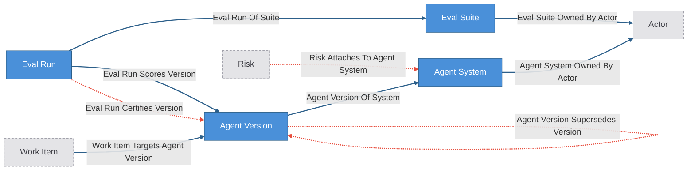
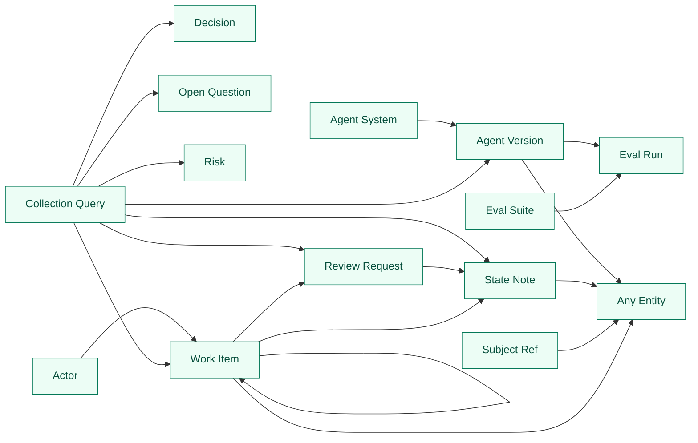

# Agent Release Kit

Agent release domain overlay composed over the agent-operation base kit
(`extends: ../agent-operation/config.yaml`).

The base supplies the operating layer: actors, work items, review requests,
decisions, risks, open questions, state notes, and their ownership, review-gate,
work-axis, and governed-judgment relationships. This overlay adds the agent
release domain: agent systems, their versions, eval suites, and receipted eval
runs — and one hard gate:

**An AgentVersion cannot be promoted to `live` without an accepted, passing,
certifying EvalRun.** The `agent_version_live_requires_certifying_eval`
mutation guard refuses the write — both the status update and the
create-directly-as-live bypass — until an `eval_run_certifies_version` edge is
live for the version. Certification itself is `write_policy: proposal_only`:
it enters only through governed proposal review, never as a direct write. Your
agent's promotion claim is un-fakeable by the agent that wants to ship.

Everything between `CRUXIBLE:BEGIN` / `CRUXIBLE:END` markers is regenerated
from `config.yaml` by `cruxible config views`; treat those blocks as code-owned
structural truth. Everything outside those marker blocks is authored explanation.

## Scope discipline (what this kit deliberately does NOT do)

- **It does not run evals.** The eval harness stays outside — promptfoo, your
  own scripts, a CI job, anything. This state layer governs receipted eval
  *claims*: an `EvalRun` is a durable record written after your harness runs,
  with `artifact_ref` pointing at the report evidence. The LLM (and the
  harness) stay outside the guarantees boundary.
- **It does not assume deployment infrastructure.** Promotion is the
  `AgentVersion.status` transition to `live`. A hobbyist local bot qualifies
  the moment its owner distinguishes "the version I run" from "the version I'm
  working on". There is no Deployment entity in v1; promotion is the status
  flip, audited via entity history and gated by the mutation guard.

## Modeling Notes

- `eval_run_scores_version` and `eval_run_certifies_version` are split on
  purpose. The first is the deterministic fact that a run measured a version.
  The second is the governed judgment that the run is valid, current, and
  covers that version for promotion. Only the governed edge feeds the gate,
  and the gate's backing query reads at `relationship_state: live` — a pending
  certification does not unlock promotion.
- Ownership is not a property. Accountability flows through the base `Actor`
  entity and `*_owned_by_actor` edges, materialized from credential mints.
- Seam edges into the operation layer: `work_item_targets_agent_version`
  (deterministic — the work that builds a version) and
  `risk_attaches_to_agent_system` (governed). Composed with the base, this
  closes the triangle: a review-gated WorkItem targets an AgentVersion whose
  promotion is eval-gated.
- `change_ref` on AgentVersion is an evidence pointer (git sha, config digest,
  prompt file hash), not embedded content.

## The release loop

```
# 1. Record the version you're about to certify
cruxible entity add AgentVersion v14 --set label="v14 prompt rev" \
  --set status=candidate --set change_ref="git:abc1234"
cruxible relationship add agent_version_of_system AgentVersion v14 AgentSystem my-bot

# 2. Run your own evals, then record the receipted claim
cruxible entity add EvalRun run-2026-07-03-a --set-json passed=true \
  --set-json score=0.95 --set ran_at="2026-07-03T19:30:00Z" \
  --set artifact_ref="file://evals/run-a/report.json"
cruxible relationship add eval_run_scores_version EvalRun run-2026-07-03-a AgentVersion v14
cruxible relationship add eval_run_of_suite EvalRun run-2026-07-03-a EvalSuite core-regression

# 3. Certification is proposal-only: propose, review, approve
cruxible group propose --relationship eval_run_certifies_version --members '[...]' \
  --thesis "run-2026-07-03-a certifies v14: passing core-regression on the exact build"
cruxible group resolve --group <GRP> --action approve --source human \
  --expected-pending-version <n> --rationale "Report verified"

# 4. Promote — the guard checks for a live, passing, certifying run
cruxible entity update --type AgentVersion --id v14 --set status=live
```

Steps 1, 2, and 4 without step 3 are refused with a receipt — that is the
point of the kit.

## Ontology

<!-- CRUXIBLE:BEGIN ontology -->

<!-- CRUXIBLE:END ontology -->

## Workflows

The kit ships no workflows: EvalRun records and release structure are written
directly by the operator or agent (the eval harness stays outside), and
certification goes through `group propose`. The composed runtime view below
shows anything inherited from the base.

<!-- CRUXIBLE:BEGIN workflow-pipeline -->
```mermaid
flowchart LR
  classDef canonicalWorkflow fill:#4a90d9,stroke:#2c5f8a,color:#fff
  classDef governedWorkflow fill:#e67e22,stroke:#a0521c,color:#fff

```
<!-- CRUXIBLE:END workflow-pipeline -->

<!-- CRUXIBLE:BEGIN workflow-summary -->

<!-- CRUXIBLE:END workflow-summary -->

## Governance

<!-- CRUXIBLE:BEGIN governance-table -->
| Relationship | Scope | Creation Path | Signals | Auto-resolve Gate | Review Policy | Feedback | Outcomes |
| --- | --- | --- | --- | --- | --- | --- | --- |
| Agent Version Supersedes Version | Agent Version -> Agent Version | Agent/manual group propose | Maintainer Judgment, Source Evidence | All Support; prior trust: Trusted Only | Trust-gated auto-resolve | 2 reason codes | Supersession Resolution |
| Decision Affects Subject | Decision -> Subject Ref | Agent/manual group propose | Maintainer Judgment, Source Evidence | All Support; prior trust: Trusted Only | Trust-gated auto-resolve | - | - |
| Decision Answers Open Question | Decision -> Open Question | Agent/manual group propose | Maintainer Judgment, Source Evidence | All Support; prior trust: Trusted Only | Trust-gated auto-resolve | - | - |
| Decision Constrains Work Item | Decision -> Work Item | Agent/manual group propose | Maintainer Judgment, Source Evidence | All Support; prior trust: Trusted Only | Trust-gated auto-resolve | - | - |
| Decision Supersedes Decision | Decision -> Decision | Agent/manual group propose | Maintainer Judgment, Source Evidence | All Support; prior trust: Trusted Only | Trust-gated auto-resolve | - | - |
| Eval Run Certifies Version | Eval Run -> Agent Version | Agent/manual group propose | Maintainer Judgment, Source Evidence | All Support; prior trust: Trusted Only | Trust-gated auto-resolve | 4 reason codes | Certification Resolution |
| Open Question Blocks Decision | Open Question -> Decision | Agent/manual group propose | Maintainer Judgment, Source Evidence | All Support; prior trust: Trusted Only | Trust-gated auto-resolve | - | - |
| Open Question Blocks Work Item | Open Question -> Work Item | Agent/manual group propose | Maintainer Judgment, Source Evidence | All Support; prior trust: Trusted Only | Trust-gated auto-resolve | - | - |
| Open Question Concerns Subject | Open Question -> Subject Ref | Agent/manual group propose | Maintainer Judgment, Source Evidence | All Support; prior trust: Trusted Only | Trust-gated auto-resolve | - | - |
| Risk Attaches To Agent System | Risk -> Agent System | Agent/manual group propose | Maintainer Judgment, Source Evidence | All Support; prior trust: Trusted Only | Trust-gated auto-resolve | 2 reason codes | - |
| Risk Attaches To Subject | Risk -> Subject Ref | Agent/manual group propose | Maintainer Judgment, Source Evidence | All Support; prior trust: Trusted Only | Trust-gated auto-resolve | - | - |
| Risk Blocks Work Item | Risk -> Work Item | Agent/manual group propose | Maintainer Judgment, Source Evidence | All Support; prior trust: Trusted Only | Trust-gated auto-resolve | - | - |
| Work Item Answers Open Question | Work Item -> Open Question | Agent/manual group propose | Maintainer Judgment, Source Evidence | All Support; prior trust: Trusted Only | Trust-gated auto-resolve | - | - |
| Work Item Depends On Work Item | Work Item -> Work Item | Agent/manual group propose | Maintainer Judgment, Source Evidence | All Support; prior trust: Trusted Only | Trust-gated auto-resolve | - | - |
| Work Item Mitigates Risk | Work Item -> Risk | Agent/manual group propose | Maintainer Judgment, Source Evidence | All Support; prior trust: Trusted Only | Trust-gated auto-resolve | - | - |
| Work Item Supersedes Work Item | Work Item -> Work Item | Agent/manual group propose | Maintainer Judgment, Source Evidence | All Support; prior trust: Trusted Only | Trust-gated auto-resolve | - | - |
<!-- CRUXIBLE:END governance-table -->

<!-- CRUXIBLE:BEGIN signal-policy-catalog -->
| Signal Source | Role | Review Unsure | Used By | Notes |
| --- | --- | --- | --- | --- |
| `maintainer_judgment` | advisory | yes | Agent Version Supersedes Version, Decision Affects Subject, Decision Answers Open Question, Decision Constrains Work Item, Decision Supersedes Decision, Eval Run Certifies Version, Open Question Blocks Decision, Open Question Blocks Work Item, Open Question Concerns Subject, Risk Attaches To Agent System, Risk Attaches To Subject, Risk Blocks Work Item, Work Item Answers Open Question, Work Item Depends On Work Item, Work Item Mitigates Risk, Work Item Supersedes Work Item | - |
| `source_evidence` | required | yes | Agent Version Supersedes Version, Decision Affects Subject, Decision Answers Open Question, Decision Constrains Work Item, Decision Supersedes Decision, Eval Run Certifies Version, Open Question Blocks Decision, Open Question Blocks Work Item, Open Question Concerns Subject, Risk Attaches To Agent System, Risk Attaches To Subject, Risk Blocks Work Item, Work Item Answers Open Question, Work Item Depends On Work Item, Work Item Mitigates Risk, Work Item Supersedes Work Item | - |
<!-- CRUXIBLE:END signal-policy-catalog -->

## Queries

<!-- CRUXIBLE:BEGIN query-map -->

<!-- CRUXIBLE:END query-map -->

<!-- CRUXIBLE:BEGIN query-catalog -->
### Actor

| Query | Mode | Returns | State | Traversal | Purpose |
| --- | --- | --- | --- | --- | --- |
| Actor Work Queue | traversal | Work Item | reviewable | Work Item Owned By Actor (Incoming) | Work items owned by an actor with latest reviews, dependency counts, blockers, subjects. |

### Agent System

| Query | Mode | Returns | State | Traversal | Purpose |
| --- | --- | --- | --- | --- | --- |
| Agent System Release Context | traversal | Agent Version | reviewable | Agent Version Of System (Incoming) | From an agent system, the version line with certification and risk context: per version, counts of scoring runs, certifying runs, and targeting work items. |

### Agent Version

| Query | Mode | Returns | State | Traversal | Purpose |
| --- | --- | --- | --- | --- | --- |
| Agent Version Context | traversal | Any Entity | reviewable | Agent Version Of System \| Eval Run Scores Version \| Eval Run Certifies Version \| Agent Version Supersedes Version \| Work Item Targets Agent Version (Both) | From an agent version, inspect its system, scoring and certifying eval runs, targeting work items, and supersession context. all_adjacent expands against the final composed config, so operation seam edges are traversed too. |
| Certifying Eval Runs For Version | traversal | Eval Run | live | Eval Run Certifies Version (Incoming) | Accepted, passing eval runs that certify an agent version. Used by the promotion guard: reads at relationship_state live, so pending certification proposals do not unlock promotion. |

### Collection Query

| Query | Mode | Returns | State | Traversal | Purpose |
| --- | --- | --- | --- | --- | --- |
| Active Risks | collection | Risk | live |  | Active operational risks. |
| Blocked Work Items | collection | Work Item | reviewable |  | Work items marked blocked, with risk/open-question blocker context. |
| Changes Requested Reviews | collection | Review Request | reviewable |  | Review requests sent back with changes requested -- the implementer's rework queue, distinct from the reviewer-facing review_queue. |
| Live Agent Versions | collection | Agent Version | reviewable |  | Currently live versions with their certification counts. |
| Open Questions Needing Review | collection | Open Question | live |  | Planned/active open questions needing review. |
| Promotion Candidates | collection | Agent Version | reviewable |  | Versions awaiting promotion (status candidate) with their certification posture: a candidate with zero certifying runs is not promotable yet. |
| Proposed Decisions | collection | Decision | live |  | Proposed decisions awaiting acceptance/rejection/deferral. |
| Recent State Notes | collection | State Note | reviewable |  | Recent operation-state notes, corrections, rationale/implementation/review notes. |
| Review Queue | collection | Review Request | reviewable |  | Review requests awaiting a reviewer -- requested or in review. Reviews sent back for rework live in changes_requested_reviews. |
| Superseded Decisions | collection | Decision | not-live |  | Decision retired/superseded on the canonical entity-lifecycle axis (lifecycle.status != live), gated out of live reads. Supersession is not a domain status value. |
| Superseded Work Items | collection | Work Item | not-live |  | WorkItem retired/superseded on the canonical entity-lifecycle axis (lifecycle.status != live), gated out of live reads. Supersession is not a domain status value. |

### Eval Suite

| Query | Mode | Returns | State | Traversal | Purpose |
| --- | --- | --- | --- | --- | --- |
| Eval Suite Run History | traversal | Eval Run | reviewable | Eval Run Of Suite (Incoming) | Eval runs recorded against a suite, newest first. |

### Review Request

| Query | Mode | Returns | State | Traversal | Purpose |
| --- | --- | --- | --- | --- | --- |
| State Notes For Review Request | traversal | State Note | reviewable | State Note About Review Request (Incoming) | The review thread: verdict and finding notes attached to a review request, newest first. This is the read that replaces scrolling a notes blob. |

### State Note

| Query | Mode | Returns | State | Traversal | Purpose |
| --- | --- | --- | --- | --- | --- |
| State Note Context | traversal | Any Entity | reviewable | State Note Authored By Actor \| State Note About Work Item \| State Note About Review Request \| State Note About Decision \| State Note About Risk \| State Note About Open Question \| State Note About Subject \| State Note About Actor \| State Note Supersedes State Note \| State Note Resolves State Note (Both) | Full context for a state note (targets, author, supersession). |

### Subject Ref

| Query | Mode | Returns | State | Traversal | Purpose |
| --- | --- | --- | --- | --- | --- |
| Subject Operation Context | traversal | Any Entity | reviewable | State Note About Subject \| Work Item Targets Subject \| Decision Affects Subject \| Risk Attaches To Subject \| Open Question Concerns Subject (Both) | Work, decisions, risks, open questions attached to a subject ref. |

### Work Item

| Query | Mode | Returns | State | Traversal | Purpose |
| --- | --- | --- | --- | --- | --- |
| Approved Reviews For Work Item | traversal | Review Request | live | Review Request For Work Item (Incoming) | Approved review requests for a work item. Used by the closed-transition guard. |
| State Notes For Work Item | traversal | State Note | reviewable | State Note About Work Item (Incoming) | State notes attached to a work item, newest first. |
| Work Item Context | traversal | Any Entity | reviewable | Work Item Owned By Actor \| Review Request For Work Item \| State Note About Work Item \| Work Item Depends On Work Item \| Work Item Part Of Work Item \| Work Item Spawned From Work Item \| Work Item Supersedes Work Item \| Risk Blocks Work Item \| Open Question Blocks Work Item \| Work Item Mitigates Risk \| Work Item Answers Open Question \| Decision Constrains Work Item \| Work Item Targets Subject \| Work Item Targets Agent Version (Both) | From a work item, inspect dependencies, blockers, reviews, composition, lineage, decisions, owner, subjects. all_adjacent expands against the final composed config, so on a composed instance this query also traverses overlay seam edges (e.g. project-domain's roadmap, release, milestone, and area relationships). |
| Work Item Lineage Context | traversal | Work Item | reviewable | Work Item Spawned From Work Item \| Work Item Supersedes Work Item (Both, depth=5) | Work item lineage/replacement context, excluding sequencing deps. |
| Work Item Rollup Context | traversal | Work Item | reviewable | Work Item Part Of Work Item (Incoming, depth=5) | Child/descendant work items under a parent. |
<!-- CRUXIBLE:END query-catalog -->

## Quality Rules

<!-- CRUXIBLE:BEGIN quality-rules -->
### Constraints

No configured constraints.

### Quality Checks

| Name | Kind | Target | Severity | Rule |
| --- | --- | --- | --- | --- |
| `agent_systems_have_owner` | Cardinality | Agent System -> Agent System Owned By Actor (out) | Warning | min `1` |
| `agent_versions_belong_to_one_system` | Cardinality | Agent Version -> Agent Version Of System (out) | Error | min `1`, max `1` |
| `certifications_have_basis` | Property | Eval Run Certifies Version.certification_basis | Warning | Non Empty |
| `decision_supersessions_have_basis` | Property | Decision Supersedes Decision.supersession_basis | Warning | Non Empty |
| `decision_work_constraints_have_type` | Property | Decision Constrains Work Item.impact_type | Warning | Required |
| `eval_runs_belong_to_suite` | Cardinality | Eval Run -> Eval Run Of Suite (out) | Warning | min `1` |
| `eval_runs_score_one_version` | Cardinality | Eval Run -> Eval Run Scores Version (out) | Error | min `1`, max `1` |
| `open_question_work_blockers_have_basis` | Property | Open Question Blocks Work Item.blocking_basis | Warning | Non Empty |
| `review_requests_review_work` | Cardinality | Review Request -> Review Request For Work Item (out) | Warning | min `1` |
| `risk_attachments_have_basis` | Property | Risk Attaches To Agent System.impact_basis | Warning | Non Empty |
| `risk_work_blockers_have_basis` | Property | Risk Blocks Work Item.blocking_basis | Warning | Non Empty |
| `state_note_supersessions_have_basis` | Property | State Note Supersedes State Note.supersession_basis | Warning | Non Empty |
| `state_notes_have_author` | Cardinality | State Note -> State Note Authored By Actor (out) | Warning | min `1` |
| `version_supersessions_have_basis` | Property | Agent Version Supersedes Version.supersession_basis | Warning | Non Empty |
| `work_dependencies_have_basis` | Property | Work Item Depends On Work Item.dependency_basis | Warning | Non Empty |
| `work_item_part_of_single_parent` | Cardinality | Work Item -> Work Item Part Of Work Item (out) | Warning | max `1` |
| `work_item_spawned_from_single_origin` | Cardinality | Work Item -> Work Item Spawned From Work Item (out) | Warning | max `1` |
| `work_items_have_owner` | Cardinality | Work Item -> Work Item Owned By Actor (out) | Warning | min `1` |
| `work_supersessions_have_basis` | Property | Work Item Supersedes Work Item.supersession_basis | Warning | Non Empty |
<!-- CRUXIBLE:END quality-rules -->

## Learning Loops

<!-- CRUXIBLE:BEGIN learning-loops -->
### Feedback Profiles (Loop 1)

#### `agent_version_supersedes_version`
- Version: `1`
- Reason codes:
  - `not_a_replacement` (`decision_policy`): The versions are parallel variants, not a supersession.
  - `wrong_direction` (`quality_check`): The supersession edge points the wrong way.
- Scope keys:
  - `superseded`: `TO.agent_version_id`
  - `superseding`: `FROM.agent_version_id`

#### `eval_run_certifies_version`
- Version: `1`
- Reason codes:
  - `build_mismatch` (`quality_check`): The run measured a different build than the version's change_ref claims.
  - `insufficient_coverage` (`decision_policy`): The suite passed but does not cover the surface this version changed.
  - `stale_run` (`constraint`): The run predates changes to the version and no longer certifies what would ship.
  - `unverifiable_artifact` (`quality_check`): The claimed report evidence (artifact_ref) is missing, unreadable, or does not support the pass claim.
- Scope keys:
  - `basis`: `EDGE.certification_basis`
  - `run`: `FROM.eval_run_id`
  - `version`: `TO.agent_version_id`

#### `risk_attaches_to_agent_system`
- Version: `1`
- Reason codes:
  - `risk_not_material` (`decision_policy`): The risk does not materially threaten this system's releases.
  - `wrong_system` (`quality_check`): The risk concerns a different agent system.
- Scope keys:
  - `risk`: `FROM.risk_id`
  - `system`: `TO.agent_system_id`

### Outcome Profiles (Loop 2)

#### Resolution-Anchored

##### `certification_resolution`
- Version: `1`
- Target: Relationship `eval_run_certifies_version`
- Outcome codes:
  - `premature_certification` (`trust_adjustment`): The certification was accepted but the run was later shown stale, mismatched, or unsupported by its artifact.
  - `promotion_held_up` (`unknown`): The certified version performed as the eval claimed after promotion.
  - `regression_after_promotion` (`require_review`): The certified version regressed in real use despite the passing certifying run.
- Scope keys:
  - `relationship_type`: `RESOLUTION.relationship_type`

##### `supersession_resolution`
- Version: `1`
- Target: Relationship `agent_version_supersedes_version`
- Outcome codes:
  - `rollback_to_superseded` (`require_review`): The superseded version had to come back after the replacement failed.
  - `supersession_confirmed` (`unknown`): The superseding version durably replaced the old one.
- Scope keys:
  - `relationship_type`: `RESOLUTION.relationship_type`

#### Receipt-Anchored

##### `certifying_runs_query`
- Version: `1`
- Target: Query `certifying_eval_runs_for_version`
- Outcome codes:
  - `false_certifying_run` (`graph_fix`): The guard surface counted a certifying run later shown invalid for the version.
  - `missed_certifying_run` (`graph_fix`): A valid certifying run existed but was not visible to the guard surface at promotion time.
- Scope keys:
  - `query`: `SURFACE.name`
<!-- CRUXIBLE:END learning-loops -->
