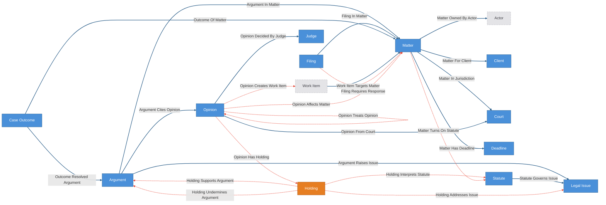

# Case-Law Monitoring Kit

Case-law domain overlay composed over the agent-operation base kit
(declared via the kit manifest's `target_state: agent-operation`).

The corpus layer is **real public law**: opinions, courts, judges, statutes,
and the citation graph, sourced from CourtListener metadata and digest-pinned
as a seed bundle (the launch corpus is the Chevron-deference cluster). The
firm layer is the practice: clients, matters, arguments, filings, deadlines,
case outcomes. Governed edges carry the judgments an attorney actually
reviews — holdings, statutory interpretations, citation treatment, argument
support and risk, matter impact, filing obligations. The treatment edge
(`opinion_treats_opinion`) is a governed, receipted citator entry: extraction
proposes, an attorney resolves, trust accumulates per judgment surface.

Everything between `CRUXIBLE:BEGIN` / `CRUXIBLE:END` markers is regenerated
from `config.yaml` by `cruxible config views`; treat those blocks as code-owned
structural truth. Everything outside them is authored explanation.

## Composition notes (no duplicated operating layer)

- **Attorneys are base Actors.** Matter accountability is
  `matter_owned_by_actor` to a mint-materialized Actor. The corpus seed loads
  matters unowned — Actors cannot be seeded — and onboarding assigns owners
  after credentials are minted; the `matters_have_owner` check nags until
  then, deliberately.
- **Review obligations are base WorkItems**, created by the
  analyze → apply → propose pipeline and attached through governed seam edges
  (`opinion_creates_work_item`) plus the deterministic
  `work_item_targets_matter`. A brief-update WorkItem closes through the base
  review gate: attorney signoff *is* the ReviewRequest approval. Nothing
  auto-closes work.
- **Holdings are judgment-born.** The canonical apply step creates them as
  inert records from the extractor payload; only the governed
  `opinion_has_holding` edge makes them reviewed legal reasoning, and the
  `holdings_belong_to_an_opinion` check flags orphaned extractions.
- **Two-act corpus.** `build_corpus` loads the pinned act-one world (the
  doctrine standing). `refresh_corpus` loads the bundled act-two fixture
  (fresh opinions arrive via `scripts/fetch_courtlistener.py`, outside the
  workflow boundary) and `sync_corpus_update` applies the reviewed rows. Then the treatment and impact proposal
  chain shows the law change propagating into firm state:
  `supporting_authority_now_bad_law` is the alarm.
- **LLM-outside.** Providers are deterministic heuristics over curated
  metadata; anything smarter proposes through the same governed path with
  tri-state signals and never writes accepted state.

## Opinion-text evidence

The launch corpus includes real CourtListener opinion text under
`data/seed/opinions/`. Each curated holding and each Loper Bright treatment
edge cites a verbatim quote, character offsets in the stored text file, and the
text file hash. The holding and treatment proposal workflows pass those rows'
`evidence_refs` through to candidate groups while retaining the rationale text,
so review still has a useful fallback if source artifacts are not registered.

To pull fresh CourtListener data, use `scripts/fetch_courtlistener.py` — the
acquisition tool outside the workflow boundary (set `COURTLISTENER_API_TOKEN`
or place a token in `~/.cruxible/courtlistener-api-key`; the environment
variable wins). Providers never fetch: acquisition crosses into Cruxible as
digest-pinned artifacts and reviewed rows. See `data/seed/README.md` for the
full recipe.

Register the text files after instance initialization so evidence refs
dereference to the actual passages (`--id` pins the deterministic artifact ids
the seed evidence cites, e.g. `opinion_text_op_loper_bright`):

```bash
jq -r '.opinions[] | [.opinion_id, .source_url] | @tsv' \
  kits/case-law-monitoring/data/seed/opinions/manifest.json |
while IFS=$'\t' read -r opinion_id source_url; do
  cruxible source register \
    --path "kits/case-law-monitoring/data/seed/opinions/${opinion_id}.txt" \
    --id "opinion_text_${opinion_id}" \
    --kind markdown \
    --retention manifest_only \
    --original-uri "$source_url" \
    --label "${opinion_id} opinion text" \
    --json
done
```

## Run the two-act demo

The kit's story runs in two acts: act one builds the pre-2024 world (the
doctrine standing, nothing alarming), act two lands Loper Bright and the
alarm fires. This is the complete run order for a fresh instance. Several
steps below pause at `group resolve` — the workflow proposed judgment and
nothing becomes accepted state until a reviewer approves it. That pause
**is** the product working, not friction to script away.

**Setup.** This kit composes over agent-operation, whose Actor type is
auth-managed, so it needs a fresh auth-on daemon. Start one, initialize the
composed instance with the daemon's bootstrap secret as the bearer, then
claim the admin credential and mint a working token exactly as in the
repository README's Get Started:

```bash
cruxible init --kit agent-operation --kit case-law-monitoring --bootstrap
```

With the connection context set and a token in
`CRUXIBLE_SERVER_BEARER_TOKEN`, register the opinion texts using the
`source register --id` loop from the Opinion-text evidence section above.

**Act one — build the world.** Canonical workflows preview first, then
apply:

```bash
cruxible run --workflow build_corpus --save-preview corpus-preview.json
cruxible apply --preview-file corpus-preview.json
```

**Holdings: analyze → apply → propose.** The extractor emits one candidate
payload; the same file seeds the inert Holding entities and the governed
`opinion_has_holding` proposal:

```bash
cruxible run --workflow analyze_opinions_for_holdings --json \
  | jq '{items: .output.items}' > holding-candidates.json

cruxible run --workflow apply_candidate_holdings \
  --input-file holding-candidates.json --save-preview holdings-preview.json
cruxible apply --preview-file holdings-preview.json

cruxible propose --workflow propose_holdings_from_opinion \
  --input-file holding-candidates.json
```

The proposal lands as a pending candidate group. Review it and resolve —
this is the pattern for every `propose` below:

```bash
cruxible group list --status pending_review
cruxible group get --group <group-id>
cruxible group resolve --group <group-id> --action approve \
  --expected-pending-version <pending-version> \
  --rationale "Verified holdings against the registered opinion text."
```

**Wire holdings to statutes, issues, and arguments.** Each layer reads the
one before it, so resolve each group before running the next workflow:

```bash
cruxible propose --workflow propose_statute_interpretations   # then resolve
cruxible propose --workflow propose_holding_issue_links       # then resolve
cruxible propose --workflow propose_argument_support          # then resolve
```

`propose_argument_support` is what makes the finale reachable: the bad-law
alarm walks matter → argument → supporting holding → treated opinion, and
without accepted `holding_supports_argument` edges it has nothing to
traverse.

**Act-one quiet check.** Nothing negatively treats the firm's cited
authorities yet:

```bash
cruxible query run negative_treatment_for_cited_authorities \
  --param matter_id=matter_greengrid_epa
```

Zero results is the point — the doctrine is standing.

**Act two — Loper Bright arrives.** `refresh_corpus` loads the bundled
update fixture and returns rows for review; `sync_corpus_update` applies
them:

```bash
cruxible run --workflow refresh_corpus --json | jq '.output' > corpus-update.json

cruxible run --workflow sync_corpus_update \
  --input-file corpus-update.json --save-preview sync-preview.json
cruxible apply --preview-file sync-preview.json

cruxible propose --workflow propose_opinion_treatment          # then resolve
```

The treatment group is the governed citator entry: the overrules /
abrogates / limits rows arrive with quote-and-offset evidence, and negative
treatment always requires review.

**The payoff.**

```bash
cruxible query run supporting_authority_now_bad_law \
  --param matter_id=matter_greengrid_epa
```

Loper Bright surfaces as the opinion that overruled this matter's
supporting authority, newest treatment first, with a receipt for the whole
traversal.

**Route the review work.** The router suggests review obligations from the
accepted treatments and impacts; applying them creates base WorkItems
(planned, unowned) that close only through the operating layer's review
gate:

```bash
cruxible run --workflow analyze_review_work --json \
  | jq '{items: .output.items}' > work-candidates.json

cruxible run --workflow apply_review_work_items \
  --input-file work-candidates.json --save-preview work-preview.json
cruxible apply --preview-file work-preview.json
```

To attach the obligations to the opinions that created them, feed the same
payload to `cruxible propose --workflow propose_opinion_work_links
--input-file work-candidates.json` and resolve the group.

## The agent pathway (when logic can't be bottled)

The bundled analysis providers are the **zero-LLM floor**: joins over curated
seed data, plus deliberately simple lexical signals (a keyword scan cannot
read *"we decline to overrule Chevron"* correctly — a reviewer, or a model,
can). They make the kit demoable and replayable with no model in the loop,
and they define the row shapes judgment must arrive in. They are not the
ceiling.

For real operation, the intelligence steering the ship supplies the judgment
through the **same contracts and the same gates**:

1. **Context out.** The agent reads the registered opinion text
   (`cruxible source dereference` for passages, `cruxible source get` for
   an artifact's chunk manifest) and queries the matter graph for whatever
   context it needs.
2. **Judgment in, as contract rows.** The agent authors its own
   holding/treatment/impact rows — same shapes the providers emit (see
   Provider Contracts below) — and feeds them to the proposal workflows with
   `--input-file`, or proposes governed edges directly (agent-supplied
   signals are first-class: their provenance is recorded as
   `evidence_mode: agent_supplied`, distinct from `workflow_generated`).
3. **Same governance.** Agent-authored rows face the identical review
   policies and evidence expectations as provider output. A support verdict
   without evidence stops at review either way.

The guarantees are model-quality-orthogonal on purpose: a better model writes
better proposals, and nothing about review, evidence, or receipts moves. The
keyword heuristics are what the kit knows without a model; the contract path
is how a model makes it smarter without ever writing state directly.

## Ontology

<!-- CRUXIBLE:BEGIN ontology -->


**Diagram legend:** blue node = canonical entity (deterministic writes); orange node = governed entity (enters via proposal/review); dashed grey node = base-kit entity shown for seam context; solid edge = deterministic relationship; dotted edge = governed relationship.
<!-- CRUXIBLE:END ontology -->

<!-- CRUXIBLE:BEGIN schema-catalog -->
| Entity | Properties | Description |
| --- | --- | --- |
| `Argument` | `argument_id: string (pk)`, `title: string?`, `description: string?`, `argument_type: argument_type?`, `position: argument_position?`, `status: argument_status?` | Legal argument, position, theory, or cited-authority bundle used in a matter. |
| `CaseOutcome` | `outcome_id: string (pk)`, `result: outcome_result?`, `resolved_at: date?`, `notes: string?` | Resolved matter result. Distinct from Cruxible Loop 2 outcomes, which judge whether system decisions were correct. |
| `Client` | `client_id: string (pk)`, `name: string?`, `industry: string?` | Firm client associated with one or more matters. |
| `Court` | `court_id: string (pk)`, `name: string?`, `jurisdiction: string?`, `level: court_level?` | Court or tribunal issuing opinions and hosting matters. |
| `Deadline` | `deadline_id: string (pk)`, `title: string?`, `due_date: date?`, `deadline_type: deadline_type?`, `status: deadline_status?` | Filing deadline, response obligation, hearing date, or other matter deadline. |
| `Filing` | `filing_id: string (pk)`, `title: string?`, `docket_number: string?`, `filing_type: filing_type?`, `filed_at: date?` | Filing, brief, motion, order, or docket entry associated with a matter. |
| `Holding` | `holding_id: string (pk)`, `summary: string?`, `holding_type: holding_type?`, `scope: string?` | Atomic holding or rule extracted from an opinion. Judgment-born: created inert by the canonical apply step; the governed opinion_has_holding edge is what makes it reviewed legal reasoning. |
| `Judge` | `judge_id: string (pk)`, `name: string?`, `court_hint: string?` | Judge, panel member, or adjudicator associated with an opinion. |
| `LegalIssue` | `issue_id: string (pk)`, `name: string?`, `practice_area: string?`, `description: string?` | Practice-specific legal issue or doctrine tracked by the firm. |
| `Matter` | `matter_id: string (pk)`, `name: string?`, `matter_type: matter_type?`, `status: matter_status?`, `jurisdiction: string?` | Firm matter, pending case, investigation, deal, or representation that legal developments may affect. |
| `Opinion` | `opinion_id: string (pk)`, `case_name: string?`, `citation: string?`, `docket_number: string?`, `date_filed: date?`, `jurisdiction: string?`, `precedential_status: precedential_status?`, `source_url: string?` | Published opinion, order, or precedential authority in the monitored corpus (CourtListener-sourced). |
| `Statute` | `statute_id: string (pk)`, `title: string?`, `section: string?`, `jurisdiction: string?`, `topic: string?` | Statute, regulation, rule, or doctrinal source interpreted by opinions and relevant to matters. |

### Enums

| Enum | Values |
| --- | --- |
| `argument_position` | plaintiff, defense, petitioner, respondent, advisory, neutral |
| `argument_status` | draft, filed, planned, abandoned, preserved |
| `argument_type` | claim, defense, counterclaim, affirmative_defense, motion, advisory_position |
| `court_level` | trial, appellate, supreme, administrative |
| `deadline_status` | pending, met, missed, extended, waived, closed |
| `deadline_type` | filing, response, discovery, hearing, statute_of_limitations, client_update |
| `filing_type` | complaint, motion, brief, order, notice, letter, memo |
| `holding_type` | rule, exception, application, distinction, procedural |
| `matter_status` | active, stayed, closed, monitoring |
| `matter_type` | litigation, investigation, advisory, transaction, regulatory |
| `outcome_result` | won, lost, settled, dismissed, default_judgment, withdrawn, moot |
| `precedential_status` | published, unpublished, precedential, nonprecedential, order |
<!-- CRUXIBLE:END schema-catalog -->

## Workflows

The generated diagram below lists workflows alphabetically, not in run
order — the run order is in [Run the two-act demo](#run-the-two-act-demo)
above.

<!-- CRUXIBLE:BEGIN workflow-pipeline -->

<!-- CRUXIBLE:END workflow-pipeline -->

<!-- CRUXIBLE:BEGIN workflow-summary -->
### 1. Apply Candidate Holdings

**Role:** Canonical seed

**Input context**
- None (seeds canonical state)

**Result**
- Canonical entities: Holding

**Provider source**
- -

### 2. Apply Review Work Items

**Role:** Canonical seed

**Input context**
- None (seeds canonical state)

**Result**
- Canonical entities: Work Item
- Canonical relationships: Work Item Targets Matter

**Provider source**
- -

### 3. Build Corpus

**Role:** Canonical seed

**Input context**
- None (seeds canonical state)

**Result**
- Canonical entities: Argument, Client, Court, Judge, Legal Issue, Matter, Opinion, Statute
- Canonical relationships: Argument Cites Opinion, Argument In Matter, Argument Raises Issue, Matter For Client, Matter In Jurisdiction, Opinion Cites Opinion, Opinion Decided By Judge, Opinion From Court, Statute Governs Issue

**Provider source**
- Load Corpus Seed (Python Function, v0.2.0); source: `kit://providers/case_law_monitoring.py::load_corpus_seed`; artifact: Corpus Seed Bundle

### 4. Ingest Case Outcomes

**Role:** Canonical seed

**Input context**
- None (seeds canonical state)

**Result**
- Canonical entities: Case Outcome
- Canonical relationships: Outcome Of Matter, Outcome Resolved Argument

**Provider source**
- Load Case Outcome Feed (Python Function, v0.2.0); source: `kit://providers/case_law_monitoring.py::load_case_outcome_feed`; artifact: Corpus Seed Bundle

### 5. Ingest Docket

**Role:** Canonical seed

**Input context**
- None (seeds canonical state)

**Result**
- Canonical entities: Deadline, Filing
- Canonical relationships: Filing In Matter, Matter Has Deadline

**Provider source**
- Load Docket Feed (Python Function, v0.2.0); source: `kit://providers/case_law_monitoring.py::load_docket_feed`; artifact: Corpus Seed Bundle

### 6. Refresh Stale Deadlines

**Role:** Canonical seed

**Input context**
- Query context: Deadline, Matter, Matter Has Deadline

**Result**
- Canonical entities: Deadline

**Provider source**
- Sweep Stale Deadlines (Python Function, v0.2.0); source: `kit://providers/case_law_monitoring.py::sweep_stale_deadlines`

### 7. Sync Corpus Update

**Role:** Canonical seed

**Input context**
- None (seeds canonical state)

**Result**
- Canonical entities: Court, Judge, Opinion
- Canonical relationships: Opinion Cites Opinion, Opinion Decided By Judge, Opinion From Court

**Provider source**
- -

### 8. Propose Argument Risk

**Role:** Governed proposal

**Input context**
- Query context: Argument, Holding, Argument Raises Issue, Holding Addresses Issue

**Result**
- Proposed relationships: Holding Undermines Argument

**Provider source**
- Assess Argument Impact (Python Function, v0.2.0); source: `kit://providers/case_law_monitoring.py::assess_argument_impact`

### 9. Propose Argument Support

**Role:** Governed proposal

**Input context**
- Query context: Argument, Holding, Argument Raises Issue, Holding Addresses Issue

**Result**
- Proposed relationships: Holding Supports Argument

**Provider source**
- Assess Argument Impact (Python Function, v0.2.0); source: `kit://providers/case_law_monitoring.py::assess_argument_impact`

### 10. Propose Filing Response

**Role:** Governed proposal

**Input context**
- Query context: Deadline, Filing, Matter, Filing In Matter, Matter Has Deadline

**Result**
- Proposed relationships: Filing Requires Response

**Provider source**
- Assess Filing Response Obligations (Python Function, v0.2.0); source: `kit://providers/case_law_monitoring.py::assess_filing_response_obligations`

### 11. Propose Holding Issue Links

**Role:** Governed proposal

**Input context**
- Query context: Holding, Legal Issue, Holding Interprets Statute, Statute Governs Issue

**Result**
- Proposed relationships: Holding Addresses Issue

**Provider source**
- Map Holdings To Issues (Python Function, v0.2.0); source: `kit://providers/case_law_monitoring.py::map_holdings_to_issues`

### 12. Propose Holdings From Opinion

**Role:** Governed proposal

**Input context**
- None

**Result**
- Proposed relationships: Opinion Has Holding

**Provider source**
- -

### 13. Propose Matter Impact

**Role:** Governed proposal

**Input context**
- Query context: Matter, Opinion, Argument In Matter, Holding Supports Argument, Holding Undermines Argument, Matter In Jurisdiction, Matter Turns On Statute, Opinion From Court, Opinion Has Holding, Opinion Treats Opinion

**Result**
- Proposed relationships: Opinion Affects Matter

**Provider source**
- Assess Matter Impact (Python Function, v0.2.0); source: `kit://providers/case_law_monitoring.py::assess_matter_impact`

### 14. Propose Matter Statutory Scope

**Role:** Governed proposal

**Input context**
- Query context: Matter, Statute

**Result**
- Proposed relationships: Matter Turns On Statute

**Provider source**
- Scope Matters To Statutes (Python Function, v0.2.0); source: `kit://providers/case_law_monitoring.py::scope_matters_to_statutes`; artifact: Corpus Seed Bundle

### 15. Propose Opinion Treatment

**Role:** Governed proposal

**Input context**
- Query context: Opinion, Opinion Cites Opinion

**Result**
- Proposed relationships: Opinion Treats Opinion

**Provider source**
- Classify Opinion Treatment (Python Function, v0.2.0); source: `kit://providers/case_law_monitoring.py::classify_opinion_treatment`

### 16. Propose Opinion Work Links

**Role:** Governed proposal

**Input context**
- None

**Result**
- Proposed relationships: Opinion Creates Work Item

**Provider source**
- -

### 17. Propose Statute Interpretations

**Role:** Governed proposal

**Input context**
- Query context: Holding, Statute, Opinion Has Holding

**Result**
- Proposed relationships: Holding Interprets Statute

**Provider source**
- Link Holdings To Statutes (Python Function, v0.2.0); source: `kit://providers/case_law_monitoring.py::link_holdings_to_statutes`

### 18. Analyze Opinions For Holdings

**Role:** Utility

**Input context**
- Query context: Opinion

**Result**
- Provider output: Extract Holdings From Opinions

**Provider source**
- Extract Holdings From Opinions (Python Function, v0.2.0); source: `kit://providers/case_law_monitoring.py::extract_holdings_from_opinions`

### 19. Analyze Review Work

**Role:** Utility

**Input context**
- Query context: Matter, Opinion, Argument Cites Opinion, Argument In Matter, Opinion Affects Matter, Opinion Treats Opinion

**Result**
- Provider output: Route Review Work

**Provider source**
- Route Review Work (Python Function, v0.2.0); source: `kit://providers/case_law_monitoring.py::route_review_work`

### 20. Refresh Corpus

**Role:** Utility

**Input context**
- None

**Result**
- Provider output: Load Corpus Update

**Provider source**
- Load Corpus Update (Python Function, v0.2.0); source: `kit://providers/case_law_monitoring.py::load_corpus_update`; artifact: Corpus Seed Bundle
<!-- CRUXIBLE:END workflow-summary -->

<!-- CRUXIBLE:BEGIN provider-contracts -->
### `assess_argument_impact` (deterministic)

- Ref: `kit://providers/case_law_monitoring.py::assess_argument_impact`
- Purpose: Assess whether holdings support or undermine firm arguments via shared issues.

Called by workflow `propose_argument_risk`, step `judgments`:

- Input `holdings` <- query step `holdings` (`results`)
- Input `arguments` <- query step `arguments` (`results`)
- Input `holding_issue_edges` <- query step `holding_issue_edges` (`results`)
- Input `argument_issue_edges` <- query step `argument_issue_edges` (`results`)
- Output rows -> `make_candidates` step `candidates` (`holding_undermines_argument`): required row keys: `holding_id` (from id), `argument_id` (to id), `risk_type`, `rationale`. `properties: auto` — rows must carry every key; null for unset optionals.

Called by workflow `propose_argument_support`, step `judgments`:

- Input `holdings` <- query step `holdings` (`results`)
- Input `arguments` <- query step `arguments` (`results`)
- Input `holding_issue_edges` <- query step `holding_issue_edges` (`results`)
- Input `argument_issue_edges` <- query step `argument_issue_edges` (`results`)
- Output rows -> `make_candidates` step `candidates` (`holding_supports_argument`): required row keys: `holding_id` (from id), `argument_id` (to id), `support_strength`, `rationale`. `properties: auto` — rows must carry every key; null for unset optionals.

### `assess_filing_response_obligations` (deterministic)

- Ref: `kit://providers/case_law_monitoring.py::assess_filing_response_obligations`
- Purpose: Assess whether filings require responses, deadlines, or client updates.

Called by workflow `propose_filing_response`, step `judgments`:

- Input `filings` <- query step `filings` (`results`)
- Input `matters` <- query step `matters` (`results`)
- Input `deadlines` <- query step `deadlines` (`results`)
- Input `filing_in_matter_edges` <- query step `filing_in_matter_edges` (`results`)
- Input `matter_deadline_edges` <- query step `matter_deadline_edges` (`results`)
- Output rows -> `make_candidates` step `candidates` (`filing_requires_response`): required row keys: `filing_id` (from id), `matter_id` (to id), `response_type`, `deadline_date`, `rationale`. `properties: auto` — rows must carry every key; null for unset optionals.

### `assess_matter_impact` (deterministic)

- Ref: `kit://providers/case_law_monitoring.py::assess_matter_impact`
- Purpose: Assess whether opinions affect firm matters via argument impact, treatment, scope, and jurisdiction overlap.

Called by workflow `propose_matter_impact`, step `judgments`:

- Input `opinions` <- query step `opinions` (`results`)
- Input `matters` <- query step `matters` (`results`)
- Input `support_edges` <- query step `support_edges` (`results`)
- Input `undermine_edges` <- query step `undermine_edges` (`results`)
- Input `opinion_holding_edges` <- query step `opinion_holding_edges` (`results`)
- Input `argument_matter_edges` <- query step `argument_matter_edges` (`results`)
- Input `treatment_edges` <- query step `treatment_edges` (`results`)
- Input `matter_statute_edges` <- query step `matter_statute_edges` (`results`)
- Input `opinion_court_edges` <- query step `opinion_court_edges` (`results`)
- Input `matter_jurisdiction_edges` <- query step `matter_jurisdiction_edges` (`results`)
- Output rows -> `make_candidates` step `candidates` (`opinion_affects_matter`): required row keys: `opinion_id` (from id), `matter_id` (to id), `impact_level`, `impact_type`, `rationale`. `properties: auto` — rows must carry every key; null for unset optionals.

### `classify_opinion_treatment` (deterministic)

- Ref: `kit://providers/case_law_monitoring.py::classify_opinion_treatment`
- Purpose: Classify legally meaningful treatment along the citation graph.

Called by workflow `propose_opinion_treatment`, step `judgments`:

- Input `opinions` <- query step `opinions` (`results`)
- Input `citation_edges` <- query step `citation_edges` (`results`)
- Output rows -> `make_candidates` step `candidates` (`opinion_treats_opinion`): required row keys: `source_opinion_id` (from id), `cited_opinion_id` (to id), `treatment`, `rationale`. `properties: auto` — rows must carry every key; null for unset optionals.

### `extract_holdings_from_opinions` (deterministic)

- Ref: `kit://providers/case_law_monitoring.py::extract_holdings_from_opinions`
- Purpose: Extract candidate holdings from corpus opinions (deterministic heuristics over opinion metadata and curated holding text).

Called by workflow `analyze_opinions_for_holdings`, step `candidates`:

- Input `opinions` <- query step `opinions` (`results`)

### `link_holdings_to_statutes` (deterministic)

- Ref: `kit://providers/case_law_monitoring.py::link_holdings_to_statutes`
- Purpose: Propose statute/rule interpretation links for applied holdings.

Called by workflow `propose_statute_interpretations`, step `judgments`:

- Input `holdings` <- query step `holdings` (`results`)
- Input `statutes` <- query step `statutes` (`results`)
- Input `opinion_holding_edges` <- query step `opinion_holding_edges` (`results`)
- Output rows -> `make_candidates` step `candidates` (`holding_interprets_statute`): required row keys: `holding_id` (from id), `statute_id` (to id), `interpretation_type`, `rationale`. `properties: auto` — rows must carry every key; null for unset optionals.

### `load_case_outcome_feed` (deterministic)

- Ref: `kit://providers/case_law_monitoring.py::load_case_outcome_feed`
- Reads artifact: `corpus_seed_bundle` (`kits/case-law-monitoring/data/seed`)
- Purpose: Load resolved case outcomes with matter and argument edges.

Called by workflow `ingest_case_outcomes`, step `feed`:

- Input: none (empty payload).
- Output rows -> `make_entities` step `case_outcomes` (`CaseOutcome`): required row keys: `outcome_id` (entity id), `result`, `resolved_at`, `notes`. `properties: auto` — rows must carry every key; null for unset optionals.
- Output rows -> `make_relationships` step `outcome_matter_edges` (`outcome_of_matter`): required row keys: `outcome_id` (from id), `matter_id` (to id).
- Output rows -> `make_relationships` step `outcome_argument_edges` (`outcome_resolved_argument`): required row keys: `outcome_id` (from id), `argument_id` (to id), `role`, `prevailed`, `weight`, `notes`. `properties: auto` — rows must carry every key; null for unset optionals.

### `load_corpus_seed` (deterministic)

- Ref: `kit://providers/case_law_monitoring.py::load_corpus_seed`
- Reads artifact: `corpus_seed_bundle` (`kits/case-law-monitoring/data/seed`)
- Purpose: Parse the pinned corpus bundle into corpus + firm rows.

Called by workflow `build_corpus`, step `seed`:

- Input: none (empty payload).
- Output rows -> `make_entities` step `opinions` (`Opinion`): required row keys: `opinion_id` (entity id), `case_name`, `citation`, `docket_number`, `date_filed`, `jurisdiction`, `precedential_status`, `source_url`. `properties: auto` — rows must carry every key; null for unset optionals.
- Output rows -> `make_entities` step `courts` (`Court`): required row keys: `court_id` (entity id), `name`, `jurisdiction`, `level`. `properties: auto` — rows must carry every key; null for unset optionals.
- Output rows -> `make_entities` step `judges` (`Judge`): required row keys: `judge_id` (entity id), `name`, `court_hint`. `properties: auto` — rows must carry every key; null for unset optionals.
- Output rows -> `make_entities` step `statutes` (`Statute`): required row keys: `statute_id` (entity id), `title`, `section`, `jurisdiction`, `topic`. `properties: auto` — rows must carry every key; null for unset optionals.
- Output rows -> `make_entities` step `legal_issues` (`LegalIssue`): required row keys: `issue_id` (entity id), `name`, `practice_area`, `description`. `properties: auto` — rows must carry every key; null for unset optionals.
- Output rows -> `make_entities` step `clients` (`Client`): required row keys: `client_id` (entity id), `name`, `industry`. `properties: auto` — rows must carry every key; null for unset optionals.
- Output rows -> `make_entities` step `matters` (`Matter`): required row keys: `matter_id` (entity id), `name`, `matter_type`, `status`, `jurisdiction`. `properties: auto` — rows must carry every key; null for unset optionals.
- Output rows -> `make_entities` step `arguments` (`Argument`): required row keys: `argument_id` (entity id), `title`, `description`, `argument_type`, `position`, `status`. `properties: auto` — rows must carry every key; null for unset optionals.
- Output rows -> `make_relationships` step `opinion_court_edges` (`opinion_from_court`): required row keys: `opinion_id` (from id), `court_id` (to id).
- Output rows -> `make_relationships` step `opinion_judge_edges` (`opinion_decided_by_judge`): required row keys: `opinion_id` (from id), `judge_id` (to id), `role`. `properties: auto` — rows must carry every key; null for unset optionals.
- Output rows -> `make_relationships` step `citation_edges` (`opinion_cites_opinion`): required row keys: `source_opinion_id` (from id), `cited_opinion_id` (to id), `citation_context`. `properties: auto` — rows must carry every key; null for unset optionals.
- Output rows -> `make_relationships` step `matter_client_edges` (`matter_for_client`): required row keys: `matter_id` (from id), `client_id` (to id).
- Output rows -> `make_relationships` step `matter_jurisdiction_edges` (`matter_in_jurisdiction`): required row keys: `matter_id` (from id), `court_id` (to id).
- Output rows -> `make_relationships` step `argument_matter_edges` (`argument_in_matter`): required row keys: `argument_id` (from id), `matter_id` (to id).
- Output rows -> `make_relationships` step `argument_issue_edges` (`argument_raises_issue`): required row keys: `argument_id` (from id), `issue_id` (to id).
- Output rows -> `make_relationships` step `argument_opinion_edges` (`argument_cites_opinion`): required row keys: `argument_id` (from id), `opinion_id` (to id), `citation_role`. `properties: auto` — rows must carry every key; null for unset optionals.
- Output rows -> `make_relationships` step `statute_issue_edges` (`statute_governs_issue`): required row keys: `statute_id` (from id), `issue_id` (to id).

### `load_corpus_update` (deterministic)

- Ref: `kit://providers/case_law_monitoring.py::load_corpus_update`
- Reads artifact: `corpus_seed_bundle` (`kits/case-law-monitoring/data/seed`)
- Purpose: Parse the pinned act-two corpus update fixture into corpus rows. Live acquisition deliberately lives outside the workflow boundary: fetch fresh opinions with scripts/fetch_courtlistener.py, register the texts as source artifacts, and apply the reviewed rows via sync_corpus_update.

Called by workflow `refresh_corpus`, step `fetched`:

- Input: none (empty payload).

### `load_docket_feed` (deterministic)

- Ref: `kit://providers/case_law_monitoring.py::load_docket_feed`
- Reads artifact: `corpus_seed_bundle` (`kits/case-law-monitoring/data/seed`)
- Purpose: Load filings and deadlines arriving from a docket feed.

Called by workflow `ingest_docket`, step `feed`:

- Input: none (empty payload).
- Output rows -> `make_entities` step `filings` (`Filing`): required row keys: `filing_id` (entity id), `title`, `docket_number`, `filing_type`, `filed_at`. `properties: auto` — rows must carry every key; null for unset optionals.
- Output rows -> `make_entities` step `deadlines` (`Deadline`): required row keys: `deadline_id` (entity id), `title`, `due_date`, `deadline_type`, `status`. `properties: auto` — rows must carry every key; null for unset optionals.
- Output rows -> `make_relationships` step `filing_matter_edges` (`filing_in_matter`): required row keys: `filing_id` (from id), `matter_id` (to id).
- Output rows -> `make_relationships` step `matter_deadline_edges` (`matter_has_deadline`): required row keys: `matter_id` (from id), `deadline_id` (to id).

### `map_holdings_to_issues` (deterministic)

- Ref: `kit://providers/case_law_monitoring.py::map_holdings_to_issues`
- Purpose: Map applied holdings to firm-tracked legal issues.

Called by workflow `propose_holding_issue_links`, step `judgments`:

- Input `holdings` <- query step `holdings` (`results`)
- Input `issues` <- query step `issues` (`results`)
- Input `statute_edges` <- query step `statute_edges` (`results`)
- Input `statute_issue_edges` <- query step `statute_issue_edges` (`results`)
- Output rows -> `make_candidates` step `candidates` (`holding_addresses_issue`): required row keys: `holding_id` (from id), `issue_id` (to id), `issue_fit`, `rationale`. `properties: auto` — rows must carry every key; null for unset optionals.

### `route_review_work` (deterministic)

- Ref: `kit://providers/case_law_monitoring.py::route_review_work`
- Purpose: Suggest review-obligation work items from accepted matter impacts and negative treatments.

Called by workflow `analyze_review_work`, step `suggestions`:

- Input `opinions` <- query step `opinions` (`results`)
- Input `matters` <- query step `matters` (`results`)
- Input `matter_impact_edges` <- query step `matter_impact_edges` (`results`)
- Input `treatment_edges` <- query step `treatment_edges` (`results`)
- Input `argument_citation_edges` <- query step `argument_citation_edges` (`results`)
- Input `argument_matter_edges` <- query step `argument_matter_edges` (`results`)

### `scope_matters_to_statutes` (deterministic)

- Ref: `kit://providers/case_law_monitoring.py::scope_matters_to_statutes`
- Reads artifact: `corpus_seed_bundle` (`kits/case-law-monitoring/data/seed`)
- Purpose: Match tracked matters to governing statutes and doctrines using optional curated hint keywords from the seed bundle, falling back to plain token overlap. All matches are unsure and review-gated.

Called by workflow `propose_matter_statutory_scope`, step `judgments`:

- Input `matters` <- query step `matters` (`results`)
- Input `statutes` <- query step `statutes` (`results`)
- Output rows -> `make_candidates` step `candidates` (`matter_turns_on_statute`): required row keys: `matter_id` (from id), `statute_id` (to id), `scope_basis`. `properties: auto` — rows must carry every key; null for unset optionals.

### `sweep_stale_deadlines` (deterministic)

- Ref: `kit://providers/case_law_monitoring.py::sweep_stale_deadlines`
- Purpose: Identify pending deadlines that lapsed or whose matter closed.

Called by workflow `refresh_stale_deadlines`, step `sweep`:

- Input `as_of` <- literal `2024-07-15`
- Input `deadlines` <- query step `deadlines` (`results`)
- Input `matters` <- query step `matters` (`results`)
- Input `matter_deadline_edges` <- query step `matter_deadline_edges` (`results`)
- Output rows -> `make_entities` step `closed_deadlines` (`Deadline`): required row keys: `deadline_id` (entity id), `status`.
<!-- CRUXIBLE:END provider-contracts -->

## Governance

<!-- CRUXIBLE:BEGIN governance-table -->
| Relationship | Scope | Creation Path | Signals | Auto-resolve Gate | Review Policy | Feedback | Outcomes |
| --- | --- | --- | --- | --- | --- | --- | --- |
| Filing Requires Response | Filing -> Matter | Proposal only (direct write refused) | Attorney Review, Docket Matter Match, Filing Obligation Assessor | All Support; prior trust: Trusted Only | Require Review: Filing Obligations Require Review | 3 reason codes | Filing Response Resolution |
| Holding Addresses Issue | Holding -> Legal Issue | Proposal only (direct write refused) | Attorney Review, Issue Mapper | All Support; prior trust: Trusted Only | Trust-gated auto-resolve | 2 reason codes | - |
| Holding Interprets Statute | Holding -> Statute | Proposal only (direct write refused) | Attorney Review, Statute Interpretation Extractor | All Support; prior trust: Trusted Only | Trust-gated auto-resolve | 2 reason codes | - |
| Holding Supports Argument | Holding -> Argument | Proposal only (direct write refused) | Argument Impact Assessor, Attorney Review | All Support; prior trust: Trusted Only | Trust-gated auto-resolve | 2 reason codes | Argument Support Resolution |
| Holding Undermines Argument | Holding -> Argument | Proposal only (direct write refused) | Argument Impact Assessor, Attorney Review | All Support; prior trust: Trusted Only | Trust-gated auto-resolve | 3 reason codes | Argument Risk Resolution |
| Matter Turns On Statute | Matter -> Statute | Proposal only (direct write refused) | Attorney Review, Matter Statute Match | All Support; prior trust: Trusted Only | Require Review: Matter Scope Requires Review | 2 reason codes | Matter Scope Resolution |
| Opinion Affects Matter | Opinion -> Matter | Proposal only (direct write refused) | Attorney Review, Jurisdiction Overlap, Matter Impact Assessor | All Support; prior trust: Trusted Only | Require Review: Matter Impacts Require Review | 3 reason codes | Matter Impact Resolution |
| Opinion Creates Work Item | Opinion -> Work Item | Proposal only (direct write refused) | Attorney Review, Review Router | All Support; prior trust: Trusted Only | Trust-gated auto-resolve | 2 reason codes | - |
| Opinion Has Holding | Opinion -> Holding | Proposal only (direct write refused) | Attorney Review, Holding Extractor | All Support; prior trust: Trusted Only | Trust-gated auto-resolve | 3 reason codes | - |
| Opinion Treats Opinion | Opinion -> Opinion | Proposal only (direct write refused) | Attorney Review, Citation Treatment Classifier | All Support; prior trust: Trusted Only | Require Review: Negative Treatment Requires Review | 3 reason codes | Treatment Resolution |
<!-- CRUXIBLE:END governance-table -->

<!-- CRUXIBLE:BEGIN mutation-guards -->
No mutation guards declared.
<!-- CRUXIBLE:END mutation-guards -->

<!-- CRUXIBLE:BEGIN signal-policy-catalog -->
| Signal Source | Role | Review Unsure | Evidence on Support | Used By | Notes |
| --- | --- | --- | --- | --- | --- |
| `argument_impact_assessor` | required | yes | yes | Holding Supports Argument, Holding Undermines Argument | - |
| `attorney_review` | advisory | yes | no | Filing Requires Response, Holding Addresses Issue, Holding Interprets Statute, Holding Supports Argument, Holding Undermines Argument, Matter Turns On Statute, Opinion Affects Matter, Opinion Creates Work Item, Opinion Has Holding, Opinion Treats Opinion | - |
| `citation_treatment_classifier` | required | yes | yes | Opinion Treats Opinion | - |
| `docket_matter_match` | required | yes | yes | Filing Requires Response | - |
| `filing_obligation_assessor` | required | yes | yes | Filing Requires Response | - |
| `holding_extractor` | required | yes | yes | Opinion Has Holding | - |
| `issue_mapper` | required | yes | yes | Holding Addresses Issue | - |
| `jurisdiction_overlap` | advisory | yes | no | Opinion Affects Matter | - |
| `matter_impact_assessor` | required | yes | yes | Opinion Affects Matter | - |
| `matter_statute_match` | required | yes | yes | Matter Turns On Statute | - |
| `review_router` | required | yes | yes | Opinion Creates Work Item | - |
| `statute_interpretation_extractor` | required | yes | yes | Holding Interprets Statute | - |
<!-- CRUXIBLE:END signal-policy-catalog -->

## Queries


<!-- CRUXIBLE:BEGIN query-catalog -->
### Actor

| Query | Mode | Returns | State | Traversal | Purpose |
| --- | --- | --- | --- | --- | --- |
| Deadline Watch | traversal | Deadline | live | Matter Owned By Actor (Incoming) -> Matter Has Deadline (Outgoing) | Deadlines across the matters this actor owns, soonest first. |

### Argument

| Query | Mode | Returns | State | Traversal | Purpose |
| --- | --- | --- | --- | --- | --- |
| Argument Track Record | traversal | Case Outcome | live | Outcome Resolved Argument (Incoming) | Case outcomes where this argument was resolved or evaluated. |

### Client

| Query | Mode | Returns | State | Traversal | Purpose |
| --- | --- | --- | --- | --- | --- |
| Client Impact Watch | traversal | Opinion | reviewable | Matter For Client (Incoming) -> Opinion Affects Matter (Incoming) | Opinions judged to affect a client's matters. |

### Collection Query

| Query | Mode | Returns | State | Traversal | Purpose |
| --- | --- | --- | --- | --- | --- |
| Upcoming Deadlines | collection | Deadline | live |  | All live deadlines still awaiting action, soonest first — the practice-wide docket view. |

### Judge

| Query | Mode | Returns | State | Traversal | Purpose |
| --- | --- | --- | --- | --- | --- |
| Opinions By Judge | traversal | Opinion | live | Opinion Decided By Judge (Incoming) | Opinions this judge authored or joined. |

### Legal Issue

| Query | Mode | Returns | State | Traversal | Purpose |
| --- | --- | --- | --- | --- | --- |
| Precedent Chain For Issue | traversal | Opinion | reviewable | Holding Addresses Issue (Incoming) -> Opinion Has Holding (Incoming) | Opinions with reviewed holdings addressing this issue. |
| Statutory Interpretations For Issue | traversal | Statute | reviewable | Holding Addresses Issue (Incoming) -> Holding Interprets Statute (Outgoing) | Statutes interpreted by holdings addressing this issue. |

### Matter

| Query | Mode | Returns | State | Traversal | Purpose |
| --- | --- | --- | --- | --- | --- |
| Adverse Authority For Matter | traversal | Opinion | reviewable | Argument In Matter (Incoming) -> Holding Undermines Argument (Incoming) -> Opinion Has Holding (Incoming) | Opinions whose holdings undermine arguments in this matter. |
| Authorities In Matter Jurisdiction | traversal | Opinion | live | Matter In Jurisdiction (Outgoing) -> Opinion From Court (Incoming) | Opinions issued by courts in the matter's jurisdiction. |
| Case Outcomes For Matter | traversal | Case Outcome | live | Outcome Of Matter (Incoming) | Case outcomes recorded for this matter. |
| Filing Response Obligations For Matter | traversal | Filing | reviewable | Filing Requires Response (Incoming) | Filings judged to require a response or deadline for this matter. |
| Matter Context | traversal | Any Entity | reviewable | Filing In Matter \| Matter For Client \| Matter In Jurisdiction \| Matter Has Deadline \| Argument In Matter \| Outcome Of Matter \| Matter Owned By Actor \| Work Item Targets Matter \| Matter Turns On Statute \| Opinion Affects Matter \| Filing Requires Response (Both) | Everything attached to a matter: client, owner, arguments, scope, impacts, filings, deadlines, work, outcomes. all_adjacent expands against the composed config, so base seam edges are traversed too. |
| Matter Statutory Scope | traversal | Statute | reviewable | Matter Turns On Statute (Outgoing) | Statutes and doctrines within the matter's accepted or proposed legal scope. |
| Negative Treatment For Cited Authorities | traversal | Opinion | reviewable | Argument In Matter (Incoming) -> Argument Cites Opinion (Outgoing) -> Opinion Treats Opinion (Incoming) | New opinions that negatively treat authorities cited by this matter's arguments, newest treatment first. follows is not negative treatment. |
| Statute Interpretations For Matter | traversal | Opinion | reviewable | Matter Turns On Statute (Outgoing) -> Holding Interprets Statute (Incoming) -> Opinion Has Holding (Incoming) | Opinions whose holdings interpret statutes in this matter's scope. |
| Supporting Authority For Matter | traversal | Opinion | reviewable | Argument In Matter (Incoming) -> Holding Supports Argument (Incoming) -> Opinion Has Holding (Incoming) | Opinions whose holdings support arguments in this matter. |
| Supporting Authority Now Bad Law | traversal | Opinion | reviewable | Argument In Matter (Incoming) -> Holding Supports Argument (Incoming) -> Opinion Has Holding (Incoming) -> Opinion Treats Opinion (Incoming) | The two-act alarm: reach the matter's supporting authorities, then surface opinions that overrule, abrogate, or limit them, newest first. |
| Work Items For Matter | traversal | Work Item | reviewable | Work Item Targets Matter (Incoming) | Open review obligations and other work targeting this matter. |

### Opinion

| Query | Mode | Returns | State | Traversal | Purpose |
| --- | --- | --- | --- | --- | --- |
| Matters Impacted By Opinion | traversal | Matter | reviewable | Opinion Affects Matter (Outgoing) | Matters judged affected by an opinion, pending judgments visible. |
| Opinion Context | traversal | Any Entity | reviewable | Opinion From Court \| Opinion Decided By Judge \| Opinion Cites Opinion \| Argument Cites Opinion \| Opinion Creates Work Item \| Opinion Has Holding \| Opinion Treats Opinion \| Opinion Affects Matter (Both) | Court, judges, citations, treatments, holdings, impacts, and created work for one opinion. |
| Opinion Work Items | traversal | Work Item | reviewable | Opinion Creates Work Item (Outgoing) | Review obligations created by this opinion. |

Plus 18 queries inherited from the base kit — see its README.
<!-- CRUXIBLE:END query-catalog -->

## Quality Rules

<!-- CRUXIBLE:BEGIN quality-rules -->
### Constraints

No configured constraints.

### Quality Checks

| Name | Kind | Target | Severity | Rule |
| --- | --- | --- | --- | --- |
| `case_outcomes_have_matter` | Cardinality | Case Outcome -> Outcome Of Matter (out) | Error | min `1`, max `1` |
| `deadlines_have_matter` | Cardinality | Deadline -> Matter Has Deadline (in) | Warning | min `1` |
| `holdings_belong_to_an_opinion` | Cardinality | Holding -> Opinion Has Holding (in) | Warning | min `1` |
| `matter_impacts_have_level` | Property | Opinion Affects Matter.impact_level | Error | Required |
| `matters_have_one_client` | Cardinality | Matter -> Matter For Client (out) | Warning | min `1`, max `1` |
| `matters_have_owner` | Cardinality | Matter -> Matter Owned By Actor (out) | Warning | min `1` |
| `opinions_have_court` | Cardinality | Opinion -> Opinion From Court (out) | Warning | min `1` |
| `scope_links_have_basis` | Property | Matter Turns On Statute.scope_basis | Warning | Non Empty |
| `treatments_have_rationale` | Property | Opinion Treats Opinion.rationale | Warning | Non Empty |

Plus 12 quality checks inherited from the base kit — see its README.
<!-- CRUXIBLE:END quality-rules -->

## Learning Loops

<!-- CRUXIBLE:BEGIN learning-loops -->
### Feedback Profiles (Loop 1)

#### `filing_requires_response`
- Version: `1`
- Reason codes:
  - `deadline_extraction_error` (`provider_fix`): The response deadline was incorrectly extracted or normalized.
  - `no_response_required` (`constraint`): This filing does not create a response obligation for the matter.
  - `wrong_matter_routing` (`quality_check`): The filing was routed to the wrong tracked matter.
- Scope keys:
  - `filing`: `FROM.filing_id`
  - `matter`: `TO.matter_id`
  - `response_type`: `EDGE.response_type`

#### `holding_addresses_issue`
- Version: `1`
- Reason codes:
  - `issue_too_broad` (`decision_policy`): Holding is related but does not directly address the tracked issue.
  - `wrong_practice_area` (`provider_fix`): Holding belongs to a different practice-area framing.
- Scope keys:
  - `holding`: `FROM.holding_id`
  - `issue`: `TO.issue_id`
  - `issue_fit`: `EDGE.issue_fit`

#### `holding_interprets_statute`
- Version: `1`
- Reason codes:
  - `wrong_interpretation_type` (`provider_fix`): Interpretation type is wrong.
  - `wrong_statute` (`provider_fix`): Holding does not interpret this statute or rule.
- Scope keys:
  - `holding`: `FROM.holding_id`
  - `interpretation_type`: `EDGE.interpretation_type`
  - `statute`: `TO.statute_id`

#### `holding_supports_argument`
- Version: `1`
- Reason codes:
  - `factually_distinguishable` (`constraint`): Holding depends on facts too different from the matter argument.
  - `tangential_support` (`decision_policy`): Holding is related but does not materially support this argument.
- Scope keys:
  - `argument`: `TO.argument_id`
  - `holding`: `FROM.holding_id`
  - `support_strength`: `EDGE.support_strength`

#### `holding_undermines_argument`
- Version: `1`
- Reason codes:
  - `distinguishable_authority` (`constraint`): Holding is distinguishable and should not be treated as adverse.
  - `no_material_risk` (`decision_policy`): Holding does not materially undermine the argument.
  - `wrong_direction` (`provider_fix`): Holding supports or is neutral to the argument rather than undermining it.
- Scope keys:
  - `argument`: `TO.argument_id`
  - `holding`: `FROM.holding_id`
  - `risk_type`: `EDGE.risk_type`

#### `matter_turns_on_statute`
- Version: `1`
- Reason codes:
  - `issue_not_in_matter` (`quality_check`): The issue used to justify this scope is not part of the matter.
  - `wrong_statute_link` (`provider_fix`): The statute or doctrine is not relevant to this matter's legal issues.
- Scope keys:
  - `matter`: `FROM.matter_id`
  - `statute`: `TO.statute_id`

#### `opinion_affects_matter`
- Version: `1`
- Reason codes:
  - `matter_posture_mismatch` (`constraint`): Opinion affects a posture or claim type not present in this matter.
  - `no_material_impact` (`decision_policy`): Opinion does not materially affect this matter.
  - `wrong_impact_level` (`decision_policy`): Impact level is overstated or understated.
- Scope keys:
  - `impact_level`: `EDGE.impact_level`
  - `matter`: `TO.matter_id`
  - `opinion`: `FROM.opinion_id`

#### `opinion_creates_work_item`
- Version: `1`
- Reason codes:
  - `unnecessary_review` (`decision_policy`): The opinion does not create a real review obligation.
  - `wrong_obligation_type` (`provider_fix`): The obligation type is incorrect.
- Scope keys:
  - `obligation_type`: `EDGE.obligation_type`
  - `opinion`: `FROM.opinion_id`
  - `work_item`: `TO.work_item_id`

#### `opinion_has_holding`
- Version: `1`
- Reason codes:
  - `duplicate_holding` (`decision_policy`): Holding duplicates an existing accepted holding.
  - `missed_scope_limitation` (`constraint`): Holding omits an important limitation or procedural posture.
  - `overbroad_holding` (`provider_fix`): Holding is broader than the opinion supports.
- Scope keys:
  - `holding`: `TO.holding_id`
  - `holding_type`: `TO.holding_type`
  - `opinion`: `FROM.opinion_id`

#### `opinion_treats_opinion`
- Version: `1`
- Reason codes:
  - `citation_context_mismatch` (`constraint`): Treatment holds only in a different doctrinal or procedural context.
  - `not_meaningful_treatment` (`provider_fix`): Citation does not meaningfully treat the cited authority.
  - `wrong_treatment_type` (`provider_fix`): Treatment type is incorrect.
- Scope keys:
  - `cited_opinion`: `TO.opinion_id`
  - `source_opinion`: `FROM.opinion_id`
  - `treatment`: `EDGE.treatment`

### Outcome Profiles (Loop 2)

#### Resolution-Anchored

##### `argument_risk_resolution`
- Version: `1`
- Target: Relationship `holding_undermines_argument`
- Outcome codes:
  - `missed_adverse_authority` (`require_review`): A holding that undermined the argument was missed.
  - `risk_materialized` (`unknown`): The adverse holding required a real strategy change.
  - `risk_overstated` (`trust_adjustment`): The holding was distinguishable and did not undermine the argument.
- Scope keys:
  - `relationship_type`: `RESOLUTION.relationship_type`

##### `argument_support_resolution`
- Version: `1`
- Target: Relationship `holding_supports_argument`
- Outcome codes:
  - `missed_supporting_authority` (`require_review`): A holding that would have supported the argument was missed.
  - `support_held_up` (`unknown`): The supporting holding held up in briefing or argument.
  - `support_overstated` (`trust_adjustment`): The holding did not materially help the argument.
- Scope keys:
  - `relationship_type`: `RESOLUTION.relationship_type`

##### `filing_response_resolution`
- Version: `1`
- Target: Relationship `filing_requires_response`
- Outcome codes:
  - `false_deadline` (`trust_adjustment`): The accepted obligation or deadline was incorrect.
  - `missed_deadline` (`require_review`): A real response obligation was missed.
  - `response_obligation_confirmed` (`unknown`): Later matter activity confirmed the obligation applied.
- Scope keys:
  - `relationship_type`: `RESOLUTION.relationship_type`

##### `matter_impact_resolution`
- Version: `1`
- Target: Relationship `opinion_affects_matter`
- Outcome codes:
  - `missed_matter` (`require_review`): An affected matter was missed by the workflow.
  - `no_actual_impact` (`trust_adjustment`): The accepted impact did not change the matter.
  - `strategy_updated` (`unknown`): Matter strategy, filings, or client advice changed because of this opinion.
- Scope keys:
  - `relationship_type`: `RESOLUTION.relationship_type`

##### `matter_scope_resolution`
- Version: `1`
- Target: Relationship `matter_turns_on_statute`
- Outcome codes:
  - `missed_core_statute` (`require_review`): A core statute or doctrine was missed during scoping.
  - `scope_confirmed` (`unknown`): Later review confirmed the matter-scope link.
  - `scope_too_broad` (`trust_adjustment`): The accepted scope link was broader than the matter required.
- Scope keys:
  - `relationship_type`: `RESOLUTION.relationship_type`

##### `treatment_resolution`
- Version: `1`
- Target: Relationship `opinion_treats_opinion`
- Outcome codes:
  - `negative_treatment_missed` (`workflow_fix`): Negative treatment existed but was missed by the workflow.
  - `treatment_confirmed` (`unknown`): Attorney review or later citation history confirmed the treatment.
  - `treatment_overstated` (`trust_adjustment`): Later review showed the treatment was overstated.
- Scope keys:
  - `relationship_type`: `RESOLUTION.relationship_type`

#### Receipt-Anchored

##### `adverse_authority_query`
- Version: `1`
- Target: Query `adverse_authority_for_matter`
- Outcome codes:
  - `false_positive_authority` (`graph_fix`): Query returned authority later judged not adverse.
  - `missed_adverse_authority` (`graph_fix`): Query omitted authority later judged adverse to the matter.
- Scope keys:
  - `query`: `SURFACE.name`

##### `bad_law_query`
- Version: `1`
- Target: Query `supporting_authority_now_bad_law`
- Outcome codes:
  - `false_bad_law` (`graph_fix`): The alarm fired on a treatment later judged not to reach the supporting holding.
  - `missed_bad_law` (`graph_fix`): A supporting authority went bad and the alarm did not surface it.
- Scope keys:
  - `query`: `SURFACE.name`

##### `client_impact_query`
- Version: `1`
- Target: Query `client_impact_watch`
- Outcome codes:
  - `false_client_impact` (`graph_fix`): Query returned an opinion later judged not material.
  - `missed_client_impact` (`graph_fix`): Query omitted an opinion later judged material to the client's matters.
- Scope keys:
  - `query`: `SURFACE.name`
<!-- CRUXIBLE:END learning-loops -->
