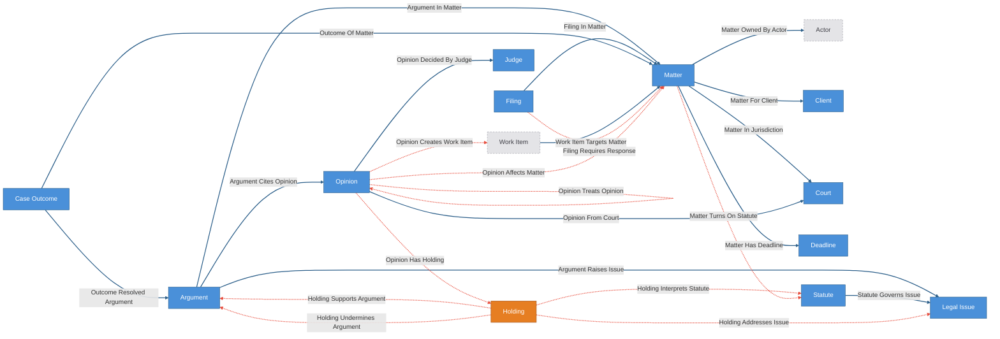
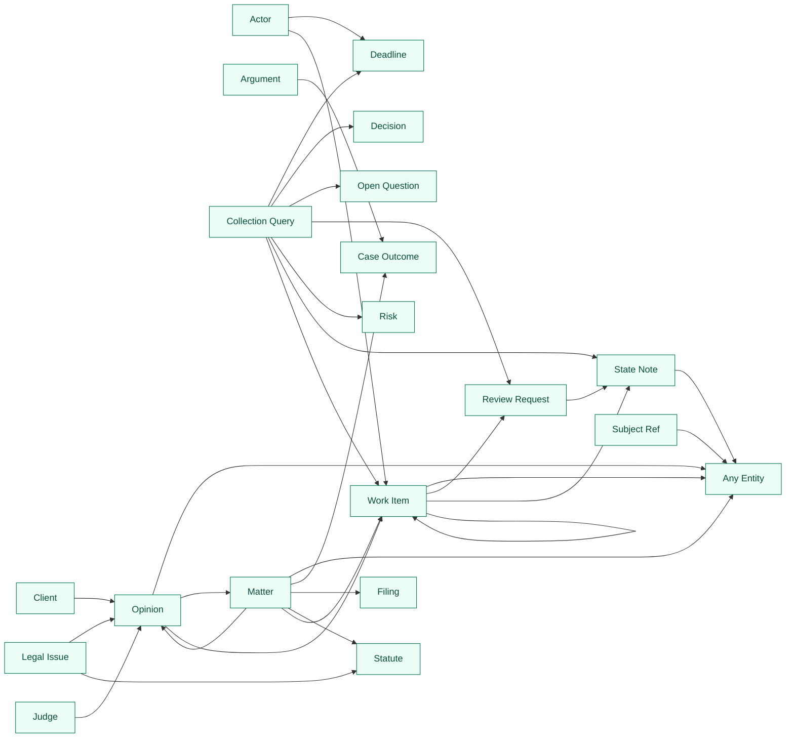

# Case-Law Monitoring Kit

Case-law domain overlay composed over the agent-operation base kit
(`extends: ../agent-operation/config.yaml`).

The corpus layer is **real public law**: opinions, courts, judges, statutes,
and the citation graph, sourced from CourtListener metadata and digest-pinned
as a seed bundle (the launch corpus is the Chevron-deference cluster). The
firm layer is the practice: clients, matters, arguments, filings, deadlines,
case outcomes. Governed edges carry the judgments an attorney actually
reviews — holdings, statutory interpretations, citation treatment, argument
support and risk, matter impact, filing obligations. The treatment edge
(`opinion_treats_opinion`) is a governed, receipted citator entry: extraction
proposes, an attorney resolves, trust accumulates per judgment surface.

Everything between `CRUXIBLE:BEGIN` / `CRUXIBLE:END` markers is regenerated
from `config.yaml` by `cruxible config views`; treat those blocks as code-owned
structural truth. Everything outside them is authored explanation.

## Composition notes (no duplicated operating layer)

- **Attorneys are base Actors.** Matter accountability is
  `matter_owned_by_actor` to a mint-materialized Actor. The corpus seed loads
  matters unowned — Actors cannot be seeded — and onboarding assigns owners
  after credentials are minted; the `matters_have_owner` check nags until
  then, deliberately.
- **Review obligations are base WorkItems**, created by the
  analyze → apply → propose pipeline and attached through governed seam edges
  (`opinion_creates_work_item`) plus the deterministic
  `work_item_targets_matter`. A brief-update WorkItem closes through the base
  review gate: attorney signoff *is* the ReviewRequest approval. Nothing
  auto-closes work.
- **Holdings are judgment-born.** The canonical apply step creates them as
  inert records from the extractor payload; only the governed
  `opinion_has_holding` edge makes them reviewed legal reasoning, and the
  `holdings_belong_to_an_opinion` check flags orphaned extractions.
- **Two-act corpus.** `build_corpus` loads the pinned act-one world (the
  doctrine standing). `refresh_corpus` fetches the update — live from
  CourtListener, or from the bundled act-two fixture when offline — and
  `sync_corpus_update` applies it. Then the treatment and impact proposal
  chain shows the law change propagating into firm state:
  `supporting_authority_now_bad_law` is the alarm.
- **LLM-outside.** Providers are deterministic heuristics over curated
  metadata; anything smarter proposes through the same governed path with
  tri-state signals and never writes accepted state.

## Ontology

<!-- CRUXIBLE:BEGIN ontology -->

<!-- CRUXIBLE:END ontology -->

## Workflows

<!-- CRUXIBLE:BEGIN workflow-pipeline -->

<!-- CRUXIBLE:END workflow-pipeline -->

<!-- CRUXIBLE:BEGIN workflow-summary -->
### 1. Apply Candidate Holdings

**Role:** Canonical seed

**Input context**
- None (seeds canonical state)

**Result**
- Canonical entities: Holding

**Provider source**
- -

### 2. Apply Review Work Items

**Role:** Canonical seed

**Input context**
- None (seeds canonical state)

**Result**
- Canonical entities: Work Item
- Canonical relationships: Work Item Targets Matter

**Provider source**
- -

### 3. Build Corpus

**Role:** Canonical seed

**Input context**
- None (seeds canonical state)

**Result**
- Canonical entities: Argument, Client, Court, Judge, Legal Issue, Matter, Opinion, Statute
- Canonical relationships: Argument Cites Opinion, Argument In Matter, Argument Raises Issue, Matter For Client, Matter In Jurisdiction, Opinion Cites Opinion, Opinion Decided By Judge, Opinion From Court, Statute Governs Issue

**Provider source**
- Load Corpus Seed (Python Function, v0.2.0); source: `kit://providers/case_law_monitoring.py::load_corpus_seed`; artifact: Corpus Seed Bundle

### 4. Ingest Case Outcomes

**Role:** Canonical seed

**Input context**
- None (seeds canonical state)

**Result**
- Canonical entities: Case Outcome
- Canonical relationships: Outcome Of Matter, Outcome Resolved Argument

**Provider source**
- Load Case Outcome Feed (Python Function, v0.2.0); source: `kit://providers/case_law_monitoring.py::load_case_outcome_feed`; artifact: Corpus Seed Bundle

### 5. Ingest Docket

**Role:** Canonical seed

**Input context**
- None (seeds canonical state)

**Result**
- Canonical entities: Deadline, Filing
- Canonical relationships: Filing In Matter, Matter Has Deadline

**Provider source**
- Load Docket Feed (Python Function, v0.2.0); source: `kit://providers/case_law_monitoring.py::load_docket_feed`; artifact: Corpus Seed Bundle

### 6. Refresh Stale Deadlines

**Role:** Canonical seed

**Input context**
- Query context: Deadline, Matter, Matter Has Deadline

**Result**
- Canonical entities: Deadline

**Provider source**
- Sweep Stale Deadlines (Python Function, v0.2.0); source: `kit://providers/case_law_monitoring.py::sweep_stale_deadlines`

### 7. Sync Corpus Update

**Role:** Canonical seed

**Input context**
- None (seeds canonical state)

**Result**
- Canonical entities: Court, Judge, Opinion
- Canonical relationships: Opinion Cites Opinion, Opinion Decided By Judge, Opinion From Court

**Provider source**
- -

### 8. Propose Argument Risk

**Role:** Governed proposal

**Input context**
- Query context: Argument, Holding, Argument Raises Issue, Holding Addresses Issue

**Result**
- Proposed relationships: Holding Undermines Argument

**Provider source**
- Assess Argument Impact (Python Function, v0.2.0); source: `kit://providers/case_law_monitoring.py::assess_argument_impact`

### 9. Propose Argument Support

**Role:** Governed proposal

**Input context**
- Query context: Argument, Holding, Argument Raises Issue, Holding Addresses Issue

**Result**
- Proposed relationships: Holding Supports Argument

**Provider source**
- Assess Argument Impact (Python Function, v0.2.0); source: `kit://providers/case_law_monitoring.py::assess_argument_impact`

### 10. Propose Filing Response

**Role:** Governed proposal

**Input context**
- Query context: Deadline, Filing, Matter

**Result**
- Proposed relationships: Filing Requires Response

**Provider source**
- Assess Filing Response Obligations (Python Function, v0.2.0); source: `kit://providers/case_law_monitoring.py::assess_filing_response_obligations`

### 11. Propose Holding Issue Links

**Role:** Governed proposal

**Input context**
- Query context: Holding, Legal Issue, Holding Interprets Statute

**Result**
- Proposed relationships: Holding Addresses Issue

**Provider source**
- Map Holdings To Issues (Python Function, v0.2.0); source: `kit://providers/case_law_monitoring.py::map_holdings_to_issues`

### 12. Propose Holdings From Opinion

**Role:** Governed proposal

**Input context**
- None

**Result**
- Proposed relationships: Opinion Has Holding

**Provider source**
- -

### 13. Propose Matter Impact

**Role:** Governed proposal

**Input context**
- Query context: Matter, Opinion, Holding Supports Argument, Holding Undermines Argument, Matter In Jurisdiction, Matter Turns On Statute, Opinion From Court, Opinion Treats Opinion

**Result**
- Proposed relationships: Opinion Affects Matter

**Provider source**
- Assess Matter Impact (Python Function, v0.2.0); source: `kit://providers/case_law_monitoring.py::assess_matter_impact`

### 14. Propose Matter Statutory Scope

**Role:** Governed proposal

**Input context**
- Query context: Matter, Statute

**Result**
- Proposed relationships: Matter Turns On Statute

**Provider source**
- Scope Matters To Statutes (Python Function, v0.2.0); source: `kit://providers/case_law_monitoring.py::scope_matters_to_statutes`

### 15. Propose Opinion Treatment

**Role:** Governed proposal

**Input context**
- Query context: Opinion, Opinion Cites Opinion

**Result**
- Proposed relationships: Opinion Treats Opinion

**Provider source**
- Classify Opinion Treatment (Python Function, v0.2.0); source: `kit://providers/case_law_monitoring.py::classify_opinion_treatment`

### 16. Propose Opinion Work Links

**Role:** Governed proposal

**Input context**
- None

**Result**
- Proposed relationships: Opinion Creates Work Item

**Provider source**
- -

### 17. Propose Statute Interpretations

**Role:** Governed proposal

**Input context**
- Query context: Holding, Statute, Opinion Has Holding

**Result**
- Proposed relationships: Holding Interprets Statute

**Provider source**
- Link Holdings To Statutes (Python Function, v0.2.0); source: `kit://providers/case_law_monitoring.py::link_holdings_to_statutes`

### 18. Analyze Opinions For Holdings

**Role:** Utility

**Input context**
- Query context: Opinion

**Result**
- Provider output: Extract Holdings From Opinions

**Provider source**
- Extract Holdings From Opinions (Python Function, v0.2.0); source: `kit://providers/case_law_monitoring.py::extract_holdings_from_opinions`

### 19. Analyze Review Work

**Role:** Utility

**Input context**
- Query context: Matter, Opinion, Opinion Affects Matter, Opinion Treats Opinion

**Result**
- Provider output: Route Review Work

**Provider source**
- Route Review Work (Python Function, v0.2.0); source: `kit://providers/case_law_monitoring.py::route_review_work`

### 20. Refresh Corpus

**Role:** Utility

**Input context**
- None

**Result**
- Provider output: Fetch Courtlistener Cluster

**Provider source**
- Fetch Courtlistener Cluster (Python Function, v0.2.0); source: `kit://providers/case_law_monitoring.py::fetch_courtlistener_cluster`; non-deterministic
<!-- CRUXIBLE:END workflow-summary -->

## Governance

<!-- CRUXIBLE:BEGIN governance-table -->
| Relationship | Scope | Creation Path | Signals | Auto-resolve Gate | Review Policy | Feedback | Outcomes |
| --- | --- | --- | --- | --- | --- | --- | --- |
| Filing Requires Response | Filing -> Matter | Workflow: Propose Filing Response | Attorney Review, Docket Matter Match, Filing Obligation Assessor | All Support; prior trust: Trusted Only | Require Review: Filing Obligations Require Review | 3 reason codes | Filing Response Resolution |
| Holding Addresses Issue | Holding -> Legal Issue | Workflow: Propose Holding Issue Links | Attorney Review, Issue Mapper | All Support; prior trust: Trusted Only | Trust-gated auto-resolve | 2 reason codes | - |
| Holding Interprets Statute | Holding -> Statute | Workflow: Propose Statute Interpretations | Attorney Review, Statute Interpretation Extractor | All Support; prior trust: Trusted Only | Trust-gated auto-resolve | 2 reason codes | - |
| Holding Supports Argument | Holding -> Argument | Workflow: Propose Argument Support | Argument Impact Assessor, Attorney Review | All Support; prior trust: Trusted Only | Trust-gated auto-resolve | 2 reason codes | Argument Support Resolution |
| Holding Undermines Argument | Holding -> Argument | Workflow: Propose Argument Risk | Argument Impact Assessor, Attorney Review | All Support; prior trust: Trusted Only | Trust-gated auto-resolve | 3 reason codes | Argument Risk Resolution |
| Matter Turns On Statute | Matter -> Statute | Workflow: Propose Matter Statutory Scope | Attorney Review, Matter Statute Match | All Support; prior trust: Trusted Only | Require Review: Matter Scope Requires Review | 2 reason codes | Matter Scope Resolution |
| Opinion Affects Matter | Opinion -> Matter | Workflow: Propose Matter Impact | Attorney Review, Jurisdiction Overlap, Matter Impact Assessor | All Support; prior trust: Trusted Only | Require Review: Matter Impacts Require Review | 3 reason codes | Matter Impact Resolution |
| Opinion Creates Work Item | Opinion -> Work Item | Workflow: Propose Opinion Work Links | Attorney Review, Review Router | All Support; prior trust: Trusted Only | Trust-gated auto-resolve | 2 reason codes | - |
| Opinion Has Holding | Opinion -> Holding | Workflow: Propose Holdings From Opinion | Attorney Review, Holding Extractor | All Support; prior trust: Trusted Only | Trust-gated auto-resolve | 3 reason codes | - |
| Opinion Treats Opinion | Opinion -> Opinion | Workflow: Propose Opinion Treatment | Attorney Review, Citation Treatment Classifier | All Support; prior trust: Trusted Only | Require Review: Negative Treatment Requires Review | 3 reason codes | Treatment Resolution |
<!-- CRUXIBLE:END governance-table -->

<!-- CRUXIBLE:BEGIN mutation-guards -->
No mutation guards declared.
<!-- CRUXIBLE:END mutation-guards -->

<!-- CRUXIBLE:BEGIN signal-policy-catalog -->
| Signal Source | Role | Review Unsure | Used By | Notes |
| --- | --- | --- | --- | --- |
| `argument_impact_assessor` | required | yes | Holding Supports Argument, Holding Undermines Argument | - |
| `attorney_review` | advisory | yes | Filing Requires Response, Holding Addresses Issue, Holding Interprets Statute, Holding Supports Argument, Holding Undermines Argument, Matter Turns On Statute, Opinion Affects Matter, Opinion Creates Work Item, Opinion Has Holding, Opinion Treats Opinion | - |
| `citation_treatment_classifier` | required | yes | Opinion Treats Opinion | - |
| `docket_matter_match` | required | yes | Filing Requires Response | - |
| `filing_obligation_assessor` | required | yes | Filing Requires Response | - |
| `holding_extractor` | required | yes | Opinion Has Holding | - |
| `issue_mapper` | required | yes | Holding Addresses Issue | - |
| `jurisdiction_overlap` | advisory | yes | Opinion Affects Matter | - |
| `maintainer_judgment` | advisory | yes | Decision Affects Subject, Decision Answers Open Question, Decision Constrains Work Item, Decision Supersedes Decision, Open Question Blocks Decision, Open Question Blocks Work Item, Open Question Concerns Subject, Risk Attaches To Subject, Risk Blocks Work Item, Work Item Answers Open Question, Work Item Depends On Work Item, Work Item Mitigates Risk, Work Item Supersedes Work Item | - |
| `matter_impact_assessor` | required | yes | Opinion Affects Matter | - |
| `matter_statute_match` | required | yes | Matter Turns On Statute | - |
| `review_router` | required | yes | Opinion Creates Work Item | - |
| `source_evidence` | required | yes | Decision Affects Subject, Decision Answers Open Question, Decision Constrains Work Item, Decision Supersedes Decision, Open Question Blocks Decision, Open Question Blocks Work Item, Open Question Concerns Subject, Risk Attaches To Subject, Risk Blocks Work Item, Work Item Answers Open Question, Work Item Depends On Work Item, Work Item Mitigates Risk, Work Item Supersedes Work Item | - |
| `statute_interpretation_extractor` | required | yes | Holding Interprets Statute | - |
<!-- CRUXIBLE:END signal-policy-catalog -->

## Queries

<!-- CRUXIBLE:BEGIN query-map -->

<!-- CRUXIBLE:END query-map -->

<!-- CRUXIBLE:BEGIN query-catalog -->
### Actor

| Query | Mode | Returns | State | Traversal | Purpose |
| --- | --- | --- | --- | --- | --- |
| Actor Work Queue | traversal | Work Item | reviewable | Work Item Owned By Actor (Incoming) | Work items owned by an actor with latest reviews, dependency counts, blockers, subjects. |
| Deadline Watch | traversal | Deadline | live | Matter Owned By Actor (Incoming) -> Matter Has Deadline (Outgoing) | Deadlines across the matters this actor owns, soonest first. |

### Argument

| Query | Mode | Returns | State | Traversal | Purpose |
| --- | --- | --- | --- | --- | --- |
| Argument Track Record | traversal | Case Outcome | live | Outcome Resolved Argument (Incoming) | Case outcomes where this argument was resolved or evaluated. |

### Client

| Query | Mode | Returns | State | Traversal | Purpose |
| --- | --- | --- | --- | --- | --- |
| Client Impact Watch | traversal | Opinion | reviewable | Matter For Client (Incoming) -> Opinion Affects Matter (Incoming) | Opinions judged to affect a client's matters. |

### Collection Query

| Query | Mode | Returns | State | Traversal | Purpose |
| --- | --- | --- | --- | --- | --- |
| Active Risks | collection | Risk | live |  | Active operational risks. |
| Blocked Work Items | collection | Work Item | reviewable |  | Work items marked blocked, with risk/open-question blocker context. |
| Changes Requested Reviews | collection | Review Request | reviewable |  | Review requests sent back with changes requested -- the implementer's rework queue, distinct from the reviewer-facing review_queue. |
| Open Questions Needing Review | collection | Open Question | live |  | Planned/active open questions needing review. |
| Proposed Decisions | collection | Decision | live |  | Proposed decisions awaiting acceptance/rejection/deferral. |
| Recent State Notes | collection | State Note | reviewable |  | Recent operation-state notes, corrections, rationale/implementation/review notes. |
| Review Queue | collection | Review Request | reviewable |  | Review requests awaiting a reviewer -- requested or in review. Reviews sent back for rework live in changes_requested_reviews. |
| Superseded Decisions | collection | Decision | not-live |  | Decision retired/superseded on the canonical entity-lifecycle axis (lifecycle.status != live), gated out of live reads. Supersession is not a domain status value. |
| Superseded Work Items | collection | Work Item | not-live |  | WorkItem retired/superseded on the canonical entity-lifecycle axis (lifecycle.status != live), gated out of live reads. Supersession is not a domain status value. |
| Upcoming Deadlines | collection | Deadline | live |  | All live deadlines still awaiting action, soonest first — the practice-wide docket view. |

### Judge

| Query | Mode | Returns | State | Traversal | Purpose |
| --- | --- | --- | --- | --- | --- |
| Opinions By Judge | traversal | Opinion | live | Opinion Decided By Judge (Incoming) | Opinions this judge authored or joined. |

### Legal Issue

| Query | Mode | Returns | State | Traversal | Purpose |
| --- | --- | --- | --- | --- | --- |
| Precedent Chain For Issue | traversal | Opinion | reviewable | Holding Addresses Issue (Incoming) -> Opinion Has Holding (Incoming) | Opinions with reviewed holdings addressing this issue. |
| Statutory Interpretations For Issue | traversal | Statute | reviewable | Holding Addresses Issue (Incoming) -> Holding Interprets Statute (Outgoing) | Statutes interpreted by holdings addressing this issue. |

### Matter

| Query | Mode | Returns | State | Traversal | Purpose |
| --- | --- | --- | --- | --- | --- |
| Adverse Authority For Matter | traversal | Opinion | reviewable | Argument In Matter (Incoming) -> Holding Undermines Argument (Incoming) -> Opinion Has Holding (Incoming) | Opinions whose holdings undermine arguments in this matter. |
| Authorities In Matter Jurisdiction | traversal | Opinion | live | Matter In Jurisdiction (Outgoing) -> Opinion From Court (Incoming) | Opinions issued by courts in the matter's jurisdiction. |
| Case Outcomes For Matter | traversal | Case Outcome | live | Outcome Of Matter (Incoming) | Case outcomes recorded for this matter. |
| Filing Response Obligations For Matter | traversal | Filing | reviewable | Filing Requires Response (Incoming) | Filings judged to require a response or deadline for this matter. |
| Matter Context | traversal | Any Entity | reviewable | Filing In Matter \| Matter For Client \| Matter In Jurisdiction \| Matter Has Deadline \| Argument In Matter \| Outcome Of Matter \| Matter Owned By Actor \| Work Item Targets Matter \| Matter Turns On Statute \| Opinion Affects Matter \| Filing Requires Response (Both) | Everything attached to a matter: client, owner, arguments, scope, impacts, filings, deadlines, work, outcomes. all_adjacent expands against the composed config, so base seam edges are traversed too. |
| Matter Statutory Scope | traversal | Statute | reviewable | Matter Turns On Statute (Outgoing) | Statutes and doctrines within the matter's accepted or proposed legal scope. |
| Negative Treatment For Cited Authorities | traversal | Opinion | reviewable | Argument In Matter (Incoming) -> Argument Cites Opinion (Outgoing) -> Opinion Treats Opinion (Incoming) | New opinions that negatively treat authorities cited by this matter's arguments, newest treatment first. follows is not negative treatment. |
| Statute Interpretations For Matter | traversal | Opinion | reviewable | Matter Turns On Statute (Outgoing) -> Holding Interprets Statute (Incoming) -> Opinion Has Holding (Incoming) | Opinions whose holdings interpret statutes in this matter's scope. |
| Supporting Authority For Matter | traversal | Opinion | reviewable | Argument In Matter (Incoming) -> Holding Supports Argument (Incoming) -> Opinion Has Holding (Incoming) | Opinions whose holdings support arguments in this matter. |
| Supporting Authority Now Bad Law | traversal | Opinion | reviewable | Argument In Matter (Incoming) -> Holding Supports Argument (Incoming) -> Opinion Has Holding (Incoming) -> Opinion Treats Opinion (Incoming) | The two-act alarm: reach the matter's supporting authorities, then surface opinions that overrule, abrogate, or limit them, newest first. |
| Work Items For Matter | traversal | Work Item | reviewable | Work Item Targets Matter (Incoming) | Open review obligations and other work targeting this matter. |

### Opinion

| Query | Mode | Returns | State | Traversal | Purpose |
| --- | --- | --- | --- | --- | --- |
| Matters Impacted By Opinion | traversal | Matter | reviewable | Opinion Affects Matter (Outgoing) | Matters judged affected by an opinion, pending judgments visible. |
| Opinion Context | traversal | Any Entity | reviewable | Opinion From Court \| Opinion Decided By Judge \| Opinion Cites Opinion \| Argument Cites Opinion \| Opinion Creates Work Item \| Opinion Has Holding \| Opinion Treats Opinion \| Opinion Affects Matter (Both) | Court, judges, citations, treatments, holdings, impacts, and created work for one opinion. |
| Opinion Work Items | traversal | Work Item | reviewable | Opinion Creates Work Item (Outgoing) | Review obligations created by this opinion. |

### Review Request

| Query | Mode | Returns | State | Traversal | Purpose |
| --- | --- | --- | --- | --- | --- |
| State Notes For Review Request | traversal | State Note | reviewable | State Note About Review Request (Incoming) | The review thread: verdict and finding notes attached to a review request, newest first. This is the read that replaces scrolling a notes blob. |

### State Note

| Query | Mode | Returns | State | Traversal | Purpose |
| --- | --- | --- | --- | --- | --- |
| State Note Context | traversal | Any Entity | reviewable | State Note Authored By Actor \| State Note About Work Item \| State Note About Review Request \| State Note About Decision \| State Note About Risk \| State Note About Open Question \| State Note About Subject \| State Note About Actor \| State Note Supersedes State Note \| State Note Resolves State Note (Both) | Full context for a state note (targets, author, supersession). |

### Subject Ref

| Query | Mode | Returns | State | Traversal | Purpose |
| --- | --- | --- | --- | --- | --- |
| Subject Operation Context | traversal | Any Entity | reviewable | State Note About Subject \| Work Item Targets Subject \| Decision Affects Subject \| Risk Attaches To Subject \| Open Question Concerns Subject (Both) | Work, decisions, risks, open questions attached to a subject ref. |

### Work Item

| Query | Mode | Returns | State | Traversal | Purpose |
| --- | --- | --- | --- | --- | --- |
| Approved Reviews For Work Item | traversal | Review Request | live | Review Request For Work Item (Incoming) | Approved review requests for a work item. Used by the closed-transition guard. |
| State Notes For Work Item | traversal | State Note | reviewable | State Note About Work Item (Incoming) | State notes attached to a work item, newest first. |
| Work Item Context | traversal | Any Entity | reviewable | Work Item Owned By Actor \| Review Request For Work Item \| State Note About Work Item \| Work Item Depends On Work Item \| Work Item Part Of Work Item \| Work Item Spawned From Work Item \| Work Item Supersedes Work Item \| Risk Blocks Work Item \| Open Question Blocks Work Item \| Work Item Mitigates Risk \| Work Item Answers Open Question \| Decision Constrains Work Item \| Work Item Targets Subject \| Work Item Targets Matter \| Opinion Creates Work Item (Both) | From a work item, inspect dependencies, blockers, reviews, composition, lineage, decisions, owner, subjects. all_adjacent expands against the final composed config, so on a composed instance this query also traverses overlay seam edges (e.g. project-domain's roadmap, release, milestone, and area relationships). |
| Work Item Lineage Context | traversal | Work Item | reviewable | Work Item Spawned From Work Item \| Work Item Supersedes Work Item (Both, depth=5) | Work item lineage/replacement context, excluding sequencing deps. |
| Work Item Rollup Context | traversal | Work Item | reviewable | Work Item Part Of Work Item (Incoming, depth=5) | Child/descendant work items under a parent. |
<!-- CRUXIBLE:END query-catalog -->

## Quality Rules

<!-- CRUXIBLE:BEGIN quality-rules -->
### Constraints

No configured constraints.

### Quality Checks

| Name | Kind | Target | Severity | Rule |
| --- | --- | --- | --- | --- |
| `case_outcomes_have_matter` | Cardinality | Case Outcome -> Outcome Of Matter (out) | Error | min `1`, max `1` |
| `deadlines_have_matter` | Cardinality | Deadline -> Matter Has Deadline (in) | Warning | min `1` |
| `decision_supersessions_have_basis` | Property | Decision Supersedes Decision.supersession_basis | Warning | Non Empty |
| `decision_work_constraints_have_type` | Property | Decision Constrains Work Item.impact_type | Warning | Required |
| `holdings_belong_to_an_opinion` | Cardinality | Holding -> Opinion Has Holding (in) | Warning | min `1` |
| `matter_impacts_have_level` | Property | Opinion Affects Matter.impact_level | Error | Required |
| `matters_have_one_client` | Cardinality | Matter -> Matter For Client (out) | Warning | min `1`, max `1` |
| `matters_have_owner` | Cardinality | Matter -> Matter Owned By Actor (out) | Warning | min `1` |
| `open_question_work_blockers_have_basis` | Property | Open Question Blocks Work Item.blocking_basis | Warning | Non Empty |
| `opinions_have_court` | Cardinality | Opinion -> Opinion From Court (out) | Warning | min `1` |
| `review_requests_review_work` | Cardinality | Review Request -> Review Request For Work Item (out) | Warning | min `1` |
| `risk_work_blockers_have_basis` | Property | Risk Blocks Work Item.blocking_basis | Warning | Non Empty |
| `scope_links_have_basis` | Property | Matter Turns On Statute.scope_basis | Warning | Non Empty |
| `state_note_supersessions_have_basis` | Property | State Note Supersedes State Note.supersession_basis | Warning | Non Empty |
| `state_notes_have_author` | Cardinality | State Note -> State Note Authored By Actor (out) | Warning | min `1` |
| `treatments_have_rationale` | Property | Opinion Treats Opinion.rationale | Warning | Non Empty |
| `work_dependencies_have_basis` | Property | Work Item Depends On Work Item.dependency_basis | Warning | Non Empty |
| `work_item_part_of_single_parent` | Cardinality | Work Item -> Work Item Part Of Work Item (out) | Warning | max `1` |
| `work_item_spawned_from_single_origin` | Cardinality | Work Item -> Work Item Spawned From Work Item (out) | Warning | max `1` |
| `work_items_have_owner` | Cardinality | Work Item -> Work Item Owned By Actor (out) | Warning | min `1` |
| `work_supersessions_have_basis` | Property | Work Item Supersedes Work Item.supersession_basis | Warning | Non Empty |
<!-- CRUXIBLE:END quality-rules -->

## Learning Loops

<!-- CRUXIBLE:BEGIN learning-loops -->
### Feedback Profiles (Loop 1)

#### `filing_requires_response`
- Version: `1`
- Reason codes:
  - `deadline_extraction_error` (`provider_fix`): The response deadline was incorrectly extracted or normalized.
  - `no_response_required` (`constraint`): This filing does not create a response obligation for the matter.
  - `wrong_matter_routing` (`quality_check`): The filing was routed to the wrong tracked matter.
- Scope keys:
  - `filing`: `FROM.filing_id`
  - `matter`: `TO.matter_id`
  - `response_type`: `EDGE.response_type`

#### `holding_addresses_issue`
- Version: `1`
- Reason codes:
  - `issue_too_broad` (`decision_policy`): Holding is related but does not directly address the tracked issue.
  - `wrong_practice_area` (`provider_fix`): Holding belongs to a different practice-area framing.
- Scope keys:
  - `holding`: `FROM.holding_id`
  - `issue`: `TO.issue_id`
  - `issue_fit`: `EDGE.issue_fit`

#### `holding_interprets_statute`
- Version: `1`
- Reason codes:
  - `wrong_interpretation_type` (`provider_fix`): Interpretation type is wrong.
  - `wrong_statute` (`provider_fix`): Holding does not interpret this statute or rule.
- Scope keys:
  - `holding`: `FROM.holding_id`
  - `interpretation_type`: `EDGE.interpretation_type`
  - `statute`: `TO.statute_id`

#### `holding_supports_argument`
- Version: `1`
- Reason codes:
  - `factually_distinguishable` (`constraint`): Holding depends on facts too different from the matter argument.
  - `tangential_support` (`decision_policy`): Holding is related but does not materially support this argument.
- Scope keys:
  - `argument`: `TO.argument_id`
  - `holding`: `FROM.holding_id`
  - `support_strength`: `EDGE.support_strength`

#### `holding_undermines_argument`
- Version: `1`
- Reason codes:
  - `distinguishable_authority` (`constraint`): Holding is distinguishable and should not be treated as adverse.
  - `no_material_risk` (`decision_policy`): Holding does not materially undermine the argument.
  - `wrong_direction` (`provider_fix`): Holding supports or is neutral to the argument rather than undermining it.
- Scope keys:
  - `argument`: `TO.argument_id`
  - `holding`: `FROM.holding_id`
  - `risk_type`: `EDGE.risk_type`

#### `matter_turns_on_statute`
- Version: `1`
- Reason codes:
  - `issue_not_in_matter` (`quality_check`): The issue used to justify this scope is not part of the matter.
  - `wrong_statute_link` (`provider_fix`): The statute or doctrine is not relevant to this matter's legal issues.
- Scope keys:
  - `matter`: `FROM.matter_id`
  - `statute`: `TO.statute_id`

#### `opinion_affects_matter`
- Version: `1`
- Reason codes:
  - `matter_posture_mismatch` (`constraint`): Opinion affects a posture or claim type not present in this matter.
  - `no_material_impact` (`decision_policy`): Opinion does not materially affect this matter.
  - `wrong_impact_level` (`decision_policy`): Impact level is overstated or understated.
- Scope keys:
  - `impact_level`: `EDGE.impact_level`
  - `matter`: `TO.matter_id`
  - `opinion`: `FROM.opinion_id`

#### `opinion_creates_work_item`
- Version: `1`
- Reason codes:
  - `unnecessary_review` (`decision_policy`): The opinion does not create a real review obligation.
  - `wrong_obligation_type` (`provider_fix`): The obligation type is incorrect.
- Scope keys:
  - `obligation_type`: `EDGE.obligation_type`
  - `opinion`: `FROM.opinion_id`
  - `work_item`: `TO.work_item_id`

#### `opinion_has_holding`
- Version: `1`
- Reason codes:
  - `duplicate_holding` (`decision_policy`): Holding duplicates an existing accepted holding.
  - `missed_scope_limitation` (`constraint`): Holding omits an important limitation or procedural posture.
  - `overbroad_holding` (`provider_fix`): Holding is broader than the opinion supports.
- Scope keys:
  - `holding`: `TO.holding_id`
  - `holding_type`: `TO.holding_type`
  - `opinion`: `FROM.opinion_id`

#### `opinion_treats_opinion`
- Version: `1`
- Reason codes:
  - `citation_context_mismatch` (`constraint`): Treatment holds only in a different doctrinal or procedural context.
  - `not_meaningful_treatment` (`provider_fix`): Citation does not meaningfully treat the cited authority.
  - `wrong_treatment_type` (`provider_fix`): Treatment type is incorrect.
- Scope keys:
  - `cited_opinion`: `TO.opinion_id`
  - `source_opinion`: `FROM.opinion_id`
  - `treatment`: `EDGE.treatment`

### Outcome Profiles (Loop 2)

#### Resolution-Anchored

##### `argument_risk_resolution`
- Version: `1`
- Target: Relationship `holding_undermines_argument`
- Outcome codes:
  - `missed_adverse_authority` (`require_review`): A holding that undermined the argument was missed.
  - `risk_materialized` (`unknown`): The adverse holding required a real strategy change.
  - `risk_overstated` (`trust_adjustment`): The holding was distinguishable and did not undermine the argument.
- Scope keys:
  - `relationship_type`: `RESOLUTION.relationship_type`

##### `argument_support_resolution`
- Version: `1`
- Target: Relationship `holding_supports_argument`
- Outcome codes:
  - `missed_supporting_authority` (`require_review`): A holding that would have supported the argument was missed.
  - `support_held_up` (`unknown`): The supporting holding held up in briefing or argument.
  - `support_overstated` (`trust_adjustment`): The holding did not materially help the argument.
- Scope keys:
  - `relationship_type`: `RESOLUTION.relationship_type`

##### `filing_response_resolution`
- Version: `1`
- Target: Relationship `filing_requires_response`
- Outcome codes:
  - `false_deadline` (`trust_adjustment`): The accepted obligation or deadline was incorrect.
  - `missed_deadline` (`require_review`): A real response obligation was missed.
  - `response_obligation_confirmed` (`unknown`): Later matter activity confirmed the obligation applied.
- Scope keys:
  - `relationship_type`: `RESOLUTION.relationship_type`

##### `matter_impact_resolution`
- Version: `1`
- Target: Relationship `opinion_affects_matter`
- Outcome codes:
  - `missed_matter` (`require_review`): An affected matter was missed by the workflow.
  - `no_actual_impact` (`trust_adjustment`): The accepted impact did not change the matter.
  - `strategy_updated` (`unknown`): Matter strategy, filings, or client advice changed because of this opinion.
- Scope keys:
  - `relationship_type`: `RESOLUTION.relationship_type`

##### `matter_scope_resolution`
- Version: `1`
- Target: Relationship `matter_turns_on_statute`
- Outcome codes:
  - `missed_core_statute` (`require_review`): A core statute or doctrine was missed during scoping.
  - `scope_confirmed` (`unknown`): Later review confirmed the matter-scope link.
  - `scope_too_broad` (`trust_adjustment`): The accepted scope link was broader than the matter required.
- Scope keys:
  - `relationship_type`: `RESOLUTION.relationship_type`

##### `treatment_resolution`
- Version: `1`
- Target: Relationship `opinion_treats_opinion`
- Outcome codes:
  - `negative_treatment_missed` (`workflow_fix`): Negative treatment existed but was missed by the workflow.
  - `treatment_confirmed` (`unknown`): Attorney review or later citation history confirmed the treatment.
  - `treatment_overstated` (`trust_adjustment`): Later review showed the treatment was overstated.
- Scope keys:
  - `relationship_type`: `RESOLUTION.relationship_type`

#### Receipt-Anchored

##### `adverse_authority_query`
- Version: `1`
- Target: Query `adverse_authority_for_matter`
- Outcome codes:
  - `false_positive_authority` (`graph_fix`): Query returned authority later judged not adverse.
  - `missed_adverse_authority` (`graph_fix`): Query omitted authority later judged adverse to the matter.
- Scope keys:
  - `query`: `SURFACE.name`

##### `bad_law_query`
- Version: `1`
- Target: Query `supporting_authority_now_bad_law`
- Outcome codes:
  - `false_bad_law` (`graph_fix`): The alarm fired on a treatment later judged not to reach the supporting holding.
  - `missed_bad_law` (`graph_fix`): A supporting authority went bad and the alarm did not surface it.
- Scope keys:
  - `query`: `SURFACE.name`

##### `client_impact_query`
- Version: `1`
- Target: Query `client_impact_watch`
- Outcome codes:
  - `false_client_impact` (`graph_fix`): Query returned an opinion later judged not material.
  - `missed_client_impact` (`graph_fix`): Query omitted an opinion later judged material to the client's matters.
- Scope keys:
  - `query`: `SURFACE.name`
<!-- CRUXIBLE:END learning-loops -->
