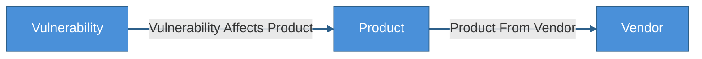
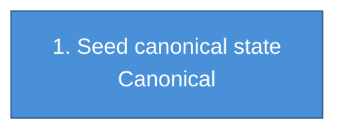

# KEV Reference Kit

Standalone Cruxible kit for building the public KEV reference state from the
pinned CISA KEV, EPSS, and NVD CPE data in `data/`.

Use this kit with `cruxible init --kit kev-reference`, then run the canonical
`build_public_kev_reference` workflow before publishing the state release.

## Generated Views

<!-- CRUXIBLE:BEGIN ontology -->

**Diagram legend:** blue node = canonical entity (deterministic writes); solid edge = deterministic relationship.
<!-- CRUXIBLE:END ontology -->

<!-- CRUXIBLE:BEGIN schema-catalog -->
| Entity | Properties | Description |
| --- | --- | --- |
| `Product` | `product_id: string (pk)`, `vendor_id: string?`, `vendor_name: string?`, `product_name: string?`, `cpe_vendor: string?`, `cpe_product: string?`, `cpe_part: string?` | Product identified by CPE vendor and product strings. |
| `Vendor` | `vendor_id: string (pk)`, `name: string?` | Vendor or software publisher, identified by CPE vendor string. |
| `Vulnerability` | `cve_id: string (pk)`, `vulnerability_name: string?`, `description: string?`, `date_added_to_kev: date?`, `kev_due_date: date?`, `required_action: string?`, `known_ransomware_use: enum?`, `cvss_score: number?`, `cvss_severity: string?`, `epss_score: number?`, `epss_percentile: number?`, `cwes: json?` | Public vulnerability record from CISA KEV catalog. |
<!-- CRUXIBLE:END schema-catalog -->

<!-- CRUXIBLE:BEGIN workflow-pipeline -->

<!-- CRUXIBLE:END workflow-pipeline -->

<!-- CRUXIBLE:BEGIN workflow-summary -->
### 1. Build Public Kev Reference

**Role:** Canonical seed

**Input context**
- None (seeds canonical state)

**Result**
- Canonical entities: Product, Vendor, Vulnerability
- Canonical relationships: Product From Vendor, Vulnerability Affects Product

**Provider source**
- Normalize Public Kev Reference (Python Function, v1.0.0); source: `kit://providers/reference.py::normalize_public_kev_reference`
- Parse Public Kev Bundle (Python Function, v1.0.0); source: `src/cruxible_core/providers/common/tabular.py::load_tabular_artifact_bundle`; artifact: Public Kev Bundle
<!-- CRUXIBLE:END workflow-summary -->

<!-- CRUXIBLE:BEGIN provider-contracts -->
### `normalize_public_kev_reference` (deterministic)

- Ref: `kit://providers/reference.py::normalize_public_kev_reference`
- Purpose: Join parsed KEV catalog, EPSS scores, and NVD CPE configurations on CVE ID, extract CPE-based product identity and version ranges, and emit one row per (CVE, CPE product) pair with aggregated affected_versions.

Called by workflow `build_public_kev_reference`, step `rows`:

- Input `kev_rows` <- provider step `raw_tables` (`tables.known_exploited_vulnerabilities.rows`)
- Input `epss_rows` <- provider step `raw_tables` (`tables.epss_kev_nvd.rows`)
- Input `nvd_cpe_rows` <- provider step `raw_tables` (`tables.nvd_kev_cves.rows`)
- Output rows -> `make_entities` step `vendors` (`Vendor`): required row keys: `vendor_id` (entity id), `vendor_name` -> `name`.
- Output rows -> `make_entities` step `products` (`Product`): required row keys: `product_id` (entity id), `vendor_id`, `vendor_name`, `product_name`, `cpe_vendor`, `cpe_product`, `cpe_part`.
- Output rows -> `make_entities` step `vulnerabilities` (`Vulnerability`): required row keys: `cve_id` (entity id), `vulnerability_name`, `description`, `date_added_to_kev`, `kev_due_date`, `required_action`, `known_ransomware_use`, `cvss_score`, `cvss_severity`, `epss_score`, `epss_percentile`, `cwes`.
- Output rows -> `make_relationships` step `product_vendor` (`product_from_vendor`): required row keys: `product_id` (from id), `vendor_id` (to id).
- Output rows -> `make_relationships` step `vulnerability_product` (`vulnerability_affects_product`): required row keys: `cve_id` (from id), `product_id` (to id), `source`, `source_record_id`, `cpe_part`, `cpe_vendor`, `cpe_product`, `affected_versions`, `fixed_version`, `default_status`, `vulnerable`, `version_logic`, `source_last_modified_at`.

### `parse_public_kev_bundle` (deterministic)

- Ref: `cruxible_core.providers.common.tabular.load_tabular_artifact_bundle`
- Reads artifact: `public_kev_bundle` (`kits/kev-reference/data`)
- Purpose: Parse the pinned public KEV artifact into generic provenance-rich tabular rows. Domain normalization happens in the next workflow step.

Called by workflow `build_public_kev_reference`, step `raw_tables`:

- Input `expected_tables` <- config literal (inline in the workflow step)
<!-- CRUXIBLE:END provider-contracts -->

<!-- CRUXIBLE:BEGIN governance-table -->
This kit declares no governed relationships.
<!-- CRUXIBLE:END governance-table -->

<!-- CRUXIBLE:BEGIN mutation-guards -->
No mutation guards declared.
<!-- CRUXIBLE:END mutation-guards -->

<!-- CRUXIBLE:BEGIN signal-policy-catalog -->
No configured proposal signal sources.
<!-- CRUXIBLE:END signal-policy-catalog -->

<!-- CRUXIBLE:BEGIN query-catalog -->
### Product

| Query | Mode | Returns | State | Traversal | Purpose |
| --- | --- | --- | --- | --- | --- |
| Product Vulnerabilities | traversal | Vulnerability | live | Vulnerability Affects Product (Incoming) | Starting from a product, return KEV vulnerabilities that affect it. |

### Vendor

| Query | Mode | Returns | State | Traversal | Purpose |
| --- | --- | --- | --- | --- | --- |
| Vendor Products | traversal | Product | live | Product From Vendor (Incoming) | Starting from a vendor, return products published by that vendor. |
| Vendor Vulnerabilities | traversal | Vulnerability | live | Product From Vendor (Incoming) -> Vulnerability Affects Product (Incoming) | Starting from a vendor, return vulnerabilities across that vendor's products, preserving the product evidence path. |

### Vulnerability

| Query | Mode | Returns | State | Traversal | Purpose |
| --- | --- | --- | --- | --- | --- |
| Vulnerability Products | traversal | Product | live | Vulnerability Affects Product (Outgoing) | Starting from a vulnerability, return affected products with reference edge evidence. |
<!-- CRUXIBLE:END query-catalog -->

<!-- CRUXIBLE:BEGIN quality-rules -->
### Constraints

No configured constraints.

### Quality Checks

| Name | Kind | Target | Severity | Rule |
| --- | --- | --- | --- | --- |
| `affected_versions_have_useful_keys` | Json Content | Vulnerability Affects Product.affected_versions | Warning | Required Nested Keys; keys: `version_start_including, version_start_excluding, version_end_including, version_end_excluding, version_exact, fixed_version`; match: `any` |
| `no_empty_affected_version_objects` | Json Content | Vulnerability Affects Product.affected_versions | Error | No Empty Objects In Array |
| `product_vendor_id_matches_vendor_edge` | Relationship Property Consistency | Product.vendor_id -> Product From Vendor | Error | Matches related `vendor_id` |
| `product_vendor_name_matches_vendor_edge` | Relationship Property Consistency | Product.vendor_name -> Product From Vendor | Warning | Matches related `name` |
| `products_have_exactly_one_vendor` | Cardinality | Product -> Product From Vendor (out) | Error | min `1`, max `1` |
<!-- CRUXIBLE:END quality-rules -->

<!-- CRUXIBLE:BEGIN learning-loops -->
### Feedback Profiles (Loop 1)

No configured feedback profiles.

### Outcome Profiles (Loop 2)

#### Resolution-Anchored

No configured resolution-anchored outcome profiles.

#### Receipt-Anchored

No configured receipt-anchored outcome profiles.
<!-- CRUXIBLE:END learning-loops -->
