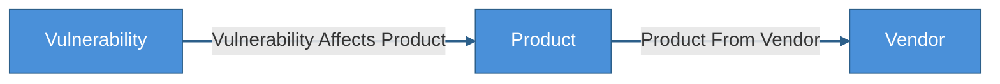
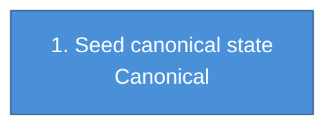
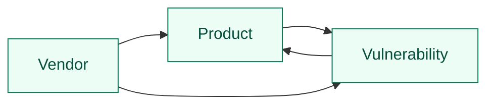

# KEV Reference Kit

Standalone Cruxible kit for building the public KEV reference state from the
pinned CISA KEV, EPSS, and NVD CPE data in `data/`.

Use this kit with `cruxible init --kit kev-reference`, then run the canonical
`build_public_kev_reference` workflow before publishing the state release.

## Generated Views

<!-- CRUXIBLE:BEGIN ontology -->

<!-- CRUXIBLE:END ontology -->

<!-- CRUXIBLE:BEGIN workflow-pipeline -->

<!-- CRUXIBLE:END workflow-pipeline -->

<!-- CRUXIBLE:BEGIN workflow-summary -->
### 1. Build Public Kev Reference

**Role:** Canonical seed

**Input context**
- None (seeds canonical state)

**Result**
- Canonical entities: Product, Vendor, Vulnerability
- Canonical relationships: Product From Vendor, Vulnerability Affects Product

**Provider source**
- Normalize Public Kev Reference (Python Function, v1.0.0); source: `kit://providers/reference.py::normalize_public_kev_reference`
- Parse Public Kev Bundle (Python Function, v1.0.0); source: `src/cruxible_core/providers/common/tabular.py::load_tabular_artifact_bundle`; artifact: Public Kev Bundle
<!-- CRUXIBLE:END workflow-summary -->

<!-- CRUXIBLE:BEGIN governance-table -->
| Relationship | Scope | Creation Path | Signals | Auto-resolve Gate | Review Policy | Feedback | Outcomes |
| --- | --- | --- | --- | --- | --- | --- | --- |
<!-- CRUXIBLE:END governance-table -->

<!-- CRUXIBLE:BEGIN mutation-guards -->
No mutation guards declared.
<!-- CRUXIBLE:END mutation-guards -->

<!-- CRUXIBLE:BEGIN signal-policy-catalog -->
No configured proposal signal sources.
<!-- CRUXIBLE:END signal-policy-catalog -->

<!-- CRUXIBLE:BEGIN query-map -->

<!-- CRUXIBLE:END query-map -->

<!-- CRUXIBLE:BEGIN query-catalog -->
### Product

| Query | Mode | Returns | State | Traversal | Purpose |
| --- | --- | --- | --- | --- | --- |
| Product Vulnerabilities | traversal | Vulnerability | live | Vulnerability Affects Product (Incoming) | Starting from a product, return KEV vulnerabilities that affect it. |

### Vendor

| Query | Mode | Returns | State | Traversal | Purpose |
| --- | --- | --- | --- | --- | --- |
| Vendor Products | traversal | Product | live | Product From Vendor (Incoming) | Starting from a vendor, return products published by that vendor. |
| Vendor Vulnerabilities | traversal | Vulnerability | live | Product From Vendor (Incoming) -> Vulnerability Affects Product (Incoming) | Starting from a vendor, return vulnerabilities across that vendor's products, preserving the product evidence path. |

### Vulnerability

| Query | Mode | Returns | State | Traversal | Purpose |
| --- | --- | --- | --- | --- | --- |
| Vulnerability Products | traversal | Product | live | Vulnerability Affects Product (Outgoing) | Starting from a vulnerability, return affected products with reference edge evidence. |
<!-- CRUXIBLE:END query-catalog -->

<!-- CRUXIBLE:BEGIN quality-rules -->
### Constraints

No configured constraints.

### Quality Checks

| Name | Kind | Target | Severity | Rule |
| --- | --- | --- | --- | --- |
| `affected_versions_have_useful_keys` | Json Content | Vulnerability Affects Product.affected_versions | Warning | Required Nested Keys; keys: `version_start_including, version_start_excluding, version_end_including, version_end_excluding, version_exact, fixed_version`; match: `any` |
| `no_empty_affected_version_objects` | Json Content | Vulnerability Affects Product.affected_versions | Error | No Empty Objects In Array |
| `product_vendor_id_matches_vendor_edge` | Relationship Property Consistency | Product.vendor_id -> Product From Vendor | Error | Matches related `vendor_id` |
| `product_vendor_name_matches_vendor_edge` | Relationship Property Consistency | Product.vendor_name -> Product From Vendor | Warning | Matches related `name` |
| `products_have_exactly_one_vendor` | Cardinality | Product -> Product From Vendor (out) | Error | min `1`, max `1` |
<!-- CRUXIBLE:END quality-rules -->

<!-- CRUXIBLE:BEGIN learning-loops -->
### Feedback Profiles (Loop 1)

No configured feedback profiles.

### Outcome Profiles (Loop 2)

#### Resolution-Anchored

No configured resolution-anchored outcome profiles.

#### Receipt-Anchored

No configured receipt-anchored outcome profiles.
<!-- CRUXIBLE:END learning-loops -->
