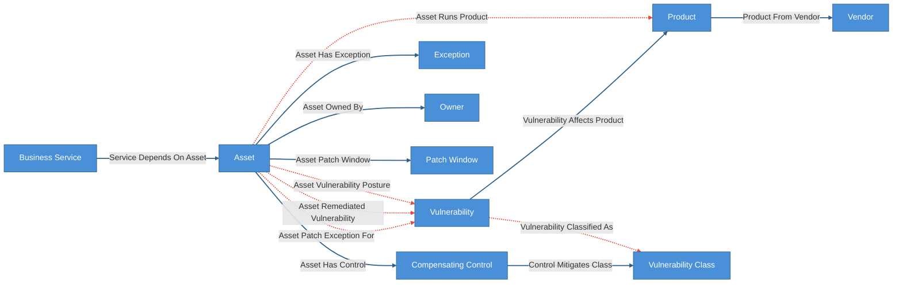
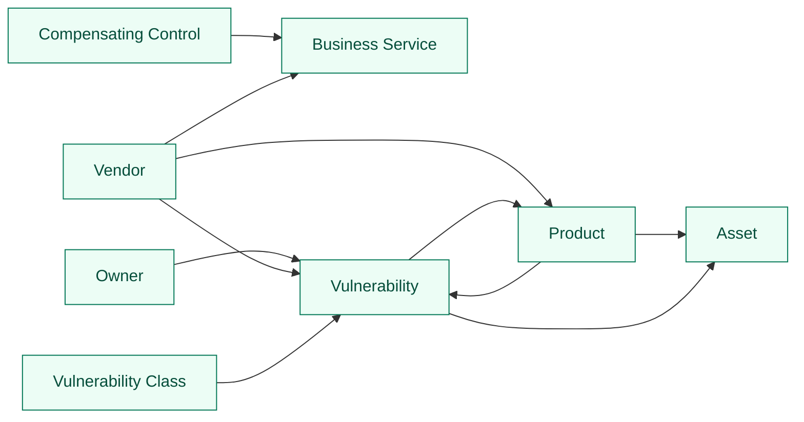

# KEV Triage

Localable cyber world model for vulnerability and KEV triage.

## Skills

- [skills/kev-start/SKILL.md](skills/kev-start/SKILL.md) — adapt the KEV kit
  to your own asset, inventory, and service-mapping data
- [skills/kev-triage/SKILL.md](skills/kev-triage/SKILL.md) — the packaged
  daily triage / waiver / remediation / control-effectiveness loop

## Structure

This demo has two kit directories that represent the two layers:

- **`../kev-reference/config.yaml`** — the published upstream world model. Contains only
  public entity types (Vendor, Product, Vulnerability), deterministic reference
  relationships, plus a canonical workflow that builds accepted reference state
  from the bundled hashed KEV/NVD/EPSS artifact. This is what Cruxible hosts
  and keeps updated from public feeds. Read-only to local instances.

- **`config.yaml`** — a customer local that uses `extends: ../kev-reference/config.yaml`.
  Adds internal entity types, deterministic internal mappings, governed judgment
  relationships, feedback and outcome profiles, quality checks, and named queries
  that traverse across both layers.

Everything between `CRUXIBLE:BEGIN` / `CRUXIBLE:END` markers is regenerated
from `config.yaml` by `cruxible config-views --runtime`; treat those
blocks as code-owned structural truth. Everything outside those marker blocks
is authored explanation for humans and agents reading the kit.

## Ontology Map

The runtime composed view includes inherited reference entities and relationships
plus the extension's internal and governed surfaces. Solid blue lines are
deterministic canonical state. Dashed red lines are governed proposal/review
relationships.

<!-- CRUXIBLE:BEGIN ontology -->

<!-- CRUXIBLE:END ontology -->

**Legend:** Blue = canonical/deterministic state, including the inherited KEV
reference layer | Orange = governed-only trigger/judgment entities | Solid blue
lines = deterministic | Dashed red lines = governed proposal/review.

## Workflow Summary

The generated pipeline gives the onboarding order. The generated stage
blocks underneath keep long context and provider provenance readable without
squeezing them into a wide table.

```mermaid
flowchart LR
  classDef canonicalWorkflow fill:#4a90d9,stroke:#2c5f8a,color:#fff
  classDef governedWorkflow fill:#e67e22,stroke:#a0521c,color:#fff

  workflow_pipeline_build_local_state["1. Seed canonical state<br/>Canonical"]
  workflow_pipeline_propose_asset_products["2. Asset Runs Product<br/>Governed proposal"]
  workflow_pipeline_propose_vulnerability_classification["3. Vulnerability Classified As<br/>Governed proposal"]
  workflow_pipeline_propose_asset_exposure["4. Asset Vulnerability Posture<br/>Governed proposal"]
  workflow_pipeline_propose_exposure_reconciliation["5. Asset Remediated Vulnerability<br/>Governed proposal"]
  workflow_pipeline_build_local_state --> workflow_pipeline_propose_asset_products
  workflow_pipeline_propose_asset_products --> workflow_pipeline_propose_vulnerability_classification
  workflow_pipeline_propose_vulnerability_classification --> workflow_pipeline_propose_asset_exposure
  workflow_pipeline_propose_asset_exposure --> workflow_pipeline_propose_exposure_reconciliation
  class workflow_pipeline_build_local_state canonicalWorkflow
  class workflow_pipeline_propose_asset_products,workflow_pipeline_propose_vulnerability_classification,workflow_pipeline_propose_asset_exposure,workflow_pipeline_propose_exposure_reconciliation governedWorkflow
```

<!-- CRUXIBLE:BEGIN workflow-pipeline -->

<!-- CRUXIBLE:END workflow-pipeline -->

<!-- CRUXIBLE:BEGIN workflow-summary -->
### 1. Build Local State

**Role:** Canonical seed

**Input context**
- None (seeds canonical state)

**Result**
- Canonical entities: Asset, Business Service, Compensating Control, Exception, Owner, Patch Window, Vulnerability Class
- Canonical relationships: Asset Has Control, Asset Has Exception, Asset Owned By, Asset Patch Window, Control Mitigates Class, Service Depends On Asset

**Provider source**
- Normalize Local Seed Tables (Python Function, v1.0.0); source: `kit://providers/seed.py::normalize_local_seed_tables`; artifact: Local Seed Bundle
- Parse Local Seed Bundle (Python Function, v1.0.0); source: `src/cruxible_core/providers/common/tabular.py::load_tabular_artifact_bundle`; artifact: Local Seed Bundle

### 2. Propose Asset Products

**Role:** Governed proposal

**Input context**
- Entity context: Product

**Result**
- Proposed relationships: Asset Runs Product

**Provider source**
- Load Software Inventory (Python Function, v1.0.0); source: `kit://providers/seed.py::load_software_inventory`; artifact: Local Seed Bundle
- Match Software To Products (Python Function, v1.0.0); source: `kit://providers/matching.py::match_software_to_products`

### 3. Propose Vulnerability Classification

**Role:** Governed proposal

**Input context**
- None

**Result**
- Proposed relationships: Vulnerability Classified As

**Provider source**
- -

### 4. Propose Asset Exposure

**Role:** Governed proposal

**Input context**
- Entity context: Asset, Compensating Control
- Relationship context: Asset Has Control, Asset Runs Product, Control Mitigates Class, Vulnerability Affects Product, Vulnerability Classified As

**Result**
- Proposed relationships: Asset Vulnerability Posture

**Provider source**
- Assess Asset Affected (Python Function, v1.0.0); source: `kit://providers/assessment.py::assess_asset_affected`
- Assess Asset Exposure (Python Function, v1.0.0); source: `kit://providers/assessment.py::assess_asset_exposure`

### 5. Propose Exposure Reconciliation

**Role:** Governed proposal

**Input context**
- Relationship context: Asset Remediated Vulnerability, Asset Runs Product, Asset Vulnerability Posture, Vulnerability Affects Product

**Result**
- Proposed relationships: Asset Remediated Vulnerability

**Provider source**
- Assess Asset Affected (Python Function, v1.0.0); source: `kit://providers/assessment.py::assess_asset_affected`
- Assess Exposure Reconciliation (Python Function, v1.0.0); source: `kit://providers/assessment.py::assess_exposure_reconciliation`
<!-- CRUXIBLE:END workflow-summary -->

## Governed Relationships

Each governed relationship has a `proposal_policy` block and signal sources that provide
signals, and linked feedback/outcome profiles for the Loop 1/2 flywheel.

<!-- CRUXIBLE:BEGIN governance-table -->
| Relationship | Scope | Creation Path | Signals | Auto-resolve Gate | Review Policy | Feedback | Outcomes |
| --- | --- | --- | --- | --- | --- | --- | --- |
| Asset Patch Exception For | Asset -> Vulnerability | Agent/manual group propose | Policy Review | All Support; prior trust: Trusted Only | Trust-gated auto-resolve | 2 reason codes | - |
| Asset Remediated Vulnerability | Asset -> Vulnerability | Workflow: Propose Exposure Reconciliation | Remediation Verification | All Support; prior trust: Trusted Only | Trust-gated auto-resolve | 3 reason codes | Asset Remediated Resolution |
| Asset Runs Product | Asset -> Product | Workflow: Propose Asset Products | Software Product Match | All Support; prior trust: Trusted Only | Trust-gated auto-resolve | 3 reason codes | Asset Runs Product Resolution |
| Asset Vulnerability Posture | Asset -> Vulnerability | Workflow: Propose Asset Exposure | Control Effectiveness, Exploitability Signal, Product Version Evidence | All Support; prior trust: Trusted Only | Trust-gated auto-resolve | 4 reason codes | Asset Vulnerability Posture Resolution |
| Vulnerability Classified As | Vulnerability -> Vulnerability Class | Workflow: Propose Vulnerability Classification | Vulnerability Classification | All Support; prior trust: Trusted Only | Trust-gated auto-resolve | 2 reason codes | - |
<!-- CRUXIBLE:END governance-table -->

### Signal Policy Notes

KEV keeps proposal signal policy directly on governed relationships, so the governed relationship table
above is the source of truth for required/advisory signal labels.

<!-- CRUXIBLE:BEGIN signal-policy-catalog -->
| Signal Source | Role | Review Unsure | Used By | Notes |
| --- | --- | --- | --- | --- |
| `control_effectiveness` | required | yes | Asset Vulnerability Posture | - |
| `exploitability_signal` | required | yes | Asset Vulnerability Posture | - |
| `policy_review` | required | no | Asset Patch Exception For | - |
| `product_version_evidence` | required | yes | Asset Vulnerability Posture | - |
| `remediation_verification` | required | yes | Asset Remediated Vulnerability | - |
| `software_product_match` | required | yes | Asset Runs Product | - |
| `vulnerability_classification` | required | yes | Vulnerability Classified As | - |
<!-- CRUXIBLE:END signal-policy-catalog -->

## Query Map

Named queries are graph-native read surfaces. The map shows entry/return
affordances; query names and traversal details live in the generated catalog.

<!-- CRUXIBLE:BEGIN query-map -->

<!-- CRUXIBLE:END query-map -->

## Query Catalog

Use the catalog to decide which KEV surfaces survive onboarding for a user's
data. Composition, presentation, and operator summaries should happen in the
skill or agent harness, not by turning every useful traversal into a governed
relationship.

<!-- CRUXIBLE:BEGIN query-catalog -->
### Compensating Control

| Query | Returns | State | Traversal | Purpose |
| --- | --- | --- | --- | --- |
| Control Coverage Gap | Business Service | reviewable | Control Mitigates Class (Outgoing) -> Vulnerability Classified As (Incoming) -> Asset Vulnerability Posture (Incoming) -> Service Depends On Asset (Incoming) | Starting from a compensating control, find the business services with asset-vulnerability posture tied to classes this control covers. This broad investigation query exposes the mitigation effect for agent interpretation: blocks/compensates are stronger mitigation coverage, reduces is risk-reduction coverage, and detects is monitoring rather than blocking mitigation. It keeps accepted, unreviewed, and pending posture/classification context visible where reviewable query visibility allows. |

### Owner

| Query | Returns | State | Traversal | Purpose |
| --- | --- | --- | --- | --- |
| Owner Patch Queue | Vulnerability | live | Asset Owned By (Incoming) -> Asset Vulnerability Posture (Outgoing) | Starting from an owner, return approved asset-vulnerability exposures across the owner's assets, excluding pairs already closed or covered by a scoped exception, and decorated with service, broad exception, control, and patch-window context for prioritization. |

### Product

| Query | Returns | State | Traversal | Purpose |
| --- | --- | --- | --- | --- |
| Product Asset Context | Asset | reviewable | Asset Runs Product (Incoming) | Starting from a reference product, return assets that run that product, with product-mapping evidence and side context for affected vulnerabilities, exposure state, owners, services, exceptions, controls, and patch windows. |
| Product Vulnerabilities | Vulnerability | live | Vulnerability Affects Product (Incoming) | Starting from a product, return KEV vulnerabilities that affect it. |

### Vendor

| Query | Returns | State | Traversal | Purpose |
| --- | --- | --- | --- | --- |
| Vendor Products | Product | live | Product From Vendor (Incoming) | Starting from a vendor, return products published by that vendor. |
| Vendor Service Impact | Business Service | reviewable | Product From Vendor (Incoming) -> Vulnerability Affects Product (Incoming) -> Asset Vulnerability Posture (Incoming) -> Service Depends On Asset (Incoming) | Starting from a vendor, trace through affected products, reviewable asset-vulnerability posture, and service dependencies to find business services in the blast radius. This broad investigation query keeps accepted, unreviewed, pending, remediated, and exception-covered context visible so agents can triage from the first result instead of treating it as a strict action queue. |
| Vendor Vulnerabilities | Vulnerability | live | Product From Vendor (Incoming) -> Vulnerability Affects Product (Incoming) | Starting from a vendor, return vulnerabilities across that vendor's products, preserving the product evidence path. |

### Vulnerability

| Query | Returns | State | Traversal | Purpose |
| --- | --- | --- | --- | --- |
| Vulnerability Asset Context | Asset | reviewable | Vulnerability Affects Product (Outgoing) -> Asset Runs Product (Incoming) | Starting from a vulnerability, return internal assets that run affected products, with the relationship evidence needed to tell whether each asset is only a candidate, has pending or accepted exposure state, has remediation state, or is covered by operational context such as owners, services, exceptions, controls, and patch windows. |
| Vulnerability Products | Product | live | Vulnerability Affects Product (Outgoing) | Starting from a vulnerability, return affected products with reference edge evidence. |

### Vulnerability Class

| Query | Returns | State | Traversal | Purpose |
| --- | --- | --- | --- | --- |
| Vulnerability Class Context | Vulnerability | reviewable | Vulnerability Classified As (Incoming) | Starting from a vulnerability class, return reviewable vulnerability classifications in the class and include the compensating controls mapped to that class. |
<!-- CRUXIBLE:END query-catalog -->

`owner_patch_queue` is the strict action queue: it returns approved exposed
posture and excludes pairs already closed or covered by a scoped exception.
`vendor_service_impact` and `control_coverage_gap` are broader investigation
surfaces. They intentionally keep remediated, exception-covered, and
non-exposed posture context available so agents can explain the state rather
than losing rows too early. `product_asset_context` also includes public
affected-vulnerability context for the product before local posture rows exist.

## Schema Reference

This README keeps schema detail at the diagram and table level so the kit
remains usable as a drafting surface. The config remains the source of truth
for full entity, relationship, and contract properties. For a generated
Markdown schema catalog, run:

```bash
uv run cruxible config-views --config kits/kev-triage/config.yaml --runtime --view schema-catalog
```

When the kit is loaded into a local instance, generate navigable reference
pages under `wiki/reference/` with:

```bash
uv run cruxible render-wiki --output wiki --scope local
```


## Rules And Learning Loops

These generated sections own the operational facts: constraints, quality
checks, feedback vocabularies, and outcome vocabularies. Authored prose should
explain how to use them, not restate the config.

<!-- CRUXIBLE:BEGIN quality-rules -->
### Constraints

No configured constraints.

### Quality Checks

| Name | Kind | Target | Severity | Rule |
| --- | --- | --- | --- | --- |
| `affected_versions_have_useful_keys` | Json Content | Vulnerability Affects Product.affected_versions | Warning | Required Nested Keys; keys: `version_start_including, version_start_excluding, version_end_including, version_end_excluding, version_exact, fixed_version`; match: `any` |
| `assets_have_hostname` | Property | Asset.hostname | Warning | Non Empty |
| `assets_have_one_owner` | Cardinality | Asset -> Asset Owned By (out) | Warning | min `1`, max `1` |
| `minimum_assets_loaded` | Bounds | Asset count | Warning | min `5` |
| `no_empty_affected_version_objects` | Json Content | Vulnerability Affects Product.affected_versions | Error | No Empty Objects In Array |
| `product_vendor_id_matches_vendor_edge` | Relationship Property Consistency | Product.vendor_id -> Product From Vendor | Error | Matches related `vendor_id` |
| `product_vendor_name_matches_vendor_edge` | Relationship Property Consistency | Product.vendor_name -> Product From Vendor | Warning | Matches related `name` |
| `products_have_exactly_one_vendor` | Cardinality | Product -> Product From Vendor (out) | Error | min `1`, max `1` |
<!-- CRUXIBLE:END quality-rules -->

<!-- CRUXIBLE:BEGIN learning-loops -->
### Feedback Profiles (Loop 1)

#### `asset_patch_exception_for`
- Version: `1`
- Reason codes:
  - `exception_expired` (`constraint`): Exception review date has passed without renewal.
  - `scope_mismatch` (`decision_policy`): Exception does not cover this specific vulnerability.
- Scope keys:
  - `cve`: `TO.cve_id`
  - `exception_id`: `EDGE.exception_id`

#### `asset_remediated_vulnerability`
- Version: `1`
- Reason codes:
  - `insufficient_verification` (`quality_check`): Evidence was too weak to claim verified remediation.
  - `regression_after_fix` (`provider_fix`): The issue reappeared after remediation was recorded.
  - `wrong_closure` (`provider_fix`): The asset-vulnerability pair was not actually remediated.
- Scope keys:
  - `asset`: `FROM.asset_id`
  - `cve`: `TO.cve_id`

#### `asset_runs_product`
- Version: `1`
- Reason codes:
  - `stale_inventory` (`provider_fix`): CMDB or software inventory data was outdated at match time.
  - `version_mismatch` (`quality_check`): Matched correct product but installed version is wrong.
  - `wrong_product_match` (`provider_fix`): Fuzzy match linked asset to the wrong reference product.
- Scope keys:
  - `evidence_source`: `EDGE.evidence_source`
  - `hostname`: `FROM.hostname`
  - `product`: `TO.product_name`

#### `asset_vulnerability_posture`
- Version: `1`
- Reason codes:
  - `control_mitigates` (`decision_policy`): A compensating control effectively blocks this exploit path.
  - `epss_score_stale` (`provider_fix`): EPSS score has changed since the exposure judgment.
  - `not_internet_reachable` (`constraint`): Asset is not reachable from the attack vector.
  - `version_not_in_range` (`constraint`): Installed version is not within the NVD affected range.
- Scope keys:
  - `criticality`: `FROM.criticality`
  - `cve`: `TO.cve_id`
  - `environment`: `FROM.environment`
  - `product`: `EDGE.product_id`

#### `control_mitigates_class`
- Version: `1`
- Reason codes:
  - `control_not_validated` (`quality_check`): Curated local control coverage has not been tested against this vulnerability class; correct the local seed/config evidence.
  - `wrong_vulnerability_class` (`constraint`): Curated local control coverage maps this control to the wrong vulnerability class; correct the local seed/config mapping.
- Scope keys:
  - `class`: `TO.class_id`
  - `control_type`: `FROM.control_type`

#### `vulnerability_classified_as`
- Version: `1`
- Reason codes:
  - `classification_too_broad` (`decision_policy`): Classification is too broad for control or scenario analysis.
  - `wrong_class` (`provider_fix`): Vulnerability was assigned to the wrong operational class.
- Scope keys:
  - `class`: `TO.class_id`
  - `cve`: `FROM.cve_id`

### Outcome Profiles (Loop 2)

#### Resolution-Anchored

##### `asset_remediated_resolution`
- Version: `1`
- Target: Relationship `asset_remediated_vulnerability`
- Outcome codes:
  - `premature_closure` (`trust_adjustment`): The remediation was accepted before the asset was actually closed.
  - `reopened_after_regression` (`require_review`): The asset later became exposed again after remediation.
  - `verified_remediation` (`unknown`): The remediation decision was correct and the asset remained closed.
- Scope keys:
  - `relationship_type`: `RESOLUTION.relationship_type`

##### `asset_runs_product_resolution`
- Version: `1`
- Target: Relationship `asset_runs_product`
- Outcome codes:
  - `version_drift` (`provider_fix`): Match was correct at resolution time but the asset has since been patched.
  - `wrong_product_match` (`trust_adjustment`): The fuzzy match resolved to the wrong reference product.
- Scope keys:
  - `relationship_type`: `RESOLUTION.relationship_type`

##### `asset_vulnerability_posture_resolution`
- Version: `1`
- Target: Relationship `asset_vulnerability_posture`
- Outcome codes:
  - `overestimated_exposure` (`trust_adjustment`): Control was effective but was not credited during resolution.
  - `underestimated_exposure` (`require_review`): An attack path was missed during exposure assessment.
- Scope keys:
  - `relationship_type`: `RESOLUTION.relationship_type`

#### Receipt-Anchored

##### `owner_patch_queue_query`
- Version: `1`
- Target: Query `owner_patch_queue`
- Outcome codes:
  - `missing_exposure` (`workflow_fix`): An exposed vulnerability was not returned for this owner.
  - `stale_priority` (`graph_fix`): Returned vulnerability that has already been patched or mitigated.
- Scope keys:
  - `query`: `SURFACE.name`

##### `vulnerability_asset_context_query`
- Version: `1`
- Target: Query `vulnerability_asset_context`
- Outcome codes:
  - `false_positive_result` (`graph_fix`): Query returned an asset that is not actually affected.
  - `missing_results` (`graph_fix`): A known-affected asset was not returned by the query.
- Scope keys:
  - `query`: `SURFACE.name`
<!-- CRUXIBLE:END learning-loops -->

## Maintenance

Regenerate the structural sections after changing ontology, workflows,
governed relationships, or named queries:

```bash
uv run cruxible config-views --config kits/kev-triage/config.yaml --runtime --update-readme kits/kev-triage/README.md
```

To inspect the same generated bundle without editing the README:

```bash
uv run cruxible config-views --config kits/kev-triage/config.yaml --runtime --view all
```

## Seed Data

Synthetic test data lives in `data/seed/`. These CSVs represent what a business
would have readily available from internal systems — CMDB exports, software
inventory, service catalogs, and operations data — using the business's own
naming conventions, not CPE identifiers. The gap between internal names and
reference-layer product IDs is the fuzzy matching problem that the
`asset_runs_product` governed relationship solves through the proposal flow.

See `data/seed/software_inventory.csv` for the key file — it contains software
names and versions as the business knows them, which need to be matched to
reference-layer products through `software_product_match` proposals.

The seed bundle now includes a richer internal environment: multiple owners,
services, internet-facing Apache hosts on different versions, patch windows,
active controls, and one legacy exception record from a source-of-record
system.

Source material for governed agent actions lives under
`data/seed/review_material/`. Those files are not loaded by
`build_local_state`; they are synthetic reports, waiver requests, and control
reviews meant to support governed relationship proposals.

## Evidence Artifacts

The KEV graph stores accepted operational conclusions, not raw observation
records. Scanner findings, EDR detections, SIEM alerts, reports, and
postmortems remain evidence inputs. Providers, proposal traces, tri-state
signals, receipts, `evidence_source`, and `evidence_refs` preserve those
pointers while the graph stays focused on durable facts such as product
matching, asset-vulnerability posture, remediation, scoped exceptions, control
coverage, and vulnerability classification.

When an evidence artifact says a host was affected by a CVE, use it to support
or challenge a governed relationship proposal. For example, cite the report in
`evidence_refs` on `asset_vulnerability_posture`, `asset_remediated_vulnerability`,
`asset_patch_exception_for`, or `vulnerability_classified_as` rather than
creating a separate graph object for the source report itself.

`control_mitigates_class` is curated local state loaded by the canonical local
build, not an agent-governed proposal. Agents should inspect it as context for
posture assessment and report missing or wrong mappings as local data/config
corrections.
