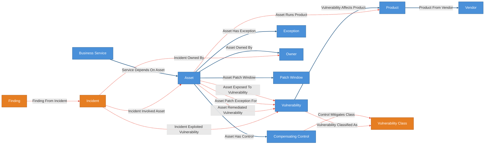
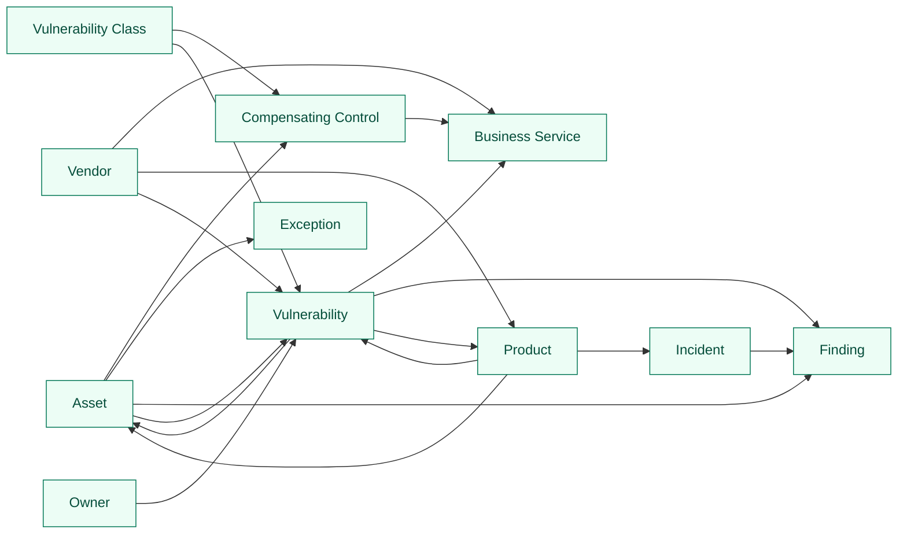

# KEV Triage

Localable cyber world model for vulnerability and KEV triage.

## Skills

- [skills/kev-start/SKILL.md](skills/kev-start/SKILL.md) — adapt the KEV kit
  to your own asset, inventory, and service-mapping data
- [skills/kev-triage/SKILL.md](skills/kev-triage/SKILL.md) — the packaged
  daily triage / incident / waiver / control-effectiveness loop

## Structure

This demo has two kit directories that represent the two layers:

- **`../kev-reference/config.yaml`** — the published upstream world model. Contains only
  public entity types (Vendor, Product, Vulnerability), deterministic reference
  relationships, plus a canonical workflow that builds accepted reference state
  from the bundled hashed KEV/NVD/EPSS artifact. This is what Cruxible hosts
  and keeps updated from public feeds. Read-only to local instances.

- **`config.yaml`** — a customer local that uses `extends: ../kev-reference/config.yaml`.
  Adds internal entity types, deterministic internal mappings, governed judgment
  relationships, feedback and outcome profiles, quality checks, and named queries
  that traverse across both layers.

Everything between `CRUXIBLE:BEGIN` / `CRUXIBLE:END` markers is regenerated
from `config.yaml` by `cruxible config-views --runtime`; treat those
blocks as code-owned structural truth. Everything outside those marker blocks
is authored explanation for humans and agents reading the kit.

## Ontology Map

The runtime composed view includes inherited reference entities and relationships
plus the extension's internal and governed surfaces. Solid blue lines are
deterministic canonical state. Dashed red lines are governed proposal/review
relationships.

<!-- CRUXIBLE:BEGIN ontology -->

<!-- CRUXIBLE:END ontology -->

**Legend:** Blue = canonical/deterministic state, including the inherited KEV
reference layer | Orange = governed-only trigger/judgment entities | Solid blue
lines = deterministic | Dashed red lines = governed proposal/review.

## Workflow Summary

The generated pipeline gives the onboarding order. The generated stage
blocks underneath keep long context and provider provenance readable without
squeezing them into a wide table.

```mermaid
flowchart LR
  classDef canonicalWorkflow fill:#4a90d9,stroke:#2c5f8a,color:#fff
  classDef governedWorkflow fill:#e67e22,stroke:#a0521c,color:#fff

  workflow_pipeline_build_local_state["1. Seed canonical state<br/>Canonical"]
  workflow_pipeline_propose_asset_products["2. Asset Runs Product<br/>Governed proposal"]
  workflow_pipeline_propose_asset_exposure["3. Asset Exposed To Vulnerability<br/>Governed proposal"]
  workflow_pipeline_propose_control_mitigates_class["4. Control Mitigates Class<br/>Governed proposal"]
  workflow_pipeline_propose_exposure_reconciliation["5. Asset Remediated Vulnerability<br/>Governed proposal"]
  workflow_pipeline_propose_vulnerability_classification["6. Vulnerability Classified As<br/>Governed proposal"]
  workflow_pipeline_build_local_state --> workflow_pipeline_propose_asset_products
  workflow_pipeline_propose_asset_products --> workflow_pipeline_propose_asset_exposure
  workflow_pipeline_propose_asset_exposure --> workflow_pipeline_propose_control_mitigates_class
  workflow_pipeline_propose_control_mitigates_class --> workflow_pipeline_propose_exposure_reconciliation
  workflow_pipeline_propose_exposure_reconciliation --> workflow_pipeline_propose_vulnerability_classification
  class workflow_pipeline_build_local_state canonicalWorkflow
  class workflow_pipeline_propose_asset_products,workflow_pipeline_propose_asset_exposure,workflow_pipeline_propose_control_mitigates_class,workflow_pipeline_propose_exposure_reconciliation,workflow_pipeline_propose_vulnerability_classification governedWorkflow
```

<!-- CRUXIBLE:BEGIN workflow-pipeline -->

<!-- CRUXIBLE:END workflow-pipeline -->

<!-- CRUXIBLE:BEGIN workflow-summary -->
### 1. Build Local State

**Role:** Canonical seed

**Input context**
- None (seeds canonical state)

**Result**
- Canonical entities: Asset, Business Service, Compensating Control, Exception, Owner, Patch Window, Vulnerability Class
- Canonical relationships: Asset Has Control, Asset Has Exception, Asset Owned By, Asset Patch Window, Service Depends On Asset

**Provider source**
- Normalize Local Seed Tables (Python Function, v1.0.0); source: `kit://providers/seed.py::normalize_local_seed_tables`; artifact: Local Seed Bundle
- Parse Local Seed Bundle (Python Function, v1.0.0); source: `src/cruxible_core/providers/common/tabular.py::load_tabular_artifact_bundle`; artifact: Local Seed Bundle

### 2. Propose Asset Products

**Role:** Governed proposal

**Input context**
- Entity context: Product

**Result**
- Proposed relationships: Asset Runs Product

**Provider source**
- Load Software Inventory (Python Function, v1.0.0); source: `kit://providers/seed.py::load_software_inventory`; artifact: Local Seed Bundle
- Match Software To Products (Python Function, v1.0.0); source: `kit://providers/matching.py::match_software_to_products`

### 3. Propose Asset Exposure

**Role:** Governed proposal

**Input context**
- Entity context: Asset, Compensating Control
- Relationship context: Asset Has Control, Asset Runs Product, Vulnerability Affects Product

**Result**
- Proposed relationships: Asset Exposed To Vulnerability

**Provider source**
- Assess Asset Affected (Python Function, v1.0.0); source: `kit://providers/assessment.py::assess_asset_affected`
- Assess Asset Exposure (Python Function, v1.0.0); source: `kit://providers/assessment.py::assess_asset_exposure`

### 4. Propose Control Mitigates Class

**Role:** Governed proposal

**Input context**
- None

**Result**
- Proposed relationships: Control Mitigates Class

**Provider source**
- -

### 5. Propose Exposure Reconciliation

**Role:** Governed proposal

**Input context**
- Relationship context: Asset Exposed To Vulnerability, Asset Remediated Vulnerability, Asset Runs Product, Vulnerability Affects Product

**Result**
- Proposed relationships: Asset Remediated Vulnerability

**Provider source**
- Assess Asset Affected (Python Function, v1.0.0); source: `kit://providers/assessment.py::assess_asset_affected`
- Assess Exposure Reconciliation (Python Function, v1.0.0); source: `kit://providers/assessment.py::assess_exposure_reconciliation`

### 6. Propose Vulnerability Classification

**Role:** Governed proposal

**Input context**
- None

**Result**
- Proposed relationships: Vulnerability Classified As

**Provider source**
- -
<!-- CRUXIBLE:END workflow-summary -->

## Governed Relationships

Each governed relationship has a `matching` block, integrations that provide
signals, and linked feedback/outcome profiles for the Loop 1/2 flywheel.

<!-- CRUXIBLE:BEGIN governance-table -->
| Relationship | Scope | Creation Path | Signals | Auto-resolve Gate | Review Policy | Feedback | Outcomes |
| --- | --- | --- | --- | --- | --- | --- | --- |
| Asset Exposed To Vulnerability | Asset -> Vulnerability | Workflow: Propose Asset Exposure | Control Effectiveness, Exploitability Signal, Product Version Evidence | All Support; prior trust: Trusted Only | Trust-gated auto-resolve | 4 reason codes | Asset Exposed Resolution |
| Asset Patch Exception For | Asset -> Vulnerability | Agent/manual group propose | Policy Review | All Support; prior trust: Trusted Only | Trust-gated auto-resolve | 2 reason codes | - |
| Asset Remediated Vulnerability | Asset -> Vulnerability | Workflow: Propose Exposure Reconciliation | Remediation Verification | All Support; prior trust: Trusted Only | Trust-gated auto-resolve | 3 reason codes | Asset Remediated Resolution |
| Asset Runs Product | Asset -> Product | Workflow: Propose Asset Products | Software Product Match | All Support; prior trust: Trusted Only | Trust-gated auto-resolve | 3 reason codes | Asset Runs Product Resolution |
| Control Mitigates Class | Compensating Control -> Vulnerability Class | Workflow: Propose Control Mitigates Class | Control Effectiveness | All Support; prior trust: Trusted Only | Trust-gated auto-resolve | 2 reason codes | - |
| Finding From Incident | Finding -> Incident | Agent/manual group propose | Incident Attribution | All Support; prior trust: Trusted Only | Trust-gated auto-resolve | 2 reason codes | - |
| Incident Exploited Vulnerability | Incident -> Vulnerability | Agent/manual group propose | Incident Attribution | All Support; prior trust: Trusted Only | Trust-gated auto-resolve | 2 reason codes | Incident Attribution Resolution |
| Incident Involved Asset | Incident -> Asset | Agent/manual group propose | Incident Attribution | All Support; prior trust: Trusted Only | Trust-gated auto-resolve | 2 reason codes | - |
| Incident Owned By | Incident -> Owner | Agent/manual group propose | Incident Attribution | All Support; prior trust: Trusted Only | Trust-gated auto-resolve | 2 reason codes | - |
| Vulnerability Classified As | Vulnerability -> Vulnerability Class | Workflow: Propose Vulnerability Classification | Vulnerability Classification | All Support; prior trust: Trusted Only | Trust-gated auto-resolve | 2 reason codes | - |
<!-- CRUXIBLE:END governance-table -->

### Integration Signal Notes

This catalog is generated from configured integrations and the governed
relationships that consume them.

<!-- CRUXIBLE:BEGIN integration-catalog -->
| Integration | Kind | Used By | Notes |
| --- | --- | --- | --- |
| `control_effectiveness` | compensating_control_review | Asset Exposed To Vulnerability, Control Mitigates Class | Reviews whether a compensating control materially reduces exploitability for the specific vulnerability class. |
| `exploitability_signal` | exploitability_assessment | Asset Exposed To Vulnerability | Assesses whether a vulnerability is practically exploitable on a specific asset given its environment and exposure posture. |
| `incident_attribution` | incident_investigation | Finding From Incident, Incident Exploited Vulnerability, Incident Involved Asset, Incident Owned By | Agent or human judgment linking incidents to assets, vulnerabilities, and findings based on investigation evidence. Typically proposed one at a time via group propose after reading incident reports or post-mortems. |
| `policy_review` | remediation_policy_review | Asset Patch Exception For | Reviews whether a patch exception is still valid per organizational remediation policy. |
| `product_version_evidence` | product_version_match | Asset Exposed To Vulnerability | Matches installed product version against NVD affected version ranges to determine if an asset is actually affected. |
| `remediation_verification` | remediation_verification | Asset Remediated Vulnerability | Reviews whether a specific asset-vulnerability pair has been remediated or verified closed based on scanner evidence, change tickets, upgrade confirmation, decommissioning, or manual validation. |
| `software_product_match` | software_product_fuzzy_match | Asset Runs Product | Fuzzy matching between internal software inventory names (e.g. "Apache HTTP Server 2.4.49") and reference-layer CPE product identifiers. Runs against the software_inventory.csv evidence source. |
| `vulnerability_classification` | vulnerability_classification | Vulnerability Classified As | Reviews whether a vulnerability belongs to a local operational class used for control coverage and scenario analysis. |
<!-- CRUXIBLE:END integration-catalog -->

## Query Map

Named queries are graph-native read surfaces. The map shows entry/return
affordances; query names and traversal details live in the generated catalog.

<!-- CRUXIBLE:BEGIN query-map -->

<!-- CRUXIBLE:END query-map -->

## Query Catalog

Use the catalog to decide which KEV surfaces survive onboarding for a user's
data. Composition, presentation, and operator summaries should happen in the
skill or agent harness, not by turning every useful traversal into a governed
relationship.

<!-- CRUXIBLE:BEGIN query-catalog -->
### Asset

| Query | Returns | Traversal | Purpose |
| --- | --- | --- | --- |
| Asset Control Context | Compensating Control | Asset Has Control (Outgoing) | Starting from an asset, find compensating controls currently attached to it. |
| Asset Exception Context | Exception | Asset Has Exception (Outgoing) | Starting from an asset, find exception records currently attached to it. |
| Asset Remediation Context | Vulnerability | Asset Remediated Vulnerability (Outgoing) | Starting from an asset, find vulnerabilities that have been explicitly marked remediated for that asset. |
| Open Findings For Asset | Finding | Incident Involved Asset (Incoming) -> Finding From Incident (Incoming) | Starting from an asset, find open findings from incidents that involved this asset. Filters out remediated findings. Answers: "What unresolved root causes exist for this asset?" |

### Compensating Control

| Query | Returns | Traversal | Purpose |
| --- | --- | --- | --- |
| Control Coverage Gap | Business Service | Control Mitigates Class (Outgoing) -> Vulnerability Classified As (Incoming) -> Asset Exposed To Vulnerability (Incoming) -> Service Depends On Asset (Incoming) | Starting from a compensating control, find the business services that would lose coverage if this control were disabled or invalidated. Traces from control through mitigated vulnerability classes to exposed vulnerabilities and dependent services. |

### Incident

| Query | Returns | Traversal | Purpose |
| --- | --- | --- | --- |
| Finding Status For Incident | Finding | Finding From Incident (Incoming) | Starting from an incident, find all findings. Answers: "Are all root causes from this incident addressed?" |

### Owner

| Query | Returns | Traversal | Purpose |
| --- | --- | --- | --- |
| Owner Patch Queue | Vulnerability | Asset Owned By (Incoming) -> Asset Exposed To Vulnerability (Outgoing) | Starting from an owner, find exposed vulnerabilities across the owner's assets. |

### Product

| Query | Returns | Traversal | Purpose |
| --- | --- | --- | --- |
| Exposed Assets For Product | Asset | Vulnerability Affects Product (Incoming) -> Asset Exposed To Vulnerability (Incoming) | Starting from a product, find assets currently accepted as exposed through vulnerabilities affecting that product. |
| Incident History For Product | Incident | Vulnerability Affects Product (Incoming) -> Incident Exploited Vulnerability (Incoming) | Starting from a product, find incidents where vulnerabilities affecting this product were exploited. Answers: "Has this product been exploited before in our environment?" |
| Product Kev Exposure | Asset | Vulnerability Affects Product (Incoming) -> Asset Exposed To Vulnerability (Incoming) | Compatibility alias for exposed_assets_for_product. |
| Product Vulnerabilities | Vulnerability | Vulnerability Affects Product (Incoming) | Starting from a product, find vulnerabilities that affect it. |

### Vendor

| Query | Returns | Traversal | Purpose |
| --- | --- | --- | --- |
| Vendor Products | Product | Product From Vendor (Incoming) | Starting from a vendor, find products published by that vendor. |
| Vendor Service Impact | Business Service | Product From Vendor (Incoming) -> Vulnerability Affects Product (Incoming) -> Asset Exposed To Vulnerability (Incoming) -> Service Depends On Asset (Incoming) | Starting from a vendor, trace through affected products, confirmed vulnerable assets, and service dependencies to find business services in the blast radius. This is the question you ask when a vendor discloses a breach or a critical supply-chain vulnerability. |
| Vendor Vulnerabilities | Vulnerability | Product From Vendor (Incoming) -> Vulnerability Affects Product (Incoming) | Starting from a vendor, find all vulnerabilities across that vendor's products. |

### Vulnerability

| Query | Returns | Traversal | Purpose |
| --- | --- | --- | --- |
| Candidate Assets For Vulnerability | Asset | Vulnerability Affects Product (Outgoing) -> Asset Runs Product (Incoming) | Starting from a vulnerability, find internal assets that run a product affected by that vulnerability. This is a candidate impact surface derived from product mappings, not accepted exposure state. |
| Exposed Assets For Vulnerability | Asset | Asset Exposed To Vulnerability (Incoming) | Starting from a vulnerability, find assets with accepted exposure state for that vulnerability. |
| Kev Assets | Asset | Vulnerability Affects Product (Outgoing) -> Asset Runs Product (Incoming) | Compatibility alias for candidate_assets_for_vulnerability. Prefer candidate_assets_for_vulnerability or exposed_assets_for_vulnerability in new decision workflows. |
| Prior Exploitation Context | Finding | Incident Exploited Vulnerability (Incoming) -> Finding From Incident (Incoming) | Starting from a vulnerability, find incidents where it was exploited and the findings from those investigations. Answers: "What did we learn last time this CVE was exploited?" |
| Remediated Assets For Vulnerability | Asset | Asset Remediated Vulnerability (Incoming) | Starting from a vulnerability, find assets that have explicit remediation state recorded for it. |
| Service Blast Radius | Business Service | Asset Exposed To Vulnerability (Incoming) -> Service Depends On Asset (Incoming) | Starting from a vulnerability, find business services with accepted exposed dependent assets. |
| Vulnerability Products | Product | Vulnerability Affects Product (Outgoing) | Starting from a vulnerability, find affected products. |

### Vulnerability Class

| Query | Returns | Traversal | Purpose |
| --- | --- | --- | --- |
| Controls For Vulnerability Class | Compensating Control | Control Mitigates Class (Incoming) | Starting from a vulnerability class, find compensating controls governed as mitigating that class. |
| Vulnerabilities For Class | Vulnerability | Vulnerability Classified As (Incoming) | Starting from a vulnerability class, find vulnerabilities that have been governed into that class. Useful context for future agent classification proposals. |
<!-- CRUXIBLE:END query-catalog -->

## Schema Reference

This README keeps schema detail at the diagram and table level so the kit
remains usable as a drafting surface. The config remains the source of truth
for full entity, relationship, and contract properties. For a generated
Markdown schema catalog, run:

```bash
uv run cruxible config-views --config kits/kev-triage/config.yaml --runtime --view schema-catalog
```

When the kit is loaded into a local instance, generate navigable reference
pages under `wiki/reference/` with:

```bash
uv run cruxible render-wiki --output wiki --scope local
```


## Rules And Learning Loops

These generated sections own the operational facts: constraints, quality
checks, feedback vocabularies, and outcome vocabularies. Authored prose should
explain how to use them, not restate the config.

<!-- CRUXIBLE:BEGIN quality-rules -->
### Constraints

No configured constraints.

### Quality Checks

| Name | Kind | Target | Severity | Rule |
| --- | --- | --- | --- | --- |
| `affected_versions_have_useful_keys` | Json Content | Vulnerability Affects Product.affected_versions | Warning | Required Nested Keys; keys: `version_start_including, version_start_excluding, version_end_including, version_end_excluding, version_exact, fixed_version`; match: `any` |
| `assets_have_hostname` | Property | Asset.hostname | Warning | Non Empty |
| `assets_have_one_owner` | Cardinality | Asset -> Asset Owned By (out) | Warning | min `1`, max `1` |
| `minimum_assets_loaded` | Bounds | Asset count | Warning | min `5` |
| `no_empty_affected_version_objects` | Json Content | Vulnerability Affects Product.affected_versions | Error | No Empty Objects In Array |
| `products_have_exactly_one_vendor` | Cardinality | Product -> Product From Vendor (out) | Error | min `1`, max `1` |
<!-- CRUXIBLE:END quality-rules -->

<!-- CRUXIBLE:BEGIN learning-loops -->
### Feedback Profiles (Loop 1)

#### `asset_exposed_to_vulnerability`
- Version: `1`
- Reason codes:
  - `control_mitigates` (`decision_policy`): A compensating control effectively blocks this exploit path.
  - `epss_score_stale` (`provider_fix`): EPSS score has changed since the exposure judgment.
  - `not_internet_reachable` (`constraint`): Asset is not reachable from the attack vector.
  - `version_not_in_range` (`constraint`): Installed version is not within the NVD affected range.
- Scope keys:
  - `criticality`: `FROM.criticality`
  - `cve`: `TO.cve_id`
  - `environment`: `FROM.environment`
  - `product`: `EDGE.product_id`

#### `asset_patch_exception_for`
- Version: `1`
- Reason codes:
  - `exception_expired` (`constraint`): Exception review date has passed without renewal.
  - `scope_mismatch` (`decision_policy`): Exception does not cover this specific vulnerability.
- Scope keys:
  - `cve`: `TO.cve_id`
  - `exception_id`: `EDGE.exception_id`

#### `asset_remediated_vulnerability`
- Version: `1`
- Reason codes:
  - `insufficient_verification` (`quality_check`): Evidence was too weak to claim verified remediation.
  - `regression_after_fix` (`provider_fix`): The issue reappeared after remediation was recorded.
  - `wrong_closure` (`provider_fix`): The asset-vulnerability pair was not actually remediated.
- Scope keys:
  - `asset`: `FROM.asset_id`
  - `cve`: `TO.cve_id`

#### `asset_runs_product`
- Version: `1`
- Reason codes:
  - `stale_inventory` (`provider_fix`): CMDB or software inventory data was outdated at match time.
  - `version_mismatch` (`quality_check`): Matched correct product but installed version is wrong.
  - `wrong_product_match` (`provider_fix`): Fuzzy match linked asset to the wrong reference product.
- Scope keys:
  - `evidence_source`: `EDGE.evidence_source`
  - `hostname`: `FROM.hostname`
  - `product`: `TO.product_name`

#### `control_mitigates_class`
- Version: `1`
- Reason codes:
  - `control_not_validated` (`quality_check`): Control effectiveness has not been tested against this vulnerability class.
  - `wrong_vulnerability_class` (`constraint`): Control does not apply to this vulnerability class.
- Scope keys:
  - `class`: `TO.class_id`
  - `control_type`: `FROM.control_type`

#### `finding_from_incident`
- Version: `1`
- Reason codes:
  - `duplicate_finding` (`quality_check`): This finding duplicates another finding for the same incident.
  - `wrong_root_cause` (`decision_policy`): This finding was not actually a root cause of this incident.
- Scope keys:
  - `finding`: `FROM.finding_id`
  - `incident`: `TO.incident_id`

#### `incident_exploited_vulnerability`
- Version: `1`
- Reason codes:
  - `correlation_not_causation` (`decision_policy`): CVE was present but not the attack vector used.
  - `wrong_cve_attribution` (`provider_fix`): The CVE was not actually exploited in this incident.
- Scope keys:
  - `cve`: `TO.cve_id`
  - `incident`: `FROM.incident_id`

#### `incident_involved_asset`
- Version: `1`
- Reason codes:
  - `misidentified_role` (`quality_check`): Asset was involved but its role was mischaracterized.
  - `wrong_asset` (`provider_fix`): This asset was not actually involved in the incident.
- Scope keys:
  - `hostname`: `TO.hostname`
  - `incident`: `FROM.incident_id`

#### `incident_owned_by`
- Version: `1`
- Reason codes:
  - `ownership_transferred` (`quality_check`): Ownership was transferred to a different team.
  - `wrong_team` (`provider_fix`): This team is not the correct owner for this incident.
- Scope keys:
  - `incident`: `FROM.incident_id`
  - `owner`: `TO.owner_id`

#### `vulnerability_classified_as`
- Version: `1`
- Reason codes:
  - `classification_too_broad` (`decision_policy`): Classification is too broad for control or scenario analysis.
  - `wrong_class` (`provider_fix`): Vulnerability was assigned to the wrong operational class.
- Scope keys:
  - `class`: `TO.class_id`
  - `cve`: `FROM.cve_id`

### Outcome Profiles (Loop 2)

#### Resolution-Anchored

##### `asset_exposed_resolution`
- Version: `1`
- Target: Relationship `asset_exposed_to_vulnerability`
- Outcome codes:
  - `overestimated_exposure` (`trust_adjustment`): Control was effective but was not credited during resolution.
  - `underestimated_exposure` (`require_review`): An attack path was missed during exposure assessment.
- Scope keys:
  - `relationship_type`: `RESOLUTION.relationship_type`

##### `asset_remediated_resolution`
- Version: `1`
- Target: Relationship `asset_remediated_vulnerability`
- Outcome codes:
  - `premature_closure` (`trust_adjustment`): The remediation was accepted before the asset was actually closed.
  - `reopened_after_regression` (`require_review`): The asset later became exposed again after remediation.
  - `verified_remediation` (`unknown`): The remediation decision was correct and the asset remained closed.
- Scope keys:
  - `relationship_type`: `RESOLUTION.relationship_type`

##### `asset_runs_product_resolution`
- Version: `1`
- Target: Relationship `asset_runs_product`
- Outcome codes:
  - `version_drift` (`provider_fix`): Match was correct at resolution time but the asset has since been patched.
  - `wrong_product_match` (`trust_adjustment`): The fuzzy match resolved to the wrong reference product.
- Scope keys:
  - `relationship_type`: `RESOLUTION.relationship_type`

##### `incident_attribution_resolution`
- Version: `1`
- Target: Relationship `incident_exploited_vulnerability`
- Outcome codes:
  - `attribution_incorrect` (`require_review`): Further investigation showed a different CVE or attack vector was used.
  - `confirmed_exploitation` (`trust_adjustment`): Post-incident analysis confirmed this CVE was the attack vector.
- Scope keys:
  - `relationship_type`: `RESOLUTION.relationship_type`

#### Receipt-Anchored

##### `kev_assets_query`
- Version: `1`
- Target: Query `kev_assets`
- Outcome codes:
  - `false_positive_result` (`graph_fix`): Query returned an asset that is not actually affected.
  - `missing_results` (`graph_fix`): A known-affected asset was not returned by the query.
- Scope keys:
  - `query`: `SURFACE.name`

##### `owner_patch_queue_query`
- Version: `1`
- Target: Query `owner_patch_queue`
- Outcome codes:
  - `missing_exposure` (`workflow_fix`): An exposed vulnerability was not returned for this owner.
  - `stale_priority` (`graph_fix`): Returned vulnerability that has already been patched or mitigated.
- Scope keys:
  - `query`: `SURFACE.name`
<!-- CRUXIBLE:END learning-loops -->

## Maintenance

Regenerate the structural sections after changing ontology, workflows,
governed relationships, or named queries:

```bash
uv run cruxible config-views --config kits/kev-triage/config.yaml --runtime --update-readme kits/kev-triage/README.md
```

To inspect the same generated bundle without editing the README:

```bash
uv run cruxible config-views --config kits/kev-triage/config.yaml --runtime --view all
```

## Seed Data

Synthetic test data lives in `data/seed/`. These CSVs represent what a business
would have readily available from internal systems — CMDB exports, software
inventory, service catalogs, and operations data — using the business's own
naming conventions, not CPE identifiers. The gap between internal names and
reference-layer product IDs is the fuzzy matching problem that the
`asset_runs_product` governed relationship solves through the proposal flow.

See `data/seed/software_inventory.csv` for the key file — it contains software
names and versions as the business knows them, which need to be matched to
reference-layer products through `software_product_match` proposals.

The seed bundle now includes a richer internal environment: multiple owners,
services, internet-facing Apache hosts on different versions, patch windows,
active controls, and one legacy exception record from a source-of-record
system.

Source material for governed agent actions lives under
`data/seed/review_material/`. Those files are not loaded by
`build_local_state`; they are synthetic incident reports, waiver requests, and
control reviews meant to drive `add-entity` and `group propose`.

## Incident History Layer

Adds incident investigation knowledge that compounds across triage cycles. The
vulnerability triage layer tells you what's exposed *now*. The incident layer
tells you what's been exploited *before* — and what you learned from it.

### Why this compounds

When a new CVE drops and the triage agent runs the exposure assessment, it can
also query `incident_history_for_product` to check: "has this product been
exploited before in our environment?" If yes, the triage summary includes what
happened last time — which assets were hit, what the root cause was, what
findings are still open. The priority isn't just CVSS × EPSS anymore; it's
informed by organizational history.

### Proposed entity types

| Entity | Properties | Source |
|---|---|---|
| `Incident` | incident_id (PK), title, severity, status (open/investigating/resolved/closed), occurred_at, resolved_at, source, summary | PagerDuty export, SIEM, manual |
| `Finding` | finding_id (PK), title, category, detail, status (open/remediated/accepted_risk), remediation_action, remediated_at | Post-mortem extraction (agent or manual) |

### Proposed relationships

| Relationship | From → To | Governed? | How it's created |
|---|---|---|---|
| `incident_owned_by` | Incident → Owner | Yes | Agent proposes accountable owner for incident |
| `incident_involved_asset` | Incident → Asset | Yes | Agent reads incident report, proposes link |
| `incident_exploited_vulnerability` | Incident → Vulnerability | Yes | Agent reads post-mortem, proposes CVE attribution |
| `finding_from_incident` | Finding → Incident | Yes | Agent extracts findings from post-mortem |

### Proposed named queries

| Query | Traversal | What it answers |
|---|---|---|
| `incident_history_for_product` | Product ← vulnerability_affects_product ← incident_exploited_vulnerability | "Has this product been exploited before?" |
| `open_findings_for_asset` | Asset ← incident_involved_asset ← finding_from_incident (status = open) | "What open findings still need action for this asset?" |
| `prior_exploitation_context` | Vulnerability ← incident_exploited_vulnerability → finding_from_incident | "What did we learn last time this CVE was exploited?" |
| `finding_status_for_incident` | Incident ← finding_from_incident | "Are all findings from this incident remediated?" |
