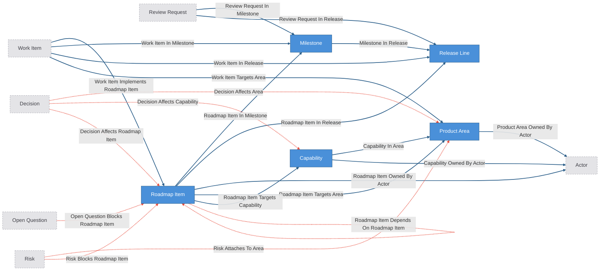

# Project Domain Kit

Project/product domain overlay composed over the agent-operation base kit
(`extends: ../agent-operation/config.yaml`).

The base supplies the operating layer: actors, work items, review requests,
decisions, risks, open questions, state notes, and their ownership, review-gate,
work-axis, and governed-judgment relationships. This overlay adds the
project/product domain: roadmap items, release lines, and milestones as typed
entities, product areas and capabilities as lightweight tag-role classification,
and the seam relationships that connect operation entities to domain structure.

Markdown docs, plans, chats, review reports, and transcripts remain source
evidence for proposals; they are not modeled as entities here.

Everything between `CRUXIBLE:BEGIN` / `CRUXIBLE:END` markers is regenerated
from `config.yaml` by `cruxible config views`; treat those blocks as code-owned
structural truth. Everything outside those marker blocks is authored explanation.

## Modeling Notes

- `ProductArea` and `Capability` are tag-role only: classification read by
  queries and warning-severity checks. Nothing gates on them.
- Ownership is not a property. Project ownership through the base `Actor`
  entity and `*_owned_by_actor` edges (see the base `actor_work_queue`).
- Seam edges (`work_item_in_release`, `work_item_in_milestone`,
  `work_item_implements_roadmap_item`, `*_targets_area`) are deterministic or
  source-backed structure; the `decision_affects_*`, `risk_*`, and
  `open_question_blocks_roadmap_item` edges are governed judgments routed
  through proposals.
- No release-pinned quality checks ship in the kit. At instance setup, add a
  `named_query_result_count` check per gating release line against
  `deferred_release_gating_work_items` (see the comment in `config.yaml`).

## Ontology

<!-- CRUXIBLE:BEGIN ontology -->

**Diagram legend:** blue node = canonical entity (deterministic writes); dashed grey node = base-kit entity shown for seam context; solid edge = deterministic relationship; dotted edge = governed relationship.
<!-- CRUXIBLE:END ontology -->

## Schema Catalog

<!-- CRUXIBLE:BEGIN schema-catalog -->
| Entity | Properties | Description |
| --- | --- | --- |
| `Capability` | `capability_id: string (pk)`, `name: string?`, `description: string?`, `status: enum?` | Durable technical or product ability the project supports. |
| `Milestone` | `milestone_id: string (pk)`, `title: string?`, `summary: string?`, `status: enum?`, `target_date: date?` | Delivery milestone, gate, checkpoint, or intermediate target. |
| `ProductArea` | `area_id: string (pk)`, `name: string?`, `description: string?` | Stable product, project, subsystem, package, or responsibility area. |
| `ReleaseLine` | `release_line_id: string (pk)`, `name: string?`, `status: enum?`, `starts_at: date?`, `target_date: date?` | Release train, version line, launch window, or delivery stream. |
| `RoadmapItem` | `roadmap_item_id: string (pk)`, `title: string?`, `summary: string?`, `status: enum?`, `priority: enum?`, `target_date: date?` | Planned investment, initiative, or roadmap-level change. |
<!-- CRUXIBLE:END schema-catalog -->

## Workflows

<!-- CRUXIBLE:BEGIN workflow-pipeline -->
This layer declares no workflows; composed instances inherit the base kit's.
<!-- CRUXIBLE:END workflow-pipeline -->

<!-- CRUXIBLE:BEGIN workflow-summary -->
This layer declares no workflows; composed instances inherit the base kit's.
<!-- CRUXIBLE:END workflow-summary -->

## Provider Contracts

<!-- CRUXIBLE:BEGIN provider-contracts -->
This layer declares no providers; state is written directly by operators and agents, and any base-kit providers are documented in the base kit's README.
<!-- CRUXIBLE:END provider-contracts -->

## Governance

<!-- CRUXIBLE:BEGIN governance-table -->
| Relationship | Scope | Creation Path | Signals | Auto-resolve Gate | Review Policy | Feedback | Outcomes |
| --- | --- | --- | --- | --- | --- | --- | --- |
| Decision Affects Area | Decision -> Product Area | Proposal only (direct write refused) | Maintainer Judgment, Source Evidence | All Support; prior trust: Trusted Only | Trust-gated auto-resolve | - | - |
| Decision Affects Capability | Decision -> Capability | Proposal only (direct write refused) | Maintainer Judgment, Source Evidence | All Support; prior trust: Trusted Only | Trust-gated auto-resolve | - | - |
| Decision Affects Roadmap Item | Decision -> Roadmap Item | Proposal only (direct write refused) | Maintainer Judgment, Source Evidence | All Support; prior trust: Trusted Only | Trust-gated auto-resolve | - | - |
| Open Question Blocks Roadmap Item | Open Question -> Roadmap Item | Proposal only (direct write refused) | Maintainer Judgment, Source Evidence | All Support; prior trust: Trusted Only | Trust-gated auto-resolve | - | - |
| Risk Attaches To Area | Risk -> Product Area | Proposal only (direct write refused) | Maintainer Judgment, Source Evidence | All Support; prior trust: Trusted Only | Trust-gated auto-resolve | - | - |
| Risk Blocks Roadmap Item | Risk -> Roadmap Item | Proposal only (direct write refused) | Maintainer Judgment, Source Evidence | All Support; prior trust: Trusted Only | Trust-gated auto-resolve | - | - |
| Roadmap Item Depends On Roadmap Item | Roadmap Item -> Roadmap Item | Proposal only (direct write refused) | Maintainer Judgment, Source Evidence | All Support; prior trust: Trusted Only | Trust-gated auto-resolve | - | - |
<!-- CRUXIBLE:END governance-table -->

<!-- CRUXIBLE:BEGIN mutation-guards -->
No mutation guards declared.
<!-- CRUXIBLE:END mutation-guards -->

<!-- CRUXIBLE:BEGIN signal-policy-catalog -->
| Signal Source | Role | Review Unsure | Evidence on Support | Used By | Notes |
| --- | --- | --- | --- | --- | --- |
| `maintainer_judgment` | advisory | yes | no | Decision Affects Area, Decision Affects Capability, Decision Affects Roadmap Item, Open Question Blocks Roadmap Item, Risk Attaches To Area, Risk Blocks Roadmap Item, Roadmap Item Depends On Roadmap Item, + 13 base relationships | - |
| `source_evidence` | required | yes | no | Decision Affects Area, Decision Affects Capability, Decision Affects Roadmap Item, Open Question Blocks Roadmap Item, Risk Attaches To Area, Risk Blocks Roadmap Item, Roadmap Item Depends On Roadmap Item, + 13 base relationships | - |
<!-- CRUXIBLE:END signal-policy-catalog -->

## Queries

<!-- CRUXIBLE:BEGIN query-catalog -->
### Collection Query

| Query | Mode | Returns | State | Traversal | Purpose |
| --- | --- | --- | --- | --- | --- |
| Work Queue | collection | Work Item | live |  | Active work items dispatched for implementation -- the queue an implementer or agentic loop pulls from. Curate by setting a work item's status to active. |

### Decision

| Query | Mode | Returns | State | Traversal | Purpose |
| --- | --- | --- | --- | --- | --- |
| Decision Impact Context | traversal | Roadmap Item | reviewable | Decision Affects Roadmap Item \| Decision Constrains Work Item \| Decision Affects Capability \| Decision Affects Area \| Decision Answers Open Question \| Decision Supersedes Decision (Outgoing) | Starting from a decision, inspect affected roadmap, constrained work, answered questions, and supersession context. |

### Milestone

| Query | Mode | Returns | State | Traversal | Purpose |
| --- | --- | --- | --- | --- | --- |
| Milestone Work Items | traversal | Work Item | live | Work Item In Milestone \| Roadmap Item In Milestone \| Work Item Implements Roadmap Item (Incoming, depth=2) | Work items reachable from a milestone directly or through roadmap items in the milestone. |

### Open Question

| Query | Mode | Returns | State | Traversal | Purpose |
| --- | --- | --- | --- | --- | --- |
| Open Question Context | traversal | Roadmap Item | reviewable | Open Question Blocks Roadmap Item \| Open Question Blocks Work Item \| Open Question Blocks Decision (Outgoing) | Starting from an open question, inspect blocked and answered roadmap, work, and decision context. |

### Product Area

| Query | Mode | Returns | State | Traversal | Purpose |
| --- | --- | --- | --- | --- | --- |
| Area Change Context | traversal | Roadmap Item | reviewable | Roadmap Item Targets Area (Incoming) | Starting from a product area, inspect roadmap items, work, decisions, risks, and open questions before editing the subsystem. |
| Area Work Items | traversal | Work Item | live | Work Item Targets Area \| Roadmap Item Targets Area \| Capability In Area \| Roadmap Item Targets Capability \| Work Item Implements Roadmap Item (Incoming, depth=3) | Work items reachable from a product area directly, through capabilities, or through roadmap items. |
| Work Items For Area | traversal | Work Item | live | Work Item Targets Area (Incoming) | Flat work items attached to a product area for agents that need a scannable area work queue. |

### Release Line

| Query | Mode | Returns | State | Traversal | Purpose |
| --- | --- | --- | --- | --- | --- |
| Deferred Release Gating Work Items | traversal | Work Item | reviewable | Work Item In Release (Incoming) | Deferred work items that are still attached to a release line and an active, planned, or blocked milestone. |
| Release Readiness Context | traversal | Any Entity | reviewable | Work Item In Release \| Roadmap Item In Release (Incoming) | Starting from a release line, inspect active, planned, or blocked work plus roadmap items, including roadmap items that have not yet been decomposed into work. |
| Release Work Items | traversal | Work Item | live | Work Item In Release \| Milestone In Release \| Roadmap Item In Release \| Work Item In Milestone \| Roadmap Item In Milestone \| Work Item Implements Roadmap Item (Incoming, depth=3) | Work items reachable from a release line directly, through release milestones, or through release roadmap items. |

### Roadmap Item

| Query | Mode | Returns | State | Traversal | Purpose |
| --- | --- | --- | --- | --- | --- |
| Roadmap Item Context | traversal | Roadmap Item | reviewable | Roadmap Item Depends On Roadmap Item (Outgoing) | Starting from a roadmap item, inspect dependencies, dependents, delivery placement, work, decisions, risks, and open questions. |
| Roadmap Item Work Items | traversal | Work Item | live | Work Item Implements Roadmap Item (Incoming) | Work items that implement a roadmap item. |

Plus 18 queries inherited from the base kit — see its README.
<!-- CRUXIBLE:END query-catalog -->

## Quality Rules

<!-- CRUXIBLE:BEGIN quality-rules -->
### Constraints

No configured constraints.

### Quality Checks

| Name | Kind | Target | Severity | Rule |
| --- | --- | --- | --- | --- |
| `decision_roadmap_impacts_have_type` | Property | Decision Affects Roadmap Item.impact_type | Warning | Required |
| `roadmap_dependencies_have_basis` | Property | Roadmap Item Depends On Roadmap Item.dependency_basis | Warning | Non Empty |
| `roadmap_items_target_area` | Cardinality | Roadmap Item -> Roadmap Item Targets Area (out) | Warning | min `1` |
| `work_items_target_area` | Cardinality | Work Item -> Work Item Targets Area (out) | Warning | min `1` |

Plus 12 quality checks inherited from the base kit — see its README.
<!-- CRUXIBLE:END quality-rules -->

## Learning Loops

<!-- CRUXIBLE:BEGIN learning-loops -->
### Feedback Profiles (Loop 1)

No configured feedback profiles.

### Outcome Profiles (Loop 2)

#### Resolution-Anchored

No configured resolution-anchored outcome profiles.

#### Receipt-Anchored

No configured receipt-anchored outcome profiles.
<!-- CRUXIBLE:END learning-loops -->
