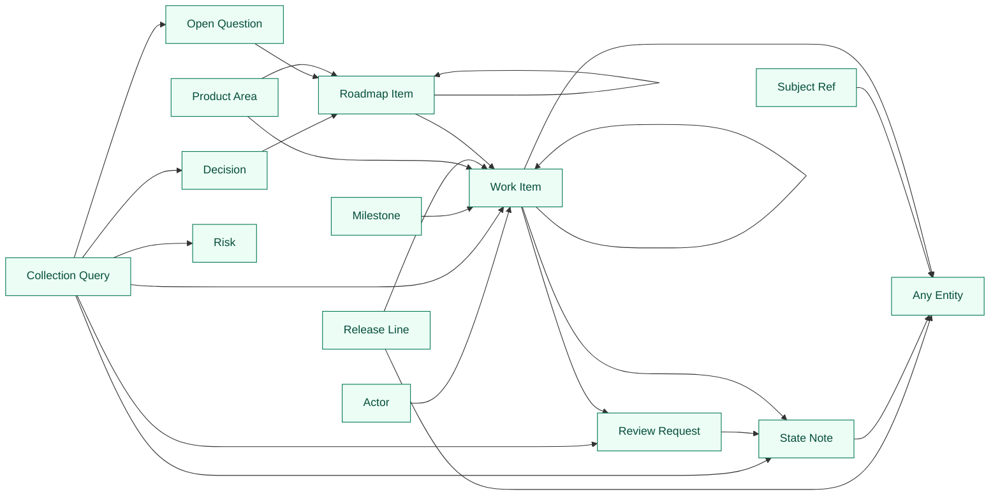

# Project Domain Kit

Project/product domain overlay composed over the agent-operation base kit
(`extends: ../agent-operation/config.yaml`).

The base supplies the operating layer: actors, work items, review requests,
decisions, risks, open questions, state notes, and their ownership, review-gate,
work-axis, and governed-judgment relationships. This overlay adds the
project/product domain: roadmap items, release lines, and milestones as typed
entities, product areas and capabilities as lightweight tag-role classification,
and the seam relationships that connect operation entities to domain structure.

Markdown docs, plans, chats, review reports, and transcripts remain source
evidence for proposals; they are not modeled as entities here.

Everything between `CRUXIBLE:BEGIN` / `CRUXIBLE:END` markers is regenerated
from `config.yaml` by `cruxible config views`; treat those blocks as code-owned
structural truth. Everything outside those marker blocks is authored explanation.

## Modeling Notes

- `ProductArea` and `Capability` are tag-role only: classification read by
  queries and warning-severity checks. Nothing gates on them.
- Ownership is not a property. Project ownership through the base `Actor`
  entity and `*_owned_by_actor` edges (see the base `actor_work_queue`).
- Seam edges (`work_item_in_release`, `work_item_in_milestone`,
  `work_item_implements_roadmap_item`, `*_targets_area`) are deterministic or
  source-backed structure; the `decision_affects_*`, `risk_*`, and
  `open_question_blocks_roadmap_item` edges are governed judgments routed
  through proposals.
- No release-pinned quality checks ship in the kit. At instance setup, add a
  `named_query_result_count` check per gating release line against
  `deferred_release_gating_work_items` (see the comment in `config.yaml`).

## Ontology

```mermaid
flowchart LR
  classDef canonicalEntity fill:#4a90d9,stroke:#2c5f8a,color:#fff
  classDef governedEntity fill:#e67e22,stroke:#a0521c,color:#fff

  entity_Actor["Actor"]
  entity_Capability["Capability"]
  entity_Decision["Decision"]
  entity_Milestone["Milestone"]
  entity_OpenQuestion["Open Question"]
  entity_ProductArea["Product Area"]
  entity_ReleaseLine["Release Line"]
  entity_ReviewRequest["Review Request"]
  entity_Risk["Risk"]
  entity_RoadmapItem["Roadmap Item"]
  entity_StateNote["State Note"]
  entity_SubjectRef["Subject Ref"]
  entity_WorkItem["Work Item"]
  class entity_Actor,entity_Capability,entity_Decision,entity_Milestone,entity_OpenQuestion,entity_ProductArea,entity_ReleaseLine,entity_ReviewRequest,entity_Risk,entity_RoadmapItem,entity_StateNote,entity_SubjectRef,entity_WorkItem canonicalEntity

  %% Deterministic canonical relationships
  entity_Capability -- "Capability In Area" --> entity_ProductArea
  entity_Capability -- "Capability Owned By Actor" --> entity_Actor
  entity_Decision -- "Decision Owned By Actor" --> entity_Actor
  entity_Milestone -- "Milestone In Release" --> entity_ReleaseLine
  entity_OpenQuestion -- "Open Question Owned By Actor" --> entity_Actor
  entity_ProductArea -- "Product Area Owned By Actor" --> entity_Actor
  entity_ReviewRequest -- "Review Request Assigned To Actor" --> entity_Actor
  entity_ReviewRequest -- "Review Request For Work Item" --> entity_WorkItem
  entity_ReviewRequest -- "Review Request In Milestone" --> entity_Milestone
  entity_ReviewRequest -- "Review Request In Release" --> entity_ReleaseLine
  entity_ReviewRequest -- "Review Request Requested By Actor" --> entity_Actor
  entity_Risk -- "Risk Owned By Actor" --> entity_Actor
  entity_RoadmapItem -- "Roadmap Item In Milestone" --> entity_Milestone
  entity_RoadmapItem -- "Roadmap Item In Release" --> entity_ReleaseLine
  entity_RoadmapItem -- "Roadmap Item Owned By Actor" --> entity_Actor
  entity_RoadmapItem -- "Roadmap Item Targets Area" --> entity_ProductArea
  entity_RoadmapItem -- "Roadmap Item Targets Capability" --> entity_Capability
  entity_StateNote -- "State Note About Actor" --> entity_Actor
  entity_StateNote -- "State Note About Decision" --> entity_Decision
  entity_StateNote -- "State Note About Open Question" --> entity_OpenQuestion
  entity_StateNote -- "State Note About Review Request" --> entity_ReviewRequest
  entity_StateNote -- "State Note About Risk" --> entity_Risk
  entity_StateNote -- "State Note About Subject" --> entity_SubjectRef
  entity_StateNote -- "State Note About Work Item" --> entity_WorkItem
  entity_StateNote -- "State Note Authored By Actor" --> entity_Actor
  entity_StateNote -- "State Note Resolves State Note" --> entity_StateNote
  entity_StateNote -- "State Note Supersedes State Note" --> entity_StateNote
  entity_WorkItem -- "Work Item Implements Roadmap Item" --> entity_RoadmapItem
  entity_WorkItem -- "Work Item In Milestone" --> entity_Milestone
  entity_WorkItem -- "Work Item In Release" --> entity_ReleaseLine
  entity_WorkItem -- "Work Item Owned By Actor" --> entity_Actor
  entity_WorkItem -- "Work Item Part Of Work Item" --> entity_WorkItem
  entity_WorkItem -- "Work Item Spawned From Work Item" --> entity_WorkItem
  entity_WorkItem -- "Work Item Targets Area" --> entity_ProductArea
  entity_WorkItem -- "Work Item Targets Subject" --> entity_SubjectRef

  %% Governed proposal/review relationships
  entity_Decision -. "Decision Affects Area" .-> entity_ProductArea
  entity_Decision -. "Decision Affects Capability" .-> entity_Capability
  entity_Decision -. "Decision Affects Roadmap Item" .-> entity_RoadmapItem
  entity_Decision -. "Decision Affects Subject" .-> entity_SubjectRef
  entity_Decision -. "Decision Answers Open Question" .-> entity_OpenQuestion
  entity_Decision -. "Decision Constrains Work Item" .-> entity_WorkItem
  entity_Decision -. "Decision Supersedes Decision" .-> entity_Decision
  entity_OpenQuestion -. "Open Question Blocks Decision" .-> entity_Decision
  entity_OpenQuestion -. "Open Question Blocks Roadmap Item" .-> entity_RoadmapItem
  entity_OpenQuestion -. "Open Question Blocks Work Item" .-> entity_WorkItem
  entity_OpenQuestion -. "Open Question Concerns Subject" .-> entity_SubjectRef
  entity_Risk -. "Risk Attaches To Area" .-> entity_ProductArea
  entity_Risk -. "Risk Attaches To Subject" .-> entity_SubjectRef
  entity_Risk -. "Risk Blocks Roadmap Item" .-> entity_RoadmapItem
  entity_Risk -. "Risk Blocks Work Item" .-> entity_WorkItem
  entity_RoadmapItem -. "Roadmap Item Depends On Roadmap Item" .-> entity_RoadmapItem
  entity_WorkItem -. "Work Item Answers Open Question" .-> entity_OpenQuestion
  entity_WorkItem -. "Work Item Depends On Work Item" .-> entity_WorkItem
  entity_WorkItem -. "Work Item Mitigates Risk" .-> entity_Risk
  entity_WorkItem -. "Work Item Supersedes Work Item" .-> entity_WorkItem
  linkStyle 0,1,2,3,4,5,6,7,8,9,10,11,12,13,14,15,16,17,18,19,20,21,22,23,24,25,26,27,28,29,30,31,32,33,34 stroke:#2c5f8a,stroke-width:2px
  linkStyle 35,36,37,38,39,40,41,42,43,44,45,46,47,48,49,50,51,52,53,54 stroke:#e74c3c,stroke-width:2px
```

<!-- CRUXIBLE:BEGIN ontology -->

<!-- CRUXIBLE:END ontology -->

## Workflows

<!-- CRUXIBLE:BEGIN workflow-pipeline -->
```mermaid
flowchart LR
  classDef canonicalWorkflow fill:#4a90d9,stroke:#2c5f8a,color:#fff
  classDef governedWorkflow fill:#e67e22,stroke:#a0521c,color:#fff

```
<!-- CRUXIBLE:END workflow-pipeline -->

<!-- CRUXIBLE:BEGIN workflow-summary -->

<!-- CRUXIBLE:END workflow-summary -->

## Governance

<!-- CRUXIBLE:BEGIN governance-table -->
| Relationship | Scope | Creation Path | Signals | Auto-resolve Gate | Review Policy | Feedback | Outcomes |
| --- | --- | --- | --- | --- | --- | --- | --- |
| Decision Affects Area | Decision -> Product Area | Agent/manual group propose | Maintainer Judgment, Source Evidence | All Support; prior trust: Trusted Only | Trust-gated auto-resolve | - | - |
| Decision Affects Capability | Decision -> Capability | Agent/manual group propose | Maintainer Judgment, Source Evidence | All Support; prior trust: Trusted Only | Trust-gated auto-resolve | - | - |
| Decision Affects Roadmap Item | Decision -> Roadmap Item | Agent/manual group propose | Maintainer Judgment, Source Evidence | All Support; prior trust: Trusted Only | Trust-gated auto-resolve | - | - |
| Decision Affects Subject | Decision -> Subject Ref | Agent/manual group propose | Maintainer Judgment, Source Evidence | All Support; prior trust: Trusted Only | Trust-gated auto-resolve | - | - |
| Decision Answers Open Question | Decision -> Open Question | Agent/manual group propose | Maintainer Judgment, Source Evidence | All Support; prior trust: Trusted Only | Trust-gated auto-resolve | - | - |
| Decision Constrains Work Item | Decision -> Work Item | Agent/manual group propose | Maintainer Judgment, Source Evidence | All Support; prior trust: Trusted Only | Trust-gated auto-resolve | - | - |
| Decision Supersedes Decision | Decision -> Decision | Agent/manual group propose | Maintainer Judgment, Source Evidence | All Support; prior trust: Trusted Only | Trust-gated auto-resolve | - | - |
| Open Question Blocks Decision | Open Question -> Decision | Agent/manual group propose | Maintainer Judgment, Source Evidence | All Support; prior trust: Trusted Only | Trust-gated auto-resolve | - | - |
| Open Question Blocks Roadmap Item | Open Question -> Roadmap Item | Agent/manual group propose | Maintainer Judgment, Source Evidence | All Support; prior trust: Trusted Only | Trust-gated auto-resolve | - | - |
| Open Question Blocks Work Item | Open Question -> Work Item | Agent/manual group propose | Maintainer Judgment, Source Evidence | All Support; prior trust: Trusted Only | Trust-gated auto-resolve | - | - |
| Open Question Concerns Subject | Open Question -> Subject Ref | Agent/manual group propose | Maintainer Judgment, Source Evidence | All Support; prior trust: Trusted Only | Trust-gated auto-resolve | - | - |
| Risk Attaches To Area | Risk -> Product Area | Agent/manual group propose | Maintainer Judgment, Source Evidence | All Support; prior trust: Trusted Only | Trust-gated auto-resolve | - | - |
| Risk Attaches To Subject | Risk -> Subject Ref | Agent/manual group propose | Maintainer Judgment, Source Evidence | All Support; prior trust: Trusted Only | Trust-gated auto-resolve | - | - |
| Risk Blocks Roadmap Item | Risk -> Roadmap Item | Agent/manual group propose | Maintainer Judgment, Source Evidence | All Support; prior trust: Trusted Only | Trust-gated auto-resolve | - | - |
| Risk Blocks Work Item | Risk -> Work Item | Agent/manual group propose | Maintainer Judgment, Source Evidence | All Support; prior trust: Trusted Only | Trust-gated auto-resolve | - | - |
| Roadmap Item Depends On Roadmap Item | Roadmap Item -> Roadmap Item | Agent/manual group propose | Maintainer Judgment, Source Evidence | All Support; prior trust: Trusted Only | Trust-gated auto-resolve | - | - |
| Work Item Answers Open Question | Work Item -> Open Question | Agent/manual group propose | Maintainer Judgment, Source Evidence | All Support; prior trust: Trusted Only | Trust-gated auto-resolve | - | - |
| Work Item Depends On Work Item | Work Item -> Work Item | Agent/manual group propose | Maintainer Judgment, Source Evidence | All Support; prior trust: Trusted Only | Trust-gated auto-resolve | - | - |
| Work Item Mitigates Risk | Work Item -> Risk | Agent/manual group propose | Maintainer Judgment, Source Evidence | All Support; prior trust: Trusted Only | Trust-gated auto-resolve | - | - |
| Work Item Supersedes Work Item | Work Item -> Work Item | Agent/manual group propose | Maintainer Judgment, Source Evidence | All Support; prior trust: Trusted Only | Trust-gated auto-resolve | - | - |
<!-- CRUXIBLE:END governance-table -->

<!-- CRUXIBLE:BEGIN signal-policy-catalog -->
| Signal Source | Role | Review Unsure | Used By | Notes |
| --- | --- | --- | --- | --- |
| `maintainer_judgment` | advisory | yes | Decision Affects Area, Decision Affects Capability, Decision Affects Roadmap Item, Decision Affects Subject, Decision Answers Open Question, Decision Constrains Work Item, Decision Supersedes Decision, Open Question Blocks Decision, Open Question Blocks Roadmap Item, Open Question Blocks Work Item, Open Question Concerns Subject, Risk Attaches To Area, Risk Attaches To Subject, Risk Blocks Roadmap Item, Risk Blocks Work Item, Roadmap Item Depends On Roadmap Item, Work Item Answers Open Question, Work Item Depends On Work Item, Work Item Mitigates Risk, Work Item Supersedes Work Item | - |
| `source_evidence` | required | yes | Decision Affects Area, Decision Affects Capability, Decision Affects Roadmap Item, Decision Affects Subject, Decision Answers Open Question, Decision Constrains Work Item, Decision Supersedes Decision, Open Question Blocks Decision, Open Question Blocks Roadmap Item, Open Question Blocks Work Item, Open Question Concerns Subject, Risk Attaches To Area, Risk Attaches To Subject, Risk Blocks Roadmap Item, Risk Blocks Work Item, Roadmap Item Depends On Roadmap Item, Work Item Answers Open Question, Work Item Depends On Work Item, Work Item Mitigates Risk, Work Item Supersedes Work Item | - |
<!-- CRUXIBLE:END signal-policy-catalog -->

## Queries

<!-- CRUXIBLE:BEGIN query-map -->

<!-- CRUXIBLE:END query-map -->

<!-- CRUXIBLE:BEGIN query-catalog -->
### Actor

| Query | Mode | Returns | State | Traversal | Purpose |
| --- | --- | --- | --- | --- | --- |
| Actor Work Queue | traversal | Work Item | reviewable | Work Item Owned By Actor (Incoming) | Work items owned by an actor with latest reviews, dependency counts, blockers, subjects. |

### Collection Query

| Query | Mode | Returns | State | Traversal | Purpose |
| --- | --- | --- | --- | --- | --- |
| Active Risks | collection | Risk | live |  | Active operational risks. |
| Blocked Work Items | collection | Work Item | reviewable |  | Work items marked blocked, with risk/open-question blocker context. |
| Changes Requested Reviews | collection | Review Request | reviewable |  | Review requests sent back with changes requested -- the implementer's rework queue, distinct from the reviewer-facing review_queue. |
| Open Questions Needing Review | collection | Open Question | live |  | Planned/active open questions needing review. |
| Proposed Decisions | collection | Decision | live |  | Proposed decisions awaiting acceptance/rejection/deferral. |
| Recent State Notes | collection | State Note | reviewable |  | Recent operation-state notes, corrections, rationale/implementation/review notes. |
| Review Queue | collection | Review Request | reviewable |  | Review requests awaiting a reviewer -- requested or in review. Reviews sent back for rework live in changes_requested_reviews. |
| Superseded Decisions | collection | Decision | not-live |  | Decision retired/superseded on the canonical entity-lifecycle axis (lifecycle.status != live), gated out of live reads. Supersession is not a domain status value. |
| Superseded Work Items | collection | Work Item | not-live |  | WorkItem retired/superseded on the canonical entity-lifecycle axis (lifecycle.status != live), gated out of live reads. Supersession is not a domain status value. |
| Work Queue | collection | Work Item | live |  | Active work items dispatched for implementation -- the queue an implementer or agentic loop pulls from. Curate by setting a work item's status to active. |

### Decision

| Query | Mode | Returns | State | Traversal | Purpose |
| --- | --- | --- | --- | --- | --- |
| Decision Impact Context | traversal | Roadmap Item | reviewable | Decision Affects Roadmap Item \| Decision Constrains Work Item \| Decision Affects Capability \| Decision Affects Area \| Decision Answers Open Question \| Decision Supersedes Decision (Outgoing) | Starting from a decision, inspect affected roadmap, constrained work, answered questions, and supersession context. |

### Milestone

| Query | Mode | Returns | State | Traversal | Purpose |
| --- | --- | --- | --- | --- | --- |
| Milestone Work Items | traversal | Work Item | live | Work Item In Milestone \| Roadmap Item In Milestone \| Work Item Implements Roadmap Item (Incoming, depth=2) | Work items reachable from a milestone directly or through roadmap items in the milestone. |

### Open Question

| Query | Mode | Returns | State | Traversal | Purpose |
| --- | --- | --- | --- | --- | --- |
| Open Question Context | traversal | Roadmap Item | reviewable | Open Question Blocks Roadmap Item \| Open Question Blocks Work Item \| Open Question Blocks Decision (Outgoing) | Starting from an open question, inspect blocked and answered roadmap, work, and decision context. |

### Product Area

| Query | Mode | Returns | State | Traversal | Purpose |
| --- | --- | --- | --- | --- | --- |
| Area Change Context | traversal | Roadmap Item | reviewable | Roadmap Item Targets Area (Incoming) | Starting from a product area, inspect roadmap items, work, decisions, risks, and open questions before editing the subsystem. |
| Area Work Items | traversal | Work Item | live | Work Item Targets Area \| Roadmap Item Targets Area \| Capability In Area \| Roadmap Item Targets Capability \| Work Item Implements Roadmap Item (Incoming, depth=3) | Work items reachable from a product area directly, through capabilities, or through roadmap items. |
| Work Items For Area | traversal | Work Item | live | Work Item Targets Area (Incoming) | Flat work items attached to a product area for agents that need a scannable area work queue. |

### Release Line

| Query | Mode | Returns | State | Traversal | Purpose |
| --- | --- | --- | --- | --- | --- |
| Deferred Release Gating Work Items | traversal | Work Item | reviewable | Work Item In Release (Incoming) | Deferred work items that are still attached to a release line and an active, planned, or blocked milestone. |
| Release Readiness Context | traversal | Any Entity | reviewable | Work Item In Release \| Roadmap Item In Release (Incoming) | Starting from a release line, inspect active, planned, or blocked work plus roadmap items, including roadmap items that have not yet been decomposed into work. |
| Release Work Items | traversal | Work Item | live | Work Item In Release \| Milestone In Release \| Roadmap Item In Release \| Work Item In Milestone \| Roadmap Item In Milestone \| Work Item Implements Roadmap Item (Incoming, depth=3) | Work items reachable from a release line directly, through release milestones, or through release roadmap items. |

### Review Request

| Query | Mode | Returns | State | Traversal | Purpose |
| --- | --- | --- | --- | --- | --- |
| State Notes For Review Request | traversal | State Note | reviewable | State Note About Review Request (Incoming) | The review thread: verdict and finding notes attached to a review request, newest first. This is the read that replaces scrolling a notes blob. |

### Roadmap Item

| Query | Mode | Returns | State | Traversal | Purpose |
| --- | --- | --- | --- | --- | --- |
| Roadmap Item Context | traversal | Roadmap Item | reviewable | Roadmap Item Depends On Roadmap Item (Outgoing) | Starting from a roadmap item, inspect dependencies, dependents, delivery placement, work, decisions, risks, and open questions. |
| Roadmap Item Work Items | traversal | Work Item | live | Work Item Implements Roadmap Item (Incoming) | Work items that implement a roadmap item. |

### State Note

| Query | Mode | Returns | State | Traversal | Purpose |
| --- | --- | --- | --- | --- | --- |
| State Note Context | traversal | Any Entity | reviewable | State Note Authored By Actor \| State Note About Work Item \| State Note About Review Request \| State Note About Decision \| State Note About Risk \| State Note About Open Question \| State Note About Subject \| State Note About Actor \| State Note Supersedes State Note \| State Note Resolves State Note (Both) | Full context for a state note (targets, author, supersession). |

### Subject Ref

| Query | Mode | Returns | State | Traversal | Purpose |
| --- | --- | --- | --- | --- | --- |
| Subject Operation Context | traversal | Any Entity | reviewable | State Note About Subject \| Work Item Targets Subject \| Decision Affects Subject \| Risk Attaches To Subject \| Open Question Concerns Subject (Both) | Work, decisions, risks, open questions attached to a subject ref. |

### Work Item

| Query | Mode | Returns | State | Traversal | Purpose |
| --- | --- | --- | --- | --- | --- |
| Approved Reviews For Work Item | traversal | Review Request | live | Review Request For Work Item (Incoming) | Approved review requests for a work item. Used by the closed-transition guard. |
| State Notes For Work Item | traversal | State Note | reviewable | State Note About Work Item (Incoming) | State notes attached to a work item, newest first. |
| Work Item Context | traversal | Any Entity | reviewable | Work Item Owned By Actor \| Review Request For Work Item \| State Note About Work Item \| Work Item Depends On Work Item \| Work Item Part Of Work Item \| Work Item Spawned From Work Item \| Work Item Supersedes Work Item \| Risk Blocks Work Item \| Open Question Blocks Work Item \| Work Item Mitigates Risk \| Work Item Answers Open Question \| Decision Constrains Work Item \| Work Item Targets Subject \| Work Item In Release \| Work Item In Milestone \| Work Item Implements Roadmap Item \| Work Item Targets Area (Both) | From a work item, inspect dependencies, blockers, reviews, composition, lineage, decisions, owner, subjects. all_adjacent expands against the final composed config, so on a composed instance this query also traverses overlay seam edges (e.g. project-domain's roadmap, release, milestone, and area relationships). |
| Work Item Lineage Context | traversal | Work Item | reviewable | Work Item Spawned From Work Item \| Work Item Supersedes Work Item (Both, depth=5) | Work item lineage/replacement context, excluding sequencing deps. |
| Work Item Rollup Context | traversal | Work Item | reviewable | Work Item Part Of Work Item (Incoming, depth=5) | Child/descendant work items under a parent. |
<!-- CRUXIBLE:END query-catalog -->

## Quality Rules

<!-- CRUXIBLE:BEGIN quality-rules -->
### Constraints

No configured constraints.

### Quality Checks

| Name | Kind | Target | Severity | Rule |
| --- | --- | --- | --- | --- |
| `decision_roadmap_impacts_have_type` | Property | Decision Affects Roadmap Item.impact_type | Warning | Required |
| `decision_supersessions_have_basis` | Property | Decision Supersedes Decision.supersession_basis | Warning | Non Empty |
| `decision_work_constraints_have_type` | Property | Decision Constrains Work Item.impact_type | Warning | Required |
| `open_question_work_blockers_have_basis` | Property | Open Question Blocks Work Item.blocking_basis | Warning | Non Empty |
| `review_requests_review_work` | Cardinality | Review Request -> Review Request For Work Item (out) | Warning | min `1` |
| `risk_work_blockers_have_basis` | Property | Risk Blocks Work Item.blocking_basis | Warning | Non Empty |
| `roadmap_dependencies_have_basis` | Property | Roadmap Item Depends On Roadmap Item.dependency_basis | Warning | Non Empty |
| `roadmap_items_target_area` | Cardinality | Roadmap Item -> Roadmap Item Targets Area (out) | Warning | min `1` |
| `state_note_supersessions_have_basis` | Property | State Note Supersedes State Note.supersession_basis | Warning | Non Empty |
| `state_notes_have_author` | Cardinality | State Note -> State Note Authored By Actor (out) | Warning | min `1` |
| `work_dependencies_have_basis` | Property | Work Item Depends On Work Item.dependency_basis | Warning | Non Empty |
| `work_item_part_of_single_parent` | Cardinality | Work Item -> Work Item Part Of Work Item (out) | Warning | max `1` |
| `work_item_spawned_from_single_origin` | Cardinality | Work Item -> Work Item Spawned From Work Item (out) | Warning | max `1` |
| `work_items_have_owner` | Cardinality | Work Item -> Work Item Owned By Actor (out) | Warning | min `1` |
| `work_items_target_area` | Cardinality | Work Item -> Work Item Targets Area (out) | Warning | min `1` |
| `work_supersessions_have_basis` | Property | Work Item Supersedes Work Item.supersession_basis | Warning | Non Empty |
<!-- CRUXIBLE:END quality-rules -->

## Learning Loops

<!-- CRUXIBLE:BEGIN learning-loops -->
### Feedback Profiles (Loop 1)

No configured feedback profiles.

### Outcome Profiles (Loop 2)

#### Resolution-Anchored

No configured resolution-anchored outcome profiles.

#### Receipt-Anchored

No configured receipt-anchored outcome profiles.
<!-- CRUXIBLE:END learning-loops -->
