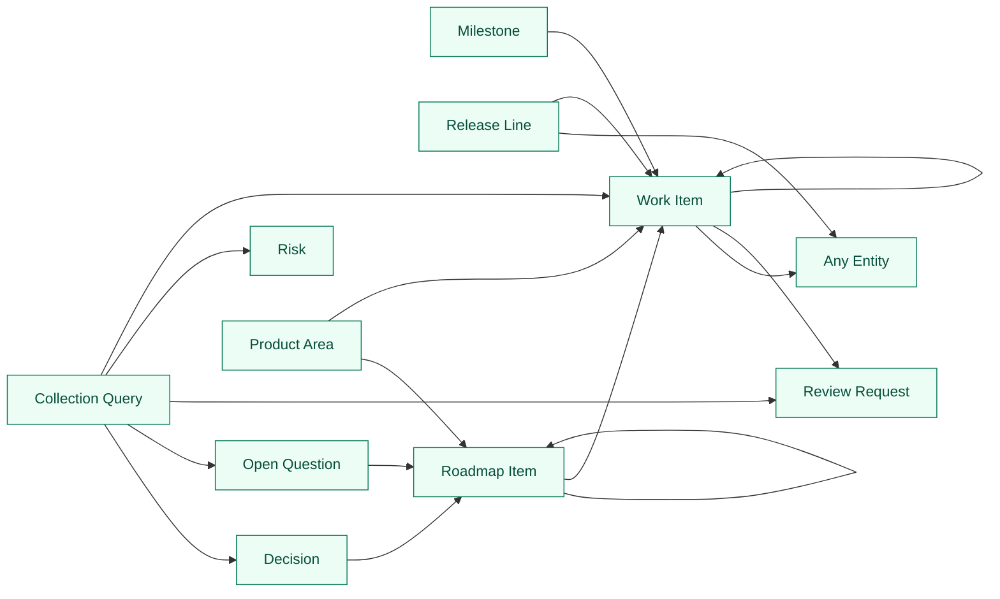

# Project State Kit

This kit defines a first-pass Cruxible state model for governed dev/project
operating state. It is for agent-assisted project work where future agents
need durable context about roadmap items, execution work, decisions,
risks, open questions, release placement, and dependency graphs.

One world instance represents one product or project operating state. The first
target use case is modeling Cruxible's own `docs/dev` state without turning the
docs themselves into graph entities.

Everything between `CRUXIBLE:BEGIN` / `CRUXIBLE:END` markers is regenerated
from `config.yaml` by `cruxible config-views`; treat those blocks as code-owned
structural truth.

## Scope

This kit is for answering questions such as:

- What work is planned, blocked, deferred, or release-critical?
- Which decisions affect an area, capability, roadmap item, or work item?
- Which risks or open questions block roadmap items or work items?
- Which roadmap items depend on other roadmap items landing first?
- Which work items depend on other work items landing first?
- Which work items mitigate risks or answer open questions?
- Which decisions answer open questions?
- Which decisions have been superseded?
- What should an agent inspect before changing a subsystem, capability, roadmap
  item, or work item?

This kit is not for storing generic memory, raw source archives, full document
corpora, chat transcripts, review reports, source-code sections, customer
records, marketing context, telemetry events, or support tickets. Those inputs
should feed proposed entities and relationships through evidence references.

## Concept Boundaries

`ProductArea` is a stable product or project surface, subsystem, or
responsibility area.

`Capability` is a durable technical or product ability the project supports.
Capabilities should outlive a single release or ticket.

`RoadmapItem` is a planned investment, initiative, or roadmap-level change.
It is broader than execution work and can be implemented by multiple work
items.

`WorkItem` is an execution-level task, issue, bug, cleanup, research item, doc
item, or test item.

`Decision` is a durable decision agents must reason about over time. It
has lifecycle state, can supersede earlier decisions, and can constrain future
work.

`Risk` is a durable blocker or concern that can attach to areas, roadmap items,
or work items.

`OpenQuestion` is an unanswered project question that can block decisions,
roadmap items, or work items until a decision or work item answers it.

Markdown docs, plans, chats, review reports, source sections, and issue threads
are source evidence for claims. They are not entities in this kit.

## Review Loop Convention

`ReviewRequest.summary` is implementer-owned evidence: scope, commit IDs,
verification, known failures, and review context. Reviewers should leave that
summary intact and write requested changes, approval notes, or reviewer-facing
follow-up context in `ReviewRequest.review_notes`.

New code-change ReviewRequests should also set structured change references:
`change_repo` is the repository being reviewed, `change_base` is the base
commit for the reviewed diff, and `change_head` is the exact reviewed head
commit. These fields are optional so historical ReviewRequests and non-code
reviews remain valid, but new implementation RRs should not rely on prose-only
commit references.

## Entity Groups

Dev/project state:

- `ProductArea`
- `Capability`
- `RoadmapItem`
- `ReleaseLine`
- `Milestone`
- `WorkItem`
- `Decision`
- `Risk`
- `OpenQuestion`

## Ontology Map

Entity types and relationships, color-coded by layer. Solid blue lines are
deterministic/source-backed state. Dashed red lines are governed
proposal/review relationships.

```mermaid
flowchart LR
  classDef canonicalEntity fill:#4a90d9,stroke:#2c5f8a,color:#fff
  classDef governedEntity fill:#e67e22,stroke:#a0521c,color:#fff

  entity_Capability["Capability"]
  entity_Decision["Decision"]
  entity_Milestone["Milestone"]
  entity_OpenQuestion["Open Question"]
  entity_ProductArea["Product Area"]
  entity_ReleaseLine["Release Line"]
  entity_ReviewRequest["Review Request"]
  entity_Risk["Risk"]
  entity_RoadmapItem["Roadmap Item"]
  entity_WorkItem["Work Item"]
  class entity_Capability,entity_Milestone,entity_ProductArea,entity_ReleaseLine,entity_ReviewRequest,entity_RoadmapItem,entity_WorkItem canonicalEntity
  class entity_Decision,entity_OpenQuestion,entity_Risk governedEntity

  %% Deterministic canonical relationships
  entity_Capability -- "Capability In Area" --> entity_ProductArea
  entity_Milestone -- "Milestone In Release" --> entity_ReleaseLine
  entity_ReviewRequest -- "Review Request For Work Item" --> entity_WorkItem
  entity_ReviewRequest -- "Review Request In Milestone" --> entity_Milestone
  entity_ReviewRequest -- "Review Request In Release" --> entity_ReleaseLine
  entity_RoadmapItem -- "Roadmap Item In Milestone" --> entity_Milestone
  entity_RoadmapItem -- "Roadmap Item In Release" --> entity_ReleaseLine
  entity_RoadmapItem -- "Roadmap Item Targets Area" --> entity_ProductArea
  entity_RoadmapItem -- "Roadmap Item Targets Capability" --> entity_Capability
  entity_WorkItem -- "Work Item Implements Roadmap Item" --> entity_RoadmapItem
  entity_WorkItem -- "Work Item In Milestone" --> entity_Milestone
  entity_WorkItem -- "Work Item In Release" --> entity_ReleaseLine
  entity_WorkItem -- "Work Item Part Of Work Item" --> entity_WorkItem
  entity_WorkItem -- "Work Item Spawned From Work Item" --> entity_WorkItem
  entity_WorkItem -- "Work Item Targets Area" --> entity_ProductArea

  %% Governed proposal/review relationships
  entity_Decision -. "Decision Affects Area" .-> entity_ProductArea
  entity_Decision -. "Decision Affects Capability" .-> entity_Capability
  entity_Decision -. "Decision Affects Roadmap Item" .-> entity_RoadmapItem
  entity_Decision -. "Decision Answers Open Question" .-> entity_OpenQuestion
  entity_Decision -. "Decision Constrains Work Item" .-> entity_WorkItem
  entity_Decision -. "Decision Supersedes Decision" .-> entity_Decision
  entity_OpenQuestion -. "Open Question Blocks Decision" .-> entity_Decision
  entity_OpenQuestion -. "Open Question Blocks Roadmap Item" .-> entity_RoadmapItem
  entity_OpenQuestion -. "Open Question Blocks Work Item" .-> entity_WorkItem
  entity_Risk -. "Risk Attaches To Area" .-> entity_ProductArea
  entity_Risk -. "Risk Blocks Roadmap Item" .-> entity_RoadmapItem
  entity_Risk -. "Risk Blocks Work Item" .-> entity_WorkItem
  entity_RoadmapItem -. "Roadmap Item Depends On Roadmap Item" .-> entity_RoadmapItem
  entity_WorkItem -. "Work Item Answers Open Question" .-> entity_OpenQuestion
  entity_WorkItem -. "Work Item Depends On Work Item" .-> entity_WorkItem
  entity_WorkItem -. "Work Item Mitigates Risk" .-> entity_Risk
  linkStyle 0,1,2,3,4,5,6,7,8,9,10,11,12,13,14 stroke:#2c5f8a,stroke-width:2px
  linkStyle 15,16,17,18,19,20,21,22,23,24,25,26,27,28,29,30 stroke:#e74c3c,stroke-width:2px
```

<!-- CRUXIBLE:BEGIN ontology -->

<!-- CRUXIBLE:END ontology -->

## Relationship Groups

Deterministic or source-backed relationships describe structure that can be
imported or asserted directly: release and milestone membership, roadmap/work
breakdown, and area/capability targeting.

Governed relationships represent interpretation that should be proposed,
reviewed, and retained as decision state: decisions affecting planning surfaces,
decisions constraining work, decision supersession, roadmap and work-item
dependencies, risk mitigation, questions answered by decisions or work, and
risks or open questions blocking work.

Relationship-specific basis fields such as `impact_basis`, `constraint_basis`,
`supersession_basis`, `dependency_basis`, `mitigation_basis`, `answer_basis`,
and `blocking_basis` are short domain explanations for the judgment represented
by that relationship. They are not generic provenance fields and should not be
used as a dump for source material.

## Workflow Summary

Workflows are intentionally not implemented in this first pass. When providers
and proposal workflows are added, the generated blocks below become the
code-owned workflow review surface.

<!-- CRUXIBLE:BEGIN workflow-pipeline -->
```mermaid
flowchart LR
  classDef canonicalWorkflow fill:#4a90d9,stroke:#2c5f8a,color:#fff
  classDef governedWorkflow fill:#e67e22,stroke:#a0521c,color:#fff

```
<!-- CRUXIBLE:END workflow-pipeline -->

<!-- CRUXIBLE:BEGIN workflow-summary -->

<!-- CRUXIBLE:END workflow-summary -->

## Governed Relationships

Governed relationships have `proposal_policy` blocks and signal sources that
describe the evidence or judgment required before project state compounds.

<!-- CRUXIBLE:BEGIN governance-table -->
| Relationship | Scope | Creation Path | Signals | Auto-resolve Gate | Review Policy | Feedback | Outcomes |
| --- | --- | --- | --- | --- | --- | --- | --- |
| Decision Affects Area | Decision -> Product Area | Agent/manual group propose | Maintainer Judgment, Source Evidence | All Support; prior trust: Trusted Only | Trust-gated auto-resolve | - | - |
| Decision Affects Capability | Decision -> Capability | Agent/manual group propose | Maintainer Judgment, Source Evidence | All Support; prior trust: Trusted Only | Trust-gated auto-resolve | - | - |
| Decision Affects Roadmap Item | Decision -> Roadmap Item | Agent/manual group propose | Maintainer Judgment, Source Evidence | All Support; prior trust: Trusted Only | Trust-gated auto-resolve | - | - |
| Decision Answers Open Question | Decision -> Open Question | Agent/manual group propose | Maintainer Judgment, Source Evidence | All Support; prior trust: Trusted Only | Trust-gated auto-resolve | - | - |
| Decision Constrains Work Item | Decision -> Work Item | Agent/manual group propose | Maintainer Judgment, Source Evidence | All Support; prior trust: Trusted Only | Trust-gated auto-resolve | - | - |
| Decision Supersedes Decision | Decision -> Decision | Agent/manual group propose | Maintainer Judgment, Source Evidence | All Support; prior trust: Trusted Only | Trust-gated auto-resolve | - | - |
| Open Question Blocks Decision | Open Question -> Decision | Agent/manual group propose | Maintainer Judgment, Source Evidence | All Support; prior trust: Trusted Only | Trust-gated auto-resolve | - | - |
| Open Question Blocks Roadmap Item | Open Question -> Roadmap Item | Agent/manual group propose | Maintainer Judgment, Source Evidence | All Support; prior trust: Trusted Only | Trust-gated auto-resolve | - | - |
| Open Question Blocks Work Item | Open Question -> Work Item | Agent/manual group propose | Maintainer Judgment, Source Evidence | All Support; prior trust: Trusted Only | Trust-gated auto-resolve | - | - |
| Risk Attaches To Area | Risk -> Product Area | Agent/manual group propose | Maintainer Judgment, Source Evidence | All Support; prior trust: Trusted Only | Trust-gated auto-resolve | - | - |
| Risk Blocks Roadmap Item | Risk -> Roadmap Item | Agent/manual group propose | Maintainer Judgment, Source Evidence | All Support; prior trust: Trusted Only | Trust-gated auto-resolve | - | - |
| Risk Blocks Work Item | Risk -> Work Item | Agent/manual group propose | Maintainer Judgment, Source Evidence | All Support; prior trust: Trusted Only | Trust-gated auto-resolve | - | - |
| Roadmap Item Depends On Roadmap Item | Roadmap Item -> Roadmap Item | Agent/manual group propose | Maintainer Judgment, Source Evidence | All Support; prior trust: Trusted Only | Trust-gated auto-resolve | - | - |
| Work Item Answers Open Question | Work Item -> Open Question | Agent/manual group propose | Maintainer Judgment, Source Evidence | All Support; prior trust: Trusted Only | Trust-gated auto-resolve | - | - |
| Work Item Depends On Work Item | Work Item -> Work Item | Agent/manual group propose | Maintainer Judgment, Source Evidence | All Support; prior trust: Trusted Only | Trust-gated auto-resolve | - | - |
| Work Item Mitigates Risk | Work Item -> Risk | Agent/manual group propose | Maintainer Judgment, Source Evidence | All Support; prior trust: Trusted Only | Trust-gated auto-resolve | - | - |
<!-- CRUXIBLE:END governance-table -->

## Signal Policy Notes

This catalog is generated from relationship-local signal policy and the
governed relationships that consume each signal source.

<!-- CRUXIBLE:BEGIN signal-policy-catalog -->
| Signal Source | Role | Review Unsure | Used By | Notes |
| --- | --- | --- | --- | --- |
| `maintainer_judgment` | advisory | yes | Decision Affects Area, Decision Affects Capability, Decision Affects Roadmap Item, Decision Answers Open Question, Decision Constrains Work Item, Decision Supersedes Decision, Open Question Blocks Decision, Open Question Blocks Roadmap Item, Open Question Blocks Work Item, Risk Attaches To Area, Risk Blocks Roadmap Item, Risk Blocks Work Item, Roadmap Item Depends On Roadmap Item, Work Item Answers Open Question, Work Item Depends On Work Item, Work Item Mitigates Risk | - |
| `source_evidence` | required | yes | Decision Affects Area, Decision Affects Capability, Decision Affects Roadmap Item, Decision Answers Open Question, Decision Constrains Work Item, Decision Supersedes Decision, Open Question Blocks Decision, Open Question Blocks Roadmap Item, Open Question Blocks Work Item, Risk Attaches To Area, Risk Blocks Roadmap Item, Risk Blocks Work Item, Roadmap Item Depends On Roadmap Item, Work Item Answers Open Question, Work Item Depends On Work Item, Work Item Mitigates Risk | - |
<!-- CRUXIBLE:END signal-policy-catalog -->

## Why Decisions Are Entities

`Decision` is first-class because future agents need to inspect decision
lifecycle, supersession, ownership, and impact before changing work. A decision
is not just a paragraph in a document once downstream work depends on it.

## Evidence Rule

Markdown docs, source sections, chat excerpts, implementation prompts, review
reports, issue comments, and similar artifacts should appear later as evidence
refs attached to proposed entities or relationships, not as required ontology
entities.

Rule of thumb:

- If future agents need to reason about lifecycle, status, supersession,
  ownership, or impact, model it as an entity.
- If future agents only need to know where a claim came from, keep it as
  evidence.

Example evidence ref shape for a future provider or proposal workflow:

```json
{
  "source": "markdown_doc",
  "source_record_id": "docs/roadmap.md#release-readiness",
  "label": "Roadmap / Release Readiness",
  "metadata": {
    "path": "docs/roadmap.md",
    "heading": "Release Readiness"
  }
}
```

Generic evidence should live in proposal metadata, relationship metadata, or
provider output records when those surfaces are added. It should not become a
required `SourceDocument`, `PromptArtifact`, `ReviewReport`, or `ChatExcerpt`
entity in this first pass.

## Query Surfaces

The named queries are intentionally narrow:

- `roadmap_item_context` starts from a roadmap item and returns upstream
  dependencies with downstream dependents, release/milestone, work, decision,
  risk, question, area, and capability context.
- `work_item_change_context` starts from a work item and returns its roadmap
  item with release/milestone, upstream and downstream work dependencies,
  constraining decisions, risks, questions, and area context.
- `area_change_context` starts from a product area and returns roadmap items
  with work, decisions, risks, questions, and capabilities for subsystem edits.
- `release_readiness_context` starts from a release line and returns work items
  with roadmap, milestone, dependency, decision, risk, and question context.
- `decision_impact_context` starts from a decision and returns
  constrained work with affected roadmap, area, capability, answered-question,
  and supersession context.
- `open_question_context` starts from an open question and returns blocked work
  with blocked roadmap/decision context plus answering decisions and work.

Separate collection queries expose focused queues for blocked work, active
risks, open questions needing review, and superseded decisions.

## Query Map

Named queries are graph-native read surfaces for agents and downstream planning
tools.

<!-- CRUXIBLE:BEGIN query-map -->

<!-- CRUXIBLE:END query-map -->

## Query Catalog

Use the generated catalog to inspect query entry points, returns, traversal
paths, and intended purpose.

<!-- CRUXIBLE:BEGIN query-catalog -->
### Collection Query

| Query | Mode | Returns | State | Traversal | Purpose |
| --- | --- | --- | --- | --- | --- |
| Active Risks | collection | Risk | live |  | Active project risks. |
| Blocked Work Items | collection | Work Item | live |  | Work queue of blocked execution-level work items. |
| Changes Requested Reviews | collection | Review Request | live |  | Review requests sent back with changes requested. |
| Open Questions For Owner | collection | Open Question | reviewable |  | Planned or active open questions owned by a person, with the decisions and work items they block. |
| Open Questions Needing Review | collection | Open Question | live |  | Active open questions that should be reviewed before dependent work proceeds. |
| Review Queue | collection | Review Request | live |  | Open review requests awaiting review. |
| Superseded Decisions | collection | Decision | live |  | Decisions whose status indicates they have been superseded. |
| Work Items For Owner | collection | Work Item | reviewable |  | Owner-scoped open work queue with dependency, blocker, and latest review status context. |

### Decision

| Query | Mode | Returns | State | Traversal | Purpose |
| --- | --- | --- | --- | --- | --- |
| Decision Impact Context | traversal | Roadmap Item | reviewable | Decision Affects Roadmap Item \| Decision Constrains Work Item \| Decision Affects Capability \| Decision Affects Area \| Decision Answers Open Question \| Decision Supersedes Decision (Outgoing) | Starting from a decision, inspect affected roadmap, constrained work, answered questions, and supersession context. |

### Milestone

| Query | Mode | Returns | State | Traversal | Purpose |
| --- | --- | --- | --- | --- | --- |
| Milestone Work Items | traversal | Work Item | live | Work Item In Milestone \| Roadmap Item In Milestone \| Work Item Implements Roadmap Item (Incoming, depth=2) | Work items reachable from a milestone directly or through roadmap items in the milestone. |

### Open Question

| Query | Mode | Returns | State | Traversal | Purpose |
| --- | --- | --- | --- | --- | --- |
| Open Question Context | traversal | Roadmap Item | reviewable | Open Question Blocks Roadmap Item \| Open Question Blocks Work Item \| Open Question Blocks Decision (Outgoing) | Starting from an open question, inspect blocked and answered roadmap, work, and decision context. |

### Product Area

| Query | Mode | Returns | State | Traversal | Purpose |
| --- | --- | --- | --- | --- | --- |
| Area Change Context | traversal | Roadmap Item | reviewable | Roadmap Item Targets Area (Incoming) | Starting from a product area, inspect roadmap items, work, decisions, risks, and open questions before editing the subsystem. |
| Area Work Items | traversal | Work Item | live | Work Item Targets Area \| Roadmap Item Targets Area \| Capability In Area \| Roadmap Item Targets Capability \| Work Item Implements Roadmap Item (Incoming, depth=3) | Work items reachable from a product area directly, through capabilities, or through roadmap items. |
| Work Items For Area | traversal | Work Item | live | Work Item Targets Area (Incoming) | Flat work items attached to a product area for agents that need a scannable area work queue. |

### Release Line

| Query | Mode | Returns | State | Traversal | Purpose |
| --- | --- | --- | --- | --- | --- |
| Deferred Release Gating Work Items | traversal | Work Item | reviewable | Work Item In Release (Incoming) | Deferred work items that are still attached to a release line and an active, planned, or blocked milestone. |
| Release Readiness Context | traversal | Any Entity | reviewable | Work Item In Release \| Roadmap Item In Release (Incoming) | Starting from a release line, inspect active, planned, or blocked work plus roadmap items, including roadmap items that have not yet been decomposed into work. |
| Release Work Items | traversal | Work Item | live | Work Item In Release \| Milestone In Release \| Roadmap Item In Release \| Work Item In Milestone \| Roadmap Item In Milestone \| Work Item Implements Roadmap Item (Incoming, depth=3) | Work items reachable from a release line directly, through release milestones, or through release roadmap items. |

### Roadmap Item

| Query | Mode | Returns | State | Traversal | Purpose |
| --- | --- | --- | --- | --- | --- |
| Roadmap Item Context | traversal | Roadmap Item | reviewable | Roadmap Item Depends On Roadmap Item (Outgoing) | Starting from a roadmap item, inspect dependencies, dependents, delivery placement, work, decisions, risks, and open questions. |
| Roadmap Item Work Items | traversal | Work Item | live | Work Item Implements Roadmap Item (Incoming) | Work items that implement a roadmap item. |

### Work Item

| Query | Mode | Returns | State | Traversal | Purpose |
| --- | --- | --- | --- | --- | --- |
| Approved Reviews For Work Item | traversal | Review Request | reviewable | Review Request For Work Item (Incoming) | Approved review requests reviewing a specific work item. Used by the work_item_closed_requires_approved_review mutation guard as the closed-transition condition. |
| Work Item Change Context | traversal | Any Entity | reviewable | Work Item Implements Roadmap Item \| Work Item Targets Area \| Work Item In Release \| Work Item In Milestone \| Work Item Depends On Work Item \| Work Item Part Of Work Item \| Work Item Spawned From Work Item \| Work Item Mitigates Risk \| Work Item Answers Open Question \| Decision Constrains Work Item \| Risk Blocks Work Item \| Open Question Blocks Work Item (Both) | Starting from a work item, inspect product area, roadmap, release, milestone, upstream and downstream work, constraining decisions, risks, and open questions. |
| Work Item Lineage Context | traversal | Work Item | live | Work Item Spawned From Work Item (Incoming, depth=5) | Follow-up work items spawned from a work item, excluding dependency sequencing. |
| Work Item Rollup Context | traversal | Work Item | live | Work Item Part Of Work Item (Incoming, depth=5) | Child and descendant work items under a parent work item. |
<!-- CRUXIBLE:END query-catalog -->

## Quality Rules

Quality checks are intentionally light warnings. They protect the useful shape
of project state without making early adoption brittle: roadmap and work items
should be grounded in areas, dependency/blocker edges should carry short basis
fields, decision impacts should identify the impact type, and supersession
edges should explain the supersession basis.

<!-- CRUXIBLE:BEGIN quality-rules -->
### Constraints

No configured constraints.

### Quality Checks

| Name | Kind | Target | Severity | Rule |
| --- | --- | --- | --- | --- |
| `decision_roadmap_impacts_have_type` | Property | Decision Affects Roadmap Item.impact_type | Warning | Required |
| `decision_supersessions_have_basis` | Property | Decision Supersedes Decision.supersession_basis | Warning | Non Empty |
| `decision_work_constraints_have_type` | Property | Decision Constrains Work Item.impact_type | Warning | Required |
| `deferred_release_work_not_gating_0_2` | Named Query Result Count | Named query `deferred_release_gating_work_items` | Error | max `0` |
| `open_question_work_blockers_have_basis` | Property | Open Question Blocks Work Item.blocking_basis | Warning | Non Empty |
| `review_requests_review_a_work_item` | Cardinality | Review Request -> Review Request For Work Item (out) | Warning | min `1` |
| `risk_work_blockers_have_basis` | Property | Risk Blocks Work Item.blocking_basis | Warning | Non Empty |
| `roadmap_dependencies_have_basis` | Property | Roadmap Item Depends On Roadmap Item.dependency_basis | Warning | Non Empty |
| `roadmap_items_target_area` | Cardinality | Roadmap Item -> Roadmap Item Targets Area (out) | Warning | min `1` |
| `work_dependencies_have_basis` | Property | Work Item Depends On Work Item.dependency_basis | Warning | Non Empty |
| `work_item_part_of_single_parent` | Cardinality | Work Item -> Work Item Part Of Work Item (out) | Warning | max `1` |
| `work_item_spawned_from_single_origin` | Cardinality | Work Item -> Work Item Spawned From Work Item (out) | Warning | max `1` |
| `work_items_target_area` | Cardinality | Work Item -> Work Item Targets Area (out) | Warning | min `1` |
<!-- CRUXIBLE:END quality-rules -->

## Learning Loops

Feedback and outcome profiles can be added after proposal workflows exist.

<!-- CRUXIBLE:BEGIN learning-loops -->
### Feedback Profiles (Loop 1)

No configured feedback profiles.

### Outcome Profiles (Loop 2)

#### Resolution-Anchored

No configured resolution-anchored outcome profiles.

#### Receipt-Anchored

No configured receipt-anchored outcome profiles.
<!-- CRUXIBLE:END learning-loops -->

## Next Passes

- Use direct agent group proposals against Cruxible `docs/dev` and attach
  source evidence refs.
- Add examples or seed proposals only after the first manual docs/dev pass.
- Consider status-filtered or OR-shaped quality checks if the quality-check DSL
  grows predicate support.
- Add proposal workflows only after the direct proposal path proves the shape.
- Split business, customer, and marketing state into separate composable kits
  when project-state hard state is working.
