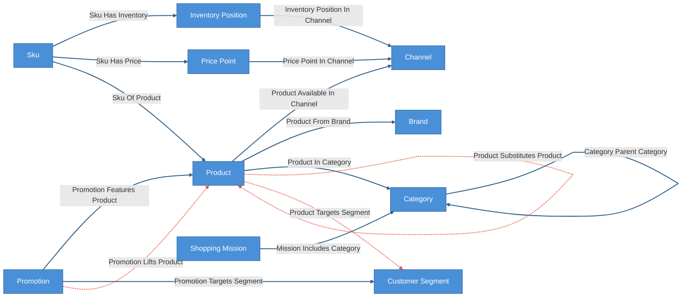
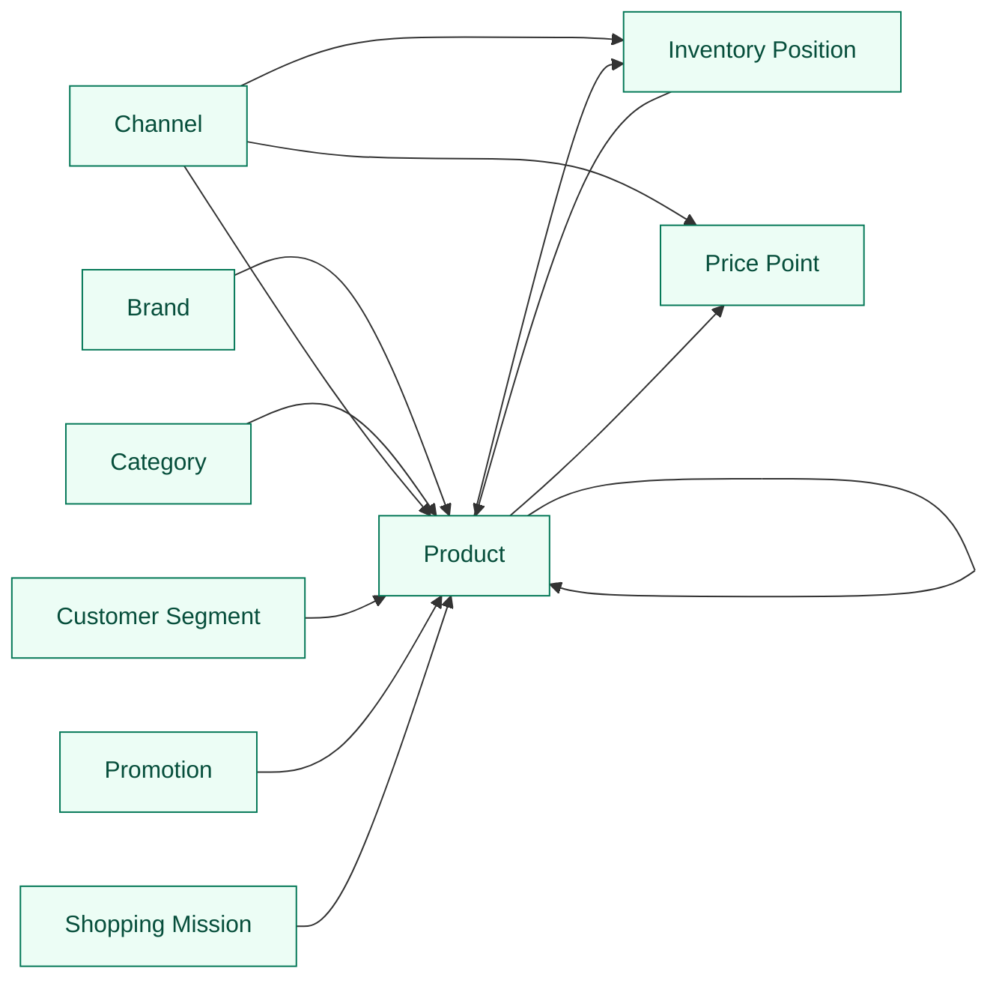

# Retail Catalog Demo

Single-layer Cruxible world model for retail catalog intelligence and
merchandising decision state. The kit is not trying to be the product
information manager, search index, pricing engine, or promotion optimizer. It
gives an agent a governed graph of the catalog judgments that downstream
planning workflows should not treat as raw memory: complements, substitutes,
cannibalization, customer-segment fit, and promotion lift.

The canonical layer is intentionally practical: products, SKUs, brands,
categories, channels, prices, inventory snapshots, promotions, customer
segments, and shopping missions. The governed layer captures commercial
judgments that should compound through review and outcome feedback:

`catalog state -> product relationships -> promotion, bundle, substitution, and targeting context`

The usage story is:

> A merchant or agent registers catalog state. Candidate commercial
> relationships are proposed from basket behavior, catalog attributes, search
> behavior, demand displacement, promotion results, and merchant review. Accepted
> judgments become reusable decision state for downstream planners and later
> outcomes calibrate which signals deserve trust.

Everything between `CRUXIBLE:BEGIN` / `CRUXIBLE:END` markers is regenerated
from `config.yaml` by `cruxible config-views`; treat those blocks as code-owned
structural truth. Everything outside those marker blocks is authored explanation
for humans and agents reading the kit.

## Modeling Notes

This first pass intentionally stops at the world-model surface. Providers,
workflow implementations, seed data, and downstream consumers can come later
once the ontology and query surface feel right. The important early choice is
that product relationships are not all the same kind of fact:

- `product_complements_product` is a useful pairing or bundle judgment.
- `product_substitutes_product` is a semantic and commercial replacement
  judgment.
- `product_cannibalizes_product` is an observed or forecasted demand
  displacement judgment.

Those three edges may connect the same two products, but they mean different
things downstream. A substitute can be useful during a stockout; a cannibalizer
may be dangerous during a promotion; a complement may be the right object for a
bundle or recommendation surface.

## Ontology Map

Entity types and relationships, color-coded by layer. Solid blue lines are
deterministic canonical state. Dashed red lines are governed proposal/review
relationships.

<!-- CRUXIBLE:BEGIN ontology -->

<!-- CRUXIBLE:END ontology -->

**Legend:** Blue = canonical/deterministic catalog state | Orange = governed
commercial judgment surface | Solid blue lines = deterministic | Dashed red
lines = governed proposal/review.

## Workflow Summary

Workflows are intentionally not implemented in this first pass. The likely
starting workflow set is:

- propose complements from basket affinity, catalog semantics, and merchant
  review.
- propose substitutes from attribute similarity, category/price overlap, search
  switching behavior, and merchant review.
- propose cannibalization from demand displacement, assortment/promotion
  context, similarity checks, and merchant review.
- propose segment fit and promotion lift once campaign and performance data are
  wired in.

When workflows are added, the generated pipeline and stage summaries below will
become the canonical review surface.

<!-- CRUXIBLE:BEGIN workflow-pipeline -->
```mermaid
flowchart LR
  classDef canonicalWorkflow fill:#4a90d9,stroke:#2c5f8a,color:#fff
  classDef governedWorkflow fill:#e67e22,stroke:#a0521c,color:#fff

```
<!-- CRUXIBLE:END workflow-pipeline -->

<!-- CRUXIBLE:BEGIN workflow-summary -->

<!-- CRUXIBLE:END workflow-summary -->

## Governed Relationships

Each governed relationship has a `proposal_policy` block and signal sources that provide
signals, and linked feedback/outcome profiles for the Loop 1/2 flywheel.

<!-- CRUXIBLE:BEGIN governance-table -->
| Relationship | Scope | Creation Path | Signals | Auto-resolve Gate | Review Policy | Feedback | Outcomes |
| --- | --- | --- | --- | --- | --- | --- | --- |
| Product Cannibalizes Product | Product -> Product | Agent/manual group propose | Catalog Attribute Similarity, Category Price Overlap, Demand Displacement Model, Merchant Review | All Support; prior trust: Trusted Only | Trust-gated auto-resolve | 4 reason codes | Cannibalization Resolution |
| Product Complements Product | Product -> Product | Agent/manual group propose | Basket Affinity, Catalog Complement Classifier, Merchant Review | All Support; prior trust: Trusted Only | Trust-gated auto-resolve | 3 reason codes | Complement Resolution |
| Product Substitutes Product | Product -> Product | Agent/manual group propose | Catalog Attribute Similarity, Category Price Overlap, Merchant Review, Search Substitution Behavior | All Support; prior trust: Trusted Only | Trust-gated auto-resolve | 4 reason codes | Substitute Resolution |
| Product Targets Segment | Product -> Customer Segment | Agent/manual group propose | Merchant Review, Segment Fit Model | All Support; prior trust: Trusted Only | Trust-gated auto-resolve | 3 reason codes | Segment Fit Resolution |
| Promotion Lifts Product | Promotion -> Product | Agent/manual group propose | Inventory Capacity Check, Merchant Review, Promo Performance Model | All Support; prior trust: Trusted Only | Trust-gated auto-resolve | 3 reason codes | Promotion Lift Resolution |
<!-- CRUXIBLE:END governance-table -->

### Signal Policy Notes

This catalog is generated from relationship-local signal policy and the
governed relationships that consume each signal source.

<!-- CRUXIBLE:BEGIN signal-policy-catalog -->
| Signal Source | Role | Review Unsure | Used By | Notes |
| --- | --- | --- | --- | --- |
| `basket_affinity` | required | yes | Product Complements Product | - |
| `catalog_attribute_similarity` | required | yes | Product Cannibalizes Product, Product Substitutes Product | - |
| `catalog_complement_classifier` | advisory | yes | Product Complements Product | - |
| `category_price_overlap` | required | yes | Product Cannibalizes Product, Product Substitutes Product | - |
| `demand_displacement_model` | required | yes | Product Cannibalizes Product | - |
| `inventory_capacity_check` | advisory | yes | Promotion Lifts Product | - |
| `merchant_review` | advisory | yes | Product Cannibalizes Product, Product Complements Product, Product Substitutes Product, Product Targets Segment, Promotion Lifts Product | - |
| `promo_performance_model` | required | yes | Promotion Lifts Product | - |
| `search_substitution_behavior` | advisory | yes | Product Substitutes Product | - |
| `segment_fit_model` | required | yes | Product Targets Segment | - |
<!-- CRUXIBLE:END signal-policy-catalog -->

## Query Map

Named queries are graph-native read surfaces for agents and downstream planning
tools. The map intentionally shows only entity-to-entity affordances; query
names and traversal details live in the catalog below.

<!-- CRUXIBLE:BEGIN query-map -->

<!-- CRUXIBLE:END query-map -->

## Query Catalog

Use the catalog to understand what questions this kit exposes. Composition,
ranking, and operator summaries should happen in the agent harness or downstream
planner, not by turning every useful view into a governed relationship.

<!-- CRUXIBLE:BEGIN query-catalog -->
### Brand

| Query | Returns | Traversal | Purpose |
| --- | --- | --- | --- |
| Brand Substitute Risk | Product | Product From Brand (Incoming) -> Product Substitutes Product (Outgoing) | Starting from a brand, find substitute products that may compete with that brand's products. |

### Category

| Query | Returns | Traversal | Purpose |
| --- | --- | --- | --- |
| Category Substitute Map | Product | Product In Category (Incoming) -> Product Substitutes Product (Outgoing) | Starting from a category, find products in the category and their reviewed substitutes. |

### Channel

| Query | Returns | Traversal | Purpose |
| --- | --- | --- | --- |
| Channel Catalog Products | Product | Product Available In Channel (Incoming) | Starting from a channel, find products available in that channel. |
| Channel Inventory Positions | Inventory Position | Inventory Position In Channel (Incoming) | Starting from a channel, find inventory positions that apply to it. |
| Channel Price Points | Price Point | Price Point In Channel (Incoming) | Starting from a channel, find price points that apply to it. |

### Customer Segment

| Query | Returns | Traversal | Purpose |
| --- | --- | --- | --- |
| Segment Merchandising Candidates | Product | Product Targets Segment (Incoming) | Starting from a customer segment, find products reviewed as good merchandising fits for that segment. |
| Segment Promotion Products | Product | Promotion Targets Segment (Incoming) -> Promotion Features Product (Outgoing) | Starting from a customer segment, find products featured in promotions targeting that segment. |

### Inventory Position

| Query | Returns | Traversal | Purpose |
| --- | --- | --- | --- |
| Substitution Options For Inventory Gap | Product | Sku Has Inventory (Incoming) -> Sku Of Product (Outgoing) -> Product Substitutes Product (Outgoing) | Starting from an inventory position, find substitute products for the product represented by the constrained SKU. |

### Product

| Query | Returns | Traversal | Purpose |
| --- | --- | --- | --- |
| Cannibalization Risk For Product | Product | Product Cannibalizes Product (Outgoing) | Starting from a product, find products it is judged likely to cannibalize. |
| Product Bundle Candidates | Product | Product Complements Product (Outgoing) | Starting from a product, find reviewed complementary products for bundles, PDP modules, or cross-sell surfaces. |
| Product Inventory Positions | Inventory Position | Sku Of Product (Incoming) -> Sku Has Inventory (Outgoing) | Starting from a product, find its SKU inventory positions. |
| Product Price Points | Price Point | Sku Of Product (Incoming) -> Sku Has Price (Outgoing) | Starting from a product, find its SKU price points. |
| Products That Cannibalize Product | Product | Product Cannibalizes Product (Incoming) | Starting from a product, find products judged likely to cannibalize it. |
| Products That Complement Product | Product | Product Complements Product (Incoming) | Starting from a product, find reviewed products that complement it. |
| Products That Substitute For Product | Product | Product Substitutes Product (Incoming) | Starting from a product, find products reviewed as replacements for it. |
| Substitutes For Product | Product | Product Substitutes Product (Outgoing) | Starting from a product, find reviewed substitute products. |

### Promotion

| Query | Returns | Traversal | Purpose |
| --- | --- | --- | --- |
| Promotion Cannibalization Risk | Product | Promotion Features Product (Outgoing) -> Product Cannibalizes Product (Outgoing) | Starting from a promotion, find products likely to lose demand because the promotion features cannibalizing products. |
| Promotion Lift Watch | Product | Promotion Lifts Product (Outgoing) | Starting from a promotion, find products judged to receive material lift from the promotion. |

### Shopping Mission

| Query | Returns | Traversal | Purpose |
| --- | --- | --- | --- |
| Complements For Shopping Mission | Product | Mission Includes Category (Outgoing) -> Product In Category (Incoming) -> Product Complements Product (Outgoing) | Starting from a shopping mission, find products connected through mission categories and reviewed complement edges. |
<!-- CRUXIBLE:END query-catalog -->

## Schema Reference

This README keeps schema detail at the diagram and table level so the kit
remains usable as a drafting surface. The config remains the source of truth
for full entity, relationship, and contract properties. For a generated
Markdown schema catalog, run:

```bash
uv run cruxible config-views --config kits/retail-catalog/config.yaml --runtime --view schema-catalog
```

When the kit is loaded into a local instance, generate navigable reference
pages under `wiki/reference/` with:

```bash
uv run cruxible render-wiki --output wiki --scope local
```


## Compounding Knowledge Procedure

1. Register the canonical catalog state: products, SKUs, brands, categories,
   channels, prices, inventory snapshots, promotions, segments, and shopping
   missions.
2. Propose governed product relationships from multiple signals instead of a
   single provider: behavior, structured attributes, semantic catalog context,
   promotion results, displacement models, and merchant review.
3. Review proposal groups until the grouping logic is stable enough that the
   agent can explain why each candidate belongs together, which signals matter,
   and which unresolved cases need human attention.
4. Resolve accepted commercial judgments into the graph so downstream agents can
   ask bounded questions like "what substitutes are safe during this stockout?"
   or "what products could this promotion cannibalize?"
5. Feed later outcomes back into Loop 2: attach-rate, substitution success,
   margin loss, displacement, campaign performance, and merchant overrides.
6. Use Loop 1 and Loop 2 feedback to improve providers, constraints, review
   policies, and query surfaces without turning raw behavior into unreviewed
   decision state.

## Usage Stories

**Stockout substitution.** A product goes out of stock. The agent asks
`substitution_options_for_inventory_gap`, filters for available SKUs, and gives
the merchant a short list of reviewed alternatives with the reason each
substitute is acceptable.

**Bundle planning.** A merchant starts from a hero product and asks
`product_bundle_candidates`. The agent can distinguish true complements from
near substitutes, then explain whether bundle evidence came from basket
behavior, catalog semantics, or merchant review.

**Promotion risk.** A planned promotion features several products. The agent
asks `promotion_cannibalization_risk` to find products that may lose demand or
margin because the promoted products are too close.

**Segment merchandising.** A lifecycle or loyalty campaign targets a customer
segment. The agent asks `segment_merchandising_candidates` and uses reviewed
segment-fit edges instead of relying only on broad product taxonomy or vector
similarity.

## Rules And Learning Loops

These generated sections own the operational facts: constraints, quality
checks, feedback vocabularies, and outcome vocabularies. Authored prose should
explain how to use them, not restate the config.

<!-- CRUXIBLE:BEGIN quality-rules -->
### Constraints

No configured constraints.

### Quality Checks

| Name | Kind | Target | Severity | Rule |
| --- | --- | --- | --- | --- |
| `active_skus_have_price` | Cardinality | Sku -> Sku Has Price (out) | Warning | min `1` |
| `cannibalization_has_type` | Property | Product Cannibalizes Product.cannibalization_type | Error | Required |
| `complements_have_type` | Property | Product Complements Product.complement_type | Warning | Required |
| `inventory_positions_have_channel` | Cardinality | Inventory Position -> Inventory Position In Channel (out) | Warning | min `1` |
| `inventory_positions_have_sku` | Cardinality | Inventory Position -> Sku Has Inventory (in) | Warning | min `1` |
| `price_points_have_channel` | Cardinality | Price Point -> Price Point In Channel (out) | Warning | min `1` |
| `products_have_category` | Cardinality | Product -> Product In Category (out) | Warning | min `1` |
| `promotion_lift_has_type` | Property | Promotion Lifts Product.lift_type | Error | Required |
| `segment_targets_have_basis` | Property | Product Targets Segment.fit_basis | Warning | Required |
| `skus_have_product` | Cardinality | Sku -> Sku Of Product (out) | Error | min `1`, max `1` |
| `substitutes_have_type` | Property | Product Substitutes Product.substitute_type | Error | Required |
<!-- CRUXIBLE:END quality-rules -->

<!-- CRUXIBLE:BEGIN learning-loops -->
### Feedback Profiles (Loop 1)

#### `product_cannibalizes_product`
- Version: `1`
- Reason codes:
  - `no_observed_displacement` (`provider_fix`): Commercial evidence does not show demand displacement.
  - `promotion_confounder` (`decision_policy`): Apparent cannibalization was caused by another concurrent promotion or placement.
  - `stockout_confounder` (`constraint`): Apparent demand transfer was caused by stockout or availability effects.
  - `wrong_direction` (`provider_fix`): The demand displacement direction is reversed or reciprocal.
- Scope keys:
  - `cannibalization_type`: `EDGE.cannibalization_type`
  - `source_product`: `FROM.product_id`
  - `target_product`: `TO.product_id`

#### `product_complements_product`
- Version: `1`
- Reason codes:
  - `not_bought_together` (`provider_fix`): Basket evidence does not support this complement relationship.
  - `poor_bundle_economics` (`decision_policy`): Products are related but do not make a useful bundle or cross-sell action.
  - `seasonal_or_mission_only` (`decision_policy`): Complement relationship only applies in a narrower season or shopping mission.
- Scope keys:
  - `complement_type`: `EDGE.complement_type`
  - `source_product`: `FROM.product_id`
  - `target_product`: `TO.product_id`

#### `product_substitutes_product`
- Version: `1`
- Reason codes:
  - `brand_tier_mismatch` (`decision_policy`): Brand tier difference changes customer expectations enough to require narrower substitution.
  - `not_functionally_equivalent` (`provider_fix`): Products do not satisfy the same customer need.
  - `price_band_mismatch` (`constraint`): Products are too far apart in price or value tier to substitute cleanly.
  - `size_or_pack_mismatch` (`quality_check`): Size, quantity, pack, or unit basis makes the replacement misleading.
- Scope keys:
  - `source_product`: `FROM.product_id`
  - `substitute_type`: `EDGE.substitute_type`
  - `target_product`: `TO.product_id`

#### `product_targets_segment`
- Version: `1`
- Reason codes:
  - `seasonal_context_missing` (`constraint`): Segment fit depends on a seasonal or mission context not represented in the edge.
  - `segment_too_broad` (`decision_policy`): Segment is too broad for this targeting judgment.
  - `wrong_segment` (`provider_fix`): Product is not a good fit for this segment.
- Scope keys:
  - `fit_basis`: `EDGE.fit_basis`
  - `product`: `FROM.product_id`
  - `segment`: `TO.segment_id`

#### `promotion_lifts_product`
- Version: `1`
- Reason codes:
  - `inventory_constrained` (`quality_check`): Promotion lift was capped or distorted by inventory availability.
  - `margin_negative` (`decision_policy`): Promotion lifted units or revenue but harmed contribution margin.
  - `no_observed_lift` (`provider_fix`): Promotion did not materially lift the product.
- Scope keys:
  - `lift_type`: `EDGE.lift_type`
  - `product`: `TO.product_id`
  - `promotion`: `FROM.promotion_id`

### Outcome Profiles (Loop 2)

#### Resolution-Anchored

##### `cannibalization_resolution`
- Version: `1`
- Target: Relationship `product_cannibalizes_product`
- Outcome codes:
  - `displacement_confirmed` (`unknown`): Later sales or margin outcomes confirmed demand displacement.
  - `false_cannibalization` (`trust_adjustment`): Later outcomes showed the products did not materially cannibalize each other.
  - `missed_cannibalization` (`require_review`): A material cannibalization path was missed by the workflow or graph.
- Scope keys:
  - `relationship_type`: `RESOLUTION.relationship_type`

##### `complement_resolution`
- Version: `1`
- Target: Relationship `product_complements_product`
- Outcome codes:
  - `bundle_performed` (`unknown`): Later bundle, recommendation, or PDP placement performance confirmed the complement relationship.
  - `missed_complement` (`require_review`): A useful complement was missing from the reviewed graph.
  - `weak_attach_rate` (`trust_adjustment`): Later behavior showed weak attach rate or poor cross-sell performance.
- Scope keys:
  - `relationship_type`: `RESOLUTION.relationship_type`

##### `promotion_lift_resolution`
- Version: `1`
- Target: Relationship `promotion_lifts_product`
- Outcome codes:
  - `lift_confirmed` (`unknown`): Later promotion results confirmed product lift.
  - `lift_overstated` (`trust_adjustment`): Later promotion results showed lift was overstated.
  - `missed_lift` (`require_review`): A product with material lift was missed.
- Scope keys:
  - `relationship_type`: `RESOLUTION.relationship_type`

##### `segment_fit_resolution`
- Version: `1`
- Target: Relationship `product_targets_segment`
- Outcome codes:
  - `missed_segment_candidate` (`require_review`): A useful product for the segment was missing from the reviewed graph.
  - `segment_fit_confirmed` (`unknown`): Later merchandising or campaign behavior confirmed the segment fit.
  - `weak_segment_fit` (`trust_adjustment`): Later behavior showed the product was a weak fit for the segment.
- Scope keys:
  - `relationship_type`: `RESOLUTION.relationship_type`

##### `substitute_resolution`
- Version: `1`
- Target: Relationship `product_substitutes_product`
- Outcome codes:
  - `bad_replacement` (`trust_adjustment`): Later behavior or merchant review showed the substitute was misleading.
  - `missed_substitute` (`require_review`): A useful substitute was missing from the reviewed graph.
  - `substitution_succeeded` (`unknown`): Later out-of-stock, search, or recommendation behavior confirmed the substitute relationship.
- Scope keys:
  - `relationship_type`: `RESOLUTION.relationship_type`

#### Receipt-Anchored

##### `bundle_candidates_query`
- Version: `1`
- Target: Query `product_bundle_candidates`
- Outcome codes:
  - `missing_bundle_candidate` (`graph_fix`): Useful complement or bundle candidate was not returned.
  - `weak_bundle_candidate` (`graph_fix`): Query returned a weak complement or poor bundle candidate.
- Scope keys:
  - `query`: `SURFACE.name`

##### `promotion_cannibalization_query`
- Version: `1`
- Target: Query `promotion_cannibalization_risk`
- Outcome codes:
  - `missed_risk` (`graph_fix`): Query missed a product that later showed cannibalization risk.
  - `overstated_risk` (`graph_fix`): Query returned a cannibalization risk that did not materialize.
- Scope keys:
  - `query`: `SURFACE.name`

##### `substitution_options_query`
- Version: `1`
- Target: Query `substitutes_for_product`
- Outcome codes:
  - `bad_replacement_result` (`graph_fix`): Query returned products that were not acceptable replacements.
  - `missing_results` (`graph_fix`): Useful substitutes were not returned.
- Scope keys:
  - `query`: `SURFACE.name`
<!-- CRUXIBLE:END learning-loops -->

## Open Design Questions

- Should substitutes eventually be modeled at SKU level for availability and
  pack-size precision, or is Product-level substitution enough for the first
  downstream planners?
- Should cannibalization remain Product -> Product, or should later versions add
  a Promotion -> Product risk object for promotion-specific displacement?
- Which downstream consumer should come first: a substitution calculator, bundle
  planner, promotion risk reviewer, or segment merchandising assistant?
- How much merchant-authored taxonomy should be canonical versus proposed and
  reviewed as governed commercial judgment?

## Maintenance

Regenerate the generated sections after changing the config:

```bash
uv run cruxible config-views --config kits/retail-catalog/config.yaml --update-readme kits/retail-catalog/README.md
```

Validate the config:

```bash
uv run cruxible --server-url "" --server-socket "" validate --config kits/retail-catalog/config.yaml
```

## Status

First-pass config and README only. Provider implementations, workflow steps,
seed data, and downstream consumers are intentionally deferred until the kit
shape is reviewed alongside the other release kits.
