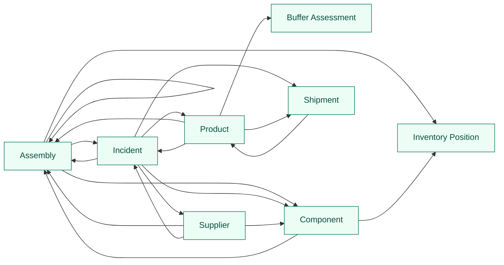

# Supply Chain Blast Radius Demo

> **Status: in_progress.** The ontology, governed
> relationships, named queries, and feedback/outcome loops are complete and
> validated. The data-ingest and assessment providers are placeholders that raise
> `NotImplementedError` — implement them or wire your own data before running the
> workflows.

Deterministic supply-chain state model that turns a supplier-side disruption into
a bounded, reviewable blast radius. The stable canonical backbone is suppliers,
components, assemblies, products, and shipments. Incidents arrive as governed
trigger state and cascade through staged proposal workflows:

`incident -> supplier -> component/direct assembly`

Product and shipment risk are derived context surfaces over accepted upstream
impacts, BOM structure, buffer assessments, and deterministic shipment state,
not direct incident-to-product or incident-to-shipment edges.

Governed edges are rule-centric: proposal bucket signatures carry `rule_id` and
`rule_version`, not `incident_id`, so trust accumulates on reusable cascade rules
across many incidents instead of starting fresh every time.

Everything between `CRUXIBLE:BEGIN` / `CRUXIBLE:END` markers is regenerated
from `config.yaml` by `cruxible config views`; treat those blocks as
code-owned structural truth. Everything outside those marker blocks is authored
explanation for humans and agents reading the kit.

## Ontology Map

Entity types and relationships, color-coded by layer. Solid blue lines are
deterministic canonical state. Dashed red lines are governed proposal/review
relationships.

```mermaid
flowchart LR
  classDef canonicalEntity fill:#4a90d9,stroke:#2c5f8a,color:#fff
  classDef governedEntity fill:#e67e22,stroke:#a0521c,color:#fff

  entity_Assembly["Assembly"]
  entity_BufferAssessment["Buffer Assessment"]
  entity_Component["Component"]
  entity_Incident["Incident"]
  entity_InventoryPosition["Inventory Position"]
  entity_Location["Location"]
  entity_Product["Product"]
  entity_Shipment["Shipment"]
  entity_Supplier["Supplier"]
  class entity_Assembly,entity_BufferAssessment,entity_Component,entity_InventoryPosition,entity_Location,entity_Product,entity_Shipment,entity_Supplier canonicalEntity
  class entity_Incident governedEntity

  %% Deterministic canonical relationships
  entity_Assembly -- "Assembly Buffer Assessment" --> entity_BufferAssessment
  entity_Assembly -- "Assembly Inventory Position" --> entity_InventoryPosition
  entity_Assembly -- "Assembly Part Of Assembly" --> entity_Assembly
  entity_Assembly -- "Assembly Part Of Product" --> entity_Product
  entity_BufferAssessment -- "Buffer Assessment Inventory" --> entity_InventoryPosition
  entity_Component -- "Component Buffer Assessment" --> entity_BufferAssessment
  entity_Component -- "Component Inventory Position" --> entity_InventoryPosition
  entity_Component -- "Component Part Of Assembly" --> entity_Assembly
  entity_InventoryPosition -- "Inventory Position Location" --> entity_Location
  entity_Product -- "Product Buffer Assessment" --> entity_BufferAssessment
  entity_Product -- "Product In Shipment" --> entity_Shipment
  entity_Product -- "Product Inventory Position" --> entity_InventoryPosition
  entity_Supplier -- "Supplier Supplies Assembly" --> entity_Assembly
  entity_Supplier -- "Supplier Supplies Component" --> entity_Component

  %% Governed proposal/review relationships
  entity_Incident -. "Incident Impacts Assembly" .-> entity_Assembly
  entity_Incident -. "Incident Impacts Component" .-> entity_Component
  entity_Incident -. "Incident Impacts Supplier" .-> entity_Supplier
  linkStyle 0,1,2,3,4,5,6,7,8,9,10,11,12,13 stroke:#2c5f8a,stroke-width:2px
  linkStyle 14,15,16 stroke:#e74c3c,stroke-width:2px
```

<!-- CRUXIBLE:BEGIN ontology -->

<!-- CRUXIBLE:END ontology -->

**Legend:** Blue = canonical/deterministic state | Orange = governed-only
trigger/judgment entity | Solid blue lines = deterministic | Dashed red lines =
governed proposal/review.

## Workflow Summary

The generated pipeline gives the stage order. The generated stage blocks
underneath keep long context and result lists readable without squeezing them
into a wide table.

<!-- CRUXIBLE:BEGIN workflow-pipeline -->

<!-- CRUXIBLE:END workflow-pipeline -->

<!-- CRUXIBLE:BEGIN workflow-summary -->

```mermaid
flowchart LR
  classDef canonicalWorkflow fill:#4a90d9,stroke:#2c5f8a,color:#fff
  classDef governedWorkflow fill:#e67e22,stroke:#a0521c,color:#fff

  workflow_pipeline_build_seed_state["1. Seed canonical state<br/>Canonical"]
  workflow_pipeline_ingest_incidents["2. Seed canonical state<br/>Canonical"]
  workflow_pipeline_sync_inventory_positions["3. Seed canonical state<br/>Canonical"]
  workflow_pipeline_sync_product_buffer_assessments["4. Seed canonical state<br/>Canonical"]
  workflow_pipeline_propose_incident_impacts_assembly["5. Incident Impacts Assembly<br/>Governed proposal"]
  workflow_pipeline_propose_incident_impacts_component["6. Incident Impacts Component<br/>Governed proposal"]
  workflow_pipeline_propose_incident_impacts_supplier["7. Incident Impacts Supplier<br/>Governed proposal"]
  workflow_pipeline_build_seed_state --> workflow_pipeline_ingest_incidents
  workflow_pipeline_ingest_incidents --> workflow_pipeline_sync_inventory_positions
  workflow_pipeline_sync_inventory_positions --> workflow_pipeline_sync_product_buffer_assessments
  workflow_pipeline_sync_product_buffer_assessments --> workflow_pipeline_propose_incident_impacts_assembly
  workflow_pipeline_propose_incident_impacts_assembly --> workflow_pipeline_propose_incident_impacts_component
  workflow_pipeline_propose_incident_impacts_component --> workflow_pipeline_propose_incident_impacts_supplier
  class workflow_pipeline_build_seed_state,workflow_pipeline_ingest_incidents,workflow_pipeline_sync_inventory_positions,workflow_pipeline_sync_product_buffer_assessments canonicalWorkflow
  class workflow_pipeline_propose_incident_impacts_assembly,workflow_pipeline_propose_incident_impacts_component,workflow_pipeline_propose_incident_impacts_supplier governedWorkflow
```

### 1. Build Seed State

**Role:** Canonical seed

**Input context**
- None (seeds canonical state)

**Result**
- Canonical entities: Assembly, Component, Product, Shipment, Supplier
- Canonical relationships: Assembly Part Of Assembly, Assembly Part Of Product, Component Part Of Assembly, Product In Shipment, Supplier Supplies Assembly, Supplier Supplies Component

**Provider source**
- Load Supply Chain Seed Data (Python Function, v1.0.0); source: `kit://providers/supply_chain_blast_radius.py::load_seed_data`; artifact: Supply Chain Seed Bundle

### 2. Ingest Incidents

**Role:** Canonical seed

**Input context**
- None (seeds canonical state)

**Result**
- Canonical entities: Incident

**Provider source**
- Load Incident Feed (Python Function, v1.0.0); source: `kit://providers/supply_chain_blast_radius.py::load_incident_feed`

### 3. Sync Inventory Positions

**Role:** Canonical seed

**Input context**
- None (seeds canonical state)

**Result**
- Canonical entities: Inventory Position, Location
- Canonical relationships: Assembly Inventory Position, Component Inventory Position, Inventory Position Location, Product Inventory Position

**Provider source**
- -

### 4. Sync Product Buffer Assessments

**Role:** Canonical seed

**Input context**
- None (seeds canonical state)

**Result**
- Canonical entities: Buffer Assessment
- Canonical relationships: Assembly Buffer Assessment, Buffer Assessment Inventory, Component Buffer Assessment, Product Buffer Assessment

**Provider source**
- -

### 5. Propose Incident Impacts Assembly

**Role:** Governed proposal

**Input context**
- Query context: Assembly, Incident Impacts Supplier, Supplier Supplies Assembly

**Result**
- Proposed relationships: Incident Impacts Assembly

**Provider source**
- Assess Incident Assembly Cascade (Python Function, v1.0.0); source: `kit://providers/supply_chain_blast_radius.py::assess_incident_assembly_cascade`

### 6. Propose Incident Impacts Component

**Role:** Governed proposal

**Input context**
- Query context: Component, Incident Impacts Supplier, Supplier Supplies Component

**Result**
- Proposed relationships: Incident Impacts Component

**Provider source**
- Assess Incident Component Cascade (Python Function, v1.0.0); source: `kit://providers/supply_chain_blast_radius.py::assess_incident_component_cascade`

### 7. Propose Incident Impacts Supplier

**Role:** Governed proposal

**Input context**
- Query context: Incident, Supplier

**Result**
- Proposed relationships: Incident Impacts Supplier

**Provider source**
- Assess Incident Supplier Scope (Python Function, v1.0.0); source: `kit://providers/supply_chain_blast_radius.py::assess_incident_supplier_scope`

### 8. Assess Incident Product Exposure

**Role:** Utility

**Input context**
- Query context: Assembly, Buffer Assessment, Product, Assembly Buffer Assessment, Assembly Part Of Assembly, Assembly Part Of Product, Component Buffer Assessment, Component Part Of Assembly, Incident Impacts Assembly, Incident Impacts Component, Product Buffer Assessment

**Result**
- Provider output: Assess Incident Product Exposure

**Provider source**
- Assess Incident Product Exposure (Python Function, v1.0.0); source: `kit://providers/supply_chain_blast_radius.py::assess_incident_product_exposure`

### 9. Refresh Buffer Assessments

**Role:** Utility

**Input context**
- Query context: Assembly, Component, Inventory Position, Product, Assembly Inventory Position, Assembly Part Of Assembly, Assembly Part Of Product, Component Inventory Position, Component Part Of Assembly

**Result**
- Provider output: Assess Buffer Coverage

**Provider source**
- Assess Buffer Coverage (Python Function, v1.0.0); source: `kit://providers/supply_chain_blast_radius.py::assess_buffer_coverage`

### 10. Refresh Inventory Positions

**Role:** Utility

**Input context**
- None

**Result**
- Provider output: Fetch Inventory Positions

**Provider source**
- Fetch Inventory Positions (Python Function, v1.0.0); source: `kit://providers/supply_chain_blast_radius.py::fetch_inventory_positions`; non-deterministic
<!-- CRUXIBLE:END workflow-summary -->

## Governed Relationships

This table is generated from existing proposal policy, decision policy, feedback, and
outcome profile config. It distinguishes structural proposal mechanics from the
authored explanation around them.

<!-- CRUXIBLE:BEGIN governance-table -->
| Relationship | Scope | Creation Path | Signals | Auto-resolve Gate | Review Policy | Feedback | Outcomes |
| --- | --- | --- | --- | --- | --- | --- | --- |
| Incident Impacts Assembly | Incident -> Assembly | Workflow: Propose Incident Impacts Assembly | Incident Assembly Cascade | All Support; prior trust: Trusted Only | Trust-gated auto-resolve | 4 reason codes | Incident Assembly Resolution |
| Incident Impacts Component | Incident -> Component | Workflow: Propose Incident Impacts Component | Incident Component Cascade | All Support; prior trust: Trusted Only | Trust-gated auto-resolve | 3 reason codes | Incident Component Resolution |
| Incident Impacts Supplier | Incident -> Supplier | Workflow: Propose Incident Impacts Supplier | Incident Supplier Scope Match | All Support; prior trust: Trusted Only | Trust-gated auto-resolve | 3 reason codes | Incident Supplier Resolution |
<!-- CRUXIBLE:END governance-table -->

### Signal Policy Notes

This catalog is generated from relationship-local signal policy and the
governed relationships that consume each signal source.

<!-- CRUXIBLE:BEGIN signal-policy-catalog -->
| Signal Source | Role | Review Unsure | Used By | Notes |
| --- | --- | --- | --- | --- |
| `incident_assembly_cascade` | required | yes | Incident Impacts Assembly | - |
| `incident_component_cascade` | required | yes | Incident Impacts Component | - |
| `incident_supplier_scope_match` | required | yes | Incident Impacts Supplier | - |
<!-- CRUXIBLE:END signal-policy-catalog -->

## Query Map

Named queries are graph-native read surfaces. The map intentionally shows only
entity-to-entity affordances; query names and traversal details live in the
catalog below.

<!-- CRUXIBLE:BEGIN query-map -->

<!-- CRUXIBLE:END query-map -->

## Query Catalog

Use the catalog to understand what questions the kit exposes. Composition,
presentation, and operator summaries should happen in the skill or agent
harness, not by turning every useful traversal into a governed relationship.

<!-- CRUXIBLE:BEGIN query-catalog -->
### Assembly

| Query | Mode | Returns | State | Traversal | Purpose |
| --- | --- | --- | --- | --- | --- |
| Assembly Child Assemblies | traversal | Assembly | live | Assembly Part Of Assembly (Incoming) | Starting from an assembly, find direct child assemblies. |
| Assembly Child Components | traversal | Component | live | Component Part Of Assembly (Incoming) | Starting from an assembly, find direct child components. |
| Assembly Impacting Incidents | traversal | Incident | live | Incident Impacts Assembly (Incoming) | Starting from an assembly, find incidents judged to impact it directly. |
| Assembly Inventory Positions | traversal | Inventory Position | live | Assembly Inventory Position (Outgoing) | Starting from an assembly, find inventory positions for that assembly. |

### Component

| Query | Mode | Returns | State | Traversal | Purpose |
| --- | --- | --- | --- | --- | --- |
| Component Inventory Positions | traversal | Inventory Position | live | Component Inventory Position (Outgoing) | Starting from a component, find inventory positions for that component. |
| Component Parent Assemblies | traversal | Assembly | live | Component Part Of Assembly \| Assembly Part Of Assembly (Outgoing, depth=8) | Starting from a component, find direct and higher-level parent assemblies in the BOM hierarchy. |

### Incident

| Query | Mode | Returns | State | Traversal | Purpose |
| --- | --- | --- | --- | --- | --- |
| Incident Component Exposed Products | traversal | Product | live | Incident Impacts Component (Outgoing) -> Component Part Of Assembly \| Assembly Part Of Assembly (Outgoing, depth=8) -> Assembly Part Of Product (Outgoing) | Starting from an incident, derive finished products exposed through accepted component impacts and the component/assembly BOM hierarchy. This is context for an agentic product or shipment judgment, not governed graph state. |
| Incident Direct Assembly Exposed Products | traversal | Product | live | Incident Impacts Assembly (Outgoing) -> Assembly Part Of Product (Outgoing) | Starting from an incident, derive finished products exposed through accepted direct assembly impacts where the assembly is a top-level product assembly. |
| Incident Exposed Assembly Context | traversal | Assembly | live | Incident Impacts Supplier \| Incident Impacts Component \| Incident Impacts Assembly (Outgoing) -> Supplier Supplies Assembly \| Component Part Of Assembly \| Assembly Part Of Assembly (Outgoing, depth=8) | Starting from an incident, derive assembly context exposed by accepted supplier, component, or direct assembly impacts through supply and BOM structure. This is a query/view, not governed state. |
| Incident Exposed Shipments | traversal | Shipment | live | Incident Impacts Component \| Incident Impacts Assembly (Outgoing) -> Component Part Of Assembly \| Assembly Part Of Assembly (Outgoing, depth=8) -> Assembly Part Of Product (Outgoing) -> Product In Shipment (Outgoing) | Starting from an incident, derive outbound shipments exposed through accepted component and direct assembly impacts, the component/assembly BOM hierarchy, exposed finished products, and the product_in_shipment fulfillment edge. This is the terminal (shipment) derived exposure surface — context for an agentic shipment judgment, not governed graph state. No direct incident-shipment edge is created. The BOM-up hop is required false so directly impacted top-level assemblies reach products and shipments without an intermediate BOM rollup. |
| Incident Impacted Assemblies | traversal | Assembly | live | Incident Impacts Assembly (Outgoing) | Starting from an incident, find assemblies judged impacted via direct supplier-to-assembly cascade. |
| Incident Impacted Components | traversal | Component | live | Incident Impacts Component (Outgoing) | Starting from an incident, find components judged impacted via the supplier cascade. |
| Incident Impacted Suppliers | traversal | Supplier | live | Incident Impacts Supplier (Outgoing) | Starting from an incident, find suppliers judged impacted. |
| Incident Nested Assembly Exposed Products | traversal | Product | live | Incident Impacts Assembly (Outgoing) -> Assembly Part Of Assembly (Outgoing, depth=8) -> Assembly Part Of Product (Outgoing) | Starting from an incident, derive finished products exposed through accepted direct assembly impacts and higher-level parent assemblies. |
| Single Source Assemblies For Incident | traversal | Assembly | live | Incident Impacts Assembly (Outgoing) | Starting from an incident, find impacted directly supplied assemblies that have only one viable supplier path. |
| Single Source Components For Incident | traversal | Component | live | Incident Impacts Component (Outgoing) | Starting from an incident, find impacted components that have only one viable supplier path. Surfaces the "no viable alternate supplier" enrichment for the operator summary. |

### Product

| Query | Mode | Returns | State | Traversal | Purpose |
| --- | --- | --- | --- | --- | --- |
| Product Buffer Assessments | traversal | Buffer Assessment | live | Product Buffer Assessment (Outgoing) | Starting from a product, find current buffer assessments used for product exposure context. |
| Product Component Impacting Incidents | traversal | Incident | live | Assembly Part Of Product (Incoming) -> Assembly Part Of Assembly \| Component Part Of Assembly (Incoming, depth=8) -> Incident Impacts Component (Incoming) | Starting from a product, find incidents that impact components in its BOM. |
| Product Direct Assembly Impacting Incidents | traversal | Incident | live | Assembly Part Of Product (Incoming) -> Incident Impacts Assembly (Incoming) | Starting from a product, find incidents that directly impact top-level assemblies in its BOM. |
| Product Nested Assembly Impacting Incidents | traversal | Incident | live | Assembly Part Of Product (Incoming) -> Assembly Part Of Assembly (Incoming, depth=8) -> Incident Impacts Assembly (Incoming) | Starting from a product, find incidents that directly impact nested assemblies in its BOM. |
| Product Shipments | traversal | Shipment | live | Product In Shipment (Outgoing) | Starting from a product, find shipments containing it. |
| Product Top Level Assemblies | traversal | Assembly | live | Assembly Part Of Product (Incoming) | Starting from a product, find top-level assemblies in its BOM. |

### Shipment

| Query | Mode | Returns | State | Traversal | Purpose |
| --- | --- | --- | --- | --- | --- |
| Shipment Products | traversal | Product | live | Product In Shipment (Incoming) | Starting from a shipment, find products contained in it. |

### Supplier

| Query | Mode | Returns | State | Traversal | Purpose |
| --- | --- | --- | --- | --- | --- |
| Supplier Impacting Incidents | traversal | Incident | live | Incident Impacts Supplier (Incoming) | Starting from a supplier, find incidents judged to impact it. |
| Supplier Supplied Assemblies | traversal | Assembly | live | Supplier Supplies Assembly (Outgoing) | Starting from a supplier, find directly supplied assemblies. |
| Supplier Supplied Components | traversal | Component | live | Supplier Supplies Component (Outgoing) | Starting from a supplier, find directly supplied components. |
<!-- CRUXIBLE:END query-catalog -->

## Schema Reference

This README keeps schema detail at the diagram and table level so the kit
remains usable as a drafting surface. The config remains the source of truth
for full entity, relationship, and contract properties. For a generated
Markdown schema catalog, run:

```bash
uv run cruxible config views --config kits/supply-chain-blast-radius/config.yaml --runtime --view schema-catalog
```


## Rules And Learning Loops

These generated sections own the operational facts: constraints, quality
checks, feedback vocabularies, and outcome vocabularies. Authored prose should
explain how to use them, not restate the config.

<!-- CRUXIBLE:BEGIN quality-rules -->
### Constraints

No configured constraints.

### Quality Checks

| Name | Kind | Target | Severity | Rule |
| --- | --- | --- | --- | --- |
| `components_have_kind` | Property | Component.component_kind | Error | Required |
| `components_have_supplier` | Cardinality | Component -> Supplier Supplies Component (in) | Warning | min `1` |
| `critical_components_have_redundancy` | Cardinality | Component -> Supplier Supplies Component (in) | Warning | min `2` |
| `products_have_assembly_bom` | Cardinality | Product -> Assembly Part Of Product (in) | Error | min `1` |
<!-- CRUXIBLE:END quality-rules -->

<!-- CRUXIBLE:BEGIN learning-loops -->
### Feedback Profiles (Loop 1)

#### `incident_impacts_assembly`
- Version: `1`
- Reason codes:
  - `alternate_supplier_available` (`provider_fix`): Assembly has a viable alternate supplier outside incident scope; cascade should have stopped.
  - `assembly_decommissioned` (`quality_check`): Assembly is no longer in active use.
  - `sourcing_plan_stale` (`provider_fix`): Supplier sourcing posture was stale at cascade time.
  - `wrong_supplier_assembly_scope` (`provider_fix`): Rule matched the wrong directly supplied assembly for the impacted supplier.
- Scope keys:
  - `alternate_state`: `EDGE.alternate_state`
  - `assembly`: `TO.assembly_id`
  - `impacted_supplier`: `EDGE.impacted_supplier_id`
  - `incident`: `FROM.incident_id`

#### `incident_impacts_component`
- Version: `1`
- Reason codes:
  - `alternate_supplier_available` (`provider_fix`): Component has a viable alternate supplier outside incident scope; cascade should have stopped.
  - `component_decommissioned` (`quality_check`): Component is no longer in active use.
  - `supplier_substitution_planned` (`decision_policy`): A planned substitution mitigates this cascade.
- Scope keys:
  - `alternate_state`: `EDGE.alternate_state`
  - `component`: `TO.component_id`
  - `incident`: `FROM.incident_id`

#### `incident_impacts_supplier`
- Version: `1`
- Reason codes:
  - `geography_stale` (`provider_fix`): Supplier's primary_geography was outdated; supplier is no longer in scope.
  - `supplier_recently_cleared` (`decision_policy`): Supplier was cleared for a similar incident recently and should not have been re-flagged.
  - `wrong_supplier_scope_match` (`provider_fix`): Rule matched the wrong supplier for the incident scope.
- Scope keys:
  - `incident`: `FROM.incident_id`
  - `match_basis`: `EDGE.match_basis`
  - `supplier`: `TO.supplier_id`

### Outcome Profiles (Loop 2)

#### Resolution-Anchored

##### `incident_assembly_resolution`
- Version: `1`
- Target: Relationship `incident_impacts_assembly`
- Outcome codes:
  - `assembly_unaffected` (`require_review`): The assembly remained unaffected despite the accepted impact judgment.
  - `confirmed_assembly_constraint` (`trust_adjustment`): Later operations data confirmed assembly supply was constrained.
  - `missed_assembly_impact` (`workflow_fix`): An assembly impact was discovered after the proposal chain ran.
- Scope keys:
  - `relationship_type`: `RESOLUTION.relationship_type`

##### `incident_component_resolution`
- Version: `1`
- Target: Relationship `incident_impacts_component`
- Outcome codes:
  - `alternate_covered_need` (`require_review`): Alternate sourcing prevented the predicted component impact.
  - `confirmed_component_shortage` (`trust_adjustment`): Later operations data confirmed component supply was constrained.
  - `missed_component_impact` (`workflow_fix`): A component impact was discovered after the proposal chain ran.
- Scope keys:
  - `relationship_type`: `RESOLUTION.relationship_type`

##### `incident_supplier_resolution`
- Version: `1`
- Target: Relationship `incident_impacts_supplier`
- Outcome codes:
  - `confirmed_supplier_disruption` (`trust_adjustment`): Later operations data confirmed the supplier was materially disrupted.
  - `scope_data_stale` (`provider_fix`): Supplier or geography scope data was stale at resolution time.
  - `supplier_unaffected` (`require_review`): Later operations data showed the supplier was not materially disrupted.
- Scope keys:
  - `relationship_type`: `RESOLUTION.relationship_type`

#### Receipt-Anchored

##### `buffer_assessment_refresh`
- Version: `1`
- Target: Workflow `refresh_buffer_assessments`
- Outcome codes:
  - `buffer_held` (`trust_adjustment`): Assessment called sufficient_buffer and inventory did in fact cover demand through the horizon.
  - `buffer_ran_out` (`provider_fix`): Assessment looked sufficient or partial but the item ran out before the coverage horizon.
  - `consumption_rate_wrong` (`provider_fix`): Actual consumption diverged materially from the estimated_consumption_rate, miscalling coverage_duration.
  - `overstated_shortfall` (`require_review`): Assessment called no_buffer or partial_buffer but on-hand inventory comfortably covered demand.
- Scope keys:
  - `surface`: `SURFACE.name`

##### `component_exposed_products_query`
- Version: `1`
- Target: Query `incident_component_exposed_products`
- Outcome codes:
  - `false_positive_product` (`graph_fix`): Component-path exposure query returned a product later confirmed to be unaffected.
  - `missing_impacted_product` (`graph_fix`): Component-path exposure query omitted a product later confirmed to be impacted.
- Scope keys:
  - `query`: `SURFACE.name`

##### `direct_assembly_exposed_products_query`
- Version: `1`
- Target: Query `incident_direct_assembly_exposed_products`
- Outcome codes:
  - `false_positive_product` (`graph_fix`): Direct-assembly exposure query returned a product later confirmed to be unaffected.
  - `missing_impacted_product` (`graph_fix`): Direct-assembly exposure query omitted a product later confirmed to be impacted.
- Scope keys:
  - `query`: `SURFACE.name`

##### `exposed_shipments_query`
- Version: `1`
- Target: Query `incident_exposed_shipments`
- Outcome codes:
  - `false_positive_shipment` (`graph_fix`): Terminal shipment exposure query returned a shipment later confirmed to be unaffected.
  - `missing_impacted_shipment` (`graph_fix`): Terminal shipment exposure query omitted a shipment later confirmed to be impacted.
- Scope keys:
  - `query`: `SURFACE.name`

##### `impacted_assemblies_query`
- Version: `1`
- Target: Query `incident_impacted_assemblies`
- Outcome codes:
  - `false_positive_assembly` (`graph_fix`): Query returned an assembly later confirmed not directly impacted.
  - `missing_impacted_assembly` (`graph_fix`): Query omitted a directly supplied assembly later confirmed impacted.
- Scope keys:
  - `query`: `SURFACE.name`

##### `nested_assembly_exposed_products_query`
- Version: `1`
- Target: Query `incident_nested_assembly_exposed_products`
- Outcome codes:
  - `false_positive_product` (`graph_fix`): Nested-assembly exposure query returned a product later confirmed to be unaffected.
  - `missing_impacted_product` (`graph_fix`): Nested-assembly exposure query omitted a product later confirmed to be impacted.
- Scope keys:
  - `query`: `SURFACE.name`

##### `product_exposure_assessment`
- Version: `1`
- Target: Workflow `assess_incident_product_exposure`
- Outcome codes:
  - `bom_depth_miscount` (`provider_fix`): The bom_depth_bucket was wrong, mis-weighting the exposure path.
  - `buffer_state_misread` (`provider_fix`): The buffer_state attributed to the product was wrong, flipping the exposure conclusion.
  - `confirmed_product_exposure` (`trust_adjustment`): Product flagged exposed was in fact materially affected by the incident.
  - `missed_product_exposure` (`workflow_fix`): A product later confirmed exposed was not surfaced by the exposure assessment.
  - `product_unaffected` (`require_review`): Product flagged exposed turned out unaffected once buffer and BOM reality played out.
- Scope keys:
  - `surface`: `SURFACE.name`
<!-- CRUXIBLE:END learning-loops -->

## Model Notes

- `Assembly` is a canonical entity because the domain needs hierarchical BOM
  structure, not just a loose component-to-product shortcut.
- `component_part_of_assembly`, `assembly_part_of_assembly`, and
  `assembly_part_of_product` preserve the product structure needed for
  downstream blast-radius and tier-depth analysis. BOM edges carry variant,
  plant, and effective-window properties so product exposure can be assessed
  against the right build context.
- `incident_impacts_assembly` is governed state only for directly supplied
  assemblies. BOM rollup context remains query-derived.
- `incident_impacted_assemblies` returns accepted direct assembly impacts;
  `incident_exposed_assembly_context` derives BOM context for read surfaces.
- `InventoryPosition` and `BufferAssessment` model operational signals without
  tying them directly to incidents. The agent can fetch current inventory from a
  kit-specific provider, sync reviewed inventory into graph state, calculate
  buffer coverage with explicit rate and duration units, and then use those
  assessments as context for derived product exposure.
- Supplier sourcing and product catalog status use lifecycle, qualification,
  sourcing role, activation state, priority, allocation, capacity, and
  effective windows rather than coarse `active` booleans.
- `product_in_shipment` points from `Product` to `Shipment`, so shipment risk is
  downstream from derived product exposure context.
- There is intentionally no governed `Incident -> Product` edge. Product and
  shipment action should be an agentic decision over reviewed upstream edges,
  BOM paths, buffer posture, and shipment state.

## Compounding Knowledge Procedure

1. Register canonical supply-chain anchors: suppliers, components, assemblies,
   products, shipments, deterministic BOM edges, inventory positions, and
   locations.
2. Sync reviewed inventory evidence and buffer assessments from operational
   sources, including demand context and time units for consumption and
   coverage.
3. Register supplier-side incidents as governed trigger state with known scope
   such as supplier, geography, disruption type, lifecycle status, severity,
   and timing.
4. Propose incident-to-supplier impact using direct supplier and geography
   matches.
5. Cascade accepted supplier impacts to components and directly supplied
   assemblies, accounting for viable alternates and criticality.
6. Derive product exposure context from accepted component and direct assembly
   impacts through the BOM, preserving depth, route, BOM variant, and buffer
   state without writing an incident-product edge.
7. Combine product exposure queries with product-shipment links to review
   in-flight or committed shipments.
8. Use named queries to give the agent reviewed context for supplier exposure,
   single-source assemblies, assembly/product blast radius, buffer posture, and
   shipment/customer action.
9. Feed review feedback and later operational outcomes back into provider fixes,
   decision policies, constraints, and trust calibration for future incidents.

## Usage Stories

- **Supplier disruption triage:** start from a fire, strike, cyber incident, or
  regulatory event and identify suppliers that require review.
- **BOM blast-radius analysis:** move from accepted supplier/component impact to
  assemblies and products without flattening away the assembly hierarchy.
- **Alternate-source review:** distinguish real product risk from component
  impact that is buffered by viable alternate suppliers.
- **Inventory buffer review:** combine current inventory, BOM quantity, demand
  rate, and coverage horizon so the agent can explain whether stock meaningfully
  mitigates an incident.
- **Shipment risk review:** identify shipments containing impacted products so
  operations agents can decide whether to hold, reroute, expedite, or notify
  customers.
- **Customer escalation context:** give an agent a reviewed path from incident
  to affected product and shipment, rather than a generic incident summary.
- **Operational memory:** preserve accepted and rejected cascade decisions so
  future incidents reuse the organization's learned supply-chain judgment.

## Debug Views

Detailed mechanical Mermaid renderings are still available when needed:

```bash
uv run cruxible config views --config kits/supply-chain-blast-radius/config.yaml --view workflow-steps
uv run cruxible config views --config kits/supply-chain-blast-radius/config.yaml --view queries
```

## Maintenance

Regenerate the structural sections after changing ontology, workflows, governed
relationships, or named queries:

```bash
uv run cruxible config views --config kits/supply-chain-blast-radius/config.yaml --update-readme kits/supply-chain-blast-radius/README.md
```

To inspect the same generated bundle without editing the README:

```bash
uv run cruxible config views --config kits/supply-chain-blast-radius/config.yaml --view all
```

## Status

This is a scaffold: the config, workflows, named queries, feedback profiles,
outcome profiles, and decision policies are in place and validate cleanly. The
kit provider refs currently resolve to explicit placeholder implementations;
real seed data and cascade provider behavior land in a follow-up.
