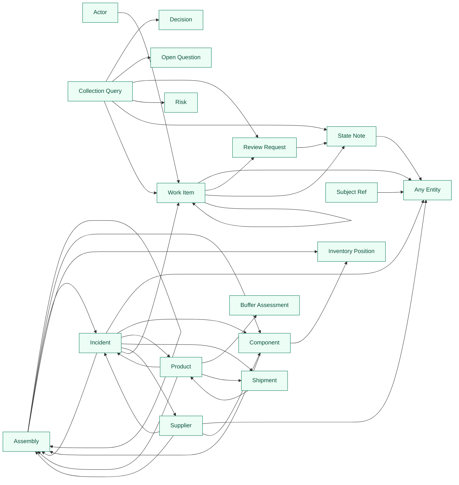

# Supply Chain Blast Radius Kit

Supply-chain incident blast-radius domain overlay composed over the
agent-operation base kit (`extends: ../agent-operation/config.yaml`).

The deterministic base world is suppliers, components, assemblies (recursive
BOM), products, and shipments — the launch seed is a **real open-hardware
BOM** (components carry `manufacturer`/`mpn` from the published design) with
fictional suppliers placed in real geographies. Incidents arrive as entities
and cascade through three staged governed workflows:

`incident -> supplier -> component / direct assembly`

Product and shipment risk are **derived context surfaces** over accepted
upstream impacts, BOM structure, buffer assessments, and shipment state —
never direct incident-to-product edges. Governed edges are rule-centric:
bucket signatures carry the cascade rule, not the incident, so trust
accumulates on reusable rules across many incidents and clean cascades
auto-resolve on all-support while anything unsure stops for review.

Everything between `CRUXIBLE:BEGIN` / `CRUXIBLE:END` markers is regenerated
from `config.yaml` by `cruxible config views`; treat those blocks as code-owned
structural truth. Everything outside them is authored explanation.

## Composition notes

- **Response work is base WorkItems** via the deterministic
  `work_item_addresses_incident` seam; `incident_work_items` is the response
  queue and work closes through the base review gate.
- **Supplier risk is the governed seam** `risk_attaches_to_supplier` — the
  base Risk entity attached through proposal review, so "we think this
  supplier is shaky" is a reviewed judgment, not a vibe.
- **Catalog lifecycle is its own vocabulary** (`catalog_status`:
  active/deprecated/obsolete) because the base owns `lifecycle_status`.
- **Contracts are deliberately thin** (`type: json` plus prose row
  contracts); providers own and enforce their row shapes.
- `fetch_inventory_positions` with `base_url: null` (the default) reads the
  bundled inventory fixture — the offline/demo mode; point it at a real
  inventory API to go live.

## Ontology

```mermaid
flowchart LR
  classDef canonicalEntity fill:#4a90d9,stroke:#2c5f8a,color:#fff
  classDef governedEntity fill:#e67e22,stroke:#a0521c,color:#fff
  classDef baseEntity fill:#e4e4e7,stroke:#a1a1aa,color:#3f3f46,stroke-dasharray: 4 3

  entity_Assembly["Assembly"]
  entity_BufferAssessment["Buffer Assessment"]
  entity_Component["Component"]
  entity_Incident["Incident"]
  entity_InventoryPosition["Inventory Position"]
  entity_Location["Location"]
  entity_Product["Product"]
  entity_Risk["Risk"]
  entity_Shipment["Shipment"]
  entity_Supplier["Supplier"]
  entity_WorkItem["Work Item"]
  class entity_Assembly,entity_BufferAssessment,entity_Component,entity_Incident,entity_InventoryPosition,entity_Location,entity_Product,entity_Shipment,entity_Supplier canonicalEntity
  class entity_Risk,entity_WorkItem baseEntity

  %% Deterministic canonical relationships
  entity_Assembly -- "Assembly Buffer Assessment" --> entity_BufferAssessment
  entity_Assembly -- "Assembly Inventory Position" --> entity_InventoryPosition
  entity_Assembly -- "Assembly Part Of Assembly" --> entity_Assembly
  entity_Assembly -- "Assembly Part Of Product" --> entity_Product
  entity_BufferAssessment -- "Buffer Assessment Inventory" --> entity_InventoryPosition
  entity_Component -- "Component Buffer Assessment" --> entity_BufferAssessment
  entity_Component -- "Component Inventory Position" --> entity_InventoryPosition
  entity_Component -- "Component Part Of Assembly" --> entity_Assembly
  entity_InventoryPosition -- "Inventory Position Location" --> entity_Location
  entity_Product -- "Product Buffer Assessment" --> entity_BufferAssessment
  entity_Product -- "Product In Shipment" --> entity_Shipment
  entity_Product -- "Product Inventory Position" --> entity_InventoryPosition
  entity_Supplier -- "Supplier Supplies Assembly" --> entity_Assembly
  entity_Supplier -- "Supplier Supplies Component" --> entity_Component
  entity_WorkItem -- "Work Item Addresses Incident" --> entity_Incident

  %% Governed proposal/review relationships
  entity_Incident -. "Incident Impacts Assembly" .-> entity_Assembly
  entity_Incident -. "Incident Impacts Component" .-> entity_Component
  entity_Incident -. "Incident Impacts Supplier" .-> entity_Supplier
  entity_Risk -. "Risk Attaches To Supplier" .-> entity_Supplier
  linkStyle 0,1,2,3,4,5,6,7,8,9,10,11,12,13,14 stroke:#2c5f8a,stroke-width:2px
  linkStyle 15,16,17,18 stroke:#e74c3c,stroke-width:2px
```

<!-- CRUXIBLE:BEGIN ontology -->

<!-- CRUXIBLE:END ontology -->

## Workflows

```mermaid
flowchart LR
  classDef canonicalWorkflow fill:#4a90d9,stroke:#2c5f8a,color:#fff
  classDef governedWorkflow fill:#e67e22,stroke:#a0521c,color:#fff

  workflow_pipeline_build_seed_state["1. Seed canonical state<br/>Canonical"]
  workflow_pipeline_ingest_incidents["2. Seed canonical state<br/>Canonical"]
  workflow_pipeline_sync_inventory_positions["3. Seed canonical state<br/>Canonical"]
  workflow_pipeline_sync_product_buffer_assessments["4. Seed canonical state<br/>Canonical"]
  workflow_pipeline_propose_incident_impacts_assembly["5. Incident Impacts Assembly<br/>Governed proposal"]
  workflow_pipeline_propose_incident_impacts_component["6. Incident Impacts Component<br/>Governed proposal"]
  workflow_pipeline_propose_incident_impacts_supplier["7. Incident Impacts Supplier<br/>Governed proposal"]
  workflow_pipeline_build_seed_state --> workflow_pipeline_ingest_incidents
  workflow_pipeline_ingest_incidents --> workflow_pipeline_sync_inventory_positions
  workflow_pipeline_sync_inventory_positions --> workflow_pipeline_sync_product_buffer_assessments
  workflow_pipeline_sync_product_buffer_assessments --> workflow_pipeline_propose_incident_impacts_assembly
  workflow_pipeline_propose_incident_impacts_assembly --> workflow_pipeline_propose_incident_impacts_component
  workflow_pipeline_propose_incident_impacts_component --> workflow_pipeline_propose_incident_impacts_supplier
  class workflow_pipeline_build_seed_state,workflow_pipeline_ingest_incidents,workflow_pipeline_sync_inventory_positions,workflow_pipeline_sync_product_buffer_assessments canonicalWorkflow
  class workflow_pipeline_propose_incident_impacts_assembly,workflow_pipeline_propose_incident_impacts_component,workflow_pipeline_propose_incident_impacts_supplier governedWorkflow
```

<!-- CRUXIBLE:BEGIN workflow-pipeline -->

<!-- CRUXIBLE:END workflow-pipeline -->

<!-- CRUXIBLE:BEGIN workflow-summary -->
### 1. Build Seed State

**Role:** Canonical seed

**Input context**
- None (seeds canonical state)

**Result**
- Canonical entities: Assembly, Component, Product, Shipment, Supplier
- Canonical relationships: Assembly Part Of Assembly, Assembly Part Of Product, Component Part Of Assembly, Product In Shipment, Supplier Supplies Assembly, Supplier Supplies Component

**Provider source**
- Load Supply Chain Seed Data (Python Function, v1.0.0); source: `kit://providers/supply_chain_blast_radius.py::load_seed_data`; artifact: Supply Chain Seed Bundle

### 2. Ingest Incidents

**Role:** Canonical seed

**Input context**
- None (seeds canonical state)

**Result**
- Canonical entities: Incident

**Provider source**
- Load Incident Feed (Python Function, v1.0.0); source: `kit://providers/supply_chain_blast_radius.py::load_incident_feed`; artifact: Supply Chain Seed Bundle

### 3. Sync Inventory Positions

**Role:** Canonical seed

**Input context**
- None (seeds canonical state)

**Result**
- Canonical entities: Inventory Position, Location
- Canonical relationships: Assembly Inventory Position, Component Inventory Position, Inventory Position Location, Product Inventory Position

**Provider source**
- -

### 4. Sync Product Buffer Assessments

**Role:** Canonical seed

**Input context**
- None (seeds canonical state)

**Result**
- Canonical entities: Buffer Assessment
- Canonical relationships: Assembly Buffer Assessment, Buffer Assessment Inventory, Component Buffer Assessment, Product Buffer Assessment

**Provider source**
- -

### 5. Propose Incident Impacts Assembly

**Role:** Governed proposal

**Input context**
- Query context: Assembly, Incident Impacts Supplier, Supplier Supplies Assembly

**Result**
- Proposed relationships: Incident Impacts Assembly

**Provider source**
- Assess Incident Assembly Cascade (Python Function, v1.0.0); source: `kit://providers/supply_chain_blast_radius.py::assess_incident_assembly_cascade`

### 6. Propose Incident Impacts Component

**Role:** Governed proposal

**Input context**
- Query context: Component, Incident Impacts Supplier, Supplier Supplies Component

**Result**
- Proposed relationships: Incident Impacts Component

**Provider source**
- Assess Incident Component Cascade (Python Function, v1.0.0); source: `kit://providers/supply_chain_blast_radius.py::assess_incident_component_cascade`

### 7. Propose Incident Impacts Supplier

**Role:** Governed proposal

**Input context**
- Query context: Incident, Supplier

**Result**
- Proposed relationships: Incident Impacts Supplier

**Provider source**
- Assess Incident Supplier Scope (Python Function, v1.0.0); source: `kit://providers/supply_chain_blast_radius.py::assess_incident_supplier_scope`

### 8. Assess Incident Product Exposure

**Role:** Utility

**Input context**
- Query context: Assembly, Buffer Assessment, Product, Assembly Buffer Assessment, Assembly Part Of Assembly, Assembly Part Of Product, Component Buffer Assessment, Component Part Of Assembly, Incident Impacts Assembly, Incident Impacts Component, Product Buffer Assessment

**Result**
- Provider output: Assess Incident Product Exposure

**Provider source**
- Assess Incident Product Exposure (Python Function, v1.0.0); source: `kit://providers/supply_chain_blast_radius.py::assess_incident_product_exposure`

### 9. Refresh Buffer Assessments

**Role:** Utility

**Input context**
- Query context: Assembly, Component, Inventory Position, Product, Assembly Inventory Position, Assembly Part Of Assembly, Assembly Part Of Product, Component Inventory Position, Component Part Of Assembly

**Result**
- Provider output: Assess Buffer Coverage

**Provider source**
- Assess Buffer Coverage (Python Function, v1.0.0); source: `kit://providers/supply_chain_blast_radius.py::assess_buffer_coverage`

### 10. Refresh Inventory Positions

**Role:** Utility

**Input context**
- None

**Result**
- Provider output: Fetch Inventory Positions

**Provider source**
- Fetch Inventory Positions (Python Function, v1.0.0); source: `kit://providers/supply_chain_blast_radius.py::fetch_inventory_positions`; non-deterministic
<!-- CRUXIBLE:END workflow-summary -->

## Governance

<!-- CRUXIBLE:BEGIN governance-table -->
| Relationship | Scope | Creation Path | Signals | Auto-resolve Gate | Review Policy | Feedback | Outcomes |
| --- | --- | --- | --- | --- | --- | --- | --- |
| Incident Impacts Assembly | Incident -> Assembly | Workflow: Propose Incident Impacts Assembly | Incident Assembly Cascade | All Support; prior trust: Trusted Only | Trust-gated auto-resolve | 4 reason codes | Incident Assembly Resolution |
| Incident Impacts Component | Incident -> Component | Workflow: Propose Incident Impacts Component | Incident Component Cascade | All Support; prior trust: Trusted Only | Trust-gated auto-resolve | 3 reason codes | Incident Component Resolution |
| Incident Impacts Supplier | Incident -> Supplier | Workflow: Propose Incident Impacts Supplier | Incident Supplier Scope Match | All Support; prior trust: Trusted Only | Trust-gated auto-resolve | 3 reason codes | Incident Supplier Resolution |
| Risk Attaches To Supplier | Risk -> Supplier | Agent/manual group propose | Maintainer Judgment, Source Evidence | All Support; prior trust: Trusted Only | Trust-gated auto-resolve | 2 reason codes | - |
<!-- CRUXIBLE:END governance-table -->

<!-- CRUXIBLE:BEGIN mutation-guards -->
No mutation guards declared.
<!-- CRUXIBLE:END mutation-guards -->

<!-- CRUXIBLE:BEGIN signal-policy-catalog -->
| Signal Source | Role | Review Unsure | Used By | Notes |
| --- | --- | --- | --- | --- |
| `incident_assembly_cascade` | required | yes | Incident Impacts Assembly | - |
| `incident_component_cascade` | required | yes | Incident Impacts Component | - |
| `incident_supplier_scope_match` | required | yes | Incident Impacts Supplier | - |
| `maintainer_judgment` | advisory | yes | Decision Affects Subject, Decision Answers Open Question, Decision Constrains Work Item, Decision Supersedes Decision, Open Question Blocks Decision, Open Question Blocks Work Item, Open Question Concerns Subject, Risk Attaches To Subject, Risk Attaches To Supplier, Risk Blocks Work Item, Work Item Answers Open Question, Work Item Depends On Work Item, Work Item Mitigates Risk, Work Item Supersedes Work Item | - |
| `source_evidence` | required | yes | Decision Affects Subject, Decision Answers Open Question, Decision Constrains Work Item, Decision Supersedes Decision, Open Question Blocks Decision, Open Question Blocks Work Item, Open Question Concerns Subject, Risk Attaches To Subject, Risk Attaches To Supplier, Risk Blocks Work Item, Work Item Answers Open Question, Work Item Depends On Work Item, Work Item Mitigates Risk, Work Item Supersedes Work Item | - |
<!-- CRUXIBLE:END signal-policy-catalog -->

## Queries

<!-- CRUXIBLE:BEGIN query-map -->

<!-- CRUXIBLE:END query-map -->

<!-- CRUXIBLE:BEGIN query-catalog -->
### Actor

| Query | Mode | Returns | State | Traversal | Purpose |
| --- | --- | --- | --- | --- | --- |
| Actor Work Queue | traversal | Work Item | reviewable | Work Item Owned By Actor (Incoming) | Work items owned by an actor with latest reviews, dependency counts, blockers, subjects. |

### Assembly

| Query | Mode | Returns | State | Traversal | Purpose |
| --- | --- | --- | --- | --- | --- |
| Assembly Child Assemblies | traversal | Assembly | live | Assembly Part Of Assembly (Incoming) | Direct child assemblies of this assembly. |
| Assembly Child Components | traversal | Component | live | Component Part Of Assembly (Incoming) | Direct child components of this assembly. |
| Assembly Impacting Incidents | traversal | Incident | reviewable | Incident Impacts Assembly (Incoming) | Incidents judged to impact this assembly directly. |
| Assembly Inventory Positions | traversal | Inventory Position | live | Assembly Inventory Position (Outgoing) | Inventory positions for this assembly. |

### Collection Query

| Query | Mode | Returns | State | Traversal | Purpose |
| --- | --- | --- | --- | --- | --- |
| Active Risks | collection | Risk | live |  | Active operational risks. |
| Blocked Work Items | collection | Work Item | reviewable |  | Work items marked blocked, with risk/open-question blocker context. |
| Changes Requested Reviews | collection | Review Request | reviewable |  | Review requests sent back with changes requested -- the implementer's rework queue, distinct from the reviewer-facing review_queue. |
| Open Questions Needing Review | collection | Open Question | live |  | Planned/active open questions needing review. |
| Proposed Decisions | collection | Decision | live |  | Proposed decisions awaiting acceptance/rejection/deferral. |
| Recent State Notes | collection | State Note | reviewable |  | Recent operation-state notes, corrections, rationale/implementation/review notes. |
| Review Queue | collection | Review Request | reviewable |  | Review requests awaiting a reviewer -- requested or in review. Reviews sent back for rework live in changes_requested_reviews. |
| Superseded Decisions | collection | Decision | not-live |  | Decision retired/superseded on the canonical entity-lifecycle axis (lifecycle.status != live), gated out of live reads. Supersession is not a domain status value. |
| Superseded Work Items | collection | Work Item | not-live |  | WorkItem retired/superseded on the canonical entity-lifecycle axis (lifecycle.status != live), gated out of live reads. Supersession is not a domain status value. |

### Component

| Query | Mode | Returns | State | Traversal | Purpose |
| --- | --- | --- | --- | --- | --- |
| Component Inventory Positions | traversal | Inventory Position | live | Component Inventory Position (Outgoing) | Inventory positions for this component. |
| Component Parent Assemblies | traversal | Assembly | live | Component Part Of Assembly \| Assembly Part Of Assembly (Outgoing, depth=8) | Direct and higher-level parent assemblies in the BOM. |

### Incident

| Query | Mode | Returns | State | Traversal | Purpose |
| --- | --- | --- | --- | --- | --- |
| Incident Component Exposed Products | traversal | Product | reviewable | Incident Impacts Component (Outgoing) -> Component Part Of Assembly \| Assembly Part Of Assembly (Outgoing, depth=8) -> Assembly Part Of Product (Outgoing) | Starting from an incident, derive finished products exposed through accepted component impacts and the component/assembly BOM hierarchy. This is context for an agentic product or shipment judgment, not governed graph state. |
| Incident Context | traversal | Any Entity | reviewable | Work Item Addresses Incident \| Incident Impacts Supplier \| Incident Impacts Component \| Incident Impacts Assembly (Both) | The incident war room — impacted suppliers/components/assemblies, response work, and anything else adjacent in the composed graph. |
| Incident Direct Assembly Exposed Products | traversal | Product | reviewable | Incident Impacts Assembly (Outgoing) -> Assembly Part Of Product (Outgoing) | Starting from an incident, derive finished products exposed through accepted direct assembly impacts where the assembly is a top-level product assembly. |
| Incident Exposed Assembly Context | traversal | Assembly | reviewable | Incident Impacts Supplier \| Incident Impacts Component \| Incident Impacts Assembly (Outgoing) -> Supplier Supplies Assembly \| Component Part Of Assembly \| Assembly Part Of Assembly (Outgoing, depth=8) | Starting from an incident, derive assembly context exposed by accepted supplier, component, or direct assembly impacts through supply and BOM structure. This is a query/view, not governed state. The supply/BOM hop is required false so a directly impacted assembly is itself included even when it has no parent assembly (same pattern as incident_exposed_shipments). |
| Incident Exposed Shipments | traversal | Shipment | reviewable | Incident Impacts Component \| Incident Impacts Assembly (Outgoing) -> Component Part Of Assembly \| Assembly Part Of Assembly (Outgoing, depth=8) -> Assembly Part Of Product (Outgoing) -> Product In Shipment (Outgoing) | Starting from an incident, derive outbound shipments exposed through accepted component and direct assembly impacts, the component/assembly BOM hierarchy, exposed finished products, and the product_in_shipment fulfillment edge. This is the terminal (shipment) derived exposure surface — context for an agentic shipment judgment, not governed graph state. No direct incident-shipment edge is created. The BOM-up hop is required false so directly impacted top-level assemblies reach products and shipments without an intermediate BOM rollup. |
| Incident Impacted Assemblies | traversal | Assembly | reviewable | Incident Impacts Assembly (Outgoing) | Directly supplied assemblies judged impacted. |
| Incident Impacted Components | traversal | Component | reviewable | Incident Impacts Component (Outgoing) | Components judged impacted via the supplier cascade. |
| Incident Impacted Suppliers | traversal | Supplier | reviewable | Incident Impacts Supplier (Outgoing) | Suppliers judged impacted by this incident, pending judgments visible. |
| Incident Nested Assembly Exposed Products | traversal | Product | reviewable | Incident Impacts Assembly (Outgoing) -> Assembly Part Of Assembly (Outgoing, depth=8) -> Assembly Part Of Product (Outgoing) | Starting from an incident, derive finished products exposed through accepted direct assembly impacts and higher-level parent assemblies. |
| Incident Work Items | traversal | Work Item | reviewable | Work Item Addresses Incident (Incoming) | Open response work addressing this incident. |
| Single Source Assemblies For Incident | traversal | Assembly | reviewable | Incident Impacts Assembly (Outgoing) | Starting from an incident, find impacted directly supplied assemblies that have only one viable supplier path. |
| Single Source Components For Incident | traversal | Component | reviewable | Incident Impacts Component (Outgoing) | Starting from an incident, find impacted components that have only one viable supplier path. Surfaces the "no viable alternate supplier" enrichment for the operator summary. |

### Product

| Query | Mode | Returns | State | Traversal | Purpose |
| --- | --- | --- | --- | --- | --- |
| Product Buffer Assessments | traversal | Buffer Assessment | live | Product Buffer Assessment (Outgoing) | Current buffer assessments in this product's context. |
| Product Component Impacting Incidents | traversal | Incident | reviewable | Assembly Part Of Product (Incoming) -> Assembly Part Of Assembly \| Component Part Of Assembly (Incoming, depth=8) -> Incident Impacts Component (Incoming) | Starting from a product, find incidents that impact components in its BOM. |
| Product Direct Assembly Impacting Incidents | traversal | Incident | reviewable | Assembly Part Of Product (Incoming) -> Incident Impacts Assembly (Incoming) | Starting from a product, find incidents that directly impact top-level assemblies in its BOM. |
| Product Nested Assembly Impacting Incidents | traversal | Incident | reviewable | Assembly Part Of Product (Incoming) -> Assembly Part Of Assembly (Incoming, depth=8) -> Incident Impacts Assembly (Incoming) | Starting from a product, find incidents that directly impact nested assemblies in its BOM. |
| Product Shipments | traversal | Shipment | live | Product In Shipment (Outgoing) | Shipments containing this product. |
| Product Top Level Assemblies | traversal | Assembly | live | Assembly Part Of Product (Incoming) | Top-level assemblies in this product's BOM. |

### Review Request

| Query | Mode | Returns | State | Traversal | Purpose |
| --- | --- | --- | --- | --- | --- |
| State Notes For Review Request | traversal | State Note | reviewable | State Note About Review Request (Incoming) | The review thread: verdict and finding notes attached to a review request, newest first. This is the read that replaces scrolling a notes blob. |

### Shipment

| Query | Mode | Returns | State | Traversal | Purpose |
| --- | --- | --- | --- | --- | --- |
| Shipment Products | traversal | Product | live | Product In Shipment (Incoming) | Products contained in this shipment. |

### State Note

| Query | Mode | Returns | State | Traversal | Purpose |
| --- | --- | --- | --- | --- | --- |
| State Note Context | traversal | Any Entity | reviewable | State Note Authored By Actor \| State Note About Work Item \| State Note About Review Request \| State Note About Decision \| State Note About Risk \| State Note About Open Question \| State Note About Subject \| State Note About Actor \| State Note Supersedes State Note \| State Note Resolves State Note (Both) | Full context for a state note (targets, author, supersession). |

### Subject Ref

| Query | Mode | Returns | State | Traversal | Purpose |
| --- | --- | --- | --- | --- | --- |
| Subject Operation Context | traversal | Any Entity | reviewable | State Note About Subject \| Work Item Targets Subject \| Decision Affects Subject \| Risk Attaches To Subject \| Open Question Concerns Subject (Both) | Work, decisions, risks, open questions attached to a subject ref. |

### Supplier

| Query | Mode | Returns | State | Traversal | Purpose |
| --- | --- | --- | --- | --- | --- |
| Supplier Context | traversal | Any Entity | reviewable | Supplier Supplies Component \| Supplier Supplies Assembly \| Risk Attaches To Supplier \| Incident Impacts Supplier (Both) | Everything attached to a supplier — supplied items, impacting incidents, attached risks. |
| Supplier Impacting Incidents | traversal | Incident | reviewable | Incident Impacts Supplier (Incoming) | Incidents judged to impact this supplier. |
| Supplier Supplied Assemblies | traversal | Assembly | live | Supplier Supplies Assembly (Outgoing) | Assemblies this supplier supplies directly. |
| Supplier Supplied Components | traversal | Component | live | Supplier Supplies Component (Outgoing) | Components this supplier is qualified to supply. |

### Work Item

| Query | Mode | Returns | State | Traversal | Purpose |
| --- | --- | --- | --- | --- | --- |
| Approved Reviews For Work Item | traversal | Review Request | live | Review Request For Work Item (Incoming) | Approved review requests for a work item. Used by the closed-transition guard. |
| State Notes For Work Item | traversal | State Note | reviewable | State Note About Work Item (Incoming) | State notes attached to a work item, newest first. |
| Work Item Context | traversal | Any Entity | reviewable | Work Item Owned By Actor \| Review Request For Work Item \| State Note About Work Item \| Work Item Depends On Work Item \| Work Item Part Of Work Item \| Work Item Spawned From Work Item \| Work Item Supersedes Work Item \| Risk Blocks Work Item \| Open Question Blocks Work Item \| Work Item Mitigates Risk \| Work Item Answers Open Question \| Decision Constrains Work Item \| Work Item Targets Subject \| Work Item Addresses Incident (Both) | From a work item, inspect dependencies, blockers, reviews, composition, lineage, decisions, owner, subjects. all_adjacent expands against the final composed config, so on a composed instance this query also traverses overlay seam edges (e.g. project-domain's roadmap, release, milestone, and area relationships). |
| Work Item Lineage Context | traversal | Work Item | reviewable | Work Item Spawned From Work Item \| Work Item Supersedes Work Item (Both, depth=5) | Work item lineage/replacement context, excluding sequencing deps. |
| Work Item Rollup Context | traversal | Work Item | reviewable | Work Item Part Of Work Item (Incoming, depth=5) | Child/descendant work items under a parent. |
<!-- CRUXIBLE:END query-catalog -->

## Quality Rules

<!-- CRUXIBLE:BEGIN quality-rules -->
### Constraints

No configured constraints.

### Quality Checks

| Name | Kind | Target | Severity | Rule |
| --- | --- | --- | --- | --- |
| `components_have_kind` | Property | Component.component_kind | Error | Required |
| `components_have_supplier` | Cardinality | Component -> Supplier Supplies Component (in) | Warning | min `1` |
| `critical_components_have_redundancy` | Cardinality | Component -> Supplier Supplies Component (in) | Warning | min `2` |
| `decision_supersessions_have_basis` | Property | Decision Supersedes Decision.supersession_basis | Warning | Non Empty |
| `decision_work_constraints_have_type` | Property | Decision Constrains Work Item.impact_type | Warning | Required |
| `open_question_work_blockers_have_basis` | Property | Open Question Blocks Work Item.blocking_basis | Warning | Non Empty |
| `products_have_assembly_bom` | Cardinality | Product -> Assembly Part Of Product (in) | Error | min `1` |
| `review_requests_review_work` | Cardinality | Review Request -> Review Request For Work Item (out) | Warning | min `1` |
| `risk_work_blockers_have_basis` | Property | Risk Blocks Work Item.blocking_basis | Warning | Non Empty |
| `state_note_supersessions_have_basis` | Property | State Note Supersedes State Note.supersession_basis | Warning | Non Empty |
| `state_notes_have_author` | Cardinality | State Note -> State Note Authored By Actor (out) | Warning | min `1` |
| `supplier_risk_attachments_have_basis` | Property | Risk Attaches To Supplier.impact_basis | Warning | Non Empty |
| `work_dependencies_have_basis` | Property | Work Item Depends On Work Item.dependency_basis | Warning | Non Empty |
| `work_item_part_of_single_parent` | Cardinality | Work Item -> Work Item Part Of Work Item (out) | Warning | max `1` |
| `work_item_spawned_from_single_origin` | Cardinality | Work Item -> Work Item Spawned From Work Item (out) | Warning | max `1` |
| `work_items_have_owner` | Cardinality | Work Item -> Work Item Owned By Actor (out) | Warning | min `1` |
| `work_supersessions_have_basis` | Property | Work Item Supersedes Work Item.supersession_basis | Warning | Non Empty |
<!-- CRUXIBLE:END quality-rules -->

## Learning Loops

<!-- CRUXIBLE:BEGIN learning-loops -->
### Feedback Profiles (Loop 1)

#### `incident_impacts_assembly`
- Version: `1`
- Reason codes:
  - `alternate_supplier_available` (`provider_fix`): Assembly has a viable alternate supplier outside incident scope; cascade should have stopped.
  - `assembly_decommissioned` (`quality_check`): Assembly is no longer in active use.
  - `sourcing_plan_stale` (`provider_fix`): Supplier sourcing posture was stale at cascade time.
  - `wrong_supplier_assembly_scope` (`provider_fix`): Rule matched the wrong directly supplied assembly for the impacted supplier.
- Scope keys:
  - `alternate_state`: `EDGE.alternate_state`
  - `assembly`: `TO.assembly_id`
  - `impacted_supplier`: `EDGE.impacted_supplier_id`
  - `incident`: `FROM.incident_id`

#### `incident_impacts_component`
- Version: `1`
- Reason codes:
  - `alternate_supplier_available` (`provider_fix`): Component has a viable alternate supplier outside incident scope; cascade should have stopped.
  - `component_decommissioned` (`quality_check`): Component is no longer in active use.
  - `supplier_substitution_planned` (`decision_policy`): A planned substitution mitigates this cascade.
- Scope keys:
  - `alternate_state`: `EDGE.alternate_state`
  - `component`: `TO.component_id`
  - `incident`: `FROM.incident_id`

#### `incident_impacts_supplier`
- Version: `1`
- Reason codes:
  - `geography_stale` (`provider_fix`): Supplier's primary_geography was outdated; supplier is no longer in scope.
  - `supplier_recently_cleared` (`decision_policy`): Supplier was cleared for a similar incident recently and should not have been re-flagged.
  - `wrong_supplier_scope_match` (`provider_fix`): Rule matched the wrong supplier for the incident scope.
- Scope keys:
  - `incident`: `FROM.incident_id`
  - `match_basis`: `EDGE.match_basis`
  - `supplier`: `TO.supplier_id`

#### `risk_attaches_to_supplier`
- Version: `1`
- Reason codes:
  - `risk_not_material` (`decision_policy`): The risk does not materially threaten this supplier's deliveries.
  - `wrong_supplier` (`quality_check`): The risk concerns a different supplier.
- Scope keys:
  - `risk`: `FROM.risk_id`
  - `supplier`: `TO.supplier_id`

### Outcome Profiles (Loop 2)

#### Resolution-Anchored

##### `incident_assembly_resolution`
- Version: `1`
- Target: Relationship `incident_impacts_assembly`
- Outcome codes:
  - `assembly_unaffected` (`require_review`): The assembly remained unaffected despite the accepted impact judgment.
  - `confirmed_assembly_constraint` (`trust_adjustment`): Later operations data confirmed assembly supply was constrained.
  - `missed_assembly_impact` (`workflow_fix`): An assembly impact was discovered after the proposal chain ran.
- Scope keys:
  - `relationship_type`: `RESOLUTION.relationship_type`

##### `incident_component_resolution`
- Version: `1`
- Target: Relationship `incident_impacts_component`
- Outcome codes:
  - `alternate_covered_need` (`require_review`): Alternate sourcing prevented the predicted component impact.
  - `confirmed_component_shortage` (`trust_adjustment`): Later operations data confirmed component supply was constrained.
  - `missed_component_impact` (`workflow_fix`): A component impact was discovered after the proposal chain ran.
- Scope keys:
  - `relationship_type`: `RESOLUTION.relationship_type`

##### `incident_supplier_resolution`
- Version: `1`
- Target: Relationship `incident_impacts_supplier`
- Outcome codes:
  - `confirmed_supplier_disruption` (`trust_adjustment`): Later operations data confirmed the supplier was materially disrupted.
  - `scope_data_stale` (`provider_fix`): Supplier or geography scope data was stale at resolution time.
  - `supplier_unaffected` (`require_review`): Later operations data showed the supplier was not materially disrupted.
- Scope keys:
  - `relationship_type`: `RESOLUTION.relationship_type`

#### Receipt-Anchored

##### `buffer_assessment_refresh`
- Version: `1`
- Target: Workflow `refresh_buffer_assessments`
- Outcome codes:
  - `buffer_held` (`trust_adjustment`): Assessment called sufficient_buffer and inventory did in fact cover demand through the horizon.
  - `buffer_ran_out` (`provider_fix`): Assessment looked sufficient or partial but the item ran out before the coverage horizon.
  - `consumption_rate_wrong` (`provider_fix`): Actual consumption diverged materially from the estimated_consumption_rate, miscalling coverage_duration.
  - `overstated_shortfall` (`require_review`): Assessment called no_buffer or partial_buffer but on-hand inventory comfortably covered demand.
- Scope keys:
  - `surface`: `SURFACE.name`

##### `component_exposed_products_query`
- Version: `1`
- Target: Query `incident_component_exposed_products`
- Outcome codes:
  - `false_positive_product` (`graph_fix`): Component-path exposure query returned a product later confirmed to be unaffected.
  - `missing_impacted_product` (`graph_fix`): Component-path exposure query omitted a product later confirmed to be impacted.
- Scope keys:
  - `query`: `SURFACE.name`

##### `direct_assembly_exposed_products_query`
- Version: `1`
- Target: Query `incident_direct_assembly_exposed_products`
- Outcome codes:
  - `false_positive_product` (`graph_fix`): Direct-assembly exposure query returned a product later confirmed to be unaffected.
  - `missing_impacted_product` (`graph_fix`): Direct-assembly exposure query omitted a product later confirmed to be impacted.
- Scope keys:
  - `query`: `SURFACE.name`

##### `exposed_shipments_query`
- Version: `1`
- Target: Query `incident_exposed_shipments`
- Outcome codes:
  - `false_positive_shipment` (`graph_fix`): Terminal shipment exposure query returned a shipment later confirmed to be unaffected.
  - `missing_impacted_shipment` (`graph_fix`): Terminal shipment exposure query omitted a shipment later confirmed to be impacted.
- Scope keys:
  - `query`: `SURFACE.name`

##### `impacted_assemblies_query`
- Version: `1`
- Target: Query `incident_impacted_assemblies`
- Outcome codes:
  - `false_positive_assembly` (`graph_fix`): Query returned an assembly later confirmed not directly impacted.
  - `missing_impacted_assembly` (`graph_fix`): Query omitted a directly supplied assembly later confirmed impacted.
- Scope keys:
  - `query`: `SURFACE.name`

##### `nested_assembly_exposed_products_query`
- Version: `1`
- Target: Query `incident_nested_assembly_exposed_products`
- Outcome codes:
  - `false_positive_product` (`graph_fix`): Nested-assembly exposure query returned a product later confirmed to be unaffected.
  - `missing_impacted_product` (`graph_fix`): Nested-assembly exposure query omitted a product later confirmed to be impacted.
- Scope keys:
  - `query`: `SURFACE.name`

##### `product_exposure_assessment`
- Version: `1`
- Target: Workflow `assess_incident_product_exposure`
- Outcome codes:
  - `bom_depth_miscount` (`provider_fix`): The bom_depth_bucket was wrong, mis-weighting the exposure path.
  - `buffer_state_misread` (`provider_fix`): The buffer_state attributed to the product was wrong, flipping the exposure conclusion.
  - `confirmed_product_exposure` (`trust_adjustment`): Product flagged exposed was in fact materially affected by the incident.
  - `missed_product_exposure` (`workflow_fix`): A product later confirmed exposed was not surfaced by the exposure assessment.
  - `product_unaffected` (`require_review`): Product flagged exposed turned out unaffected once buffer and BOM reality played out.
- Scope keys:
  - `surface`: `SURFACE.name`
<!-- CRUXIBLE:END learning-loops -->
