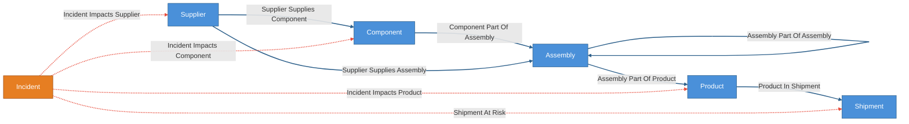
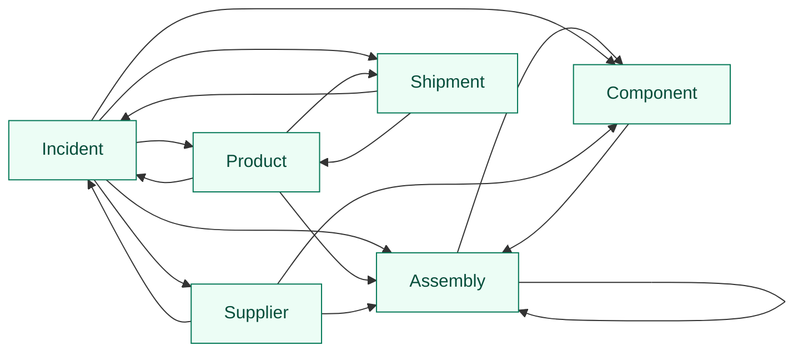

# Supply Chain Blast Radius Demo

Deterministic supply-chain world model that turns a supplier-side disruption into
a bounded, reviewable blast radius. The stable canonical backbone is suppliers,
components, assemblies, products, and shipments. Incidents arrive as governed
trigger state and cascade through staged proposal workflows:

`incident -> supplier -> component/assembly -> product -> at-risk shipment`

Governed edges are rule-centric: proposal bucket signatures carry `rule_id` and
`rule_version`, not `incident_id`, so trust accumulates on reusable cascade rules
across many incidents instead of starting fresh every time.

Everything between `CRUXIBLE:BEGIN` / `CRUXIBLE:END` markers is regenerated
from `config.yaml` by `cruxible config-views`; treat those blocks as
code-owned structural truth. Everything outside those marker blocks is authored
explanation for humans and agents reading the kit.

## Ontology Map

Entity types and relationships, color-coded by layer. Solid blue lines are
deterministic canonical state. Dashed red lines are governed proposal/review
relationships.

<!-- CRUXIBLE:BEGIN ontology -->

<!-- CRUXIBLE:END ontology -->

**Legend:** Blue = canonical/deterministic state | Orange = governed-only
trigger/judgment entity | Solid blue lines = deterministic | Dashed red lines =
governed proposal/review.

## Workflow Summary

The generated pipeline gives the stage order. The generated stage blocks
underneath keep long context and result lists readable without squeezing them
into a wide table.

```mermaid
flowchart LR
  classDef canonicalWorkflow fill:#4a90d9,stroke:#2c5f8a,color:#fff
  classDef governedWorkflow fill:#e67e22,stroke:#a0521c,color:#fff

  workflow_pipeline_build_seed_state["1. Seed canonical state<br/>Canonical"]
  workflow_pipeline_propose_incident_impacts_supplier["2. Assess supplier impact<br/>Governed proposal"]
  workflow_pipeline_propose_incident_impacts_component["3. Cascade to components<br/>Governed proposal"]
  workflow_pipeline_propose_incident_impacts_product["4. Cascade to products<br/>Governed proposal"]
  workflow_pipeline_propose_shipment_at_risk["5. Flag at-risk shipments<br/>Governed proposal"]
  workflow_pipeline_build_seed_state --> workflow_pipeline_propose_incident_impacts_supplier
  workflow_pipeline_propose_incident_impacts_supplier --> workflow_pipeline_propose_incident_impacts_component
  workflow_pipeline_propose_incident_impacts_component --> workflow_pipeline_propose_incident_impacts_product
  workflow_pipeline_propose_incident_impacts_product --> workflow_pipeline_propose_shipment_at_risk
  class workflow_pipeline_build_seed_state canonicalWorkflow
  class workflow_pipeline_propose_incident_impacts_supplier,workflow_pipeline_propose_incident_impacts_component,workflow_pipeline_propose_incident_impacts_product,workflow_pipeline_propose_shipment_at_risk governedWorkflow
```

<!-- CRUXIBLE:BEGIN workflow-pipeline -->

<!-- CRUXIBLE:END workflow-pipeline -->

<!-- CRUXIBLE:BEGIN workflow-summary -->
### 1. Build Seed State

**Role:** Canonical seed

**Input context**
- None (seeds canonical state)

**Result**
- Canonical entities: Assembly, Component, Product, Shipment, Supplier
- Canonical relationships: Assembly Part Of Assembly, Assembly Part Of Product, Component Part Of Assembly, Product In Shipment, Supplier Supplies Assembly, Supplier Supplies Component

**Provider source**
- Load Supply Chain Seed Data (Python Function, v1.0.0); source: `src/cruxible_kits/supply_chain_blast_radius.py::load_seed_data`; artifact: Supply Chain Seed Bundle

### 2. Propose Incident Impacts Supplier

**Role:** Governed proposal

**Input context**
- Entity context: Incident, Supplier

**Result**
- Proposed relationships: Incident Impacts Supplier

**Provider source**
- Assess Incident Supplier Scope (Python Function, v1.0.0); source: `src/cruxible_kits/supply_chain_blast_radius.py::assess_incident_supplier_scope`

### 3. Propose Incident Impacts Component

**Role:** Governed proposal

**Input context**
- Entity context: Component
- Relationship context: Incident Impacts Supplier, Supplier Supplies Component

**Result**
- Proposed relationships: Incident Impacts Component

**Provider source**
- Assess Incident Component Cascade (Python Function, v1.0.0); source: `src/cruxible_kits/supply_chain_blast_radius.py::assess_incident_component_cascade`

### 4. Propose Incident Impacts Product

**Role:** Governed proposal

**Input context**
- Entity context: Assembly, Product
- Relationship context: Assembly Part Of Assembly, Assembly Part Of Product, Component Part Of Assembly, Incident Impacts Component, Incident Impacts Supplier, Supplier Supplies Assembly

**Result**
- Proposed relationships: Incident Impacts Product

**Provider source**
- Assess Incident Product Cascade (Python Function, v1.0.0); source: `src/cruxible_kits/supply_chain_blast_radius.py::assess_incident_product_cascade`

### 5. Propose Shipment At Risk

**Role:** Governed proposal

**Input context**
- Entity context: Incident, Shipment
- Relationship context: Incident Impacts Product, Product In Shipment

**Result**
- Proposed relationships: Shipment At Risk

**Provider source**
- Assess Shipment Risk (Python Function, v1.0.0); source: `src/cruxible_kits/supply_chain_blast_radius.py::assess_shipment_risk`
<!-- CRUXIBLE:END workflow-summary -->

## Governed Relationships

This table is generated from existing matching, decision policy, feedback, and
outcome profile config. It distinguishes structural proposal mechanics from the
authored explanation around them.

<!-- CRUXIBLE:BEGIN governance-table -->
| Relationship | Scope | Creation Path | Signals | Auto-resolve Gate | Review Policy | Feedback | Outcomes |
| --- | --- | --- | --- | --- | --- | --- | --- |
| Incident Impacts Component | Incident -> Component | Workflow: Propose Incident Impacts Component | Incident Component Cascade | All Support; prior trust: Trusted Only | Trust-gated auto-resolve | 3 reason codes | Incident Component Resolution |
| Incident Impacts Product | Incident -> Product | Workflow: Propose Incident Impacts Product | Incident Product Cascade | All Support; prior trust: Trusted Only | Require Review: Product Impact Always Review | 3 reason codes | Incident Product Resolution |
| Incident Impacts Supplier | Incident -> Supplier | Workflow: Propose Incident Impacts Supplier | Incident Supplier Scope Match | All Support; prior trust: Trusted Only | Trust-gated auto-resolve | 3 reason codes | Incident Supplier Resolution |
| Shipment At Risk | Incident -> Shipment | Workflow: Propose Shipment At Risk | Shipment Risk Assessment | All Support; prior trust: Trusted Only | Require Review: Shipment Risk Always Review | 3 reason codes | Shipment Risk Resolution |
<!-- CRUXIBLE:END governance-table -->

### Integration Signal Notes

This catalog is generated from configured integrations and the governed
relationships that consume them.

<!-- CRUXIBLE:BEGIN integration-catalog -->
| Integration | Kind | Used By | Notes |
| --- | --- | --- | --- |
| `incident_component_cascade` | supplier_to_component_cascade | Incident Impacts Component | Cascades from impacted suppliers through supplier_supplies_component to components, downgrading the signal when an active alternate supplier exists outside incident scope. |
| `incident_product_cascade` | bom_to_product_cascade | Incident Impacts Product | Rolls resolved impacted components and directly supplied assemblies through supplier_supplies_assembly, component_part_of_assembly, assembly_part_of_assembly, and assembly_part_of_product to finished goods. Records discretized BOM depth in bom_depth_bucket. |
| `incident_supplier_scope_match` | incident_scope_match | Incident Impacts Supplier | Matches incident scope (supplier\|geography) to suppliers via supplier_id or supplier.primary_geography. |
| `shipment_risk_assessment` | shipment_state_assessment | Shipment At Risk | Assesses each in-flight shipment containing an impacted product against shipment status and ship_date relative to incident.reported_at. |
<!-- CRUXIBLE:END integration-catalog -->

## Query Map

Named queries are graph-native read surfaces. The map intentionally shows only
entity-to-entity affordances; query names and traversal details live in the
catalog below.

<!-- CRUXIBLE:BEGIN query-map -->

<!-- CRUXIBLE:END query-map -->

## Query Catalog

Use the catalog to understand what questions the kit exposes. Composition,
presentation, and operator summaries should happen in the skill or agent
harness, not by turning every useful traversal into a governed relationship.

<!-- CRUXIBLE:BEGIN query-catalog -->
### Assembly

| Query | Returns | Traversal | Purpose |
| --- | --- | --- | --- |
| Assembly Child Assemblies | Assembly | Assembly Part Of Assembly (Incoming) | Starting from an assembly, find direct child assemblies. |
| Assembly Child Components | Component | Component Part Of Assembly (Incoming) | Starting from an assembly, find direct child components. |

### Component

| Query | Returns | Traversal | Purpose |
| --- | --- | --- | --- |
| Component Parent Assemblies | Assembly | Component Part Of Assembly \| Assembly Part Of Assembly (Outgoing, depth=8) | Starting from a component, find direct and higher-level parent assemblies in the BOM hierarchy. |

### Incident

| Query | Returns | Traversal | Purpose |
| --- | --- | --- | --- |
| Incident At Risk Shipments | Shipment | Shipment At Risk (Outgoing) | Starting from an incident, find at-risk in-flight shipments. |
| Incident Impacted Assemblies | Assembly | Incident Impacts Supplier \| Incident Impacts Component (Outgoing) -> Supplier Supplies Assembly \| Component Part Of Assembly \| Assembly Part Of Assembly (Outgoing, depth=8) | Starting from an incident, derive assemblies exposed to accepted supplier or component impacts by walking supplier_supplies_assembly, component_part_of_assembly, and assembly_part_of_assembly. This is a named query/view, not a governed relationship. |
| Incident Impacted Components | Component | Incident Impacts Component (Outgoing) | Starting from an incident, find components judged impacted via the supplier cascade. |
| Incident Impacted Products | Product | Incident Impacts Product (Outgoing) | Starting from an incident, find finished products judged impacted via component and assembly BOM cascade. The bom_depth_bucket edge property lets the skill filter for tier_2 / tier_3_plus. |
| Incident Impacted Suppliers | Supplier | Incident Impacts Supplier (Outgoing) | Starting from an incident, find suppliers judged impacted. |
| Single Source Components For Incident | Component | Incident Impacts Component (Outgoing) | Starting from an incident, find impacted components that have only one active supplier path. Surfaces the "no alternate active supplier" enrichment for the operator summary. |

### Product

| Query | Returns | Traversal | Purpose |
| --- | --- | --- | --- |
| Product Impacting Incidents | Incident | Incident Impacts Product (Incoming) | Starting from a product, find incidents judged to impact it. |
| Product Shipments | Shipment | Product In Shipment (Outgoing) | Starting from a product, find shipments containing it. |
| Product Top Level Assemblies | Assembly | Assembly Part Of Product (Incoming) | Starting from a product, find top-level assemblies in its BOM. |

### Shipment

| Query | Returns | Traversal | Purpose |
| --- | --- | --- | --- |
| Shipment Products | Product | Product In Shipment (Incoming) | Starting from a shipment, find products contained in it. |
| Shipment Risk Incidents | Incident | Shipment At Risk (Incoming) | Starting from a shipment, find incidents judged to put it at risk. |

### Supplier

| Query | Returns | Traversal | Purpose |
| --- | --- | --- | --- |
| Supplier Impacting Incidents | Incident | Incident Impacts Supplier (Incoming) | Starting from a supplier, find incidents judged to impact it. |
| Supplier Supplied Assemblies | Assembly | Supplier Supplies Assembly (Outgoing) | Starting from a supplier, find directly supplied assemblies. |
| Supplier Supplied Components | Component | Supplier Supplies Component (Outgoing) | Starting from a supplier, find directly supplied components. |
<!-- CRUXIBLE:END query-catalog -->

## Rules And Learning Loops

These generated sections own the operational facts: constraints, quality
checks, feedback vocabularies, and outcome vocabularies. Authored prose should
explain how to use them, not restate the config.

<!-- CRUXIBLE:BEGIN quality-rules -->
### Constraints

No configured constraints.

### Quality Checks

| Name | Kind | Target | Severity | Rule |
| --- | --- | --- | --- | --- |
| `components_have_kind` | Property | Component.component_kind | Error | Required |
| `components_have_supplier` | Cardinality | Component -> Supplier Supplies Component (in) | Warning | min `1` |
| `critical_components_have_redundancy` | Cardinality | Component -> Supplier Supplies Component (in) | Warning | min `2` |
| `products_have_assembly_bom` | Cardinality | Product -> Assembly Part Of Product (in) | Error | min `1` |
<!-- CRUXIBLE:END quality-rules -->

<!-- CRUXIBLE:BEGIN learning-loops -->
### Feedback Profiles (Loop 1)

#### `incident_impacts_component`
- Version: `1`
- Reason codes:
  - `alternate_supplier_active` (`provider_fix`): Component has an active alternate supplier outside incident scope; cascade should have stopped.
  - `component_decommissioned` (`quality_check`): Component is no longer in active use.
  - `supplier_substitution_planned` (`decision_policy`): A planned substitution mitigates this cascade.
- Scope keys:
  - `alternate_state`: `EDGE.alternate_state`
  - `component`: `TO.component_id`
  - `incident`: `FROM.incident_id`

#### `incident_impacts_product`
- Version: `1`
- Reason codes:
  - `bom_depth_overstated` (`provider_fix`): BOM traversal recorded a tier closer than reality.
  - `bom_variant_mismatch` (`provider_fix`): Product uses a BOM variant that does not include the impacted component path.
  - `product_inactive` (`quality_check`): Product is inactive; cascade should not have included it.
- Scope keys:
  - `bom_depth_bucket`: `EDGE.bom_depth_bucket`
  - `incident`: `FROM.incident_id`
  - `product`: `TO.product_id`

#### `incident_impacts_supplier`
- Version: `1`
- Reason codes:
  - `geography_stale` (`provider_fix`): Supplier's primary_geography was outdated; supplier is no longer in scope.
  - `supplier_recently_cleared` (`decision_policy`): Supplier was cleared for a similar incident recently and should not have been re-flagged.
  - `wrong_supplier_scope_match` (`provider_fix`): Rule matched the wrong supplier for the incident scope.
- Scope keys:
  - `incident`: `FROM.incident_id`
  - `match_basis`: `EDGE.match_basis`
  - `supplier`: `TO.supplier_id`

#### `shipment_at_risk`
- Version: `1`
- Reason codes:
  - `already_delivered` (`provider_fix`): Shipment was already delivered when incident occurred.
  - `alternate_source_shipment` (`provider_fix`): Shipment uses product variant from an alternate source not in incident scope.
  - `ships_before_incident` (`provider_fix`): Shipment ship_date predates incident; not actually at risk.
- Scope keys:
  - `incident`: `FROM.incident_id`
  - `shipment`: `TO.shipment_id`
  - `shipment_state`: `EDGE.shipment_state`

### Outcome Profiles (Loop 2)

#### Resolution-Anchored

##### `incident_component_resolution`
- Version: `1`
- Target: Relationship `incident_impacts_component`
- Outcome codes:
  - `alternate_covered_need` (`require_review`): Alternate sourcing prevented the predicted component impact.
  - `confirmed_component_shortage` (`trust_adjustment`): Later operations data confirmed component supply was constrained.
  - `missed_component_impact` (`workflow_fix`): A component impact was discovered after the proposal chain ran.
- Scope keys:
  - `relationship_type`: `RESOLUTION.relationship_type`

##### `incident_product_resolution`
- Version: `1`
- Target: Relationship `incident_impacts_product`
- Outcome codes:
  - `confirmed_product_impact` (`trust_adjustment`): Later planning, production, or customer data confirmed product impact.
  - `missed_product_impact` (`workflow_fix`): A product impact was discovered after the proposal chain ran.
  - `product_unaffected` (`require_review`): The product remained unaffected despite the accepted impact judgment.
- Scope keys:
  - `relationship_type`: `RESOLUTION.relationship_type`

##### `incident_supplier_resolution`
- Version: `1`
- Target: Relationship `incident_impacts_supplier`
- Outcome codes:
  - `confirmed_supplier_disruption` (`trust_adjustment`): Later operations data confirmed the supplier was materially disrupted.
  - `scope_data_stale` (`provider_fix`): Supplier or geography scope data was stale at resolution time.
  - `supplier_unaffected` (`require_review`): Later operations data showed the supplier was not materially disrupted.
- Scope keys:
  - `relationship_type`: `RESOLUTION.relationship_type`

##### `shipment_risk_resolution`
- Version: `1`
- Target: Relationship `shipment_at_risk`
- Outcome codes:
  - `confirmed_shipment_delay` (`trust_adjustment`): Shipment was delayed, held, shorted, or customer-impacting as predicted.
  - `missed_at_risk_shipment` (`workflow_fix`): A shipment became customer-impacting but was not flagged by the chain.
  - `shipment_unaffected` (`require_review`): Shipment completed normally despite the accepted risk judgment.
- Scope keys:
  - `relationship_type`: `RESOLUTION.relationship_type`

#### Receipt-Anchored

##### `at_risk_shipments_query`
- Version: `1`
- Target: Query `incident_at_risk_shipments`
- Outcome codes:
  - `false_positive_shipment` (`graph_fix`): Query returned a shipment later confirmed unaffected.
  - `missing_at_risk_shipment` (`graph_fix`): Query omitted a shipment later confirmed at risk.
- Scope keys:
  - `query`: `SURFACE.name`

##### `impacted_assemblies_query`
- Version: `1`
- Target: Query `incident_impacted_assemblies`
- Outcome codes:
  - `false_positive_assembly` (`graph_fix`): Query returned an assembly later confirmed not to be exposed through the active BOM.
  - `missing_impacted_assembly` (`graph_fix`): Query omitted an assembly later confirmed to be exposed through the BOM.
- Scope keys:
  - `query`: `SURFACE.name`

##### `impacted_products_query`
- Version: `1`
- Target: Query `incident_impacted_products`
- Outcome codes:
  - `false_positive_product` (`graph_fix`): Query returned a product later confirmed to be unaffected.
  - `missing_impacted_product` (`graph_fix`): Query omitted a product later confirmed to be impacted.
- Scope keys:
  - `query`: `SURFACE.name`
<!-- CRUXIBLE:END learning-loops -->

## Model Notes

- `Assembly` is a canonical entity because the domain needs hierarchical BOM
  structure, not just a loose component-to-product shortcut.
- `component_part_of_assembly`, `assembly_part_of_assembly`, and
  `assembly_part_of_product` preserve the product structure needed for
  downstream blast-radius and tier-depth analysis.
- `incident_impacted_assemblies` is a named query/view, not governed state. It is
  derived from accepted supplier/component impact plus the deterministic BOM.
- `product_in_shipment` points from `Product` to `Shipment`, so shipment risk is
  downstream from the product-impact decision.
- Product impact and shipment risk are governed and review-gated because they
  drive customer-facing action.

## Compounding Knowledge Procedure

1. Register canonical supply-chain anchors: suppliers, components, assemblies,
   products, shipments, and deterministic BOM edges.
2. Register supplier-side incidents as governed trigger state with known scope
   such as supplier, geography, disruption type, severity, and timing.
3. Propose incident-to-supplier impact using direct supplier and geography
   matches.
4. Cascade accepted supplier impacts to components and assemblies, accounting
   for active alternates and criticality.
5. Cascade accepted component and assembly impacts through the BOM to finished
   products, preserving depth and route of impact.
6. Cascade accepted product impacts to in-flight or committed shipments.
7. Use named queries to give the agent reviewed context for supplier exposure,
   assembly/product blast radius, and shipment/customer action.
8. Feed review feedback and later operational outcomes back into provider fixes,
   decision policies, constraints, and trust calibration for future incidents.

## Usage Stories

- **Supplier disruption triage:** start from a fire, strike, cyber incident, or
  regulatory event and identify suppliers that require review.
- **BOM blast-radius analysis:** move from accepted supplier/component impact to
  assemblies and products without flattening away the assembly hierarchy.
- **Alternate-source review:** distinguish real product risk from component
  impact that is buffered by active alternate suppliers.
- **Shipment risk review:** identify shipments containing impacted products so
  operations can hold, reroute, expedite, or notify customers.
- **Customer escalation context:** give an agent a reviewed path from incident
  to affected product and shipment, rather than a generic incident summary.
- **Operational memory:** preserve accepted and rejected cascade decisions so
  future incidents reuse the organization's learned supply-chain judgment.

## Debug Views

Detailed mechanical Mermaid renderings are still available when needed:

```bash
uv run cruxible config-views --config kits/supply-chain-blast-radius/config.yaml --view workflow-steps
uv run cruxible config-views --config kits/supply-chain-blast-radius/config.yaml --view queries
```

## Maintenance

Regenerate the structural sections after changing ontology, workflows, governed
relationships, or named queries:

```bash
uv run cruxible config-views --config kits/supply-chain-blast-radius/config.yaml --update-readme kits/supply-chain-blast-radius/README.md
```

To inspect the same generated bundle without editing the README:

```bash
uv run cruxible config-views --config kits/supply-chain-blast-radius/config.yaml --view all
```

## Status

This is a scaffold: the config, workflows, named queries, feedback profiles,
outcome profiles, and decision policies are in place and validate cleanly. The
kit provider refs currently resolve to explicit placeholder implementations;
real seed data and cascade provider behavior land in a follow-up.
