# Supply Chain Blast Radius Kit

Supply-chain incident blast-radius domain overlay composed over the
agent-operation base kit (declared via the kit manifest's
`target_state: agent-operation`).

The deterministic base world is suppliers, components, assemblies (recursive
BOM), products, and shipments — the launch seed is a **real open-hardware
BOM** (components carry `manufacturer`/`mpn` from the published design) with
fictional suppliers placed in real geographies. Incidents arrive as entities
and cascade through three staged governed workflows:

`incident -> supplier -> component / direct assembly`

Product and shipment risk are **derived context surfaces** over accepted
upstream impacts, BOM structure, buffer assessments, and shipment state —
never direct incident-to-product edges. Governed edges are rule-centric:
bucket signatures carry the cascade rule, not the incident, so trust
accumulates on reusable rules across many incidents and clean cascades
can auto-resolve on all-support only after the rule has prior trusted
resolution. First-run support groups still require operator review, and
anything unsure stops for review.

Everything between `CRUXIBLE:BEGIN` / `CRUXIBLE:END` markers is regenerated
from `config.yaml` by `cruxible config views`; treat those blocks as code-owned
structural truth. Everything outside them is authored explanation.

## Composition notes

- **Response work is base WorkItems** via the deterministic
  `work_item_addresses_incident` seam; `incident_work_items` is the response
  queue and work closes through the base review gate.
- **Supplier risk is the governed seam** `risk_attaches_to_supplier` — the
  base Risk entity attached through proposal review, so "we think this
  supplier is shaky" is a reviewed judgment, not a vibe.
- **Operations routing ships as workflows**:
  `analyze_operations_routing -> apply_operations_routing ->
  propose_risk_attaches_to_supplier` creates response work, applies base risks,
  and proposes reviewed supplier-risk attachments.
- **Catalog lifecycle is its own vocabulary** (`catalog_status`:
  active/deprecated/obsolete) because the base owns `lifecycle_status`.
- **Contracts are deliberately thin** (`type: json` plus prose row
  contracts); providers own and enforce their row shapes.
- **Acquisition lives outside the workflow boundary**:
  `load_inventory_positions` reads the pinned fixture; for live positions,
  `scripts/fetch_inventory.py` owns the API call and auth, and the reviewed
  JSON feeds the sync workflow. Providers never fetch.

## Ontology

```mermaid
flowchart LR
  classDef canonicalEntity fill:#4a90d9,stroke:#2c5f8a,color:#fff
  classDef governedEntity fill:#e67e22,stroke:#a0521c,color:#fff
  classDef baseEntity fill:#e4e4e7,stroke:#a1a1aa,color:#3f3f46,stroke-dasharray: 4 3

  entity_Assembly["Assembly"]
  entity_BufferAssessment["Buffer Assessment"]
  entity_Component["Component"]
  entity_Incident["Incident"]
  entity_InventoryPosition["Inventory Position"]
  entity_Location["Location"]
  entity_Product["Product"]
  entity_Risk["Risk"]
  entity_Shipment["Shipment"]
  entity_Supplier["Supplier"]
  entity_WorkItem["Work Item"]
  class entity_Assembly,entity_BufferAssessment,entity_Component,entity_Incident,entity_InventoryPosition,entity_Location,entity_Product,entity_Shipment,entity_Supplier canonicalEntity
  class entity_Risk,entity_WorkItem baseEntity

  %% Deterministic canonical relationships
  entity_Assembly -- "Assembly Buffer Assessment" --> entity_BufferAssessment
  entity_Assembly -- "Assembly Inventory Position" --> entity_InventoryPosition
  entity_Assembly -- "Assembly Part Of Assembly" --> entity_Assembly
  entity_Assembly -- "Assembly Part Of Product" --> entity_Product
  entity_BufferAssessment -- "Buffer Assessment Inventory" --> entity_InventoryPosition
  entity_Component -- "Component Buffer Assessment" --> entity_BufferAssessment
  entity_Component -- "Component Inventory Position" --> entity_InventoryPosition
  entity_Component -- "Component Part Of Assembly" --> entity_Assembly
  entity_InventoryPosition -- "Inventory Position Location" --> entity_Location
  entity_Product -- "Product Buffer Assessment" --> entity_BufferAssessment
  entity_Product -- "Product In Shipment" --> entity_Shipment
  entity_Product -- "Product Inventory Position" --> entity_InventoryPosition
  entity_Supplier -- "Supplier Supplies Assembly" --> entity_Assembly
  entity_Supplier -- "Supplier Supplies Component" --> entity_Component
  entity_WorkItem -- "Work Item Addresses Incident" --> entity_Incident

  %% Governed proposal/review relationships
  entity_Incident -. "Incident Impacts Assembly" .-> entity_Assembly
  entity_Incident -. "Incident Impacts Component" .-> entity_Component
  entity_Incident -. "Incident Impacts Supplier" .-> entity_Supplier
  entity_Risk -. "Risk Attaches To Supplier" .-> entity_Supplier
  linkStyle 0,1,2,3,4,5,6,7,8,9,10,11,12,13,14 stroke:#2c5f8a,stroke-width:2px
  linkStyle 15,16,17,18 stroke:#e74c3c,stroke-width:2px
```

<!-- CRUXIBLE:BEGIN ontology -->

**Diagram legend:** blue node = canonical entity (deterministic writes); dashed grey node = base-kit entity shown for seam context; solid edge = deterministic relationship; dotted edge = governed relationship.
<!-- CRUXIBLE:END ontology -->

<!-- CRUXIBLE:BEGIN schema-catalog -->
| Entity | Properties | Description |
| --- | --- | --- |
| `Assembly` | `assembly_id: string (pk)`, `name: string?`, `revision: string?`, `lifecycle_status: catalog_status?`, `criticality: criticality?`, `category: string?` | Buildable subassembly or assembly composed of components and lower-level assemblies. |
| `BufferAssessment` | `buffer_assessment_id: string (pk)`, `item_type: buffer_item_type?`, `item_id: string?`, `product_id: string?`, `bom_variant_id: string?`, `net_available: float?`, `required_per_unit: float?`, `open_demand_units: float?`, `estimated_consumption_rate: float?`, `rate_period: rate_period?`, `coverage_duration: float?`, `coverage_unit: duration_unit?`, `horizon_duration: float?`, `horizon_unit: duration_unit?`, `buffer_state: buffer_state?`, `unit_of_measure: string?`, `as_of: date?`, `rationale: string?` | Reusable coverage assessment of whether inventory covers expected demand for an item in a product/BOM context. |
| `Component` | `component_id: string (pk)`, `name: string?`, `component_kind: component_kind?`, `manufacturer: string?`, `mpn: string?`, `revision: string?`, `lifecycle_status: catalog_status?`, `criticality: criticality?`, `category: string?` | Raw material or discrete part that rolls up into assemblies. manufacturer/mpn carry the real-world part identity from open-hardware BOMs; the Supplier edge carries who we buy it from. |
| `Incident` | `incident_id: string (pk)`, `title: string?`, `severity: incident_severity?`, `scope_type: incident_scope_type?`, `scope_id: string?`, `status: incident_status?`, `reported_at: date?`, `closed_at: date?`, `summary: string?` | Supplier-side disruption or geography-level supply event. |
| `InventoryPosition` | `inventory_position_id: string (pk)`, `item_type: inventory_item_type?`, `item_id: string?`, `location_id: string?`, `quantity_on_hand: float?`, `quantity_allocated: float?`, `net_available: float?`, `unit_of_measure: string?`, `as_of: date?` | Time-stamped inventory evidence for an item at a location. |
| `Location` | `location_id: string (pk)`, `name: string?`, `location_type: location_type?`, `geography: string?` | Plant, warehouse, supplier, or in-transit location holding inventory. |
| `Product` | `product_id: string (pk)`, `sku: string?`, `name: string?`, `lifecycle_status: catalog_status?` | Finished good shipped to customers. |
| `Shipment` | `shipment_id: string (pk)`, `customer_id: string?`, `status: shipment_status?`, `ship_date: date?`, `eta: date?` | Outbound shipment of products to a customer. |
| `Supplier` | `supplier_id: string (pk)`, `name: string?`, `primary_geography: string?`, `tier_hint: string?` | External supplier of raw materials, parts, or assemblies. |

### Enums

| Enum | Values |
| --- | --- |
| `buffer_item_type` | component, assembly |
| `buffer_state` | no_buffer, partial_buffer, sufficient_buffer, unknown |
| `catalog_status` | active, deprecated, obsolete |
| `component_kind` | raw_material, part |
| `criticality` | critical, standard, low |
| `duration_unit` | days, weeks, months |
| `incident_scope_type` | supplier, geography |
| `incident_severity` | critical, high, medium, low |
| `incident_status` | open, monitoring, closed |
| `inventory_item_type` | component, assembly, product |
| `location_type` | plant, warehouse, supplier, in_transit |
| `rate_period` | day, week, month |
| `shipment_status` | in_flight, delivered, cancelled |
<!-- CRUXIBLE:END schema-catalog -->

## Workflows

```mermaid
flowchart LR
  classDef canonicalWorkflow fill:#4a90d9,stroke:#2c5f8a,color:#fff
  classDef governedWorkflow fill:#e67e22,stroke:#a0521c,color:#fff

  workflow_pipeline_apply_operations_routing["1. Seed canonical state<br/>Canonical"]
  workflow_pipeline_build_seed_state["2. Seed canonical state<br/>Canonical"]
  workflow_pipeline_ingest_incidents["3. Seed canonical state<br/>Canonical"]
  workflow_pipeline_sync_inventory_positions["4. Seed canonical state<br/>Canonical"]
  workflow_pipeline_sync_product_buffer_assessments["5. Seed canonical state<br/>Canonical"]
  workflow_pipeline_propose_incident_impacts_assembly["6. Incident Impacts Assembly<br/>Governed proposal"]
  workflow_pipeline_propose_incident_impacts_component["7. Incident Impacts Component<br/>Governed proposal"]
  workflow_pipeline_propose_incident_impacts_supplier["8. Incident Impacts Supplier<br/>Governed proposal"]
  workflow_pipeline_propose_risk_attaches_to_supplier["9. Risk Attaches To Supplier<br/>Governed proposal"]
  workflow_pipeline_apply_operations_routing --> workflow_pipeline_build_seed_state
  workflow_pipeline_build_seed_state --> workflow_pipeline_ingest_incidents
  workflow_pipeline_ingest_incidents --> workflow_pipeline_sync_inventory_positions
  workflow_pipeline_sync_inventory_positions --> workflow_pipeline_sync_product_buffer_assessments
  workflow_pipeline_sync_product_buffer_assessments --> workflow_pipeline_propose_incident_impacts_assembly
  workflow_pipeline_propose_incident_impacts_assembly --> workflow_pipeline_propose_incident_impacts_component
  workflow_pipeline_propose_incident_impacts_component --> workflow_pipeline_propose_incident_impacts_supplier
  workflow_pipeline_propose_incident_impacts_supplier --> workflow_pipeline_propose_risk_attaches_to_supplier
  class workflow_pipeline_apply_operations_routing,workflow_pipeline_build_seed_state,workflow_pipeline_ingest_incidents,workflow_pipeline_sync_inventory_positions,workflow_pipeline_sync_product_buffer_assessments canonicalWorkflow
  class workflow_pipeline_propose_incident_impacts_assembly,workflow_pipeline_propose_incident_impacts_component,workflow_pipeline_propose_incident_impacts_supplier,workflow_pipeline_propose_risk_attaches_to_supplier governedWorkflow
```

<!-- CRUXIBLE:BEGIN workflow-pipeline -->

<!-- CRUXIBLE:END workflow-pipeline -->

<!-- CRUXIBLE:BEGIN workflow-summary -->
### 1. Apply Operations Routing

**Role:** Canonical seed

**Input context**
- None (seeds canonical state)

**Result**
- Canonical entities: Risk, Work Item
- Canonical relationships: Work Item Addresses Incident

**Provider source**
- -

### 2. Build Seed State

**Role:** Canonical seed

**Input context**
- None (seeds canonical state)

**Result**
- Canonical entities: Assembly, Component, Product, Shipment, Supplier
- Canonical relationships: Assembly Part Of Assembly, Assembly Part Of Product, Component Part Of Assembly, Product In Shipment, Supplier Supplies Assembly, Supplier Supplies Component

**Provider source**
- Load Supply Chain Seed Data (Python Function, v1.0.0); source: `kit://providers/supply_chain_blast_radius.py::load_seed_data`; artifact: Supply Chain Seed Bundle

### 3. Ingest Incidents

**Role:** Canonical seed

**Input context**
- None (seeds canonical state)

**Result**
- Canonical entities: Incident

**Provider source**
- Load Incident Feed (Python Function, v1.0.0); source: `kit://providers/supply_chain_blast_radius.py::load_incident_feed`; artifact: Supply Chain Seed Bundle

### 4. Sync Inventory Positions

**Role:** Canonical seed

**Input context**
- None (seeds canonical state)

**Result**
- Canonical entities: Inventory Position, Location
- Canonical relationships: Assembly Inventory Position, Component Inventory Position, Inventory Position Location, Product Inventory Position

**Provider source**
- -

### 5. Sync Product Buffer Assessments

**Role:** Canonical seed

**Input context**
- None (seeds canonical state)

**Result**
- Canonical entities: Buffer Assessment
- Canonical relationships: Assembly Buffer Assessment, Buffer Assessment Inventory, Component Buffer Assessment, Product Buffer Assessment

**Provider source**
- -

### 6. Propose Incident Impacts Assembly

**Role:** Governed proposal

**Input context**
- Query context: Assembly, Incident Impacts Supplier, Supplier Supplies Assembly

**Result**
- Proposed relationships: Incident Impacts Assembly

**Provider source**
- Assess Incident Assembly Cascade (Python Function, v1.0.0); source: `kit://providers/supply_chain_blast_radius.py::assess_incident_assembly_cascade`

### 7. Propose Incident Impacts Component

**Role:** Governed proposal

**Input context**
- Query context: Component, Incident Impacts Supplier, Supplier Supplies Component

**Result**
- Proposed relationships: Incident Impacts Component

**Provider source**
- Assess Incident Component Cascade (Python Function, v1.0.0); source: `kit://providers/supply_chain_blast_radius.py::assess_incident_component_cascade`

### 8. Propose Incident Impacts Supplier

**Role:** Governed proposal

**Input context**
- Query context: Incident, Supplier

**Result**
- Proposed relationships: Incident Impacts Supplier

**Provider source**
- Assess Incident Supplier Scope (Python Function, v1.0.0); source: `kit://providers/supply_chain_blast_radius.py::assess_incident_supplier_scope`

### 9. Propose Risk Attaches To Supplier

**Role:** Governed proposal

**Input context**
- Query context: Incident, Risk, Supplier, Incident Impacts Assembly, Incident Impacts Component, Incident Impacts Supplier

**Result**
- Proposed relationships: Risk Attaches To Supplier

**Provider source**
- Assess Supplier Risk Attachments (Python Function, v1.0.0); source: `kit://providers/supply_chain_blast_radius.py::assess_supplier_risk_attachments`; artifact: Supply Chain Seed Bundle

### 10. Analyze Operations Routing

**Role:** Utility

**Input context**
- None

**Result**
- Provider output: Analyze Operations Routing

**Provider source**
- Analyze Operations Routing (Python Function, v1.0.0); source: `kit://providers/supply_chain_blast_radius.py::analyze_operations_routing`; artifact: Supply Chain Seed Bundle

### 11. Assess Incident Product Exposure

**Role:** Utility

**Input context**
- Query context: Assembly, Buffer Assessment, Product, Assembly Buffer Assessment, Assembly Part Of Assembly, Assembly Part Of Product, Component Buffer Assessment, Component Part Of Assembly, Incident Impacts Assembly, Incident Impacts Component, Product Buffer Assessment

**Result**
- Provider output: Assess Incident Product Exposure

**Provider source**
- Assess Incident Product Exposure (Python Function, v1.0.0); source: `kit://providers/supply_chain_blast_radius.py::assess_incident_product_exposure`

### 12. Refresh Buffer Assessments

**Role:** Utility

**Input context**
- Query context: Assembly, Component, Inventory Position, Product, Assembly Inventory Position, Assembly Part Of Assembly, Assembly Part Of Product, Component Inventory Position, Component Part Of Assembly

**Result**
- Provider output: Assess Buffer Coverage

**Provider source**
- Assess Buffer Coverage (Python Function, v1.0.0); source: `kit://providers/supply_chain_blast_radius.py::assess_buffer_coverage`; artifact: Supply Chain Seed Bundle

### 13. Refresh Inventory Positions

**Role:** Utility

**Input context**
- None

**Result**
- Provider output: Load Inventory Positions

**Provider source**
- Load Inventory Positions (Python Function, v1.0.0); source: `kit://providers/supply_chain_blast_radius.py::load_inventory_positions`; artifact: Supply Chain Seed Bundle
<!-- CRUXIBLE:END workflow-summary -->

<!-- CRUXIBLE:BEGIN provider-contracts -->
### `analyze_operations_routing` (deterministic)

- Ref: `kit://providers/supply_chain_blast_radius.py::analyze_operations_routing`
- Reads artifact: `supply_chain_seed_bundle` (`kits/supply-chain-blast-radius/data/seed`)
- Purpose: Load deterministic base WorkItem/Risk routing rows from the bundled operations fixture.

Called by workflow `analyze_operations_routing`, step `routing`:

- Input: none (empty payload).

### `assess_buffer_coverage` (deterministic)

- Ref: `kit://providers/supply_chain_blast_radius.py::assess_buffer_coverage`
- Reads artifact: `supply_chain_seed_bundle` (`kits/supply-chain-blast-radius/data/seed`)
- Purpose: Compute reusable buffer coverage assessments from inventory, BOM, and demand context.

Called by workflow `refresh_buffer_assessments`, step `assessments`:

- Input `components` <- query step `components` (`results`)
- Input `assemblies` <- query step `assemblies` (`results`)
- Input `products` <- query step `products` (`results`)
- Input `inventory_positions` <- query step `inventory_positions` (`results`)
- Input `component_inventory_position_edges` <- query step `component_inventory` (`results`)
- Input `assembly_inventory_position_edges` <- query step `assembly_inventory` (`results`)
- Input `component_part_of_assembly_edges` <- query step `component_assembly` (`results`)
- Input `assembly_part_of_assembly_edges` <- query step `assembly_recursive` (`results`)
- Input `assembly_part_of_product_edges` <- query step `assembly_product` (`results`)
- Input `demand_context` <- workflow input `demand_context`

### `assess_incident_assembly_cascade` (deterministic)

- Ref: `kit://providers/supply_chain_blast_radius.py::assess_incident_assembly_cascade`
- Purpose: Cascade impacted suppliers to directly supplied assemblies, downgrading where viable alternate sourcing exists.

Called by workflow `propose_incident_impacts_assembly`, step `assessments`:

- Input `impacted_supplier_edges` <- query step `impacted_supplier_edges` (`results`)
- Input `supplier_supplies_assembly_edges` <- query step `assembly_supply_edges` (`results`)
- Input `assemblies` <- query step `assemblies` (`results`)
- Output rows -> `make_candidates` step `candidates` (`incident_impacts_assembly`): required row keys: `incident_id` (from id), `assembly_id` (to id), `impacted_supplier_id`, `alternate_state`, `rationale`. `properties: auto` — rows must carry every key; null for unset optionals.

### `assess_incident_component_cascade` (deterministic)

- Ref: `kit://providers/supply_chain_blast_radius.py::assess_incident_component_cascade`
- Purpose: Cascade impacted suppliers to components, downgrading where viable alternate sourcing exists.

Called by workflow `propose_incident_impacts_component`, step `assessments`:

- Input `impacted_supplier_edges` <- query step `impacted_supplier_edges` (`results`)
- Input `supplier_supplies_component_edges` <- query step `supplies_edges` (`results`)
- Input `components` <- query step `components` (`results`)
- Output rows -> `make_candidates` step `candidates` (`incident_impacts_component`): required row keys: `incident_id` (from id), `component_id` (to id), `alternate_state`, `rationale`. `properties: auto` — rows must carry every key; null for unset optionals.

### `assess_incident_product_exposure` (deterministic)

- Ref: `kit://providers/supply_chain_blast_radius.py::assess_incident_product_exposure`
- Purpose: Roll accepted impacts through the BOM hierarchy to derived product exposure context.

Called by workflow `assess_incident_product_exposure`, step `assessments`:

- Input `impacted_component_edges` <- query step `impacted_component_edges` (`results`)
- Input `impacted_assembly_edges` <- query step `impacted_assembly_edges` (`results`)
- Input `component_part_of_assembly_edges` <- query step `component_assembly` (`results`)
- Input `assembly_part_of_assembly_edges` <- query step `assembly_recursive` (`results`)
- Input `assembly_part_of_product_edges` <- query step `assembly_product` (`results`)
- Input `buffer_assessments` <- query step `buffer_assessments` (`results`)
- Input `component_buffer_assessment_edges` <- query step `component_buffers` (`results`)
- Input `assembly_buffer_assessment_edges` <- query step `assembly_buffers` (`results`)
- Input `product_buffer_assessment_edges` <- query step `product_buffers` (`results`)
- Input `assemblies` <- query step `assemblies` (`results`)
- Input `products` <- query step `products` (`results`)

### `assess_incident_supplier_scope` (deterministic)

- Ref: `kit://providers/supply_chain_blast_radius.py::assess_incident_supplier_scope`
- Purpose: Match each open incident's scope to suppliers via direct or geography basis.

Called by workflow `propose_incident_impacts_supplier`, step `assessments`:

- Input `incidents` <- query step `incidents` (`results`)
- Input `suppliers` <- query step `suppliers` (`results`)
- Output rows -> `make_candidates` step `candidates` (`incident_impacts_supplier`): required row keys: `incident_id` (from id), `supplier_id` (to id), `match_basis`, `rationale`. `properties: auto` — rows must carry every key; null for unset optionals.

### `assess_supplier_risk_attachments` (deterministic)

- Ref: `kit://providers/supply_chain_blast_radius.py::assess_supplier_risk_attachments`
- Reads artifact: `supply_chain_seed_bundle` (`kits/supply-chain-blast-radius/data/seed`)
- Purpose: Propose governed supplier-risk attachments from routed risks and incident cascade evidence.

Called by workflow `propose_risk_attaches_to_supplier`, step `assessments`:

- Input `incidents` <- query step `incidents` (`results`)
- Input `suppliers` <- query step `suppliers` (`results`)
- Input `risks` <- query step `risks` (`results`)
- Input `impacted_supplier_edges` <- query step `impacted_supplier_edges` (`results`)
- Input `impacted_component_edges` <- query step `impacted_component_edges` (`results`)
- Input `impacted_assembly_edges` <- query step `impacted_assembly_edges` (`results`)
- Output rows -> `make_candidates` step `candidates` (`risk_attaches_to_supplier`): required row keys: `risk_id` (from id), `supplier_id` (to id), `impact_basis`.

### `load_incident_feed` (deterministic)

- Ref: `kit://providers/supply_chain_blast_radius.py::load_incident_feed`
- Reads artifact: `supply_chain_seed_bundle` (`kits/supply-chain-blast-radius/data/seed`)
- Purpose: Load incident records from the bundled feed for ingestion as Incident entities.

Called by workflow `ingest_incidents`, step `feed`:

- Input: none (empty payload).
- Output rows -> `make_entities` step `incidents` (`Incident`): required row keys: `incident_id` (entity id), `title`, `severity`, `scope_type`, `scope_id`, `status`, `reported_at`, `closed_at`, `summary`. `properties: auto` — rows must carry every key; null for unset optionals.

### `load_inventory_positions` (deterministic)

- Ref: `kit://providers/supply_chain_blast_radius.py::load_inventory_positions`
- Reads artifact: `supply_chain_seed_bundle` (`kits/supply-chain-blast-radius/data/seed`)
- Purpose: Load the pinned inventory fixture with the requested filters applied. Live acquisition deliberately lives outside the workflow boundary: pull positions with scripts/fetch_inventory.py (which owns API auth) and apply the reviewed rows through the sync workflow.

Called by workflow `refresh_inventory_positions`, step `inventory`:

- Input `item_ids` <- workflow input `item_ids`
- Input `item_types` <- workflow input `item_types`
- Input `location_ids` <- workflow input `location_ids`
- Input `as_of` <- workflow input `as_of`

### `load_supply_chain_seed_data` (deterministic)

- Ref: `kit://providers/supply_chain_blast_radius.py::load_seed_data`
- Reads artifact: `supply_chain_seed_bundle` (`kits/supply-chain-blast-radius/data/seed`)
- Purpose: Load base-world entities and deterministic edges from the seed bundle.

Called by workflow `build_seed_state`, step `seed`:

- Input: none (empty payload).
- Output rows -> `make_entities` step `suppliers` (`Supplier`): required row keys: `supplier_id` (entity id), `name`, `primary_geography`, `tier_hint`. `properties: auto` — rows must carry every key; null for unset optionals.
- Output rows -> `make_entities` step `components` (`Component`): required row keys: `component_id` (entity id), `name`, `component_kind`, `manufacturer`, `mpn`, `revision`, `lifecycle_status`, `criticality`, `category`. `properties: auto` — rows must carry every key; null for unset optionals.
- Output rows -> `make_entities` step `assemblies` (`Assembly`): required row keys: `assembly_id` (entity id), `name`, `revision`, `lifecycle_status`, `criticality`, `category`. `properties: auto` — rows must carry every key; null for unset optionals.
- Output rows -> `make_entities` step `products` (`Product`): required row keys: `product_id` (entity id), `sku`, `name`, `lifecycle_status`. `properties: auto` — rows must carry every key; null for unset optionals.
- Output rows -> `make_entities` step `shipments` (`Shipment`): required row keys: `shipment_id` (entity id), `customer_id`, `status`, `ship_date`, `eta`. `properties: auto` — rows must carry every key; null for unset optionals.
- Output rows -> `make_relationships` step `supplies_edges` (`supplier_supplies_component`): required row keys: `supplier_id` (from id), `component_id` (to id), `lead_time_days`, `qualification_status`, `sourcing_role`, `priority_rank`, `allocation_pct`, `activation_state`, `capacity_units_per_week`, `effective_from`, `effective_to`, `last_verified_at`. `properties: auto` — rows must carry every key; null for unset optionals.
- Output rows -> `make_relationships` step `assembly_supply_edges` (`supplier_supplies_assembly`): required row keys: `supplier_id` (from id), `assembly_id` (to id), `lead_time_days`, `qualification_status`, `sourcing_role`, `priority_rank`, `allocation_pct`, `activation_state`, `capacity_units_per_week`, `effective_from`, `effective_to`, `last_verified_at`. `properties: auto` — rows must carry every key; null for unset optionals.
- Output rows -> `make_relationships` step `component_assembly_edges` (`component_part_of_assembly`): required row keys: `component_id` (from id), `assembly_id` (to id), `quantity`, `bom_variant_id`, `plant_id`, `effective_from`, `effective_to`. `properties: auto` — rows must carry every key; null for unset optionals.
- Output rows -> `make_relationships` step `assembly_recursive_edges` (`assembly_part_of_assembly`): required row keys: `child_assembly_id` (from id), `parent_assembly_id` (to id), `quantity`, `bom_variant_id`, `plant_id`, `effective_from`, `effective_to`. `properties: auto` — rows must carry every key; null for unset optionals.
- Output rows -> `make_relationships` step `assembly_product_edges` (`assembly_part_of_product`): required row keys: `assembly_id` (from id), `product_id` (to id), `quantity`, `bom_variant_id`, `plant_id`, `effective_from`, `effective_to`. `properties: auto` — rows must carry every key; null for unset optionals.
- Output rows -> `make_relationships` step `shipment_edges` (`product_in_shipment`): required row keys: `product_id` (from id), `shipment_id` (to id), `qty`. `properties: auto` — rows must carry every key; null for unset optionals.
<!-- CRUXIBLE:END provider-contracts -->

## Governance

<!-- CRUXIBLE:BEGIN governance-table -->
| Relationship | Scope | Creation Path | Signals | Auto-resolve Gate | Review Policy | Feedback | Outcomes |
| --- | --- | --- | --- | --- | --- | --- | --- |
| Incident Impacts Assembly | Incident -> Assembly | Workflow: Propose Incident Impacts Assembly | Incident Assembly Cascade | All Support; prior trust: Trusted Only | Trust-gated auto-resolve | 4 reason codes | Incident Assembly Resolution |
| Incident Impacts Component | Incident -> Component | Workflow: Propose Incident Impacts Component | Incident Component Cascade | All Support; prior trust: Trusted Only | Trust-gated auto-resolve | 3 reason codes | Incident Component Resolution |
| Incident Impacts Supplier | Incident -> Supplier | Workflow: Propose Incident Impacts Supplier | Incident Supplier Scope Match | All Support; prior trust: Trusted Only | Trust-gated auto-resolve | 3 reason codes | Incident Supplier Resolution |
| Risk Attaches To Supplier | Risk -> Supplier | Workflow: Propose Risk Attaches To Supplier | Maintainer Judgment, Source Evidence | All Support; prior trust: Trusted Only | Trust-gated auto-resolve | 2 reason codes | - |
<!-- CRUXIBLE:END governance-table -->

<!-- CRUXIBLE:BEGIN mutation-guards -->
No mutation guards declared.
<!-- CRUXIBLE:END mutation-guards -->

<!-- CRUXIBLE:BEGIN signal-policy-catalog -->
| Signal Source | Role | Review Unsure | Evidence on Support | Used By | Notes |
| --- | --- | --- | --- | --- | --- |
| `incident_assembly_cascade` | required | yes | yes | Incident Impacts Assembly | - |
| `incident_component_cascade` | required | yes | yes | Incident Impacts Component | - |
| `incident_supplier_scope_match` | required | yes | yes | Incident Impacts Supplier | - |
| `maintainer_judgment` | advisory | yes | no | Risk Attaches To Supplier, + 13 base relationships | - |
| `source_evidence` | required | yes | yes | Risk Attaches To Supplier, + 13 base relationships | - |
<!-- CRUXIBLE:END signal-policy-catalog -->

## Queries

<!-- CRUXIBLE:BEGIN query-catalog -->
### Assembly

| Query | Mode | Returns | State | Traversal | Purpose |
| --- | --- | --- | --- | --- | --- |
| Assembly Child Assemblies | traversal | Assembly | live | Assembly Part Of Assembly (Incoming) | Direct child assemblies of this assembly. |
| Assembly Child Components | traversal | Component | live | Component Part Of Assembly (Incoming) | Direct child components of this assembly. |
| Assembly Impacting Incidents | traversal | Incident | reviewable | Incident Impacts Assembly (Incoming) | Incidents judged to impact this assembly directly. |
| Assembly Inventory Positions | traversal | Inventory Position | live | Assembly Inventory Position (Outgoing) | Inventory positions for this assembly. |

### Component

| Query | Mode | Returns | State | Traversal | Purpose |
| --- | --- | --- | --- | --- | --- |
| Component Inventory Positions | traversal | Inventory Position | live | Component Inventory Position (Outgoing) | Inventory positions for this component. |
| Component Parent Assemblies | traversal | Assembly | live | Component Part Of Assembly \| Assembly Part Of Assembly (Outgoing, depth=8) | Direct and higher-level parent assemblies in the BOM. |

### Incident

| Query | Mode | Returns | State | Traversal | Purpose |
| --- | --- | --- | --- | --- | --- |
| Incident Component Exposed Products | traversal | Product | reviewable | Incident Impacts Component (Outgoing) -> Component Part Of Assembly \| Assembly Part Of Assembly (Outgoing, depth=8) -> Assembly Part Of Product (Outgoing) | Starting from an incident, derive finished products exposed through accepted component impacts and the component/assembly BOM hierarchy. This is context for an agentic product or shipment judgment, not governed graph state. |
| Incident Context | traversal | Any Entity | reviewable | Work Item Addresses Incident \| Incident Impacts Supplier \| Incident Impacts Component \| Incident Impacts Assembly (Both) | The incident war room — impacted suppliers/components/assemblies, response work, and anything else adjacent in the composed graph. |
| Incident Direct Assembly Exposed Products | traversal | Product | reviewable | Incident Impacts Assembly (Outgoing) -> Assembly Part Of Product (Outgoing) | Starting from an incident, derive finished products exposed through accepted direct assembly impacts where the assembly is a top-level product assembly. |
| Incident Exposed Assembly Context | traversal | Assembly | reviewable | Incident Impacts Supplier \| Incident Impacts Component \| Incident Impacts Assembly (Outgoing) -> Supplier Supplies Assembly \| Component Part Of Assembly \| Assembly Part Of Assembly (Outgoing, depth=8) | Starting from an incident, derive assembly context exposed by accepted supplier, component, or direct assembly impacts through supply and BOM structure. This is a query/view, not governed state. The supply/BOM hop is required false so a directly impacted assembly is itself included even when it has no parent assembly (same pattern as incident_exposed_shipments). |
| Incident Exposed Shipments | traversal | Shipment | reviewable | Incident Impacts Component \| Incident Impacts Assembly (Outgoing) -> Component Part Of Assembly \| Assembly Part Of Assembly (Outgoing, depth=8) -> Assembly Part Of Product (Outgoing) -> Product In Shipment (Outgoing) | Starting from an incident, derive outbound shipments exposed through accepted component and direct assembly impacts, the component/assembly BOM hierarchy, exposed finished products, and the product_in_shipment fulfillment edge. This is the terminal (shipment) derived exposure surface — context for an agentic shipment judgment, not governed graph state. No direct incident-shipment edge is created. The BOM-up hop is required false so directly impacted top-level assemblies reach products and shipments without an intermediate BOM rollup. |
| Incident Impacted Assemblies | traversal | Assembly | reviewable | Incident Impacts Assembly (Outgoing) | Directly supplied assemblies judged impacted. |
| Incident Impacted Components | traversal | Component | reviewable | Incident Impacts Component (Outgoing) | Components judged impacted via the supplier cascade. |
| Incident Impacted Suppliers | traversal | Supplier | reviewable | Incident Impacts Supplier (Outgoing) | Suppliers judged impacted by this incident, pending judgments visible. |
| Incident Nested Assembly Exposed Products | traversal | Product | reviewable | Incident Impacts Assembly (Outgoing) -> Assembly Part Of Assembly (Outgoing, depth=8) -> Assembly Part Of Product (Outgoing) | Starting from an incident, derive finished products exposed through accepted direct assembly impacts and higher-level parent assemblies. |
| Incident Work Items | traversal | Work Item | reviewable | Work Item Addresses Incident (Incoming) | Open response work addressing this incident. |
| Single Source Assemblies For Incident | traversal | Assembly | reviewable | Incident Impacts Assembly (Outgoing) | Starting from an incident, find impacted directly supplied assemblies that have only one viable supplier path. |
| Single Source Components For Incident | traversal | Component | reviewable | Incident Impacts Component (Outgoing) | Starting from an incident, find impacted components that have only one viable supplier path. Surfaces the "no viable alternate supplier" enrichment for the operator summary. |

### Product

| Query | Mode | Returns | State | Traversal | Purpose |
| --- | --- | --- | --- | --- | --- |
| Product Buffer Assessments | traversal | Buffer Assessment | live | Product Buffer Assessment (Outgoing) | Current buffer assessments in this product's context. |
| Product Component Impacting Incidents | traversal | Incident | reviewable | Assembly Part Of Product (Incoming) -> Assembly Part Of Assembly \| Component Part Of Assembly (Incoming, depth=8) -> Incident Impacts Component (Incoming) | Starting from a product, find incidents that impact components in its BOM. |
| Product Direct Assembly Impacting Incidents | traversal | Incident | reviewable | Assembly Part Of Product (Incoming) -> Incident Impacts Assembly (Incoming) | Starting from a product, find incidents that directly impact top-level assemblies in its BOM. |
| Product Nested Assembly Impacting Incidents | traversal | Incident | reviewable | Assembly Part Of Product (Incoming) -> Assembly Part Of Assembly (Incoming, depth=8) -> Incident Impacts Assembly (Incoming) | Starting from a product, find incidents that directly impact nested assemblies in its BOM. |
| Product Shipments | traversal | Shipment | live | Product In Shipment (Outgoing) | Shipments containing this product. |
| Product Top Level Assemblies | traversal | Assembly | live | Assembly Part Of Product (Incoming) | Top-level assemblies in this product's BOM. |

### Shipment

| Query | Mode | Returns | State | Traversal | Purpose |
| --- | --- | --- | --- | --- | --- |
| Shipment Products | traversal | Product | live | Product In Shipment (Incoming) | Products contained in this shipment. |

### Supplier

| Query | Mode | Returns | State | Traversal | Purpose |
| --- | --- | --- | --- | --- | --- |
| Supplier Context | traversal | Any Entity | reviewable | Supplier Supplies Component \| Supplier Supplies Assembly \| Risk Attaches To Supplier \| Incident Impacts Supplier (Both) | Everything attached to a supplier — supplied items, impacting incidents, attached risks. |
| Supplier Impacting Incidents | traversal | Incident | reviewable | Incident Impacts Supplier (Incoming) | Incidents judged to impact this supplier. |
| Supplier Supplied Assemblies | traversal | Assembly | live | Supplier Supplies Assembly (Outgoing) | Assemblies this supplier supplies directly. |
| Supplier Supplied Components | traversal | Component | live | Supplier Supplies Component (Outgoing) | Components this supplier is qualified to supply. |

Plus 18 queries inherited from the base kit — see its README.
<!-- CRUXIBLE:END query-catalog -->

## Quality Rules

<!-- CRUXIBLE:BEGIN quality-rules -->
### Constraints

No configured constraints.

### Quality Checks

| Name | Kind | Target | Severity | Rule |
| --- | --- | --- | --- | --- |
| `components_have_kind` | Property | Component.component_kind | Error | Required |
| `components_have_supplier` | Cardinality | Component -> Supplier Supplies Component (in) | Warning | min `1` |
| `critical_components_have_redundancy` | Cardinality | Component -> Supplier Supplies Component (in) | Warning | min `2` |
| `products_have_assembly_bom` | Cardinality | Product -> Assembly Part Of Product (in) | Error | min `1` |
| `supplier_risk_attachments_have_basis` | Property | Risk Attaches To Supplier.impact_basis | Warning | Non Empty |

Plus 12 quality checks inherited from the base kit — see its README.
<!-- CRUXIBLE:END quality-rules -->

## Learning Loops

<!-- CRUXIBLE:BEGIN learning-loops -->
### Feedback Profiles (Loop 1)

#### `incident_impacts_assembly`
- Version: `1`
- Reason codes:
  - `alternate_supplier_available` (`provider_fix`): Assembly has a viable alternate supplier outside incident scope; cascade should have stopped.
  - `assembly_decommissioned` (`quality_check`): Assembly is no longer in active use.
  - `sourcing_plan_stale` (`provider_fix`): Supplier sourcing posture was stale at cascade time.
  - `wrong_supplier_assembly_scope` (`provider_fix`): Rule matched the wrong directly supplied assembly for the impacted supplier.
- Scope keys:
  - `alternate_state`: `EDGE.alternate_state`
  - `assembly`: `TO.assembly_id`
  - `impacted_supplier`: `EDGE.impacted_supplier_id`
  - `incident`: `FROM.incident_id`

#### `incident_impacts_component`
- Version: `1`
- Reason codes:
  - `alternate_supplier_available` (`provider_fix`): Component has a viable alternate supplier outside incident scope; cascade should have stopped.
  - `component_decommissioned` (`quality_check`): Component is no longer in active use.
  - `supplier_substitution_planned` (`decision_policy`): A planned substitution mitigates this cascade.
- Scope keys:
  - `alternate_state`: `EDGE.alternate_state`
  - `component`: `TO.component_id`
  - `incident`: `FROM.incident_id`

#### `incident_impacts_supplier`
- Version: `1`
- Reason codes:
  - `geography_stale` (`provider_fix`): Supplier's primary_geography was outdated; supplier is no longer in scope.
  - `supplier_recently_cleared` (`decision_policy`): Supplier was cleared for a similar incident recently and should not have been re-flagged.
  - `wrong_supplier_scope_match` (`provider_fix`): Rule matched the wrong supplier for the incident scope.
- Scope keys:
  - `incident`: `FROM.incident_id`
  - `match_basis`: `EDGE.match_basis`
  - `supplier`: `TO.supplier_id`

#### `risk_attaches_to_supplier`
- Version: `1`
- Reason codes:
  - `risk_not_material` (`decision_policy`): The risk does not materially threaten this supplier's deliveries.
  - `wrong_supplier` (`quality_check`): The risk concerns a different supplier.
- Scope keys:
  - `risk`: `FROM.risk_id`
  - `supplier`: `TO.supplier_id`

### Outcome Profiles (Loop 2)

#### Resolution-Anchored

##### `incident_assembly_resolution`
- Version: `1`
- Target: Relationship `incident_impacts_assembly`
- Outcome codes:
  - `assembly_unaffected` (`require_review`): The assembly remained unaffected despite the accepted impact judgment.
  - `confirmed_assembly_constraint` (`trust_adjustment`): Later operations data confirmed assembly supply was constrained.
  - `missed_assembly_impact` (`workflow_fix`): An assembly impact was discovered after the proposal chain ran.
- Scope keys:
  - `relationship_type`: `RESOLUTION.relationship_type`

##### `incident_component_resolution`
- Version: `1`
- Target: Relationship `incident_impacts_component`
- Outcome codes:
  - `alternate_covered_need` (`require_review`): Alternate sourcing prevented the predicted component impact.
  - `confirmed_component_shortage` (`trust_adjustment`): Later operations data confirmed component supply was constrained.
  - `missed_component_impact` (`workflow_fix`): A component impact was discovered after the proposal chain ran.
- Scope keys:
  - `relationship_type`: `RESOLUTION.relationship_type`

##### `incident_supplier_resolution`
- Version: `1`
- Target: Relationship `incident_impacts_supplier`
- Outcome codes:
  - `confirmed_supplier_disruption` (`trust_adjustment`): Later operations data confirmed the supplier was materially disrupted.
  - `scope_data_stale` (`provider_fix`): Supplier or geography scope data was stale at resolution time.
  - `supplier_unaffected` (`require_review`): Later operations data showed the supplier was not materially disrupted.
- Scope keys:
  - `relationship_type`: `RESOLUTION.relationship_type`

#### Receipt-Anchored

##### `buffer_assessment_refresh`
- Version: `1`
- Target: Workflow `refresh_buffer_assessments`
- Outcome codes:
  - `buffer_held` (`trust_adjustment`): Assessment called sufficient_buffer and inventory did in fact cover demand through the horizon.
  - `buffer_ran_out` (`provider_fix`): Assessment looked sufficient or partial but the item ran out before the coverage horizon.
  - `consumption_rate_wrong` (`provider_fix`): Actual consumption diverged materially from the estimated_consumption_rate, miscalling coverage_duration.
  - `overstated_shortfall` (`require_review`): Assessment called no_buffer or partial_buffer but on-hand inventory comfortably covered demand.
- Scope keys:
  - `surface`: `SURFACE.name`

##### `component_exposed_products_query`
- Version: `1`
- Target: Query `incident_component_exposed_products`
- Outcome codes:
  - `false_positive_product` (`graph_fix`): Component-path exposure query returned a product later confirmed to be unaffected.
  - `missing_impacted_product` (`graph_fix`): Component-path exposure query omitted a product later confirmed to be impacted.
- Scope keys:
  - `query`: `SURFACE.name`

##### `direct_assembly_exposed_products_query`
- Version: `1`
- Target: Query `incident_direct_assembly_exposed_products`
- Outcome codes:
  - `false_positive_product` (`graph_fix`): Direct-assembly exposure query returned a product later confirmed to be unaffected.
  - `missing_impacted_product` (`graph_fix`): Direct-assembly exposure query omitted a product later confirmed to be impacted.
- Scope keys:
  - `query`: `SURFACE.name`

##### `exposed_shipments_query`
- Version: `1`
- Target: Query `incident_exposed_shipments`
- Outcome codes:
  - `false_positive_shipment` (`graph_fix`): Terminal shipment exposure query returned a shipment later confirmed to be unaffected.
  - `missing_impacted_shipment` (`graph_fix`): Terminal shipment exposure query omitted a shipment later confirmed to be impacted.
- Scope keys:
  - `query`: `SURFACE.name`

##### `impacted_assemblies_query`
- Version: `1`
- Target: Query `incident_impacted_assemblies`
- Outcome codes:
  - `false_positive_assembly` (`graph_fix`): Query returned an assembly later confirmed not directly impacted.
  - `missing_impacted_assembly` (`graph_fix`): Query omitted a directly supplied assembly later confirmed impacted.
- Scope keys:
  - `query`: `SURFACE.name`

##### `nested_assembly_exposed_products_query`
- Version: `1`
- Target: Query `incident_nested_assembly_exposed_products`
- Outcome codes:
  - `false_positive_product` (`graph_fix`): Nested-assembly exposure query returned a product later confirmed to be unaffected.
  - `missing_impacted_product` (`graph_fix`): Nested-assembly exposure query omitted a product later confirmed to be impacted.
- Scope keys:
  - `query`: `SURFACE.name`

##### `product_exposure_assessment`
- Version: `1`
- Target: Workflow `assess_incident_product_exposure`
- Outcome codes:
  - `bom_depth_miscount` (`provider_fix`): The bom_depth_bucket was wrong, mis-weighting the exposure path.
  - `buffer_state_misread` (`provider_fix`): The buffer_state attributed to the product was wrong, flipping the exposure conclusion.
  - `confirmed_product_exposure` (`trust_adjustment`): Product flagged exposed was in fact materially affected by the incident.
  - `missed_product_exposure` (`workflow_fix`): A product later confirmed exposed was not surfaced by the exposure assessment.
  - `product_unaffected` (`require_review`): Product flagged exposed turned out unaffected once buffer and BOM reality played out.
- Scope keys:
  - `surface`: `SURFACE.name`
<!-- CRUXIBLE:END learning-loops -->
